# SPEC: GitHub Agent Discovery

> **Status:** Dormant. GitHub source semantics only — it is not in the current
> milestone ([SPEC-iga-roadmap.md](SPEC-iga-roadmap.md)). The GitHub IGA provider
> code is live (`services/iga_github_provider.go`, binding hardened at `3e93618`),
> so this document describes a real integration; its implementation proposals need
> a fresh review before GitHub work resumes.
>
> **Read §5 first if you only read one section.** It states what this integration
> can never see, and every product claim must stay consistent with it.
>
> **Product:** [SPEC-agentic-access-management.md](SPEC-agentic-access-management.md).
>
> §2–§3 assume no GitHub knowledge and can be skipped by anyone who has used the
> GitHub API.

---

## 1. Scope

| | |
|---|---|
| **In** | GitHub.com and GitHub Enterprise Cloud. Two GitHub Apps. Org-level enumeration, repo declaration parsing, GitHub-native NHI discovery, CODEOWNERS ownership. |
| **Out** | GitHub Enterprise Server (self-hosted), GitLab, Bitbucket, Azure DevOps. AWS/GCP/Azure/Copilot Studio. The existing GitHub **Action Connector** — that is an agent acting *through* GitHub, not discovery (parent spec §5.0.1). |
| **Repos touched** | `authsec` (backend, migrations), `Authsec-ui` (console) |
| **New service** | None. Runs in the existing `authsec` binary, `worker` mode. |

---

## 2. GitHub primer

Skip if you know GitHub.

| Object | What it is | Why we care |
|---|---|---|
| **Repository** | A folder of files with version history | Where declarations live |
| **Organisation** | A company's container for repos — `github.com/contoso` | The unit an admin connects |
| **Branch** | A parallel version of the files. `main` is conventionally deployed | We scan `main` only; feature branches are invisible |
| **Workflow** | CI/CD config at `.github/workflows/*.yml`, run by GitHub on temporary machines | Agents invoked in CI |
| **CODEOWNERS** | Maps paths to responsible people/teams | **The only machine-readable human owner in the whole estate** |
| **IaC** | Terraform / Helm / K8s YAML describing cloud resources | Agents declared as infrastructure |

### 2.1 How software authenticates to GitHub

| Mechanism | Identity | Scope granularity | Expiry |
|---|---|---|---|
| **PAT (classic)** | a human's | `repo` = read+write on everything they can see | usually never |
| **PAT (fine-grained)** | a human's | per-repo, per-permission | max 1 year |
| **Deploy key** | a repo | one repo, read or write | never |
| **OAuth App** | a human's | OAuth scopes | token lifetime |
| **GitHub App** | **its own** | per-repo, per-permission | 1 hour, auto-rotated |

We build on GitHub Apps. §3.

### 2.2 The one thing to remember

**GitHub stores files. It does not run production.** It can tell you an agent was
written down. It cannot tell you an agent is running. §5 is entirely about this.

---

## 3. GitHub Apps

A GitHub App is **not a program — it is an identity**. A principal with its own
name, permissions, and audit-log entries. When our App reads a repo, the customer's
audit log says `AuthSec Discovery`, not the admin who installed it.

### 3.1 Registration vs installation

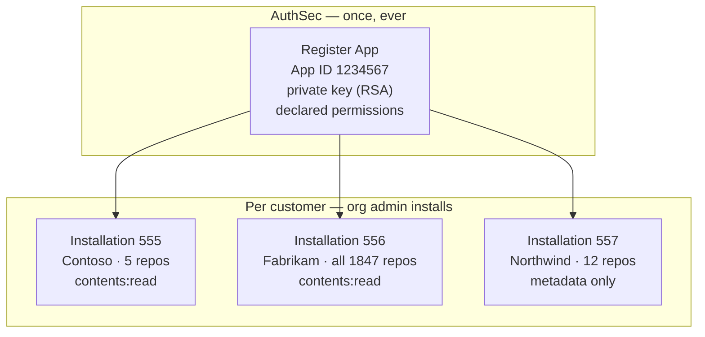

**App = the identity. Installation = that identity granted access inside one org.**
One App, N installations, each independently scoped and revocable.

### 3.2 The token exchange

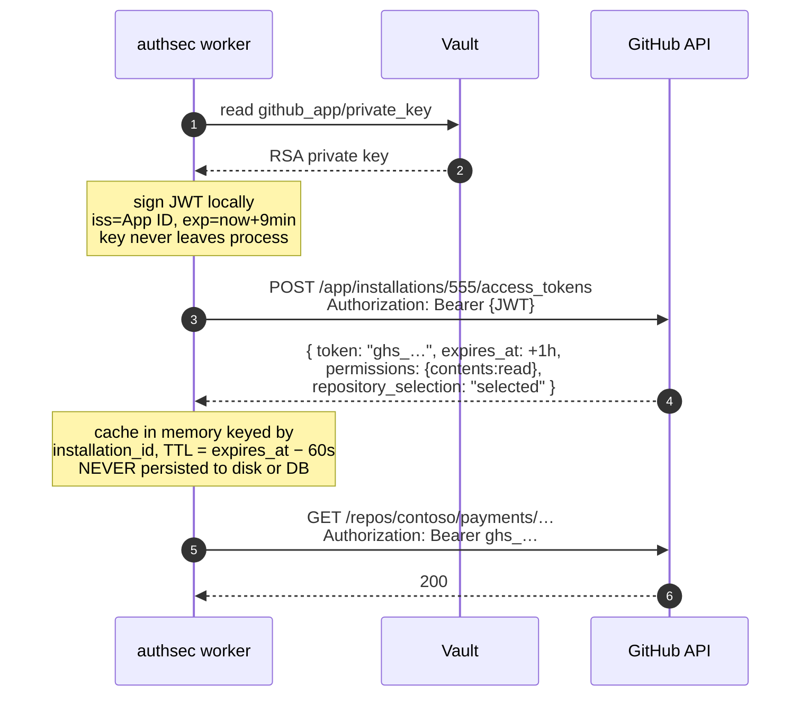

Why three steps rather than one long-lived key:

- the private key never crosses the network — only signatures derived from it;
- the working token is 1 hour and one installation, bounding any leak;
- **cross-tenant access is structurally impossible** — scope is baked in by GitHub
  at mint time, not enforced by our code at call time.

### 3.3 Rate limits

`5000 req/hour` **per installation** minimum, scaling with org size. Per
installation, not shared across customers — §8.4 depends on this.

---

## 4. Architecture

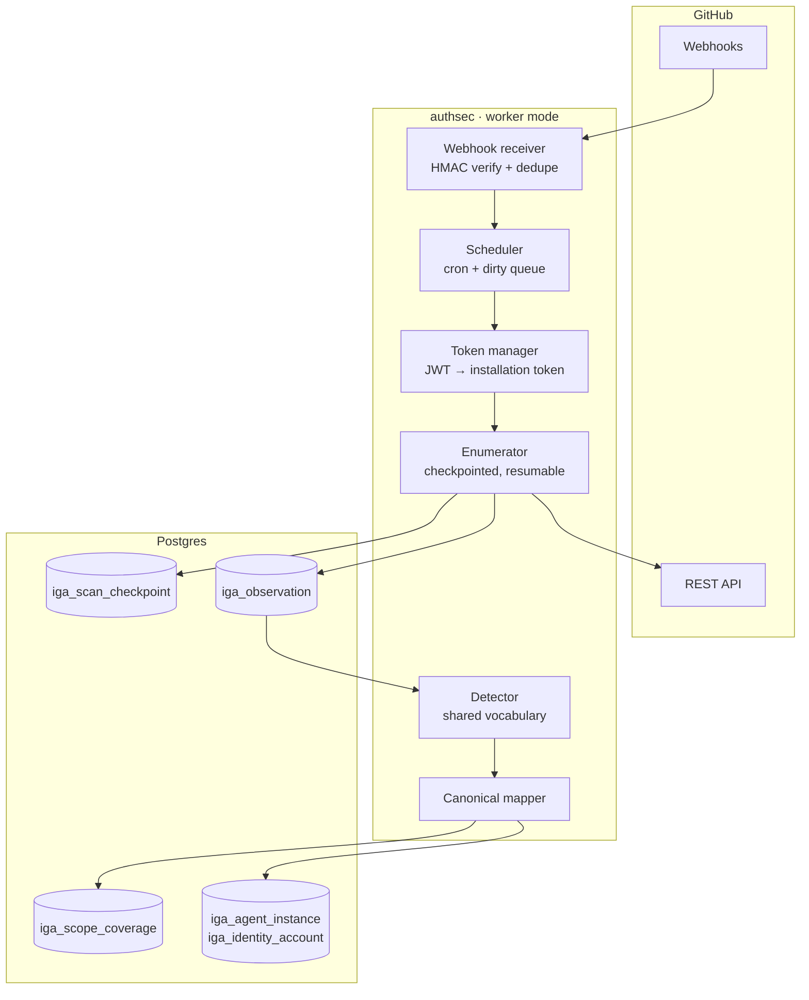

**One service, no new deployable.** Runs in the existing binary's `worker` mode,
as everything else does — see [roadmap §2.1](SPEC-iga-roadmap.md).

---

## 5. Capability boundary

**Normative. Every product claim must be consistent with this section.**

### 5.1 Detection basis and ceiling

| | value |
|---|---|
| `detection_basis` | `config_inferred` |
| max `evidence_mode` | `observed` — never `authoritative` |
| `enumeration` | REST paged sweep, per installation |
| `events` | webhooks: `push`, `installation_repositories`, `repository` |

We match patterns in declarations. GitHub never says "this is an AI agent", so
agent-ness is always our inference.

### 5.2 Declared vs running

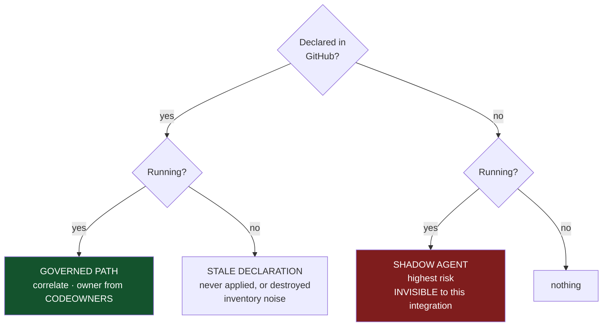

**A shadow agent is by definition one that skipped the pipeline.** If it were in
GitHub it would not be shadow. The single category this product exists to find is
the one category GitHub-only discovery can never see. This is why v1 pairs GitHub
with Kubernetes.

### 5.3 Recall limitation — published verbatim on the integration page

> Finds agents **declared in code** and identities that authenticate to GitHub.
> Cannot tell you whether a declared agent is running. Cannot see an agent
> deployed without going through GitHub. Scans the default branch only.

Permanent blind spots: agents created via web UI (Copilot Studio, AWS console);
other VCS; developer laptops; non-default branches; unselected repos; frameworks
vendored or installed by script rather than declared.

---

## 6. The two Apps

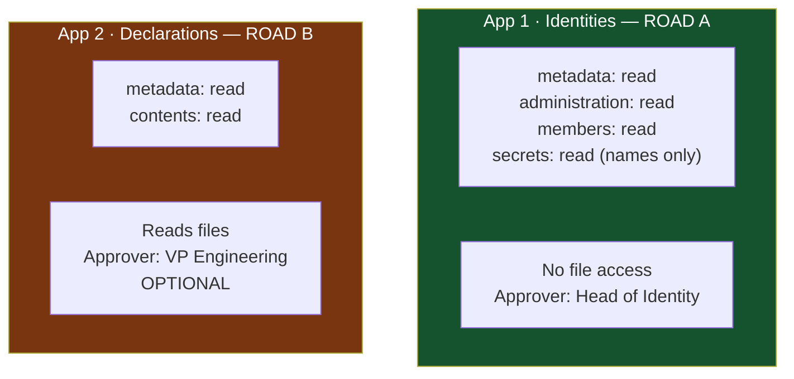

**Why two.** `contents: read` is per-repo and all-or-nothing — GitHub has no
path-scoped read permission. To a security reviewer, "we only read manifests" and
"we can read everything" are the *same grant*. Bundling would make the easy consent
as hard as the difficult one.

Committed restraint for App 2, stated publicly and enforced in code:

1. SBOM endpoint before file fetching (§8.3)
2. Fetch only §9.2 allowlist paths
3. **Never persist file content** — extract finding, store finding + path, discard blob
4. Self-hosted mode available (ticket S-4)

---

## 7. User flows

### 7.1 Onboarding

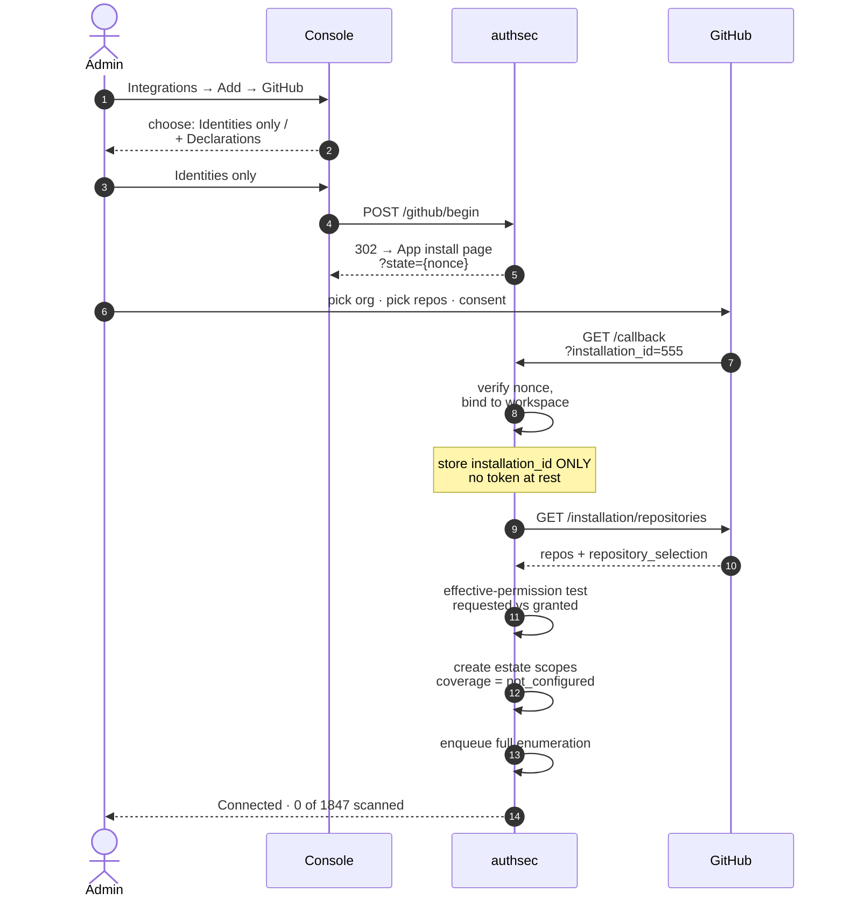

Step 9 is not optional. We *asked* for permissions; an org policy or a last-minute
deselection may mean we got less. Recording the delta is what makes "0 agents"
mean something.

### 7.2 First scan — required UI honesty

```
GitHub · contoso                          Scanning  412 / 1,847 repos

  Scanned              412 repos
  Declarations found    23
  GitHub NHIs           88
  Not yet scanned    1,435 repos   ← UNKNOWN, never rendered as zero
```

### 7.3 Coverage state machine

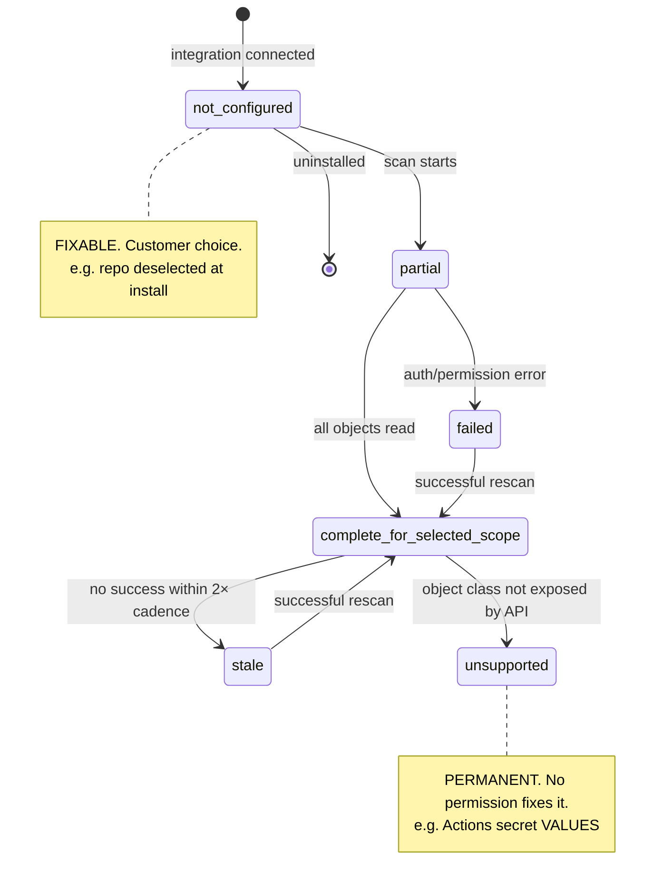

`not_configured` and `unsupported` must never be collapsed — one is fixable, the
other never will be.

---

## 8. Scan pipeline

### 8.1 End to end

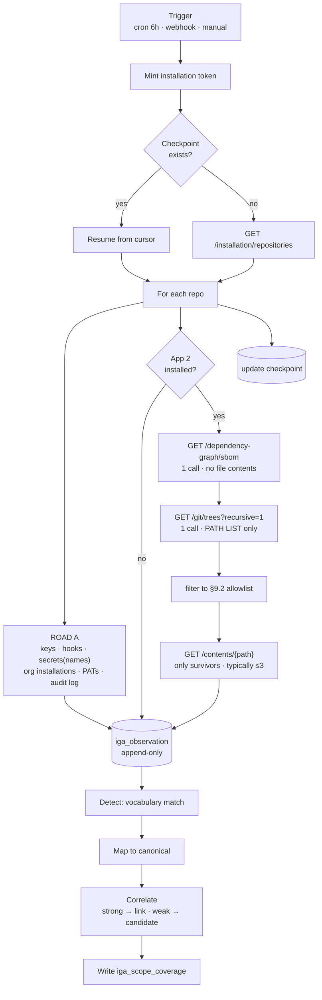

**Observation is written before detection.** When a detection rule turns out to be
wrong you re-run detection over stored observations instead of rescanning 20,000
repos.

### 8.2 Road A endpoints

| Endpoint | Produces | Permission |
|---|---|---|
| `GET /installation/repositories` | estate scopes | `metadata:read` |
| `GET /repos/{o}/{r}/keys` | deploy keys → identity accounts | `administration:read` |
| `GET /repos/{o}/{r}/hooks` | webhooks | `administration:read` |
| `GET /repos/{o}/{r}/actions/secrets` | secret **names** | `secrets:read` |
| `GET /orgs/{org}/installations` | third-party Apps + scopes | `administration:read` |
| `GET /orgs/{org}/personal-access-tokens` | org-approved fine-grained PATs | `administration:read` |
| `GET /orgs/{org}/audit-log` | last-used evidence | `administration:read` |

### 8.3 Road B — ordering is the cost story

```
1. SBOM      1 call   normalised dependency list. Most detections resolve here.
2. Tree      1 call   path list, no contents
3. Contents  ≤3 calls only allowlist survivors
                                            ≈5 calls/repo
```

A naive repo walk on a 4,000-file repo is 4,000 calls and exhausts the hourly
budget inside two repositories.

### 8.4 Rate-limit budget

```
20,000 repos × 5 calls  = 100,000 requests
5,000 req/hr            = 20 hours for first enumeration
```

Requirements, not optimisations:

- checkpointed and resumable across process restart;
- un-enumerated scopes report `unknown`;
- `429` is expected — honour `Retry-After`, never spin;
- respect `x-ratelimit-remaining`; pause at <10% budget.

### 8.5 Error matrix

| Condition | Scope state | Action |
|---|---|---|
| `401` bad JWT | `failed` | re-mint; alert if twice |
| `403` rate limit | unchanged | sleep `Retry-After`, resume from checkpoint |
| `403` insufficient permission | `partial` + reason | continue other object classes |
| `404` repo gone | tombstone scope | never hard-delete |
| `409` empty repo | `complete_for_selected_scope` | zero findings is truthful here |
| SBOM `404` (dep graph off) | `unsupported` for that class | fall back to file parsing |
| >20% repos vanish in one scan | **halt** | mass-deletion guard |

### 8.6 Incremental

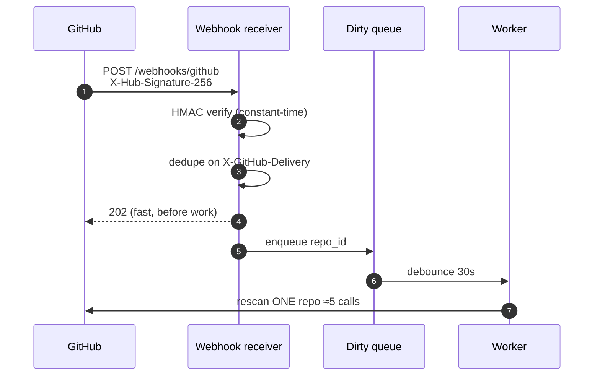

~200 pushes/day = ~1,000 calls ≈ 2% of one hour's budget.

**Events can never inventory an estate.** A webhook fires only on change *after*
connection; on day one every repo is invisible. Therefore a scope that has not
completed enumeration reports `unknown` regardless of how many events were
processed.

Weekly full reconciliation catches missed webhooks and disappearances.

---

## 9. Detection

### 9.1 Decision tree

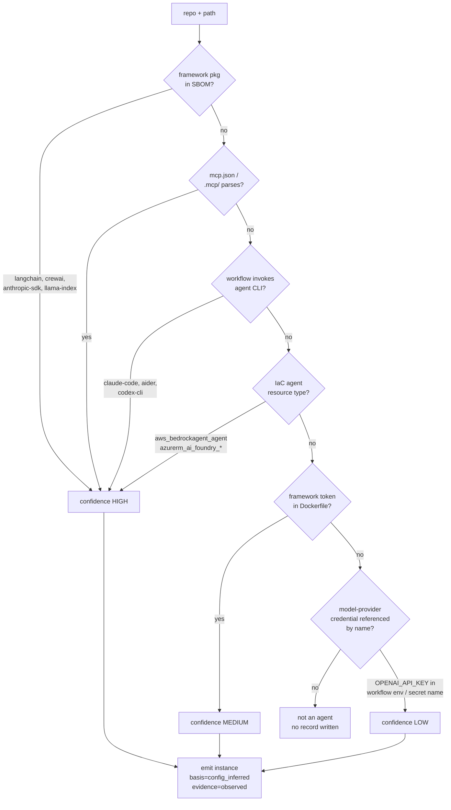

`detection_basis` is always `config_inferred`; `evidence_mode` caps at `observed`.
Confidence is orthogonal to both — a high-confidence inference is still an
inference.

### 9.2 File allowlist — normative, lives in the manifest

```
requirements*.txt  pyproject.toml  Pipfile  poetry.lock
package.json  package-lock.json  pnpm-lock.yaml
go.mod  Cargo.toml
mcp.json  .mcp/*  claude_desktop_config.json
.github/workflows/*.yml  .github/workflows/*.yaml
*.tf  *.tfvars
values.yaml  Chart.yaml
Dockerfile
CODEOWNERS  .github/CODEOWNERS  docs/CODEOWNERS
```

Nothing outside this list is ever fetched. Enforced in code by
`allowlist.Match(path)` before any `/contents/` call, and asserted by a test that
fails if a fetch is attempted for a non-allowlisted path.

### 9.3 Parsing rules

| File | Parser | Extract | Never |
|---|---|---|---|
| SBOM | SPDX JSON | `packages[].name`, `versionInfo` | — |
| `mcp.json` | `encoding/json` | `mcpServers` keys, `command`, `args`, `url` | env **values** |
| workflows | `gopkg.in/yaml.v3` | `jobs.*.steps[].uses`, `.run`, `.env` keys | secret values |
| `*.tf` | `hashicorp/hcl/v2` | `resource` type + name labels | variable values |
| `values.yaml` | yaml | `image`, `env[].name` | `env[].value` |
| `CODEOWNERS` | line parser | pattern → owners, glob precedence | — |

**No AST walking. No LLM. No semantic analysis.** Structured key extraction only.
A malformed file yields zero findings and must never fail the scan.

### 9.4 Recognition key

```go
// RecognitionKey for a GitHub declaration.
// Deliberately excludes: commit SHA, branch, file mtime, declared agent name.
// A commit is not a new agent; a directory rename is a new agent (accepted).
func RecognitionKey(owner, repo, dirPath string) string {
    return fmt.Sprintf("github:%s/%s:%s", owner, repo, path.Clean(dirPath)+"/")
}
// → "github:contoso/payments:services/refund/"
```

Keyed on **directory**, not repo: a monorepo declaring forty agents must produce
forty instances.

---

## 10. Schema

### 10.1 Entity relationships

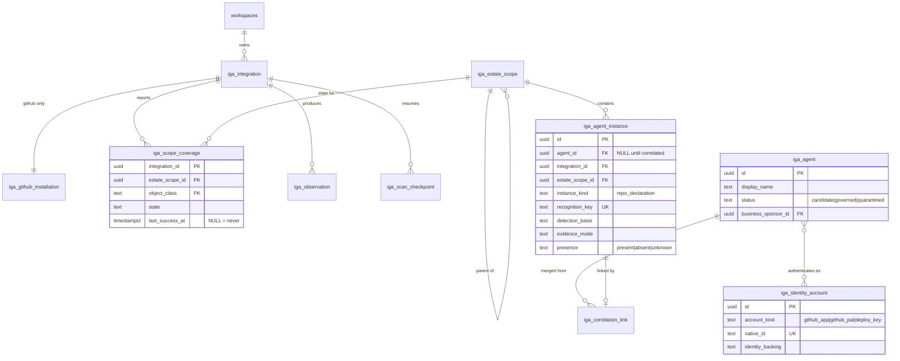

### 10.2 GitHub-specific tables — migration `00X_github_discovery.sql`

Everything else (`iga_agent`, `iga_agent_instance`, `iga_estate_scope`,
`iga_identity_account`, `iga_scope_coverage`, `iga_observation`) comes from the
canonical schema, ticket **S-1**. Only these three are GitHub's.

```sql
-- Binds one iga_integration row to one GitHub App installation.
-- Deliberately NOT merged into iga_integration.config: installation_id is a
-- foreign key into GitHub's namespace and is queried on the webhook hot path.
CREATE TABLE iga_github_installation (
    integration_id   uuid PRIMARY KEY
                     REFERENCES iga_integration(id) ON DELETE CASCADE,
    workspace_id     uuid NOT NULL
                     REFERENCES workspaces(id) ON DELETE CASCADE,
    app_id           bigint NOT NULL,        -- 1=identities app, 2=declarations app
    installation_id  bigint NOT NULL,
    account_login    text   NOT NULL,        -- 'contoso'
    account_type     text   NOT NULL CHECK (account_type IN ('Organization','User')),
    -- 'all' | 'selected'. Drives whether an unseen repo is not_configured
    -- (deselected) or simply not yet enumerated.
    repository_selection text NOT NULL
                     CHECK (repository_selection IN ('all','selected')),
    -- what GitHub SAID we got, recorded at install and re-probed each scan.
    -- Diverges from what we asked for; the delta is why "0 agents" can be trusted.
    granted_permissions  jsonb NOT NULL DEFAULT '{}'::jsonb,
    requested_permissions jsonb NOT NULL DEFAULT '{}'::jsonb,
    suspended_at   timestamptz,              -- GitHub suspends without uninstalling
    installed_by   text,                     -- login of the admin who consented
    created_at     timestamptz NOT NULL DEFAULT now(),
    updated_at     timestamptz NOT NULL DEFAULT now(),
    -- one installation cannot be bound to two integrations in a workspace
    UNIQUE (workspace_id, app_id, installation_id)
);
CREATE INDEX idx_gh_installation_lookup
    ON iga_github_installation (installation_id, app_id);

-- Resumable enumeration. A 20k-repo org takes ~20h; a deploy must not restart it.
CREATE TABLE iga_scan_checkpoint (
    integration_id uuid NOT NULL
                   REFERENCES iga_integration(id) ON DELETE CASCADE,
    scan_id        uuid NOT NULL,
    phase          text NOT NULL,   -- 'repos' | 'road_a' | 'road_b'
    cursor         text,            -- opaque: page number or last repo full_name
    repos_total    integer,
    repos_done     integer NOT NULL DEFAULT 0,
    started_at     timestamptz NOT NULL DEFAULT now(),
    updated_at     timestamptz NOT NULL DEFAULT now(),
    completed_at   timestamptz,
    PRIMARY KEY (integration_id, scan_id, phase)
);
CREATE INDEX idx_scan_checkpoint_open
    ON iga_scan_checkpoint (integration_id) WHERE completed_at IS NULL;

-- Webhook idempotency. GitHub retries; a redelivery must not re-queue work.
CREATE TABLE iga_github_webhook_delivery (
    delivery_id   uuid PRIMARY KEY,          -- X-GitHub-Delivery
    installation_id bigint NOT NULL,
    event_type    text NOT NULL,
    received_at   timestamptz NOT NULL DEFAULT now()
);
-- 30-day retention; older rows pruned by the existing cleanup job.
CREATE INDEX idx_gh_delivery_prune ON iga_github_webhook_delivery (received_at);
```

### 10.3 Rows produced by one scan

Repo `contoso/payments`, both Apps installed:

```sql
-- estate scopes
INSERT INTO iga_estate_scope (provider, scope_type, native_id, display_name, path, depth) VALUES
 ('github','github_org','O_kgDOAbc123','contoso','/gh-contoso',0),
 ('github','repo','R_kgDOXyz789','payments','/gh-contoso/payments',1);

-- ROAD A: an AI coding assistant with write on every repo
INSERT INTO iga_identity_account
 (account_kind, native_id, display_name, identity_backing, estate_scope_id) VALUES
 ('github_app','12345678','AI Coding Assistant','agent_native', <org scope>);
--   metadata: {permissions:{contents:"write",pull_requests:"write"},
--              repository_selection:"all", installed_by:"priya@contoso.com"}

INSERT INTO iga_identity_account VALUES
 ('deploy_key','98765','ci-deploy','workload_identity', <repo scope>);

-- ROAD B: the declaration
INSERT INTO iga_agent_instance
 (agent_id, integration_id, estate_scope_id, instance_kind,
  recognition_key, recognition_key_rule, detection_basis, evidence_mode,
  confidence, presence, metadata)
VALUES
 (NULL,                                    -- not correlated yet. NORMAL.
  <github integration>, <repo scope>, 'repo_declaration',
  'github:contoso/payments:services/refund/', 'github.declaration.v1',
  'config_inferred', 'observed', 'high', 'present',
  '{"deps":[{"name":"langchain","version":"0.3.1"}],
    "mcp_servers":["github","postgres"],
    "path":"services/refund/",
    "signals":[{"kind":"sbom","detail":"langchain 0.3.1"},
               {"kind":"mcp_config","detail":"mcp.json: 2 servers"}]}');

-- coverage, per scope AND per object class
INSERT INTO iga_scope_coverage
 (integration_id, estate_scope_id, object_class, state, reason, last_success_at) VALUES
 (<gh>, <repo scope>, 'repo_declaration', 'complete_for_selected_scope', '',      now()),
 (<gh>, <repo scope>, 'actions_secrets',  'unsupported',
     'GitHub never exposes secret values', now()),
 (<gh>, <legacy scope>,'repo_declaration','not_configured',
     'repository not selected at install', NULL);   -- NULL = never succeeded
```

### 10.4 Capability manifest — `iga_integration.manifest`

Validated on registration. Rejected if `enumeration` and `events` are both `none`.

```json
{
  "provider": "github",
  "normalization_version": "1",
  "roles": ["identity_source", "declaration_source"],
  "detection_basis": "config_inferred",
  "max_evidence_mode": "observed",
  "recall_limitation": "Finds agents declared in code and identities that authenticate to GitHub. Cannot tell you whether a declared agent is running. Cannot see an agent deployed without going through GitHub. Scans the default branch only.",
  "enumeration": { "mechanism": "rest_paged", "cadence": "6h", "unit": "repository" },
  "events": {
    "mechanism": "webhook",
    "types": ["push", "installation_repositories", "repository", "installation"]
  },
  "recognition_key_rules": {
    "repo_declaration": {
      "id": "github.declaration.v1",
      "template": "github:{owner}/{repo}:{dir_path}/",
      "excludes": ["commit_sha", "branch", "declared_name"]
    }
  },
  "object_classes": {
    "repo_declaration": { "supported": true },
    "github_app":       { "supported": true },
    "deploy_key":       { "supported": true },
    "actions_secrets":  { "supported": "names_only",
                          "unsupported_reason": "GitHub never exposes secret values" }
  },
  "required_permissions": {
    "app_identities":   ["metadata:read","administration:read","members:read","secrets:read"],
    "app_declarations": ["metadata:read","contents:read"]
  },
  "file_allowlist": ["requirements*.txt","pyproject.toml","package.json","go.mod",
                     "mcp.json",".mcp/*",".github/workflows/*.yml","*.tf",
                     "values.yaml","Dockerfile","CODEOWNERS"]
}
```

---

## 11. Go contracts

### 11.1 The source interface — every integration implements this

```go
// internal/iga/source/source.go
type Source interface {
    Manifest() Manifest

    // Enumerate walks the estate. MUST be resumable from Checkpoint and MUST
    // emit observations incrementally, never accumulate then flush.
    Enumerate(ctx context.Context, in EnumerateInput) error

    // RecognitionKey is pure and deterministic. Same object → same key, forever.
    RecognitionKey(objectKind string, native map[string]any) (string, error)

    // MapToCanonical turns one observation into zero or more canonical records.
    MapToCanonical(obs Observation) ([]CanonicalRecord, error)
}

type EnumerateInput struct {
    IntegrationID uuid.UUID
    ScanID        uuid.UUID
    Checkpoint    *Checkpoint          // nil on a fresh scan
    Emit          func(Observation) error
    Progress      func(Checkpoint) error
    Scopes        []uuid.UUID          // empty = whole estate
}
```

### 11.2 GitHub client — the only place tokens exist

```go
// internal/iga/source/github/client.go
type Client struct {
    appID      int64
    privateKey *rsa.PrivateKey       // loaded from Vault, never persisted
    tokens     *tokenCache           // in-memory, keyed by installationID
    http       *http.Client
    limiter    *rateLimiter          // reads x-ratelimit-remaining
}

// Token returns a cached or freshly minted installation token.
// Callers never see the JWT and never construct Authorization headers.
func (c *Client) Token(ctx context.Context, installationID int64) (string, error)

// Get performs an authenticated GET with rate limiting, retry on 429/5xx,
// and automatic pagination via the Link header.
func (c *Client) Get(ctx context.Context, installationID int64, path string, out any) error

// Contents is the ONLY method that fetches file bodies. It refuses any path
// outside the allowlist — belt and braces against a mapper bug.
func (c *Client) Contents(ctx context.Context, inst int64, repo, p string) ([]byte, error) {
    if !allowlist.Match(p) {
        return nil, fmt.Errorf("path %q not in allowlist: refusing to fetch", p)
    }
    ...
}
```

### 11.3 Rate limiter behaviour

```go
// Pause when the remaining budget drops below 10%, rather than sprinting into
// a 429. Reset is read from x-ratelimit-reset.
func (r *rateLimiter) Wait(ctx context.Context) error {
    if r.remaining > r.limit/10 { return nil }
    return sleepUntil(ctx, r.reset)
}
```

### 11.4 API surface

| Method | Path | Purpose |
|---|---|---|
| `POST` | `/authsec/iga/integrations/github/begin` | returns the GitHub install URL + `state` nonce |
| `GET` | `/authsec/iga/integrations/github/callback` | binds `installation_id` → workspace, probes permissions |
| `POST` | `/authsec/iga/integrations/:id/scan` | manual rescan; 409 if one is running |
| `GET` | `/authsec/iga/integrations/:id/coverage` | per-scope coverage rows |
| `POST` | `/webhooks/github` | **unauthenticated route; HMAC-verified body**. Constant-time compare, 202 before work. |

---

## 12. Tickets

**S-1 blocks everything.** Nothing below can start before the canonical schema
lands.

```mermaid
gantt
    dateFormat X
    axisFormat %s
    section Blocking
    S-1 canonical schema        :s1, 0, 3
    section Road A
    A-1 app + auth chain        :a1, after s1, 2
    A-2 onboarding + perm test  :a2, after a1, 2
    A-3 NHI enumeration         :a3, after a1, 2
    A-4 coverage writer         :a4, after s1, 2
    A-5 checkpointed enumerator :a5, after a1, 3
    A-6 webhook receiver        :a6, after a5, 2
    section Road B
    B-1 second app + consent    :b1, after a2, 1
    B-2 SBOM detection          :b2, after b1, 2
    B-3 tree-filtered fetch     :b3, after b2, 2
    B-4 parsers                 :b4, after b3, 3
    B-5 CODEOWNERS ownership    :b5, after b3, 2
    B-6 monorepo path scoping   :b6, after b4, 1
    section Cross
    S-2 correlation             :s2, after b4, 3
    S-3 manifest + honesty UI   :s3, after a4, 2
```

### Blocking

**S-1 · Canonical schema — senior**
`iga_estate_scope`, `iga_agent`, `iga_agent_instance`, `iga_identity_account`,
`iga_integration`, `iga_scope_coverage`, `iga_observation`, `iga_correlation_link`.
Migrations + backfill of existing `discovered_agents`.
**Done when** existing Kubernetes data serves identically through the new tables
with byte-identical fingerprints — no re-keying, no orphaned claims.

### Road A — ships alone

**A-1 · App registration + auth chain — mid/senior**
Register App 1. JWT signing from a Vault-held key, installation-token exchange,
in-memory cache with `expires_at − 60s` TTL, `429`/`Retry-After`, Link-header
pagination.
**Done when** a test mints tokens for two installations and proves installation A's
token returns `404` on installation B's repo.

**A-2 · Onboarding + effective-permission test — junior**
`/begin` and `/callback`, `state` nonce verification, `iga_github_installation`
row, permission probe recording `requested` vs `granted`, estate scopes created,
coverage `not_configured`.
**Done when** connecting an org with one repo deselected shows that repo as
`not_configured` with reason, not as absent.

**A-3 · NHI enumeration — junior**
§8.2 endpoints → `iga_identity_account` with correct `identity_backing`
(`github_app`→`agent_native`, `deploy_key`→`workload_identity`).
**Done when** a third-party App with `contents:write` on all repos appears with its
permission set and installer login, **and** a test asserts no Actions secret
*value* is ever read or stored.

**A-4 · Per-scope coverage writer — junior**
Write `iga_scope_coverage`. Integration rollup is the **worst** state, never an
average. `last_success_at` distinct from `last_attempt_at`.
**Done when** an org with one denied repo reports `partial` at integration level
with per-scope reasons, and a never-succeeded scope shows `last_success_at IS NULL`
rather than the failure timestamp.

**A-5 · Checkpointed enumerator — mid**
Resumable scan writing `iga_scan_checkpoint`. Survives SIGTERM.
**Done when** a 2,000-repo fixture is killed at repo 800 and resumes at 801,
proven by request count.

**A-6 · Webhook receiver — mid**
HMAC-SHA256 constant-time verify, `X-GitHub-Delivery` dedupe via
`iga_github_webhook_delivery`, 202 before work, 30s debounce per repo.
**Done when** a replayed delivery produces zero additional API calls, and an
invalid signature returns 401 without touching the queue.

### Road B — optional, harder consent

**B-1 · Second App + consent separation — mid**
**Done when** uninstalling App 2 marks only declaration scopes `not_configured`
and leaves all Road A findings intact and current.

**B-2 · SBOM framework detection — junior**
**Done when** a repo with `langchain` in `requirements.txt` is detected using the
SBOM endpoint alone — asserted by a test that fails if any `/contents/` call is made.

**B-3 · Tree-filtered fetch — mid**
**Done when** a 4,000-file fixture repo costs ≤10 requests, and a fetch attempt for
a non-allowlisted path returns an error rather than a request.

**B-4 · Declaration parsers — junior**
YAML/JSON/HCL structured extraction per §9.3.
**Done when** each parser has fixtures for valid, malformed, and
looks-relevant-but-isn't — and malformed input yields zero findings without
failing the scan.

**B-5 · CODEOWNERS → ownership candidates — junior**
Glob precedence (last match wins), team handle → members, rank by recent commits
on that path.
**Done when** nested patterns resolve to the most specific match and a team
resolves to named people, not a handle.

**B-6 · Monorepo path scoping — mid**
**Done when** a fixture monorepo with three agent directories yields three
instances with three distinct recognition keys.

### Cross-cutting

**S-2 · Declaration → runtime correlation — senior**
Join `repo_declaration` to a Kubernetes instance via repo → image → workload.
Strong keys auto-link; weak keys become candidates; splits proposable and
non-destructive.
**Done when** a repo declaring an agent and a cluster running its image resolve to
one `iga_agent`, and a split restores two instances with observations intact.

**S-3 · Manifest + honesty surface — senior**
Publish and validate §10.4. Render §5.3 verbatim on the integration page.
**Done when** registration rejects a manifest declaring neither enumeration nor
events, and the recall limitation is visible in the console.

**S-4 · Self-hosted scan mode — senior, optional**
Road B as a GitHub Action reporting findings outward; no code leaves the customer.
**Done when** the same fixture yields byte-identical findings via SaaS and
self-hosted paths.

### Allocation

| Person | Tickets |
|---|---|
| Senior 1 | **S-1**, then S-2 |
| Senior 2 | S-3, A-1, A-5, then S-4 |
| Mid | A-6, B-1, B-3, B-6 |
| Junior 1 | A-2, A-4 |
| Junior 2 | A-3, B-2 |
| Junior 3 | B-4, B-5 |

### Milestones

| | Contents | Shippable |
|---|---|---|
| **M1** | S-1. Kubernetes retrofitted, no behaviour change. | internal |
| **M2** | Road A end to end — connect org, NHIs, honest coverage. | **yes — sell this** |
| **M3** | Road B — SBOM, parsers, CODEOWNERS ownership. | yes |
| **M4** | S-2 correlation. Declared-vs-running becomes visible. | yes |
| **M5** | S-4 self-hosted. | on demand |

M2 is roughly what competitors sell for GitHub, minus the declaration layer. **Do
not hold it for Road B.**

---

## 13. Open decisions — sign off before M1

| # | Decision | Recommendation |
|---|---|---|
| 1 | Is `repo_declaration` an `iga_agent_instance`, or its own candidate table? | **Instance**, with a hard rule that coverage/KPI queries filter `instance_kind <> 'repo_declaration'`. A separate table is cleaner but forces correlation to look in two places. |
| 2 | Recognition-key granularity | **`repo + dir_path`**. Adding the declared name is more precise but breaks on rename. |
| 3 | Branch scope | **Default branch only**, published as a recall limitation. All-branches multiplies cost and surfaces agents that may never merge. |
| 4 | Is Road B in v1? | **Validate with two design partners first.** It needs an approver who owns the repos and has no stake in our product. If they decline, M3 has no customer. |
| 5 | Ephemeral CI agents | **Deferred, needs its own decision.** A workflow run is an agent alive for 90 seconds with a fresh OIDC identity per run — naively, every run manufactures a new agent, violating the §9.4 continuity rule. Not solved here. |

---

## 14. Related

- [SPEC-agentic-access-management.md](SPEC-agentic-access-management.md) — product scope and domain model.
- [SPEC-iga-roadmap.md](SPEC-iga-roadmap.md) — coverage contract, invariants and delivery phases.
- `discovery-agent/GUIDE.md` — the Kubernetes runtime source this correlates against.
- `discovery-agent/DETECTION.md` — shared framework vocabulary. **Keep in sync.**
