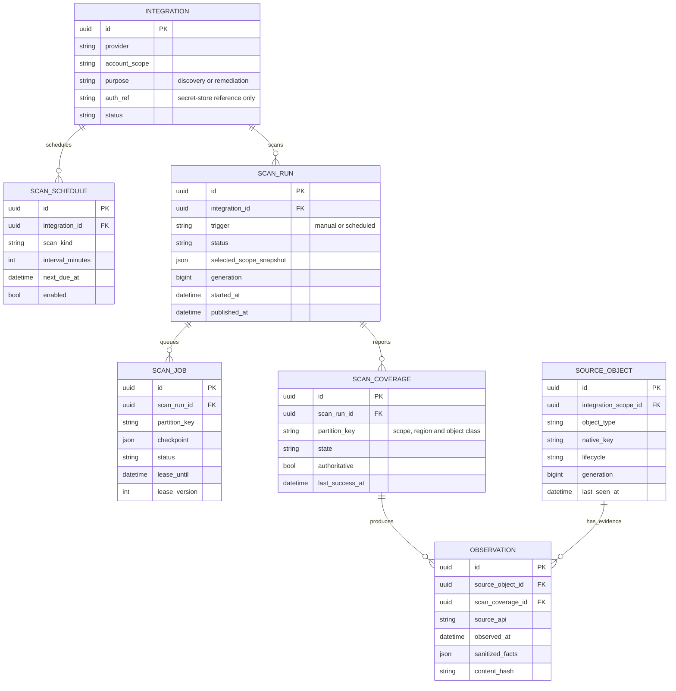

# SPEC: Phase 1 — connect and collect

> **The phase being implemented.** Everything needed to build it: scope, model,
> schema, tasks with gates, and acceptance.
>
> Foundations, invariants and the other phases:
> [SPEC-iga-roadmap.md](SPEC-iga-roadmap.md). When this phase closes, this
> document moves to `archive/` and a Phase 2 document replaces it.
>
> **Verified 2026-09-15** against the tree at `aac6f5a` (PR #54 merged).

---

## 1. What this phase is

Connecting an AWS account and reading it already works. **This phase makes the
reading trustworthy**: durable, evidenced, and safe to repeat.

Nothing in Phase 1 builds the graph. It builds the record of what was seen, by
whom, when, and how completely — so that Phase 2 can create stable objects from
evidence rather than from the last response that happened to arrive.

### In scope

| # | Deliverable | Status |
|---|---|---|
| **P1-1** | The isolation CI check | **done** — `scripts/ci-iga-isolation-check.sh`. Passes with an empty allowlist on today's tree; fails on a deliberately added `JOIN public.workspaces`. Reads code, not comments |
| **P1-2** | Durable scan execution | **done** — migration `020` `cloud_scan_run`, `CloudScanRunRepository`, `AWSScanWorker`, `GET /aws/scan-runs/:id`, worker started in `cmd/main.go` |
| **P1-3** | Coverage per partition, with `unsupported` and `not_selected` | **done** — both states added; unselected regions and granted-but-uncollected surfaces are recorded; `Complete()` exempts them so recording them does not switch reconciliation off |
| **P1-4** | Observations written by every cloud collector | **done** — migration `022` `cloud_observation`, anchored on `cloud_scan_run`. Identity, permission and workload collectors write evidence; redaction happens **before** hashing; an unchanged re-read writes nothing |
| **P1-5** | Idempotent ingestion | **N/A for AWS** — the `cloud_*` repositories already upsert on natural keys. The insert-only `Upsert*` are on the GitHub path |
| **P1-6** | The `MembershipAuthority` interface | **done** — `services/iga_membership.go`. Inactive members are found but may not act; a snapshot past the 60-minute ceiling may be read but not acted on |
| **P1-7** | Verified bindings on the new ingestion path | **done** — A1's equivalent is `TestAWSOnboardingStoresNoKeyMaterialAndTakesTheAccountFromAWS` (the account comes from `sts:GetCallerIdentity`, never the caller); A2's is the coverage/deletion gates re-proved on this path; the worker's own failure path records a reason, refuses to publish, and frees the connector |

### P1-4 · Evidence, and why it is a cloud table

`iga_observations` exists and is the same idea, but its provenance anchor is a
foreign key to `iga_scan_runs` — the GitHub pipeline's run table. Migration
`017`'s header already said that making AWS write those rows would be forcing it
into the canonical `iga_*` pipeline, "an open architecture question and not
something a resume feature should decide". `cloud_scan_run` (020) gave the cloud
path its own anchor, so `cloud_observation` (022) hangs off that instead.

Two properties carry the weight:

- **Redaction precedes hashing.** `HashObservation` is the single entry point,
  and the order is response → delete sensitive fields → canonical form → hash.
  Hashing first would keep a deterministic derivative of material we refused to
  store — an oracle for exactly what redaction removed. Held by a test where two
  payloads differing only in a secret value must hash **identically**.
- **An unchanged re-read writes nothing.** Otherwise evidence grows linearly
  with scan count for an account nobody is changing.

Subjects are four nullable typed foreign keys with a check that exactly one is
set, not a `(kind, id)` pair: a text discriminator beside a bare UUID is not a
foreign key, and that shape is the open cross-tenant defect in the `iga_*`
tables.

### P1-2 · What durable execution actually changed

`POST /aws/connectors/:id/scan` **enqueues**; it no longer runs the scan. Three
customer-visible failures came from the goroutine it replaced, and each is now
held by a regression test:

| Failure | What stops it |
|---|---|
| A restart lost the run, and the connector sat at `running` forever | The run is a row. A worker claims it, and a crashed worker's run is reclaimed once its lease lapses — resuming the SAME run, keeping its generation |
| Two requests raced, and whichever finished last reconciled away the other's rows | A partial unique index on `(connector_id) WHERE status IN ('queued','running')`. A second request gets `409` with the live run's id, not a duplicate scan |
| A superseded worker published results older than the run replacing it | Publication is fenced on `lease_version`. The worker records the value it claimed and the `UPDATE` demands the row still carries it — **no clock is consulted**, so skew between hosts cannot let a straggler through. `Fail` is fenced too, or a straggler's error would overwrite the live run's outcome |

The generation is assigned **at claim, not at enqueue**: reconciliation reads
generations as evidence a pass happened, so a run that never starts must not
consume one.

**Completion-driven refresh.** `scanAwsConnector` invalidated every inventory
tag on the 202 — refetching them before the scan had begun, then never again
when it finished. It now invalidates only the connector and the run; the
inventory tags hang off `getAwsScanRun` and fire when the run reaches
`published`. The drawer polls the run rather than `coverage.status`, because
coverage is written after publication and the IAM stage used to commit one
early.

### P1-8 · Align the console with the backend — **partially done**

**Done.** The API layer now models pages honestly: a `CloudPage<T>` with `total`,
`limit`, `offset` and `truncated`, built from the `meta` the backend already
returns. Permissions, resources, assume-edges, workloads and usage all carry it.
Server tallies are renamed `pageMeta` because the backend counts `unattributed`,
`by_runtime_kind` and `never_accessed` **over the page it returned**, and both the
compute page and the identities page had a comment predicting exactly this
breakage if the endpoints were ever paged. They were.

Views request the server maximum (500) instead of the 100 default, and every one
that can still be truncated says so: the compute page states "showing N of M",
the permission tab warns when statements or the resource lookup are cut, and the
identities page renders "Partial activity" instead of a never-used count it
cannot stand behind.

Permission rows now render `derivation = 'boundary'` as a **ceiling, not a
grant**, show `NotAction` as "every action except", `NotResource` verbatim, the
`Condition` block as recorded-not-evaluated, and `constraint_state` as a badge
for every value except `unconstrained`.

**Also done, after a second review round.** Trust, Compute, Usage and Keys tabs
request the maximum and declare truncation — an earlier claim that "all views"
did this was wrong, and only permissions and resources had it. Every detail tab
now separates a **failed request** from an empty result: they previously fell
through from loading straight to "No trust relationships recorded", which is an
assertion about the account made from no data. The connector drawer asks the
server for one account's access keys instead of intersecting two first pages
client-side, which could drop a key silently. `toPage` no longer invents a
total: a response with no pagination meta reports `totalKnown: false` and
presumes a full page is truncated, so absent evidence stops reading as proof of
completeness.

**Not done.** There are still no server-side pagers on these views — an account
with more than 500 workloads or 500 statements on one role shows a subset. It now
declares that rather than lying about it, which is the difference between
incomplete and wrong, but it is not complete. `/aws/usage` still has no
per-identity grouped count, so the never-used column is disclosure-only until it
does.

### P1-8 original scope

Added after review. Two customer-visible defects, both created by backend
changes the frontend has not caught up with.

**Pagination.** `clampLimit` returns 100 when no limit is sent. The API layer
still declares these routes "UNPAGINATED … the server has no limit/offset",
discards pagination metadata, and filters and counts over the truncated set. An
account with 250 workloads shows 100. The identity list discloses its cap; the
other views do not.

**Constraints.** The permission tab renders action chips and scope badges with no
notion of `condition`, `not_actions`, `not_resources`, `constraint_state` or
`derivation = 'boundary'`. A ceiling renders as a grant, and a gated grant
renders as plain access. The "not effective access" disclaimer does not
compensate for evidence that is simply absent.

*Gate:* a seeded account with more rows than one page reports a true total and
pages through it; a boundary statement is visually distinct from a grant; a
conditional grant shows its condition; a row with `constraint_state = 'unknown'`
says so rather than reading as unconstrained.

### Out of scope

The object registry, typed relationships, policy versioning and the traversal API
are Phases 2–4. Phase 1 may write `iga_source_object` and `iga_observation`; it
must not invent canonical objects or relationships from them.

### Starting state

Built: `routes/routes.go:1647–1683` serves onboarding, connector
create/list/get/verify/revoke, `POST /aws/connectors/:id/scan`, and reads for
identities, secrets, assume-edges, permissions, resources, workloads and usage.
Collectors are in `internal/awsdiscovery/` and `services/cloud_aws_*_scan.go`.

**Three rounds of fixes have landed.** What they leave is recorded against the
tasks below.

| Landed | Where | Effect |
|---|---|---|
| Permission and workload outcomes fold into connector coverage | `4615d9d` | `coverage.status` no longer commits on IAM's four surfaces alone. A denied EKS, Bedrock or Lambda read used to appear nowhere but a server log while coverage read `complete` |
| Pagination and `connector_id` scoping on list endpoints | `a09362e` | Six of seven endpoints returned every row in the workspace; five could not scope to one account |
| Statement constraints recorded end to end | migration `019`, **local, not deployed** | `Condition`, `NotAction`, `NotResource` and the permissions boundary are parsed, persisted **and refreshed on rescan**; malformed permission and trust documents are parse failures instead of empty results; the trust parser stopped reading `StringNotEquals` as `StringEquals`; `GetServiceLastAccessedDetails` follows its `Marker` instead of stopping at the default 100-entry page; a failed `GetRole` marks the identity `detail_incomplete` instead of writing its gaps as facts |
| Bootstrap/migration parity | `001_bootstrap.sql` | `cloud_workload`, `cloud_usage` and `cloud_scan_checkpoint` existed in `015`–`017` but not in bootstrap, so a fresh install failed scans with `relation "cloud_scan_checkpoint" does not exist` |

Still broken, and what this phase fixes:

| Defect | Location | Fixed by |
|---|---|---|
| Scan execution is not durable — `go func()` with no lease, checkpoint or resumption | `controllers/platform/cloud_aws_controller.go:408` | P1-2 |
| Cloud collectors write no observations | `services/cloud_aws_*_scan.go` | P1-4 |
| Surface coverage has no `unsupported` or `not_selected` | `models/cloud_discovery.go` | P1-3 |
| Resource policies are invisible — no S3 client, so a bucket policy denying an action cannot be seen | — | **not in this phase**; see below |
| Frontend ignores backend pagination and renders the first 100 rows as the whole account | `Authsec-ui/src/app/api/cloudDiscoveryApi.ts:924` | **P1-8** |
| Frontend has no types or rendering for conditions, negations or boundary state | `Authsec-ui/.../AWSIdentityTabs.tsx:163` | **P1-8** |

**Ingestion idempotency is not a Phase 1 task for AWS.** The `cloud_*`
repositories already upsert with `ON CONFLICT … DO UPDATE` on natural keys, so an
AWS rescan does not duplicate. The insert-only `Upsert*` methods are on the
GitHub/IGA path (`repository/iga_repository.go:616–629`), which is out of scope
until AWS delivers one source end to end.

**Resource policies are the largest remaining blind spot.** A bucket policy that
denies `s3:GetObject` is invisible, so a grant it blocks still reads as access.
Closing it means an S3 client, a new coverage surface and a decision about
reading resource policies for named buckets without enumerating any — deliberately
held out of this phase rather than bolted on.

---

## 2. The model

**Question this phase answers: where did this information come from, and can we
trust its freshness?**



**Integration** is Acme's authorized connection to an AWS account. **Scan run** is
one attempt to collect it. **Scan job** is a durable piece of that run with a
worker lease, so a restart resumes rather than restarts. **Scan coverage** records
which scope/region/object class was read successfully or failed. **Observation**
is the sanitized facts received about one source object during that scan.

Two modelling decisions carry the weight:

**Coverage is separate from objects, and exists even when a partition returns
nothing.** A scan can read roles successfully and fail to read Lambda. Zero rows
after `AccessDenied` must never read as "no identities exist" — only a complete
inventory of that partition can support the conclusion that something
disappeared.

**An observation references the scan's coverage record**, not just the run, so the
limitations under which a fact was collected stay inspectable forever. A fact
collected during a partial scan is readable as such a year later.

---

## 3. Schema

New tables start at `migrations/master/019`. `iga_source_objects` already exists
and gained `integration_scope_id` in `018`.

### 3.1 Scan run, job and coverage

```sql
CREATE TABLE IF NOT EXISTS public.iga_scan_run (
    id            uuid PRIMARY KEY DEFAULT gen_random_uuid(),
    workspace_id  uuid NOT NULL,
    integration_id uuid NOT NULL,
    trigger       text NOT NULL,
    status        text NOT NULL DEFAULT 'running',
    generation    bigint NOT NULL,
    selected_scope_snapshot jsonb NOT NULL DEFAULT '{}'::jsonb,
    started_at    timestamptz NOT NULL DEFAULT now(),
    published_at  timestamptz,
    CONSTRAINT iga_scan_run_status_chk CHECK (status IN
        ('running','published','failed','abandoned')),
    -- A run is authoritative only once published, and a published run must say when.
    CONSTRAINT iga_scan_run_published_chk CHECK ((status = 'published') = (published_at IS NOT NULL)),
    CONSTRAINT iga_scan_run_gen_key UNIQUE (workspace_id, integration_id, generation)
);

CREATE TABLE IF NOT EXISTS public.iga_scan_job (
    id             uuid PRIMARY KEY DEFAULT gen_random_uuid(),
    workspace_id   uuid NOT NULL,
    scan_run_id    uuid NOT NULL REFERENCES public.iga_scan_run(id) ON DELETE CASCADE,
    partition_key  text NOT NULL,
    status         text NOT NULL DEFAULT 'pending',
    checkpoint     jsonb NOT NULL DEFAULT '{}'::jsonb,
    lease_owner    text NOT NULL DEFAULT '',
    lease_until    timestamptz,
    lease_version  bigint NOT NULL DEFAULT 0,
    attempts       int NOT NULL DEFAULT 0,
    last_error     text NOT NULL DEFAULT '',
    CONSTRAINT iga_scan_job_status_chk CHECK (status IN
        ('pending','leased','done','failed')),
    -- A leased job must name its owner and its expiry, or it cannot be fenced.
    CONSTRAINT iga_scan_job_lease_chk CHECK (
        status <> 'leased' OR (lease_owner <> '' AND lease_until IS NOT NULL)),
    CONSTRAINT iga_scan_job_part_key UNIQUE (workspace_id, scan_run_id, partition_key)
);

CREATE TABLE IF NOT EXISTS public.iga_scan_coverage (
    id              uuid PRIMARY KEY DEFAULT gen_random_uuid(),
    workspace_id    uuid NOT NULL,
    scan_run_id     uuid NOT NULL REFERENCES public.iga_scan_run(id) ON DELETE CASCADE,
    integration_scope_id uuid,
    partition_key   text NOT NULL,          -- scope · region · object class
    object_class    text NOT NULL,
    state           text NOT NULL,
    authoritative   boolean NOT NULL DEFAULT false,
    object_count    int NOT NULL DEFAULT 0,
    pages_read      int NOT NULL DEFAULT 0,
    error_class     text NOT NULL DEFAULT '',
    observed_at     timestamptz NOT NULL DEFAULT now(),
    last_success_at timestamptz,
    -- Surface-level reachability, matching models/cloud_discovery.go plus the
    -- two states it lacks. Run-level outcome lives on iga_scan_run.status.
    CONSTRAINT iga_scan_coverage_state_chk CHECK (state IN
        ('reached','denied','throttled','not_configured','unsupported','not_selected')),
    -- Only a surface that was actually reached may license reconciliation. This
    -- is the constraint that stops a denied scope being emptied by another
    -- scope's success.
    CONSTRAINT iga_scan_coverage_auth_chk CHECK (authoritative = (state = 'reached')),
    CONSTRAINT iga_scan_coverage_err_chk CHECK (
        state NOT IN ('denied','throttled') OR error_class <> ''),
    CONSTRAINT iga_scan_coverage_part_key UNIQUE (workspace_id, scan_run_id, partition_key)
);
```

### 3.2 Observation

```sql
CREATE TABLE IF NOT EXISTS public.iga_observation (
    id               uuid PRIMARY KEY DEFAULT gen_random_uuid(),
    workspace_id     uuid NOT NULL,
    source_object_id uuid NOT NULL,
    scan_coverage_id uuid NOT NULL REFERENCES public.iga_scan_coverage(id) ON DELETE RESTRICT,
    source_api       text NOT NULL,
    observed_at      timestamptz NOT NULL,
    ingested_at      timestamptz NOT NULL DEFAULT now(),
    sanitized_facts  jsonb NOT NULL,
    content_hash     text NOT NULL,
    CONSTRAINT iga_observation_hash_chk CHECK (content_hash <> ''),
    -- Re-reading unchanged data does not create a new observation.
    CONSTRAINT iga_observation_dedupe UNIQUE
        (workspace_id, source_object_id, source_api, content_hash)
);

CREATE INDEX IF NOT EXISTS idx_iga_observation_object
    ON public.iga_observation(workspace_id, source_object_id, observed_at DESC);
```

`ON DELETE RESTRICT` on the coverage reference is deliberate: evidence must not
lose the record of the conditions it was collected under.

### 3.3 Rules the DDL cannot express

- **Redact before hashing.** The order is AWS response → sensitive-field deletion
  → normalize → hash. Hashing first would fix a hash over data that must not be
  stored. No secret values, Kubernetes Secret contents or source-code secrets are
  ingested.
- **Publication is one transaction.** Coverage rows, the run's `published_at`,
  the generation and any reconciliation commit together or not at all.
- **Fixed write order** within a scan: coverage → source object → observation.
- **A NULL `integration_scope_id` is never swept** (the A2 invariant, which must
  be re-proved here rather than inherited).

---

## 4. Tasks

### P1-1 · Isolation CI check

A script that fails when a file under `services/iga_*`, `repository/iga_*`,
`controllers/platform/iga_*` names a non-`iga_` table outside a short allowlist.

*Gate:* passes with an empty allowlist against `aac6f5a`; fails on a deliberately
added `JOIN public.workspaces`.

### P1-2 · Durable scan execution

Replace the goroutine. A run creates `iga_scan_job` rows per partition; a worker
leases a job with a compare-and-swap on `lease_version`; checkpoints are written
**after** the data they describe; the run publishes in one transaction.

*Gate:* a worker killed mid-partition is resumed by another worker from the last
durable checkpoint, and the resume test seeds only state the real sequence can
actually produce. A lease-expired worker cannot publish over a newer generation.

### P1-3 · Coverage per partition

`4615d9d` already folds permission and workload outcomes into connector coverage,
so a denied EKS or Lambda read can no longer hide behind a `complete` status, and
migration `019` added a parse-failure count so an unreadable policy is a coverage
fact rather than an empty result. Two things remain.

**Add the two missing surface states.** `models/cloud_discovery.go` carries
`reached`, `denied`, `throttled` and `not_configured`. Without `unsupported` and
`not_selected`, a surface we have built no collector for is indistinguishable
from one the customer declined — and those have different owners.

**Record coverage per `(scope, region, object class)`**, not per connector, with
`authoritative` true only for `reached`.

*Gate:* per surface — denied, throttled, empty, paginated beyond one page, and
malformed payload each produce the right state and error class. A mixed
denied/reached scan tombstones nothing in the denied partition. A surface with no
collector reports `unsupported`, never `reached` with zero rows.

`tests/integration/cloud_aws_coverage_test.go` already covers the folding
(`TestCoverageStatusReflectsPermissionAndWorkloadDenialsNotJustIAM`,
`TestCoverageStatusCompleteWhenAllThreeScansSucceed`,
`TestCoverageRecordsWhollyFailedSubScan`). Extend it rather than starting over.

### P1-4 · Observations from every collector

Each collector writes an `iga_observation` per source object read, referencing
its coverage row, sanitized and hashed.

*Gate:* a scan of a real account produces observations for every object it
reports; re-scanning unchanged data creates **no** new observation rows; a
redaction test proves the hash is computed after field deletion.

### P1-5 · Idempotent ingestion

Rewrite the five `Upsert*` methods in `repository/cloud_identity_repository.go`
to `INSERT … ON CONFLICT … DO UPDATE` on the namespaced natural key. No
read-then-write.

*Gate:* an identical rescan preserves row counts, IDs and `first_seen_at`. Two
concurrent scans of overlapping scopes produce no duplicates and no deadlock.

### P1-6 · Membership authority interface

Introduce `MembershipAuthority` and inject it where IGA needs to know who exists,
following the `InstallationVerifier` pattern in `NewIGAManager`.

*Gate:* no IGA file names a legacy membership table (P1-1 enforces this);
mutations fail closed when the snapshot is unavailable or older than 60 minutes;
a fake implementation drives the tests.

### P1-7 · Verified bindings on the new path

A1 and A2 semantics must hold on the new ingestion path by demonstration, not by
inheritance.

*Gate:* binding refuses caller-supplied proof; a denied scope preserves prior
facts as stale — both re-proved against the Phase 1 code.

---

## 5. Acceptance

The phase closes when all of these hold against a real AWS account:

1. A connector is created, verified against account `220171243705`, and scanned.
2. Every supported surface reports a coverage state with its scope and
   observation time; at least one deliberately denied surface reports `denied`
   and loses nothing.
3. Every object read has at least one observation citing its coverage row.
4. The scan is killed mid-run and resumes from its checkpoint without
   duplicating or losing a partition.
5. An identical rescan changes no IDs and adds no observation rows.
6. A surface that paginates beyond one page is read completely, and a surface
   that throttles is reported rather than silently truncated.
8. No permission row claims `constraint_state = 'unconstrained'` while carrying a
   condition or a negation, and no boundary statement is counted as a grant.
9. Adding a condition to a policy in AWS and rescanning updates the stored row;
   removing it clears the row. Neither leaves the previous representation behind.
10. Every count and list in the console matches what the account actually holds,
   or says explicitly that it is showing a page.
7. A workspace with two connectors returns each account's rows separately — held
   by `TestListPermissionsScopesToOneConnector` and `TestListPermissionsPaginates`
   in `tests/integration/cloud_aws_pagination_scoping_test.go`; extend the same
   shape to the remaining list endpoints.

## 6. Known-failing tests, tracked

Not "pre-existing, therefore irrelevant" — these gate release and need causes.

| Failure | Cause | Blocks |
|---|---|---|
| 7 × `TestIGA*` in `tests/integration` | The GitHub/IGA ingest path: a scan produces `source_objects=0, observations=0`, so no agent is confirmed. **Two causes were tangled here.** Until 2026-09-17 each call to `igaDB` opened a fresh gorm pool that nothing closed, so a full run exhausted PostgreSQL's 100 connections and later tests died with `sorry, too many clients already` — failures that looked like product defects and were not. The suite now shares one capped pool, and what remains is the real GitHub-path defect | the GitHub source, not AWS. Must close before a second source is admitted |
| `TestMasterMigrations_Flow` | needs a local postgres role `kloudone` that does not exist on this machine; the migration runner itself is untested here | **migration rehearsal.** Nothing validates the full `001`→`019` chain automatically; 019 was verified by hand against a scratch database |
| **198** TypeScript errors in `Authsec-ui` | `accessApi`, `resourcesApi`, `syncConfigsApi` and others. The root `tsconfig.json` has `"files": []`, so the bare `npx tsc --noEmit` that the UI's own `AGENTS.md` prescribed reported a clean tree | **the type gate is not enforced.** CI must run `-p tsconfig.app.json`; `AGENTS.md` now says so. Prove a change adds none by comparing counts — clean base, and post-change, are both 198. Note a *parse* error reports as **1** error and hides every other diagnostic, so a low count is not a good sign |

## 6. Verification

- `go build ./...` and the ownership and integration suites on the merged tree.
- P1-1 run against `aac6f5a` and against a deliberately broken file.
- One live discovery run against `220171243705`, then a rescan, comparing row
  counts and IDs before and after.
- A kill-and-resume test that seeds only reachable state.
- Migration `019` applied to a restored snapshot, with bootstrap and migrated
  schema compared by a reproducible check. Do not assume a CI runner exists.

Every Phase 1 defect fix needs a regression test that **demonstrates the defect
on the baseline**. A green fixture suite is evidence of covered behaviour, not
proof of an invariant nobody tested.
