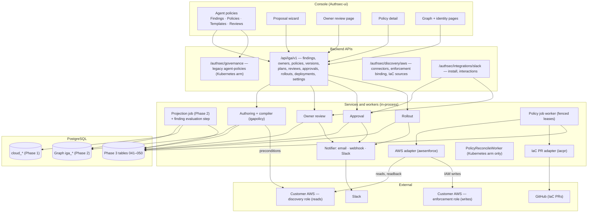
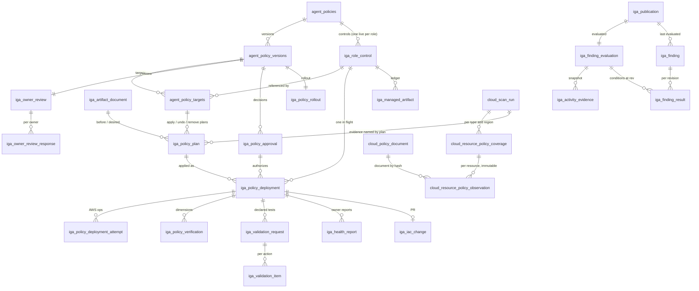

# SPEC: Phase 3 R1a — from the identity graph to verified AWS right-sizing

**Status:** draft for review, 1 October 2026. This is the **R1a implementation
spec**. R1b, R2 and R3 are recorded as direction in §12; each needs its own
implementation spec, approved separately, before any of its build tasks start.
Implementation of R1a does not start until this document is approved.

**Requirements source:** [SPEC-iga-phase3-policy-requirements.md](SPEC-iga-phase3-policy-requirements.md)
(the "brief"). Requirement IDs (P-, C-, L-, E-, R-) refer to it. Where this spec
and the brief disagree, the conflict is listed in §15; neither is silently
picked.

**Builds on:** [SPEC-iga-phase2-graph.md](SPEC-iga-phase2-graph.md) (graph,
publication, pipeline barrier, read model), [SPEC-aws-quick-create-onboarding.md](SPEC-aws-quick-create-onboarding.md)
(the Quick Create callback reused for the enforcement stack), and the shipped
Agent policies feature (`models/agent_policy.go`, `services/agent_policy_*.go`).

**Verified starting facts** (source inspection of the current backend and UI
checkouts; none of this is a deployment verification):

- The highest migration file is `040`; `037` is reserved for the Phase 2
  contract file in `migrations/contract/` and is never reused. Phase 3 R1a uses
  `041`–`050`.
- No code writes to a customer AWS account. Every AWS call is a
  List/Describe/Get or an IAM report generation (`internal/awsdiscovery`).
- The discovery role attaches `SecurityAudit` plus `iam:GenerateServiceLastAccessedDetails`
  / `iam:GetServiceLastAccessedDetails`; its `RoleName` is a template
  parameter, and it is tagged `ManagedBy=AuthSec`.
- Access Advisor is collected per **service**, for at most 500 identities per
  account (`activityIdentityCap`), into `cloud_usage`. `UpsertUsage`
  (`repository/cloud_workload_repository.go`) overwrites a row's
  `last_used_at` and `generated_at` on every scan: `cloud_usage` holds the
  latest report only, never history.
- CloudTrail is read for 48 hours, at most 10,000 management events per region,
  attributed by exact user-name match; any `errorCode` sets `Denied=true`.
- `igaread.Reader.Read` pins the **latest** revision. The projection service
  commits the publication and then, in a separate fenced transaction
  (`completeAndRelease`), completes the job and releases the pipeline barrier
  (`iga_pipeline_lease`); collection cannot start in between.
- Resource policies are read only for S3 buckets and KMS keys that a scanned
  identity statement already names (`scanResourcePolicies` in
  `services/cloud_aws_permission_scan.go`). Nothing enumerates the account's
  resources, and the evidence row stores summary facts (`has_deny`,
  `parse_failed`, statement count), not the statements. The discovery template
  grants only `s3:GetBucketPolicy` and `kms:GetKeyPolicy` explicitly. R1a's
  compiler therefore needs new collection (§3.9).
- `iga_statement_revision.valid_from` and `iga_policy_assignment.valid_from`
  record when AuthSec first observed a statement revision or an assignment.
- `agent_policies` has `PRIMARY KEY (id)` and `UNIQUE (workspace_id, name)` but
  no `UNIQUE (workspace_id, id)`; its target CHECK requires exactly one of
  `discovered_agent_id` / `selector`.
- There is no owner column on `iga_workload` or `iga_identity_accounts`, no
  append-only policy audit table, no Slack integration, and no policy detail
  route.
- The migration runner (`internal/migration/runner.go`, `executeSQLContent`)
  applies each file in one transaction. Files that rely on that (for example
  `006`, whose temporary table is `ON COMMIT DROP`) fail if their statements
  are run one by one, so rehearsals apply each file with `psql -1`.

---

## 0. The completion promise

**When R1a is finished, a customer can do this, in the product, against their
own AWS accounts:**

```
scan → the identity graph publishes → findings are evaluated against that revision
  → Findings: "RefundTaskRole is granted 14 services; 3 were used in the last 112 days"
  → open the finding → Generate tighter policy
  → see exactly what is removed, what is kept and why, who else uses the role,
    and how old each grant is
  → owners of the role and of every consuming workload are asked, with a deadline
  → observe for the chosen window; a removed service attempted meanwhile sends it back
  → approve in the console or in Slack (author ≠ approver)
  → canary → health gates pass on real evidence → expand
  → AuthSec attaches an AuthSec-owned permissions boundary through a separate,
    customer-consented enforcement role, or opens a Terraform/CloudFormation PR
  → read back from AWS → the next scan shows the boundary in the graph
  → a request to a removed service is denied by AWS, and the denial names the boundary
  → drift is detected; Undo restores exactly the state before the change
  → the finding resolves; the audit trail shows every step, actor and artifact
```

That journey, with a real AWS request denied by the deployed boundary and an
unrelated request by the same role still succeeding, is the milestone. **A
stored policy, a generated document, an approved plan, a successful API write
or a simulated denial alone is not completion.**

"End to end" means complete for the **R1a capability matrix** (§3.8): service
level, IAM roles, AWS only. Every screen says what is outside it.

| Question | Section |
|---|---|
| The three customer journeys, and what is not in R1a | §1 |
| Objects, invariants, hashes, lifecycles | §2 |
| How AWS is changed: the artifact, the compiler, the enforcement role | §3 |
| Components, packages, gates, credentials | §4 |
| The data flow, stage by stage | §5 |
| Schema `041`–`050`, executed and probed | §6 |
| APIs | §7 |
| Workers, recovery, observation, canary, verification, drift, undo | §8 |
| UX and every UI screen | §9 |
| Security and threat model | §10 |
| Shared roles in R1a | §11 |
| Direction beyond R1a (not specified to build) | §12 |
| Tasks and requirement traceability | §13 |
| Acceptance | §14 |
| Decisions and open items | §15 |

---

## 1. Journeys and scope

### 1.1 Three journeys

R1a ships three journeys over one model. They differ in what the customer
grants and what AuthSec writes; findings, proposals, owner review and approval
are shared.

| | J1 Recommendations | J2 IaC delivery | J3 Direct enforcement |
|---|---|---|---|
| Customer grants | Discovery stack only | Discovery stack + GitHub App with contents/pull-request write on the mapped repository | Discovery stack + the separate enforcement stack (§3.6) |
| Workspace mode | `findings_only` or `enforce` | `enforce` | `enforce` |
| Delivery value | `export` | `iac_pr` | `direct` |
| AuthSec writes to AWS | Nothing | Nothing (the customer's pipeline applies the merged change) | Only `/authsec/` boundary policies and their attachment |
| What the customer gets | Findings; a reviewed and approved plan; the boundary document and a CLI/Terraform snippet to apply it themselves | A PR against the mapped Terraform/CloudFormation source; the reviewed commit SHA recorded | The deployed boundary, canary, expansion, verification, undo |
| Observation | Yes (uses the discovery role's activity reports) | Yes | Yes |
| Canary/expansion | No (customer applies) | Per PR: one PR per target, canary PR merged first | Yes |
| Verification | When the desired state appears in AWS, the same dimensions as J3 apply; correlated by role incarnation, attachment and document hash | Same, after merge **and** apply (§8.11) | §8.7 |
| Required setup screen | none | IaC source mapping (S9) | Enforcement binding (S9) |

A J1 or J2 deployment is a row in `iga_policy_deployment` like J3's, so
verification, drift, findings resolution and metrics are identical. It reaches
`applied_unverified` only when the discovery role reads back the plan's desired
state on the same role incarnation (§8.11). Until then a J2 deployment is
`awaiting_merge` and then `awaiting_apply`; a J1 deployment is `awaiting_apply`
("Awaiting your apply").

### 1.2 Not in R1a

| Not built | What the product says instead |
|---|---|
| Effective-access evaluation (all policy types combined) | "Declared access · not evaluated" stays on every graph and preview screen |
| Action-level or resource-level right-sizing | R1b (§12.1). Findings and templates say "needs CloudTrail history" |
| IAM users and groups | Findings are shown; "right-size" is not offered |
| Editing customer-owned IAM documents in AWS | AuthSec writes only its own artifacts; customer documents change only through J2 PRs |
| Organization SCPs and RCPs, resource-policy right-sizing | Read as context only |
| Time-bound access, session revocation, temporary grants | R2 direction (§12.2) |
| Agent runtime controls | R3 direction (§12.3) |
| GCP, Azure, Kubernetes RBAC right-sizing | The model is provider-aware (`provider` columns); only the AWS adapter ships |
| Automatic application without approval | Every write is bound to an approved plan (§2.8) |
| Compliance control mapping (L-13, SHOULD) | Deferred with the exception recorded in §15 |

### 1.3 Starting point: what is reused, what changes

| Existing | Reuse | Change |
|---|---|---|
| `agent_policies` + `agent_policy_actions` | Policy identity, workspace ownership, name, reason | Add `family`, `target_kind`, `lifecycle`, `current_version_id`, `owner_user_id`, `UNIQUE (workspace_id, id)`; replace the target CHECK with a NULL-safe, legacy-compatible one (`043`) |
| `PolicyReconcileWorker` (5 min) | Kubernetes arm untouched | Skips rows with `target_kind = 'aws'` |
| Legacy governance routes (`/authsec/governance/agent-policies…`) | Kubernetes arm | List excludes `target_kind = 'aws'`; get/update/delete of an AWS row return `409 policy_managed_by_iga` with the new route (§7.9) |
| `agent_policy_warnings` + senders | Email and webhook delivery | Phase 3 notices use `iga_policy_notification`; Slack is a third channel |
| `provisioning_instructions` (Enforcement queue) | Kubernetes instructions untouched | AWS deployments are not routed through it; the queue screen reads both through typed adapters |
| Discovery CFN template + Quick Create callback | Session, SNS→SQS callback, ExternalId minting, Vault | A second template and custom resource type for the enforcement stack (§3.6) |
| Projection job (`iga_projection_service.go`) | Fencing, barrier, `completeAndRelease` | Finding evaluation runs between publication commit and `completeAndRelease` (§8.2) |
| Graph read API envelope | Revision-bound reads | New `/api/iga/v1` policy routes, reading at explicit revisions (§7) |

---

## 2. The model

### 2.1 Objects

| Object | Table | What it is |
|---|---|---|
| Owner | `iga_object_owner` | A workspace member accountable for a workload or identity |
| Finding evaluation | `iga_finding_evaluation` | One evaluation run for one published revision, with status |
| Activity evidence | `iga_activity_evidence` | The per-revision, per-role, per-service activity facts an evaluation used, copied out of the mutable `cloud_usage` |
| Finding | `iga_finding` | A condition worth acting on: identity, current workflow status, and the condition as of the latest complete evaluation |
| Finding result | `iga_finding_result` | The condition of each finding **at** a revision; frozen once that evaluation completes |
| Policy | `agent_policies` | Durable, named intent; one arm |
| Policy version | `agent_policy_versions` | Immutable typed intent; editing creates a new version |
| **Role control** | `iga_role_control` | The physical AWS role a policy controls, with its **baseline** (the boundary state before AuthSec's first change). **At most one live control per role, owned by one policy** |
| Target | `agent_policy_targets` | A version's reference to a role control |
| Resource-policy observation | `cloud_resource_policy_observation` (+ `_coverage`, `cloud_policy_document`) | Immutable per-scan record of each resource-based policy read, or of its absence, with coverage per form and region (§3.9) |
| Artifact document | `iga_artifact_document` | Insert-once, hash-verified, content-addressed archive of every boundary document AuthSec read or wrote |
| Plan | `iga_policy_plan` | The compiled native change for one target and control, from one live read: kind, delivery, **desired attachment** (`present` with a boundary and document, `absent`, or `unchanged` for a split and its revert), hashes |
| Owner review | `iga_owner_review` (+ `_response`) | Consultation of every known owner before observation |
| Approval | `iga_policy_approval` | A decision bound to a version's intent, impact and plan hashes |
| Rollout | `iga_policy_rollout` | Observe → canary → expand for one version |
| Deployment | `iga_policy_deployment` | One plan applied to the role control **that plan was compiled for** |
| Service outcome (history) | `iga_service_outcome` | Per deployment and service: what that deployment established at verification, and its change against the boundary it replaced (§8.7) |
| Service posture (current) | `iga_service_posture` | One row per (account, role incarnation, service) AuthSec has excluded: the boundary in force, current routes, restriction, and the outcome they establish, with the revision and scan that support it (§8.7) |
| Attempt | `iga_policy_deployment_attempt` | One AWS operation, its request id and outcome |
| Verification | `iga_policy_verification` | One dimension's result for one deployment |
| Validation request | `iga_validation_request` | A declared test call, made from a dedicated session, to prove a restriction or a retained operation |
| Health report | `iga_health_report` | An owner's "problem" / "working" report during canary or after |
| Managed artifact | `iga_managed_artifact` | Ledger of each native object AuthSec controls, per role control |
| Event | `iga_policy_event` | Append-only audit |

Every table carries `workspace_id`, and every cross-object reference is a
composite FK on `(workspace_id, id)` (or `(workspace_id, id, version_id)` where
two references must agree on the version, §2.8).

### 2.2 Subjects are role incarnations

A role control binds an AWS role by its immutable `RoleId`
(`iga_identity_accounts.immutable_key`, `continuity = 'immutable'`). A role
deleted and recreated with the same name has a new `RoleId` and is a new
subject:

- every plan's precondition contains the `RoleId`; a recreated role fails the
  precondition check and the deployment stops in `blocked` (E-04);
- the old incarnation's control moves to `removed` with reason `role_gone`, its
  findings to `superseded`, and its pending approvals are revoked (P-04).

A role with `continuity = 'recognition_only'` is ineligible in R1a.

### 2.3 Role control: one policy per role

Two policies writing the same boundary would overwrite each other, and the
second policy's undo would remove the first one's restriction. R1a therefore
gives each physical role exactly one controlling policy:

- `iga_role_control` has a unique live key on `(workspace_id, account_id,
  role_id)` (`uq_iga_role_control_live`, state ≠ `removed`).
- A version's targets reference a control **owned by the same policy**; the
  composite FK `(workspace_id, control_id, policy_id)` makes a target of
  another policy's control impossible (probe DB2, §6.3).
- Proposing a policy for a role that already has a live control returns
  `409 role_controlled_by_policy` with that policy's id. The UI offers **Edit
  that policy** (a new version of it, carrying both intents' retained and
  removed services through the compiler) instead of a second policy.
- At most one deployment per control is in flight, whatever version or kind
  (`uq_iga_policy_deployment_inflight` on `control_id`, probe DB3).
- The control a deployment locks is the control its plan was compiled for. The
  deployment's FK is `(workspace_id, plan_id, version_id, control_id, kind,
  delivery)` to the plan, whose FK is `(workspace_id, target_id, version_id,
  control_id)` to the target, so `deployment → plan → target → control` is one
  chain and the kind and delivery cannot differ from the plan's (probes
  DB22–DB24). The worker resolves the AWS role from the control row, never from
  request input.
- The control records its **baseline** when its first deployment is applied:
  the boundary ARN and archived document the role had before AuthSec's first
  change, or none. A control cannot become `active` without one (probe DB26).
  Removing AuthSec control restores the baseline (§8.10).
- A control is also the **epoch** of its role's service posture (§8.7): its
  `enforcement_seq` orders every enforcement observation, it stops advancing
  once the control is retired, and a replacement control takes over the
  role's posture rows only after the old control is retired.
- A control moves `planned → active` at its first applied deployment,
  `active → removing → removed` only through **Remove AuthSec control** (§8.10),
  and `planned → removed` when the only version targeting it is withdrawn or
  rejected without having been applied.
- Two workspaces connected to the same AWS account cannot both control a role:
  the boundary policy carries `authsec:workspace=<workspace ref>`; a
  `CreatePolicy` that meets an existing `AuthSecBoundary-<RoleId>` tagged for
  another workspace is terminal `artifact_owned_elsewhere` (§8.5).

### 2.4 Families, arms and policy lifecycle

`agent_policies.family ∈ {governance, cloud_access, time_bound, runtime}`;
`target_kind` selects the arm:

| `target_kind` | Arm | Targets | Executor |
|---|---|---|---|
| `NULL` (legacy rows and the deployed binary) / `agent` / `selector` | Kubernetes (existing) | `discovered_agent_id` xor `selector` | `PolicyReconcileWorker` |
| `aws` | AWS (R1a) | `agent_policy_targets` → `iga_role_control` | Phase 3 job worker |

One policy has one arm. AWS policies have a lifecycle the legacy arm does not
(the CHECK keeps legacy rows `active`):

| `lifecycle` | Meaning | Allowed when |
|---|---|---|
| `active` | Versions may be proposed, approved, deployed | default |
| `paused` | No new deployments start; in-flight ones finish their current op; verification and drift continue | any time, `governance:enforce` |
| `archived` | Read-only history | no control of the policy has a live artifact (ledger state `intended`, `present` or `drifted`); remaining `planned` controls are released to `removed` on archive |

Archiving a policy whose boundary is still in AWS is refused with
`409 policy_controls_roles`; the user first runs **Remove AuthSec control**
(a reviewed, approved change, §8.10). There is no implicit removal.

### 2.5 Findings

**Kinds (R1a).**

| `kind` | Condition | Evidence | Next action |
|---|---|---|---|
| `unused_service` | Service S is in the role's activity report and has no authenticated attempt within the role's qualified interval for S (§2.6). Scope: access allowed by the role's **identity policies**; resource-policy routes are reported separately as known, absent or unknown (§3.4) | `iga_activity_evidence` rows at the evaluated revision; route usage from the resource-policy observations of the role connector's run in the revision's manifest | Generate tighter policy |
| `broad_grant` | A live Allow statement grants `*`, `<svc>:*` on `Resource: *`, or an escalation action (§3.7) | Entitlement and statement revision | Generate tighter policy / review |
| `shared_role` | Two or more live `executes_as` / `task_execution_role` relationships target the role | `iga_relationship` | Propose dedicated identity (§11) |
| `missing_owner` | A workload-bound role has no accountable owner | absence in `iga_object_owner` | Assign owner |
| `missing_review_date` | A finding rule requires a review date for this workload class and the owner record has none | `iga_finding_rule`, `iga_object_owner.review_due_at` | Set review date |
| `activity_not_read` | The role is workload-bound and its activity report was not collected for this revision | `iga_activity_evidence.state = 'not_collected'` + reason | Link to the collection gap (L-16) |

`confidence` on an `unused_service` finding is `qualified` when the grant age is
established (§2.6) and `age_unverified` when the grant predates AuthSec's
observation; other kinds use `not_applicable`.

**Identity.** `fingerprint = sha256(kind ␟ RoleId ␟ detail_key)` where
`detail_key` is the service namespace (`unused_service`), the statement key
(`broad_grant`), or empty. Upserts key on `(workspace_id, fingerprint)`.

**Evaluation is pinned, snapshotted and published atomically.** Findings for
revision N are computed inside the projection job that published N, after the
publication commit and before the barrier is released (§8.2). Because
collection cannot run while the barrier is held, each connector's
`cloud_usage` rows still hold the reports of that connector's run named in
rev N's manifest. The evaluator:

1. inserts `iga_finding_evaluation(rev = N, status = running, attempts = 1)`
   in the publication transaction;
2. computes everything in memory from the snapshot: the role × service facts,
   the finding conditions, the service posture (§8.7), and the lifecycle
   transitions they cause. **Every role is evaluated, with evidence from its
   own connector:** a publication belongs to the workspace but is triggered by
   one connector's scan, so "rev N's scan" would be wrong for every other
   account. The evaluator resolves, per role, the run named for the role's
   partition in rev N's `manifest` (`{partition_key: run_id}`, `033`); that
   run's activity report and resource-policy observations are the role's
   evidence, and the run id is written on each `iga_activity_evidence` row and
   `iga_finding_result` row (`scan_run_id` / `evidence_scan_run_id`, required
   for any collected fact or route conclusion, probes DB75–DB77). Because the
   barrier is held, each connector's `cloud_usage` rows still belong to its
   manifest run; the evaluator checks the rows' generation against that run and
   records `not_collected` for a role whose rows do not match. A role whose
   partition is absent from the manifest, or whose run has no resource-policy
   coverage, gets `not_collected` / `confirm_required`, never an absence
   conclusion;
3. writes, in **one transaction** fenced on the projection job, in this order:
   the facts into `iga_activity_evidence`; the `iga_finding` upserts first, so
   every finding identity exists (`last_evaluated_rev = N` only where the
   stored value is lower; a trigger refuses lowering it, probe DB35); then one
   `iga_finding_result` row per finding whose condition holds at N (its FK
   requires the finding, probe DB27); then the evaluation's `complete` status;
4. on error or budget overrun, writes nothing but `failed` with the reason.

**Retry and replay.** The evaluation row has a guarded state machine (trigger,
probes DB29–DB33): `running → complete | failed | superseded`;
`failed → running` only with `attempts + 1`; `failed → superseded`;
`complete` and `superseded` are terminal. A replayed projection job reads the
row: `complete` or `superseded` → the step is a no-op; `running` (a crash
mid-attempt, whose transaction rolled back) → it continues that attempt;
`failed` → it first runs the fenced `UPDATE … SET status = 'running', attempts
= attempts + 1 WHERE status = 'failed'` in the job's fenced transaction, then
evaluates. Evidence and results can only be written while the row is
`running`.

So a revision's findings are either all visible or not visible at all; there
is no partially applied evaluation. Evidence and result rows can be written
only while their evaluation is `running` and are frozen afterwards (probes
DB28, DB34).

**Reads.** A finding read at revision N joins `iga_finding_result` at N (the
condition, severity, confidence and detail as of N) with `iga_finding` (the
finding's identity and its **current** workflow status, labelled as current).
`?rev=N` is accepted only when evaluation N is `complete` and its results are
retained; otherwise the API returns `409 evaluation_incomplete` or `410
revision_not_retained`. Without `rev`, reads use the newest `complete`
evaluation.

The evaluation has a time budget (default 60 s). An overrun or error records
`failed` and still lets the projection job complete: **an evaluation failure
never fails or delays publication beyond the budget**. Findings then show
"evaluated at rev N−k; evaluation of rev N failed" and the next publication
evaluates again. A revision skipped because a newer one already completed is
recorded `superseded`. Evidence and results older than
`evidence_retention_revs` (default 30) are pruned, except revisions referenced
by a version's `evidence_rev`, which are kept for the life of that version.

**Lifecycle.**

```
open ──(a proposal targets it)──▶ under_review ──(posture removed)──▶ resolved ⇄ mitigated
                                         └──(posture excluded_routes_remain | _unknown)──▶ mitigated
  │                                   │                                              │
  │◀──────(proposal withdrawn)────────┘                                              │
  ├──(exception until T)──▶ excepted ──(T passes)──▶ open                            │
  ├──(condition false at a newer rev, no AuthSec change)──▶ cleared                  │
  ├──(role retired or recreated)──▶ superseded                                       │
  └◀──────────────(condition true again at a newer rev, or undo/drift)── reopened ◀──┘
```

`resolved` and `mitigated` follow the current service posture (P-11, §8.7): they move between each other as later scans add or remove routes, and to `reopened` when the posture becomes `not_removed` (undo, drift, a contradicting test); `cleared`
says the customer changed AWS themselves. There is no hide or dismiss.

### 2.6 Qualified interval and grant age

Access Advisor reports the last **authenticated attempt** per service (an
attempt, including one that was then denied, not proof of a successful call).
Two different questions decide a finding, and R1a keeps them apart:

- **Activity coverage** — for how long does AWS's report cover attempts by this
  role on this service? This is AWS history, available on the first scan.
- **Grant continuity** — for how long has the role held the grant? AuthSec can
  only *verify* this from what it has observed since its first scan.

For role R and service S, with report generation time `G` (the
`JobCompletionDate` the scanner stores as `generated_at`):

```
covered_until   = G − reporting_lag                     reporting_lag = 4 h (AWS: recent activity
                                                         usually appears within 4 hours)
tracking_from   = catalog.tracking_start(S, region set)  versioned tracking catalog (§3.7),
                                                         never a universal 400 days
role_from       = cloud_identity.created_at for R        IAM CreateDate: AWS history, not observation
coverage_start  = max(covered_until − requested_window, role_from, tracking_from)

verified_grant_from = see "Grant continuity" below; null when the grant predates observation

window_start    = verified_grant_from is null ? coverage_start
                                              : max(coverage_start, verified_grant_from)
qualified_days  = covered_until − window_start
```

- **Grant continuity is computed per grant path.** A *path* grants S to R only
  while **all** of its components hold: the assignment of a policy to R
  (`iga_policy_assignment`, including inline policies) **and** a revision of a
  statement in that policy that grants S (`iga_statement_revision`;
  consecutive revisions that all grant S form one interval). A component whose
  interval begins at the connector's first published scan is **open-start**:
  it existed when AuthSec first looked, so its true start is unknown, not
  "the first scan".

  ```
  path interval  = intersection of its components' intervals; open-start only if
                   every component is open-start, otherwise it starts at the
                   latest component start AuthSec actually observed
  granted        = union of all path intervals
  current        = the interval of `granted` that contains the evaluation time
  verified_grant_from = current is open-start ? null : start of current
  ```

  A policy attached before AuthSec's first scan whose DynamoDB statement
  AuthSec saw added 10 days ago gives `verified_grant_from` = 10 days ago,
  whatever the attachment's age. A second, independent path that is
  open-start keeps `current` open-start, because S was then continuously
  granted. A gap in every path after observation began starts a new, verified
  interval.
- **Day one.** On the first scan every component is open-start, so
  `verified_grant_from` is null and the window is the activity coverage alone:
  an old role whose report shows no `sqs` attempt in 112 days gets an
  `unused_service` finding at its first publication. The finding never claims
  the grant is 112 days old. It carries `grant_age_basis =
  predates_observation` and `confidence = age_unverified`, and says "no attempt
  reported in 112 days; AuthSec has not yet observed how long this access has
  existed". Because `current` is chosen by evaluation time, the report's
  lag-adjusted end falling before the first observation does not matter.
- **Confirmation, not assertion.** An `age_unverified` removal enters owner
  review like any other; the review asks the owner to confirm "this access was
  not added recently" (`age_confirmations`). A version cannot be approved while
  such a removal lacks that confirmation or a recorded exception. Once AuthSec
  has observed a path start, the basis becomes `observed_since_change` and the
  window is bounded by it.
- A path the graph cannot reconstruct (missing assignment or statement history)
  makes S `unreviewed`: kept, never removed.
- If `qualified_days < 30`, no `unused_service` finding is raised; the role
  shows "Not enough history (N days)".
- `LastAuthenticated = null` is "no attempt reported in the qualified
  interval", never "never used".
- A role whose report failed or fell outside the sample gets
  `activity_not_read` instead.
- **Sampling change (T3.03).** The activity scanner orders its 500-identity
  sample so identities targeted by live `executes_as` / `task_execution_role`
  relationships, and every identity with a live role control, come first.
- **Observation needs a fresh report.** Observation ends only when, for every
  target, an activity report generated at or after `observe_until +
  reporting_lag` has been collected (`observe_evidence_required_after` on the
  rollout). If no scan is scheduled to produce one in time, the
  `refresh_activity` job queues a scan of that connector through the existing
  scan queue (a `cloud_scan_run` in `queued`); the scan runs under the normal
  pipeline barrier, uses the discovery role, and its activity sample puts
  controlled roles first, so the report arrives as ordinary evidence of the
  next revision. Elapsed time alone never ends observation.

### 2.7 Policy versions and targets

A version's `intent` is typed JSON validated by `igapolicy.ValidateIntent`:

```json
{
  "kind": "right_size_services",
  "subjects": [{ "identity_account_id": "c41…", "role_id": "AROA…", "account_id": "429418377036" }],
  "retain": [
    { "service": "s3",       "basis": "observed",   "last_attempt": "2026-09-28T10:02:00Z" },
    { "service": "logs",     "basis": "dependency", "catalog": "ecs-task-execution@1" },
    { "service": "dynamodb", "basis": "owner",      "reason": "quarterly reconciliation job", "review_by": "2027-01-15" },
    { "service": "glue",     "basis": "unreviewed", "reason": "granted but absent from the activity report" }
  ],
  "remove": [
    { "service": "ec2", "basis": "no_attempt", "qualified_days": 112, "grant_age_basis": "observed_since_change" },
    { "service": "sqs", "basis": "no_attempt", "qualified_days": 112, "grant_age_basis": "predates_observation",
      "route_usage": "confirm_required", "route_state": "bypass_known",
      "routes": [{ "resource": "arn:aws:sqs:us-east-1:429418377036:refunds", "principal": "role_session" }] }
  ],
  "observation_days": 7,
  "rollout": { "canary_target": "AROA…", "canary_hours": 48 },
  "delivery": "direct",
  "finding_ids": ["…"],
  "evidence_rev": 812
}
```

Two more intent kinds exist in R1a:

- `{ "kind": "remove_control", "control_ids": ["…"], "reason": "…" }` —
  restores each control's baseline (§8.10).
- `{ "kind": "dedicated_identity", … }` — splits one workload off a shared role;
  its full contract is in §11.

- `subjects` are frozen into targets when the version is saved; each target
  references the policy's role control for that `RoleId` (created `planned` on
  first use). There are no selector-based AWS policies in R1a (P-06).
- `agent_policy_versions` rows are immutable except `status` and
  `status_changed_at`; a trigger enforces it (probe DB14). Any edit is a new
  version.
- Status: `draft → in_review → approved → superseded | withdrawn | rejected`.
  At most one version per policy is `approved` (partial unique index, probe
  DB15). `agent_policies.current_version_id` is a composite FK that must point
  at a version of the same policy.

### 2.8 Hashes, and what an approval binds

Canonical JSON is RFC 8785 (JCS). AWS returns policy documents URL-encoded and
with arbitrary whitespace; they are decoded and canonicalized before hashing.
The compiler emits actions and statements in a fixed sort order.

**One definition of the artifact's state.** Compilation, execution, recovery,
undo and remove-control all use the same value, computed by one function
(`igapolicy.ArtifactState`) from a discovery-role read:

```
artifact_state = JCS({
  role_id,                      // the control's incarnation
  boundary_arn | null,          // the role's current boundary
  boundary_document_hash | null,// its default version, canonicalized
  attachment_set                // sorted entities using that policy, as boundary or as
})                              // permissions policy (ListEntitiesForPolicy, all usage types)
```

`artifact_state` deliberately excludes the role's own permission policies:
they decide what the role is granted, not what the artifact does to anyone
else.

| Hash | Over | Changes when |
|---|---|---|
| `intent_hash` | JCS(intent) | Anyone edits the intent (new version) |
| `desired_document_hash` | JCS(boundary document the plan installs); null when `desired_attachment` is `absent` or `unchanged` | Retained set, catalog version or compiler output changes |
| `precondition_hash` | apply: JCS({`artifact_state`, `role_arn`, `role_path`, protection tags, sorted attached managed policy ARNs with default-version document hashes, sorted inline policy names with document hashes}); undo, remove-control and role-only recovery: JCS({`artifact_state`}) of the state they start from | Apply: anything AuthSec relies on. Undo and removal: the artifact or **who uses it** changes |
| `impact_hash` | JCS({sorted consumers `(workload_id, relationship)`, sorted owner user ids, removed and retained services with basis, sorted statement-revision hashes of every identity statement granting a removed service, resource-policy routes flagged in §3.4}) | A consumer, owner or relevant grant appears or disappears |
| `plan_hash` | sha256(`control_id` ␟ `kind` ␟ `delivery` ␟ `desired_attachment` ␟ `desired_boundary_arn` ␟ `desired_document_hash` ␟ `artifact_disposition` ␟ `evidence_rev` ␟ `resource_policy_scan_run_id` ␟ JCS(`unanalysed`) ␟ `precondition_hash` ␟ JCS(ops)) | Any of its inputs change, including the evidence it used |

**Two explicit outcomes per plan.** Every plan states separately:

- **`desired_attachment`** — what *this role's* boundary must be afterwards:
  `present` (this boundary ARN with this document), `absent` (no boundary), or
  `unchanged` (only `split` and `split_revert`, §11);
- **`artifact_disposition`** — what happens to the boundary policy the role
  used before the plan, if the plan detaches or replaces it: `keep` (not
  detached or replaced), `delete` (nobody else uses it), or `retain_shared`
  (other entities use it: detach or replace for this role only, leave the
  policy and its other users untouched).

The schema requires a boundary ARN and document exactly when `present`,
forbids `apply` plans that are not `present`, allows `unchanged` only for the
two split kinds, requires `delete` or `retain_shared` when `absent`, and
allows anything but `keep` only for `undo` and `remove_control` (probes
DB19–DB21, DB36–DB40, DB54–DB57). Execution (§8.5), verification (§8.7),
graph reconciliation, the ledger and UI wording all follow both fields; none
assumes a boundary exists or that a detached policy is deleted.

Each target has an **apply plan** and a derived **undo plan**. The undo plan's
precondition is `artifact_state` after the apply (this role's boundary, its
document, and an attachment set of exactly what the apply left); its desired
attachment is the apply plan's before-state: `absent` with `delete` if the
role had no boundary, otherwise `present` with the earlier document (§8.9). An
approval row stores `intent_hash`, every target's `impact_hash`, the sorted
`plan_hash`es of every apply **and** undo plan, `accepted_residuals` (§3.4),
`evidence_rev` and `expires_at` (default 7 days). The schema makes a deployment's approval and plan
belong to the deployment's version (composite FKs on `(workspace_id, id,
version_id)`, probes DB4 and DB5).

**Before every AWS write**, the worker re-reads live state through the
discovery role and classifies it:

| Live state | Meaning | Action |
|---|---|---|
| `live_precondition_hash = plan.precondition_hash` | Nothing changed | Run the remaining ops |
| Equals this plan's post-state — `present`: the desired boundary attached with the desired default document (and, for AuthSec policies, tagged with this control); `absent` + `delete`: no boundary on the role and the policy gone; `absent` + `retain_shared`: no boundary on the role, the policy present with its document and its attachment set unchanged except for this role | A previous attempt finished the change | `recognised_done`; continue to readback |
| Equals a known intermediate state of this plan (e.g. our policy exists with the desired document, not yet attached; or detached but not yet deleted) | A previous attempt stopped mid-way | Resume at the next op |
| Anything else | The world changed | `blocked` (`plan_changed`), with the diff; a new plan and approval are needed |

**Invalidation.** Recompiling a plan supersedes the previous one. The approval
remains usable only if every current plan's `plan_hash` and every target's
`impact_hash` is in it, the intent is unchanged, it is unexpired and
unrevoked, and the approver still holds `governance:approve`, is an active
member and is not the author (P-10). A changed `impact_hash` additionally
reopens the owner review for the owners and consumers that are new
(`iga_owner_review.status = reopened`), because they were never asked (L-03,
L-14).

### 2.9 Ownership

`iga_object_owner(object_kind, workload_id | identity_account_id, user_id,
role ∈ {accountable, technical}, source ∈ {manual, tag_rule}, rule_id,
review_due_at)`.

- **Manual:** set on the workload or identity page, or in bulk from Findings.
- **Tag rule:** `iga_owner_rule` maps an AWS tag key to a workspace member by
  email. Rules are re-evaluated after each publication; a tag that matches no
  active member raises `missing_owner` showing the tag value.

A role's owners are its own owners **plus the accountable owners of every
workload that runs as it**. `discovered_agents.owner_user_id` remains the
Kubernetes arm's owner and is not migrated.

### 2.10 Separation of duties

| Permission | Grants |
|---|---|
| `governance:read` (existing) | See findings, policies, plans, deployments, events |
| `governance:author` (new) | Create policies and versions, request review and approval, file validation requests |
| `governance:approve` (new) | Approve or reject a version; never one they authored |
| `governance:enforce` (new) | Enforcement mode, bindings, IaC sources, Slack; start, expand, pause, resume; Undo |
| `governance:emergency` (new) | Break-glass Undo or control removal without an approval reference; mandatory reason; always notified |
| `iga:admin` (existing) | Owners and owner rules |

`049` seeds the four new permissions as global rows and binds them to every
workspace `admin` role, using the same statements as `004`/`005`. Self-approval
is refused in code for every role, including admins.

---

## 3. How AWS is changed

### 3.1 The artifact: an AuthSec-owned permissions boundary

R1a changes access with exactly one kind of native artifact: a
customer-managed IAM policy owned by AuthSec, attached as the role's
permissions boundary. Effective access is the intersection of identity
policies and the boundary, the boundary grants nothing, it applies to sessions
already issued, and the existing scanner already shows boundaries in the graph
(`iga_policy_assignment.assignment_kind = 'boundary'`).

Known limits, stated wherever the capability is offered:

- A role has **one** boundary (§3.3).
- A boundary changes how some **resource-based policies** evaluate: a
  same-account policy naming the role session is not limited by the boundary,
  one naming the role ARN is, `Principal: "*"` with an `aws:PrincipalArn`
  condition behaves differently from naming the role, and a `Deny` with
  `NotPrincipal` can start denying requests once any boundary is attached
  (AWS IAM user guide, "Permissions boundaries" and "Principal"). The compiler
  analyses these and refuses what it cannot preserve (§3.4).
- **Eligibility is decided by path and tag, never by name**, because customers
  name roles freely and the discovery role's name is a parameter. Ineligible:
  roles under `/aws-service-role/` or `/aws-reserved/`; roles tagged
  `ManagedBy=AuthSec` (AuthSec's own discovery and enforcement roles); roles
  tagged `authsec:protected=true`; roles with `continuity = recognition_only`.
  The enforcement role's explicit denies enforce the same set in AWS (§3.6).

### 3.2 Names, tags and document shape

| Item | Value |
|---|---|
| Policy path | `/authsec/` |
| Policy name | `AuthSecBoundary-<RoleId>` |
| Policy ARN | `arn:aws:iam::<account>:policy/authsec/AuthSecBoundary-<RoleId>` |
| Tags | `authsec:managed-by=authsec`, `authsec:workspace=<opaque workspace ref>`, `authsec:control=<control id>`, `authsec:policy=<policy id>`, `authsec:change=<deployment id>` (updated with `TagPolicy` on each version change) |
| Versions | IAM keeps at most 5. Before `CreatePolicyVersion` on a full policy, the oldest non-default version is deleted **after** its document is confirmed in `iga_artifact_document` |
| Size | 6,144 characters excluding whitespace; the compiler refuses larger documents (L-08) |

R1a document: the boundary **excludes only the removed services** and allows
everything else, so it cannot take away access nobody selected:

```json
{
  "Version": "2012-10-17",
  "Statement": [{
    "Sid": "AuthSecAllowAllExceptRemoved",
    "Effect": "Allow",
    "NotAction": ["ec2:*", "sqs:*"],
    "Resource": "*"
  }]
}
```

A boundary is a ceiling and grants nothing; with this shape the ceiling is
"everything except the removed namespaces". Access to every other service
survives whatever grants it: identity policies, resource policies naming the
role ARN (which AWS limits by the boundary), or service dependencies. The
document stays small regardless of how many services the role uses.

### 3.3 Existing boundaries

| Role's current boundary | R1a behaviour |
|---|---|
| None | J3: create `AuthSecBoundary-<RoleId>` and attach it. Undo detaches and deletes it |
| AuthSec's own (`/authsec/` path, tagged for this control, ledger matches) | J3: a new default policy version. Undo restores the previous document as a new default version |
| A customer-owned boundary used **only** as this role's boundary | **Never edited by AuthSec in AWS.** J2/J1 only: the customer's boundary is narrowed in place by structure-preserving removal (§3.4). Baseline = the customer's document; Remove AuthSec control restores it |
| A customer-owned boundary used by **any other entity** (as a boundary or as a permissions policy) | The shared document is **never changed**. J2/J1 only: a **split boundary** — a new customer-owned policy `<boundary name>-<RoleId>` holding the narrowed copy, set as this role's boundary only. Other users of the shared policy are untouched. Baseline = the shared boundary; Remove AuthSec control points the role back at it and deletes the copy |

The boundary policy's full attachment set (`ListEntitiesForPolicy`, every usage
type) is read before compiling and is part of the precondition, so a customer
boundary that becomes shared after review blocks the plan with `plan_changed`
rather than silently changing another role.

### 3.4 The compiler

`igapolicy.Compile(intent, live, graph, catalog) → plan | ineligible(reason)`.

**Preservation is by construction.** The compiler never decides what to keep.
The boundary's only content is the exclusion list `remove` (§3.2), so every
namespace not in `remove` is allowed by the ceiling exactly as before. This
does not depend on enumerating the role's grants or on resource-policy
collection, and it holds for identity statements of any shape, including
`NotAction` and `"*"`: the boundary removes the selected namespaces from
whatever they grant and nothing else. What the compiler still must establish:

1. **Each removal is justified** — every `remove` entry carries a qualified
   basis (§2.6), is not a dependency of the workload context (`D`, §3.7), and
   appears in the role's activity report (AWS's own list of services the role
   is granted).
2. **Attaching a boundary does not change how resource policies evaluate** —
   the first-attachment proof below.
3. **The preview states what the removal does and does not reach** — the
   resource-policy routes below.

**First-attachment proof.** AWS documents one way in which merely *having* a
boundary changes access that the boundary's contents do not explain: a
resource-policy statement with `Deny` and `NotPrincipal` "will always deny any
IAM principal that has a permissions boundary policy attached, regardless of
the values specified in the `NotPrincipal` element" (AWS IAM user guide,
"Permissions boundaries"). A role that is today exempted by such a statement
(its ARN, a session of it, or its account is listed in `NotPrincipal`) would
start being denied. This can only happen when a role goes from **no boundary
to a boundary** (`first_attachment = true`); changing an existing boundary's
document, or narrowing a customer boundary, leaves it unchanged.

A first-attachment plan therefore names the scan whose resource-policy
evidence it used (`resource_policy_scan_run_id`, the role connector's run in the
manifest of the compiled revision, i.e. the newest published scan of
the role's connector) and requires, from that scan's immutable observations
(§3.9):

- every **collected** policy-bearing resource form (§3.7) has coverage
  `complete` in every region enabled in the account. A collected form that is
  `partial`, `denied` or `not_collected` makes the plan `ineligible` ("S3
  access point policies could not be read in eu-west-1"). Before T3.03b ships,
  every collected form is `not_collected`, so **no first attachment is offered
  before resource-policy collection exists** — for EC2 as for any service;
- no observed policy, of any form, has a `Deny` with `NotPrincipal` whose list
  contains the role's ARN, any of its session ARNs, or its account; and no
  observed policy is `unparseable`. Either makes the plan `ineligible`
  (`resource_policy_blocks_boundary`), naming the resource;
- every **uncollected** policy-bearing form in the catalog for the account's
  services, and every resource in other accounts, is listed in the plan's
  `unanalysed` set. The approver must accept each listed item explicitly
  (`accepted_residuals` on the approval; `409 residuals_not_accepted`
  otherwise). The canary's `no_unexpected_failures` gate (§8.6) pauses on any
  resulting denial, and undo is one step.

The deploy job re-checks before the first write that the named scan is the
newest published scan of the connector and no older than 24 hours; otherwise
the plan is recompiled against the newer evidence, and a changed hash needs a
new approval.

**Resource-policy routes: what the evidence covers.** AWS documents that
last-accessed information "includes services that are allowed by an IAM
identity's policies" and that "access allowed by other policy types is not
included", naming resource-based policies (AWS IAM user guide, "Refine
permissions using last accessed information"). An `unused_service` finding
therefore establishes only **"no attempt reported for access allowed by this
role's identity policies"**. It says nothing about access a resource policy
allows on its own. For each removed namespace, the compiler reads the named
scan's observations (§3.9) and records two separate things.

*Route usage* (is the recommendation safe?):

| What the named scan shows for the namespace | `route_usage` | Consequence |
|---|---|---|
| Every collected form of the namespace complete, and no policy grants its actions to the role ARN, a session of the role, or `"*"` / `{"AWS": "*"}` | `none_observed` | The finding's evidence scope covers all access to the namespace in this account |
| One or more such policies (listed) | `confirm_required` | Usage through those routes is **unknown**. Owner review asks, per route, "does this workload use `refunds` through its queue policy?" (`route_confirmations`); approval is refused (`409 route_unconfirmed`) until each is confirmed unused or excepted |
| A form of the namespace uncollected, or not complete | `confirm_required` | Same, with the forms named: "AuthSec could not read ECR repository policies; use through them is unknown" |

A grant naming only the role's **account** is not a separate route: the
account principal delegates to identity policies, so such access is within
the report's scope. Resources in other accounts likewise need an identity-
policy grant on this role, so they are within the report's scope too.

*Route effect* (what will the removal actually achieve?):

| Route | Effect of the boundary | `route_state` for the outcome (§8.7) |
|---|---|---|
| `Allow` naming the role ARN | Limited by the boundary: the removal takes effect on this route | does not count as a remaining route |
| `Allow` naming a session of the role, same account | **Not** limited: access remains | `bypass_known`, route listed |
| `Allow` with `Principal: "*"`, with or without `aws:PrincipalArn` conditions | Not established | `effect_unknown`, route listed |
| Form not analysed | Unknown | `not_analysed`, forms listed |
| None of the above | — | `none_observed` |

Both enter `impact_hash`. The preview, review page, Slack message and policy
detail never say a service "can no longer be called" when its `route_state`
is anything but `none_observed` (§9).

**Customer boundary narrowing (J2/J1, §3.3).** The narrowed document is
produced by **removing, not rebuilding**:

- each `Allow` keeps `Sid`, `Effect`, `Resource`, `NotResource` and `Condition`
  unchanged (canonical form); only `Action` entries whose namespace is in
  `remove` are deleted, and a statement left with no actions is deleted;
- `Deny` statements are unchanged;
- narrowing is refused if any `Allow` in the boundary uses `NotAction`,
  `Action: "*"` or a namespace wildcard.

The plan records `kept | narrowed | deleted` per statement and the proof that
the result's action set is a subset of the original's (L-07). For a shared
customer boundary the same narrowed document becomes the split copy; the
shared document is not part of any plan's changes.

**Plan eligibility.** `eligible` (J3 possible), `iac_only` (customer boundary,
or no verified enforcement binding but an IaC source exists), `ineligible`
(with reason). J1 export is available for `eligible` and `iac_only` plans.

### 3.5 Who reads, who writes

| Operation | Credential |
|---|---|
| Live preconditions: `GetRole`, `ListAttachedRolePolicies`, `ListRolePolicies`, `GetRolePolicy`, `GetPolicy`, `GetPolicyVersion`, `ListPolicyVersions`, `ListEntitiesForPolicy` | **Discovery role** (`SecurityAudit` covers these) |
| Readback after a write, drift checks | Discovery role |
| `GenerateServiceLastAccessedDetails` for `refresh_activity` | Discovery role |
| `CreatePolicy`, `TagPolicy`, `CreatePolicyVersion`, `DeletePolicyVersion`, `SetDefaultPolicyVersion`, `DeletePolicy`, `PutRolePermissionsBoundary`, `DeleteRolePermissionsBoundary` | **Enforcement role** |

The enforcement role can read nothing. If the discovery connector is not
`active`, deployments block with `discovery_unavailable`.

### 3.6 The enforcement stack, its permissions and its self-test

| | Discovery | Enforcement |
|---|---|---|
| Stack | `AuthSec-Discovery-<suffix>` | `AuthSec-Enforcement-<suffix>` |
| Roles | discovery role (name is a parameter), tagged `ManagedBy=AuthSec` | `AuthSecEnforcement-<suffix>` tagged `ManagedBy=AuthSec`; `AuthSecEnforcementSelfTest-<suffix>` tagged `authsec:selftest=true` (not `ManagedBy`) |
| Template | `authsec-aws-discovery-role.yaml` | `authsec-aws-enforcement-role.yaml` (new, own `TemplateVersion`) |
| Custom resource | `Custom::AuthSecRegistration` | `Custom::AuthSecEnforcementRegistration` |
| ExternalId | Minted per workspace + account | Minted separately; never equal to discovery's |
| Vault | `kv/data/secret/workspaces/{ws}/cloud-discovery/aws/{acct}` | `kv/data/secret/workspaces/{ws}/cloud-enforcement/aws/{acct}` |
| Session name | `authsec-discovery-<16hex>` | `authsec-enforce-<deployment id 16hex>` |
| Row | `cloud_connector` | `cloud_enforcement_binding` |

**Enforcement role policy (template v1), complete:**

```yaml
Statement:
  - Sid: ManageAuthSecPolicies
    Effect: Allow
    Action: [iam:CreatePolicy, iam:TagPolicy, iam:CreatePolicyVersion,
             iam:DeletePolicyVersion, iam:SetDefaultPolicyVersion, iam:DeletePolicy]
    Resource: !Sub arn:${AWS::Partition}:iam::${AWS::AccountId}:policy/authsec/*
  - Sid: AttachOnlyAuthSecBoundaries
    Effect: Allow
    Action: [iam:PutRolePermissionsBoundary]
    Resource: !Sub arn:${AWS::Partition}:iam::${AWS::AccountId}:role/*
    Condition:
      ArnLike: { iam:PermissionsBoundary: !Sub "arn:${AWS::Partition}:iam::${AWS::AccountId}:policy/authsec/*" }
  - Sid: DetachOnlyAuthSecBoundaries
    Effect: Allow
    Action: [iam:DeleteRolePermissionsBoundary]
    Resource: !Sub arn:${AWS::Partition}:iam::${AWS::AccountId}:role/*
    Condition:
      ArnLike: { iam:PermissionsBoundary: !Sub "arn:${AWS::Partition}:iam::${AWS::AccountId}:policy/authsec/*" }
  - Sid: ProtectServiceRoles
    Effect: Deny
    Action: [iam:PutRolePermissionsBoundary, iam:DeleteRolePermissionsBoundary]
    Resource:
      - !Sub arn:${AWS::Partition}:iam::${AWS::AccountId}:role/aws-service-role/*
      - !Sub arn:${AWS::Partition}:iam::${AWS::AccountId}:role/aws-reserved/*
  - Sid: ProtectAuthSecRoles
    Effect: Deny
    Action: [iam:PutRolePermissionsBoundary, iam:DeleteRolePermissionsBoundary]
    Resource: "*"
    Condition:
      StringEquals: { aws:ResourceTag/ManagedBy: AuthSec }
  - Sid: ProtectTaggedRoles
    Effect: Deny
    Action: [iam:PutRolePermissionsBoundary, iam:DeleteRolePermissionsBoundary]
    Resource: "*"
    Condition:
      StringEquals: { aws:ResourceTag/authsec:protected: "true" }
```

The `iam:PermissionsBoundary` condition on `DeleteRolePermissionsBoundary`
evaluates the boundary currently attached, so the role can detach only
AuthSec boundaries. Whether AWS supplies the key for that action is verified by
the self-test (`detach_boundary`, and the negative probe below); if it does
not, the template must be revised before J3 ships (gate in §14.1 step 0).

**Self-test and per-capability status.** A binding is not one boolean. The
`verify_binding` job assumes the role and runs, against the stack's own
self-test role only:

| Capability | Probe | Proves |
|---|---|---|
| `assume` | `AssumeRole` with the ExternalId; `GetCallerIdentity` (through STS, no IAM permission needed) account = connector | Trust and ExternalId |
| `create_policy` | `CreatePolicy /authsec/AuthSecSelfTest-<binding id>` with tags | Create + tag |
| `version_management` | `CreatePolicyVersion` (default) then `DeletePolicyVersion` of v1 | Version writes |
| `attach_boundary` | `PutRolePermissionsBoundary` on the self-test role with the test policy | Attach condition |
| `refuses_foreign_boundary` | `PutRolePermissionsBoundary` on the self-test role with `arn:aws:iam::aws:policy/ReadOnlyAccess` → must be `AccessDenied` | The condition actually restricts |
| `detach_boundary` | `DeleteRolePermissionsBoundary` on the self-test role | Detach condition |
| `delete_policy` | `DeletePolicy` of the test policy | Cleanup |

Each capability is `ok | denied | error | untested` in
`cloud_enforcement_binding.capabilities`, with the AWS error code. State is
`verified` when all are `ok`, `partial` otherwise (J3 refused, with the failing
capabilities named), `error` when `assume` fails. Probes run at binding
creation, every 24 hours, and before each deployment batch (a cached result
younger than 1 hour is reused). The self-test never touches a customer role.

### 3.7 Catalogs

`internal/igapolicy/catalog.go`, versioned in code (`catalog@N`), holds three
tables. A newer catalog never widens or narrows a deployed boundary; it changes
new compilations only (C-03).

**Dependency catalog** (always retain):

| Context (from the graph) | Retain |
|---|---|
| Lambda execution role | `logs`; `xray` if `TracingConfig.Mode = Active` |
| ECS task execution role | `ecr`, `logs`; `secretsmanager` / `ssm` / `kms` when the task definition references secrets |
| ECS task role / EC2 instance profile role | none beyond `sts:GetCallerIdentity` |
| Bedrock agent / AgentCore runtime role | `bedrock`, `bedrock-agentcore`, `logs` |
| Statements using `kms:ViaService` | `kms` |

**Tracking catalog**: per service namespace, the date from which Access
Advisor tracks it (from the AWS IAM documentation of the tracking period,
recorded with the documentation date). A service absent from the tracking
catalog yields `unreviewed`, never `unused_service`.

**Policy-bearing forms catalog**: every resource form that can carry a
resource-based policy, per namespace, taken from AWS's list of services that
support resource-based policies and recorded with its documentation date. Each
form is `collected` (R1a reads it, §3.9) or `uncollected`. Completeness is
defined per **form**, never per namespace: "every S3 bucket read" says nothing
about S3 access points. An `uncollected` form is never treated as empty; it is
listed as `unanalysed` wherever a proof would need it (§3.4).

**Escalation actions** that make a statement a `broad_grant`: `iam:PassRole` on
`*`, `iam:Create*`, `iam:Attach*`, `iam:Put*Policy`, `iam:UpdateAssumeRolePolicy`,
`sts:AssumeRole` on `*`, `lambda:UpdateFunctionCode` on `*`.

### 3.8 Capability matrix (R1a)

| Capability | Supported | Artifact | Verification | Undo |
|---|---|---|---|---|
| Remove unused services from an IAM role | Eligible roles (§3.1); each removal justified (§3.4). A role's **first** boundary additionally needs the first-attachment proof: every collected policy-bearing form complete, no exempting `Deny` + `NotPrincipal`, uncollected forms accepted by the approver (§3.4, §3.9). J3: no boundary or an AuthSec boundary. J2/J1: also customer boundaries, narrowed in place when used only by this role, split when shared (§3.3, §3.4) | `AuthSecBoundary-<RoleId>` or a PR | §8.7 | Restore the before-state (§8.9) |
| Owner-retained exceptions | Any service, reason + review date | Same | Same | Same |
| IAM users, groups; action level; time-bound; runtime | No (findings only, or later increments) | — | — | — |

Every unsupported combination is shown with its reason (C-01).

### 3.9 Resource-policy collection (built in R1a)

The first-attachment proof and the route analysis (§3.4) need data no current
scanner produces. R1a builds it (T3.03b); until it ships, no role receives its
first boundary.

**Collected forms (R1a).** Completeness is per form and region:

| Form | Enumerate | Read policy | Scope |
|---|---|---|---|
| `s3_bucket` (general purpose) | `ListBuckets` | `GetBucketPolicy` (`NoSuchBucketPolicy` = no policy) | Account-wide list, read per bucket |
| `s3_directory_bucket` | `ListDirectoryBuckets` | `GetBucketPolicy` on the `s3express` endpoint | Per region |
| `s3_access_point` | `ListAccessPoints` (S3 Control) | `GetAccessPointPolicy` | Per region |
| `s3_multi_region_access_point` | `ListMultiRegionAccessPoints` | `GetMultiRegionAccessPointPolicy` | Account (control-plane region) |
| `s3_object_lambda_access_point` | `ListAccessPointsForObjectLambda` | `GetAccessPointPolicyForObjectLambda` | Per region |
| `kms_key` | `ListKeys` | `GetKeyPolicy` (`default`) | Per region |
| `sqs_queue` | `ListQueues` (paginated) | `GetQueueAttributes`, `AttributeNames=Policy` only | Per region |
| `sns_topic` | `ListTopics` | `GetTopicAttributes`, `Policy` attribute only | Per region |
| `lambda_function` | `ListFunctions` | `GetPolicy` without qualifier (`ResourceNotFoundException` = no policy) | Per region |
| `lambda_function_version` | `ListVersionsByFunction` per function | `GetPolicy` with `Qualifier=<version>` | Per region |
| `lambda_alias` | `ListAliases` per function | `GetPolicy` with `Qualifier=<alias>` | Per region |
| `lambda_layer_version` | `ListLayers`, `ListLayerVersions` | `GetLayerVersionPolicy` | Per region |
| `secretsmanager_secret` | `ListSecrets` | `GetResourcePolicy` (never `GetSecretValue`, which stays explicitly denied) | Per region |

Every other policy-bearing form in the catalog (for example ECR repositories,
EventBridge buses, API Gateway APIs, Glue catalogs, Backup vaults, OpenSearch
domains, CloudWatch Logs resource policies) is `uncollected` in R1a and
appears in a first-attachment plan's `unanalysed` set (§3.4). KMS grants are
not resource policies and are not affected by boundaries' `NotPrincipal`
behaviour; they are out of scope.

- **Discovery template.** A new `TemplateVersion` lists the enumerate and read
  actions above explicitly in the `ResourcePolicies` statement, following the
  template's rule of not relying on `SecurityAudit` for reads AuthSec depends
  on. Connectors on the older template record every collected form as
  `not_collected` ("discovery template update needed"), so no first
  attachment is offered for them.
- **Immutable evidence (`050`).** Each scan writes, per form and region, one
  `cloud_resource_policy_coverage` row, and per resource read one
  `cloud_resource_policy_observation` row — including `policy_present = false`
  for "no policy" — with the document stored once by hash in
  `cloud_policy_document`. Observations must belong to a coverage row of the
  same scan (FK, probe DB49), carry a document exactly when a policy exists
  (probe DB50), and are never updated (trigger, probes DB52, DB53).
  Documents are **insert-once**: the writer stores the RFC 8785 canonical text
  and its jsonb; an insert trigger rejects a hash that is not the sha256 of
  that text or a jsonb that differs from it (probes DB60, DB61), updates are
  rejected (probe DB62 reproduces the rewrite case), a duplicate insert uses
  `ON CONFLICT DO NOTHING` and is by construction the same content (probe
  DB64), and a document cannot be deleted while an observation references it
  (probe DB65). `iga_artifact_document` follows the same rules (probe DB63). A rescan
  adds its own rows and leaves earlier scans' evidence intact (probe DB51
  reproduces the overwrite case: scan N's document survives the rescan).
- **Coverage.** `complete` requires every enumerated resource to have been read
  (CHECK `read_failed = 0 AND read_ok = enumerated`, probe DB47); anything else
  is `partial`, `denied` or `not_collected` with a reason (probe DB48). Regions
  enabled in the account but not selected on the connector are recorded
  `not_collected`.
- **Which evidence a plan used.** The compiler takes the run named for the
  role's partition in the manifest of the revision it compiles against —
  never the run that happened to trigger that publication. A plan stores `evidence_rev` (graph revision)
  and `resource_policy_scan_run_id` (the connector scan whose observations it
  read); both enter `plan_hash`, so the approval identifies the exact evidence.
  The compiler reads only that scan's rows; it never reads "current" rows.
- **Retention.** A daily `prune_evidence` job deletes observations and coverage
  of scans older than `evidence_retention_revs` publications, **except** scans
  named by any plan that is current, approved, or referenced by a deployment,
  which are kept for as long as that plan or deployment exists. It then deletes
  documents no remaining observation references; the FK makes deleting a
  referenced document impossible.
- **Budget.** Reads are paginated and rate-limited per service, run inside the
  existing scan under the pipeline barrier, and count toward its budget; a
  form that cannot finish is `partial`, never silently complete.
- **Existing evidence.** The current S3/KMS summary evidence stays for the
  graph's evidence panel; the compiler never reads it.

---

## 4. Architecture

### 4.1 Components



### 4.2 Packages and files

| Path | Responsibility | Pure? |
|---|---|---|
| `internal/igapolicy/canonical.go` | RFC 8785 canonical JSON, policy-document decoding, all hash functions (§2.8) | Yes |
| `internal/igapolicy/qualify.go` | Qualified interval and grant age (§2.6) | Yes |
| `internal/igapolicy/catalog.go` | Dependency, tracking and escalation catalogs (§3.7) | Yes |
| `internal/igapolicy/findings.go` | Evaluate a revision snapshot into findings and activity evidence | Yes |
| `internal/igapolicy/intent.go` | Intent types, `ValidateIntent` | Yes |
| `internal/igapolicy/compile.go` | Retained set, boundary document, structure-preserving narrowing, eligibility, apply and undo plans, recovery classification (§3.4, §8.5) | Yes |
| `internal/igapolicy/health.go` | Canary gates from evidence (§8.6) | Yes |
| `internal/awsdiscovery/resource_policies.go` (extends the current S3/KMS reader) | Enumerate and read the six resource types (§3.9); per-region coverage | No |
| `internal/awsenforce/` | Discovery-role reads; enforcement-role writes; per-op recovery; error classes; binding self-test | No |
| `internal/iacpr/` | Render Terraform/CloudFormation changes; open/update PRs through the GitHub App; record reviewed and merged SHAs | No |
| `internal/slackapp/` | Signature verification, message builders, interaction parsing | Mostly |
| `services/iga_finding_evaluator.go` | The evaluation step called by the projection service (§8.2) | No |
| `services/iga_ownership_service.go` | Owners, owner rules | No |
| `services/iga_policy_authoring_service.go` | Policies, versions, role controls, targets, proposals | No |
| `services/iga_owner_review_service.go` | Reviews, notifications, responses, deadlines | No |
| `services/iga_policy_approval_service.go` | Approvals (UI + Slack), SoD, invalidation | No |
| `services/iga_policy_rollout_service.go` | Observe, canary, gates, expand, pause | No |
| `services/iga_policy_job_worker.go` | Claims and runs `iga_policy_job` (§8.1) | No |
| `services/cloud_enforcement_binding_service.go` | Enforcement Quick Create, self-test, revoke | No |
| `services/iga_iac_source_service.go` | IaC source mapping and PR lifecycle | No |
| `services/slack_integration_service.go` | Install, links, channel | No |
| `repository/iga_policy_*_repository.go` | One repository per table group; the job repository copies `iga_projection_job_repository.go`'s fenced claim/renew | No |
| `controllers/platform/iga_policy_*_controller.go` | Handlers (§7) | No |

### 4.3 Gates

| Gate | Values | Effect |
|---|---|---|
| `IGA_POLICY` env | `off` (default), `on` | `on` requires `IGA_GRAPH_PROJECTION=on` and the schema verified at `050`. Off: every Phase 3 route returns `503 policy_unavailable`, the evaluation step is skipped, the Kubernetes arm is unaffected |
| `iga_policy_settings.enforcement_mode` | `findings_only` (default), `enforce` | `findings_only`: findings, proposals, reviews, approvals and J1 export are allowed; `direct` and `iac_pr` deployments are refused with `enforcement_not_enabled` |
| `cloud_enforcement_binding.state = verified` | per account | Required for `direct` (J3) |
| `iga_iac_source` covering the role | per account/repository | Required for `iac_pr` (J2) |
| `agent_policies.lifecycle = active` | per policy | Required to start a deployment |
| `GET /api/iga/v1/capabilities` | adds `policy: { findings, proposals, export, iac, enforcement, slack }` | The UI explains disabled actions from these flags |

### 4.4 Credentials

```
base credentials (pod)
  ├─ AssumeRole discovery role  (existing connector credentials)  → every read
  └─ AssumeRole enforcement role
        ExternalId      = Vault cloud-enforcement/aws/{acct}.external_id
        RoleSessionName = authsec-enforce-<deployment id 16hex>
        DurationSeconds = 900
        → the writes of one deployment attempt, then discarded
```

Credentials are never cached across deployments or logged. CloudTrail names
the deployment in every AuthSec write.

---

## 5. Data flow, end to end

Worked example: lab workload `refund-agent` (ECS task) running as
`RefundTaskRole` in account `429418377036`.

```mermaid
sequenceDiagram
  autonumber
  participant Proj as Projection job (barrier held)
  participant User as Security engineer
  participant Comp as Compiler
  participant Own as Owners
  participant Appr as Approver
  participant Job as Job worker
  participant DR as AWS (discovery role)
  participant ER as AWS (enforcement role)
  Proj->>Proj: publish rev 812, then evaluate: evidence + findings @812, then release barrier
  User->>Comp: Generate tighter policy (finding)
  Comp->>DR: GetRole, attached/inline policies, current boundary
  Comp->>User: apply + undo plans, impact; hashes
  Comp->>Own: owner review (incl. age confirmations), deadline
  Own->>Comp: retain dynamodb → version 2, new hashes
  Job->>DR: refresh_activity after observe_until + 4 h
  Appr->>Comp: approve v2 {intent, impact, apply+undo plan hashes}
  Job->>DR: re-read live state → classify vs precondition
  Job->>ER: CreatePolicy /authsec/AuthSecBoundary-AROA… (tagged)
  Job->>ER: PutRolePermissionsBoundary
  Job->>DR: GetRole + GetPolicyVersion → hash = desired_document_hash
  Proj->>Proj: next publication shows the boundary assignment
  Job->>User: required operations succeeding; a declared test call denied by the boundary → verified
```

| # | Stage | Trigger | Reads | Writes | Failure behaviour |
|---|---|---|---|---|---|
| 1 | Collect | Scan | AWS (discovery role) | `cloud_*`, including immutable resource-policy observations and coverage per form and region (§3.9) | Coverage records gaps per form and region |
| 2 | Publish | Projection job | `cloud_*` | `iga_*`, `iga_publication` | Unchanged Phase 2 behaviour |
| 3 | Evaluate | Same job, after publication commit, barrier still held | `cloud_usage`, `cloud_identity`, graph at rev, owners, rules | In one transaction: `iga_activity_evidence`, `iga_finding_result`, `iga_finding`, evaluation `complete`; then owner-rule owners, events | `failed` recorded; job still completes; findings show the last complete revision |
| 4 | Author | User (finding, template, identity page, graph edge) | Findings, evidence at rev, graph, owners, catalog | `agent_policies`, `iga_role_control` (`planned`), version 1, targets | `409 role_controlled_by_policy`; validation errors inline |
| 5 | Compile | Propose; before each deployment | Live AWS (discovery role); graph statements; resource policies | `iga_artifact_document`, `iga_policy_plan` (apply + undo) | Ineligible targets with reasons |
| 6 | Owner review | Plans compiled | Owners of role + consumers | `iga_owner_review`, responses, notifications | Missing owner / delivery failure blocks until resolved or excepted (L-14) |
| 7 | Retain / object | Owner responds | Response | New version; recompiled plans; review reopened if `impact_hash` changed | — |
| 8 | Observe | Review complete | Each publication's evidence; `refresh_activity` | `iga_policy_rollout(stage=observe)` | A removed service attempted → version back to `draft` |
| 9 | Approve | Approver (UI/Slack) | Version, plans, review, observation | `iga_policy_approval`; version `approved` | Self-approval, changed hashes, departed approver refused |
| 10 | Canary | `rollout/start` | Fresh live state | Deployment, attempts, ledger, documents, AWS writes (J3) or PR (J2) or export (J1) | §8.5 recovery; terminal → `failed`, rollout `paused` |
| 11 | Verify | Deployment `applied_unverified` | Readback; publication; CloudTrail; validations; health reports | `iga_policy_verification` | `overdue` shown; never success by elapsed time |
| 12 | Gates | Canary window | Verifications, unexpected failures, reports | Rollout `expand` or `paused` | Failed gate pauses and offers Undo |
| 13 | Expand | Gates pass | Remaining targets | Deployments | Per-target; rollout `partial` if some fail (E-05) |
| 14 | Drift | Every 10 min + each publication | Readback (discovery role) | Deployment `drifted`, notices, findings reopened | Never auto-reconciled |
| 15 | Resolve | Deployment `verified` | Findings covered by the version | Findings `resolved` | — |
| 16 | Undo / remove control | User | Ledger, documents, live state | Undo or remove-control deployment | §8.9, §8.10 |

---

## 6. Schema

### 6.1 Rules and the bootstrap decision

- Numbered files `041`–`050` in `migrations/master/`, applied by the existing
  runner. `037` is never reused. Later increments number from the next free
  file at the time their own spec is approved.
- Every table: `workspace_id … REFERENCES workspaces(id) ON DELETE CASCADE`,
  `UNIQUE (workspace_id, id)`, composite FKs for every cross-object reference.
- **Expand-only against the deployed binary.** The only change to an existing
  table is `043` on `agent_policies`: new nullable/defaulted columns, a new
  `UNIQUE (workspace_id, id)`, and a replacement target CHECK under which every
  row the deployed binary writes (`target_kind IS NULL`, exactly one of
  `discovered_agent_id`/`selector`) still passes, and a row with neither or
  both fails (probes DB7, DB8, DB9). Every CHECK is NULL-safe: each branch
  yields true or false, never NULL.
- Re-runnable: `IF NOT EXISTS`, guarded `DO` blocks, `DROP TRIGGER IF EXISTS`.
  Applying `041`–`050` twice succeeds (§6.3).
- **Bootstrap decision.** `001_bootstrap.sql` contains the earlier IGA tables
  (for example `iga_identity_accounts`, `agent_policies`) but not the tables
  added from `027` that Phase 3 references (`iga_publication`,
  `iga_pipeline_lease`, `iga_statement_revision`). Phase 3 tables are therefore
  created by the numbered files only, as `027`–`040` are. Whether bootstrap
  should reach parity with the numbered chain is a separate repository question
  (T3.00), not answered here. A fresh database for Phase 3 work is built by
  applying every numbered file in order, each in one transaction, as the runner
  does.
- Before deployment, `041`–`050` are rehearsed on a copy of the production
  schema (schema only, no customer data) and on the fresh database, separately.
  The fresh-database rehearsal is recorded in §6.3; the production-schema
  rehearsal is a Stage A exit (§13.1).

### 6.2 DDL

The SQL below is exactly what §6.3 executed. Each heading is one migration
file.

#### `041_iga_ownership.sql`

```sql
CREATE TABLE IF NOT EXISTS iga_owner_rule (
  id           uuid PRIMARY KEY DEFAULT gen_random_uuid(),
  workspace_id uuid NOT NULL REFERENCES workspaces(id) ON DELETE CASCADE,
  tag_key      text NOT NULL CHECK (tag_key <> ''),
  applies_to   text NOT NULL DEFAULT 'both' CHECK (applies_to IN ('workload','identity_account','both')),
  role         text NOT NULL DEFAULT 'accountable' CHECK (role IN ('accountable','technical')),
  enabled      boolean NOT NULL DEFAULT true,
  created_by   uuid NOT NULL REFERENCES users(id),
  created_at   timestamptz NOT NULL DEFAULT now(),
  UNIQUE (workspace_id, id),
  UNIQUE (workspace_id, tag_key, applies_to, role)
);

CREATE TABLE IF NOT EXISTS iga_object_owner (
  id                  uuid PRIMARY KEY DEFAULT gen_random_uuid(),
  workspace_id        uuid NOT NULL REFERENCES workspaces(id) ON DELETE CASCADE,
  object_kind         text NOT NULL CHECK (object_kind IN ('workload','identity_account')),
  workload_id         uuid,
  identity_account_id uuid,
  user_id             uuid NOT NULL REFERENCES users(id) ON DELETE CASCADE,
  role                text NOT NULL DEFAULT 'accountable' CHECK (role IN ('accountable','technical')),
  source              text NOT NULL CHECK (source IN ('manual','tag_rule')),
  rule_id             uuid,
  review_due_at       timestamptz,
  created_by          uuid REFERENCES users(id),
  created_at          timestamptz NOT NULL DEFAULT now(),
  updated_at          timestamptz NOT NULL DEFAULT now(),
  UNIQUE (workspace_id, id),
  CONSTRAINT iga_object_owner_one_chk CHECK (
    (object_kind = 'workload' AND workload_id IS NOT NULL AND identity_account_id IS NULL) OR
    (object_kind = 'identity_account' AND identity_account_id IS NOT NULL AND workload_id IS NULL)),
  CONSTRAINT iga_object_owner_rule_chk CHECK ((source = 'tag_rule') = (rule_id IS NOT NULL)),
  FOREIGN KEY (workspace_id, workload_id) REFERENCES iga_workload (workspace_id, id) ON DELETE CASCADE,
  FOREIGN KEY (workspace_id, identity_account_id) REFERENCES iga_identity_accounts (workspace_id, id) ON DELETE CASCADE,
  FOREIGN KEY (workspace_id, rule_id) REFERENCES iga_owner_rule (workspace_id, id) ON DELETE CASCADE
);
CREATE UNIQUE INDEX IF NOT EXISTS uq_iga_object_owner
  ON iga_object_owner (workspace_id, object_kind, coalesce(workload_id, identity_account_id), user_id, role);
```

#### `042_iga_findings.sql`

```sql
-- One row per revision the evaluator processed. Evaluation runs inside the
-- projection job, under the pipeline barrier, so the cloud_* rows it reads are
-- still the published run's. Facts it relied on are copied into
-- iga_activity_evidence and never re-read from the mutable cloud_usage later.
CREATE TABLE IF NOT EXISTS iga_finding_evaluation (
  workspace_id uuid NOT NULL REFERENCES workspaces(id) ON DELETE CASCADE,
  rev          bigint NOT NULL,
  status       text NOT NULL CHECK (status IN ('running','complete','failed','superseded')),
  attempts     int  NOT NULL DEFAULT 1 CHECK (attempts > 0),
  started_at   timestamptz NOT NULL DEFAULT now(),
  finished_at  timestamptz,
  error        text NOT NULL DEFAULT '',
  PRIMARY KEY (workspace_id, rev),
  FOREIGN KEY (workspace_id, rev) REFERENCES iga_publication (workspace_id, rev)
);

-- running -> complete | failed | superseded; failed -> running (retry, attempts+1)
-- | superseded. complete and superseded are terminal, so a replay of a
-- completed evaluation can change nothing.
CREATE OR REPLACE FUNCTION iga_finding_evaluation_transition() RETURNS trigger LANGUAGE plpgsql AS $$
BEGIN
  IF NEW.status = OLD.status AND NEW.attempts = OLD.attempts THEN
    RETURN NEW;
  END IF;
  IF NOT ((OLD.status = 'running' AND NEW.status IN ('complete','failed','superseded') AND NEW.attempts = OLD.attempts)
       OR (OLD.status = 'failed'  AND NEW.status = 'running' AND NEW.attempts = OLD.attempts + 1)
       OR (OLD.status = 'failed'  AND NEW.status = 'superseded' AND NEW.attempts = OLD.attempts)) THEN
    RAISE EXCEPTION 'iga_finding_evaluation rev %: % (attempt %) -> % (attempt %) is not allowed',
      OLD.rev, OLD.status, OLD.attempts, NEW.status, NEW.attempts;
  END IF;
  RETURN NEW;
END $$;
DROP TRIGGER IF EXISTS iga_finding_evaluation_transition ON iga_finding_evaluation;
CREATE TRIGGER iga_finding_evaluation_transition BEFORE UPDATE ON iga_finding_evaluation
  FOR EACH ROW EXECUTE FUNCTION iga_finding_evaluation_transition();

CREATE TABLE IF NOT EXISTS iga_activity_evidence (
  workspace_id          uuid NOT NULL REFERENCES workspaces(id) ON DELETE CASCADE,
  rev                   bigint NOT NULL,
  identity_account_id   uuid NOT NULL,
  role_id               text NOT NULL,
  service               text NOT NULL,
  state                 text NOT NULL CHECK (state IN ('collected','not_collected')),
  reason                text NOT NULL DEFAULT '',
  last_authenticated_at timestamptz,
  report_generated_at   timestamptz,
  grant_observed_since  timestamptz,
  grant_age_basis       text NOT NULL CHECK (grant_age_basis IN ('observed_since_change','predates_observation','unknown')),
  tracking_from         timestamptz,
  -- The run of the role's own connector partition in rev's manifest: the
  -- activity report and resource-policy observations this row was built from.
  scan_run_id           uuid,
  route_usage           text NOT NULL DEFAULT 'confirm_required' CHECK (route_usage IN ('none_observed','confirm_required')),
  PRIMARY KEY (workspace_id, rev, identity_account_id, service),
  CONSTRAINT iga_ae_scan_chk CHECK (state = 'not_collected' OR scan_run_id IS NOT NULL),
  CONSTRAINT iga_ae_route_chk CHECK (route_usage = 'confirm_required' OR scan_run_id IS NOT NULL),
  FOREIGN KEY (workspace_id, scan_run_id) REFERENCES cloud_scan_run (workspace_id, id),
  FOREIGN KEY (workspace_id, rev) REFERENCES iga_finding_evaluation (workspace_id, rev) ON DELETE CASCADE,
  FOREIGN KEY (workspace_id, identity_account_id) REFERENCES iga_identity_accounts (workspace_id, id) ON DELETE CASCADE,
  CONSTRAINT iga_ae_collected_chk CHECK (state = 'not_collected' OR report_generated_at IS NOT NULL)
);

CREATE TABLE IF NOT EXISTS iga_finding (
  id                  uuid PRIMARY KEY DEFAULT gen_random_uuid(),
  workspace_id        uuid NOT NULL REFERENCES workspaces(id) ON DELETE CASCADE,
  fingerprint         text NOT NULL,
  kind                text NOT NULL CHECK (kind IN ('unused_service','broad_grant','shared_role',
                        'missing_owner','missing_review_date','activity_not_read')),
  family              text NOT NULL CHECK (family IN ('governance','cloud_access')),
  severity            text NOT NULL CHECK (severity IN ('high','medium','low','info')),
  confidence          text NOT NULL DEFAULT 'not_applicable'
                        CHECK (confidence IN ('qualified','age_unverified','not_applicable')),
  identity_account_id uuid,
  workload_id         uuid,
  role_id             text,
  connector_id        uuid,
  detail_key          text NOT NULL DEFAULT '',
  detail              jsonb NOT NULL DEFAULT '{}',
  status              text NOT NULL DEFAULT 'open' CHECK (status IN
                        ('open','under_review','excepted','mitigated','resolved','cleared','superseded','reopened')),
  excepted_until      timestamptz,
  exception_reason    text NOT NULL DEFAULT '',
  first_seen_rev      bigint NOT NULL,
  last_evaluated_rev  bigint NOT NULL,
  resolved_by_deployment_id uuid,
  first_seen_at       timestamptz NOT NULL DEFAULT now(),
  last_evaluated_at   timestamptz NOT NULL DEFAULT now(),
  status_changed_at   timestamptz NOT NULL DEFAULT now(),
  UNIQUE (workspace_id, id),
  UNIQUE (workspace_id, fingerprint),
  CONSTRAINT iga_finding_exception_chk CHECK ((status = 'excepted') = (excepted_until IS NOT NULL)),
  CONSTRAINT iga_finding_rev_order_chk CHECK (first_seen_rev <= last_evaluated_rev),
  FOREIGN KEY (workspace_id, last_evaluated_rev) REFERENCES iga_publication (workspace_id, rev),
  FOREIGN KEY (workspace_id, identity_account_id) REFERENCES iga_identity_accounts (workspace_id, id) ON DELETE CASCADE,
  FOREIGN KEY (workspace_id, workload_id) REFERENCES iga_workload (workspace_id, id) ON DELETE CASCADE
);
CREATE INDEX IF NOT EXISTS idx_iga_finding_open ON iga_finding (workspace_id, status, severity)
  WHERE status IN ('open','reopened','under_review');
CREATE INDEX IF NOT EXISTS idx_iga_finding_identity ON iga_finding (workspace_id, identity_account_id);

-- An older revision's evaluation can never overwrite a newer one.
CREATE OR REPLACE FUNCTION iga_finding_monotonic() RETURNS trigger LANGUAGE plpgsql AS $$
BEGIN
  IF NEW.last_evaluated_rev < OLD.last_evaluated_rev THEN
    RAISE EXCEPTION 'iga_finding % evaluated at rev % cannot be overwritten by rev %',
      OLD.id, OLD.last_evaluated_rev, NEW.last_evaluated_rev;
  END IF;
  RETURN NEW;
END $$;
DROP TRIGGER IF EXISTS iga_finding_monotonic ON iga_finding;
CREATE TRIGGER iga_finding_monotonic BEFORE UPDATE OF last_evaluated_rev ON iga_finding
  FOR EACH ROW EXECUTE FUNCTION iga_finding_monotonic();

-- The condition of each finding AT a revision. Written in the same transaction
-- that marks the evaluation complete; frozen afterwards, so a read at rev N is
-- reproducible after later revisions change iga_finding.
CREATE TABLE IF NOT EXISTS iga_finding_result (
  workspace_id uuid NOT NULL REFERENCES workspaces(id) ON DELETE CASCADE,
  rev          bigint NOT NULL,
  finding_id   uuid NOT NULL,
  severity     text NOT NULL CHECK (severity IN ('high','medium','low','info')),
  confidence   text NOT NULL CHECK (confidence IN ('qualified','age_unverified','not_applicable')),
  detail       jsonb NOT NULL DEFAULT '{}',
  evidence_scan_run_id uuid,   -- the role connector's run in rev's manifest (null for governance kinds)
  PRIMARY KEY (workspace_id, rev, finding_id),
  FOREIGN KEY (workspace_id, evidence_scan_run_id) REFERENCES cloud_scan_run (workspace_id, id),
  FOREIGN KEY (workspace_id, rev) REFERENCES iga_finding_evaluation (workspace_id, rev) ON DELETE CASCADE,
  FOREIGN KEY (workspace_id, finding_id) REFERENCES iga_finding (workspace_id, id) ON DELETE CASCADE
);

-- Evidence and results can be written only while their evaluation is running.
CREATE OR REPLACE FUNCTION iga_evaluation_rows_frozen() RETURNS trigger LANGUAGE plpgsql AS $$
BEGIN
  IF NOT EXISTS (SELECT 1 FROM iga_finding_evaluation e
                 WHERE e.workspace_id = NEW.workspace_id AND e.rev = NEW.rev AND e.status = 'running') THEN
    RAISE EXCEPTION '% rows for rev % are frozen: evaluation is not running', TG_TABLE_NAME, NEW.rev;
  END IF;
  RETURN NEW;
END $$;
DROP TRIGGER IF EXISTS iga_activity_evidence_frozen ON iga_activity_evidence;
CREATE TRIGGER iga_activity_evidence_frozen BEFORE INSERT OR UPDATE ON iga_activity_evidence
  FOR EACH ROW EXECUTE FUNCTION iga_evaluation_rows_frozen();
DROP TRIGGER IF EXISTS iga_finding_result_frozen ON iga_finding_result;
CREATE TRIGGER iga_finding_result_frozen BEFORE INSERT OR UPDATE ON iga_finding_result
  FOR EACH ROW EXECUTE FUNCTION iga_evaluation_rows_frozen();

CREATE TABLE IF NOT EXISTS iga_finding_rule (
  id           uuid PRIMARY KEY DEFAULT gen_random_uuid(),
  workspace_id uuid NOT NULL REFERENCES workspaces(id) ON DELETE CASCADE,
  kind         text NOT NULL CHECK (kind IN ('require_review_date','unused_window')),
  scope        jsonb NOT NULL DEFAULT '{}',
  params       jsonb NOT NULL DEFAULT '{}',
  enabled      boolean NOT NULL DEFAULT true,
  created_by   uuid NOT NULL REFERENCES users(id),
  created_at   timestamptz NOT NULL DEFAULT now(),
  UNIQUE (workspace_id, id)
);
```

#### `043_agent_policy_versions.sql`

```sql
ALTER TABLE agent_policies ADD COLUMN IF NOT EXISTS family text;
ALTER TABLE agent_policies ADD COLUMN IF NOT EXISTS target_kind text;
ALTER TABLE agent_policies ADD COLUMN IF NOT EXISTS lifecycle text NOT NULL DEFAULT 'active';
ALTER TABLE agent_policies ADD COLUMN IF NOT EXISTS current_version_id uuid;
ALTER TABLE agent_policies ADD COLUMN IF NOT EXISTS owner_user_id uuid REFERENCES users(id) ON DELETE SET NULL;

DO $$ BEGIN
  IF NOT EXISTS (SELECT 1 FROM pg_constraint WHERE conname = 'agent_policies_workspace_id_id_key') THEN
    ALTER TABLE agent_policies ADD CONSTRAINT agent_policies_workspace_id_id_key UNIQUE (workspace_id, id);
  END IF;
  IF NOT EXISTS (SELECT 1 FROM pg_constraint WHERE conname = 'agent_policies_family_chk') THEN
    ALTER TABLE agent_policies ADD CONSTRAINT agent_policies_family_chk
      CHECK (family IS NULL OR family IN ('governance','cloud_access','time_bound','runtime'));
  END IF;
  IF NOT EXISTS (SELECT 1 FROM pg_constraint WHERE conname = 'agent_policies_target_kind_chk') THEN
    ALTER TABLE agent_policies ADD CONSTRAINT agent_policies_target_kind_chk
      CHECK (target_kind IS NULL OR target_kind IN ('agent','selector','aws'));
  END IF;
  IF NOT EXISTS (SELECT 1 FROM pg_constraint WHERE conname = 'agent_policies_lifecycle_chk') THEN
    ALTER TABLE agent_policies ADD CONSTRAINT agent_policies_lifecycle_chk
      CHECK (lifecycle IN ('active','paused','archived') AND (coalesce(target_kind, 'legacy') = 'aws' OR lifecycle = 'active'));
  END IF;
END $$;

-- Every branch yields true/false, never NULL, so the CHECK cannot pass by NULL.
-- target_kind NULL is the legacy shape the currently deployed binary writes.
ALTER TABLE agent_policies DROP CONSTRAINT IF EXISTS agent_policies_target_chk;
ALTER TABLE agent_policies ADD CONSTRAINT agent_policies_target_chk CHECK (
  CASE coalesce(target_kind, 'legacy')
    WHEN 'legacy'   THEN (discovered_agent_id IS NOT NULL) <> (selector IS NOT NULL)
    WHEN 'agent'    THEN discovered_agent_id IS NOT NULL AND selector IS NULL
    WHEN 'selector' THEN selector IS NOT NULL AND discovered_agent_id IS NULL
    WHEN 'aws'      THEN discovered_agent_id IS NULL AND selector IS NULL
    ELSE false
  END);

CREATE TABLE IF NOT EXISTS agent_policy_versions (
  id              uuid PRIMARY KEY DEFAULT gen_random_uuid(),
  workspace_id    uuid NOT NULL REFERENCES workspaces(id) ON DELETE CASCADE,
  policy_id       uuid NOT NULL,
  version_no      int  NOT NULL CHECK (version_no > 0),
  intent          jsonb NOT NULL,
  intent_hash     text NOT NULL,
  catalog_version int  NOT NULL,
  evidence_rev    bigint NOT NULL,
  status          text NOT NULL DEFAULT 'draft' CHECK (status IN
                    ('draft','in_review','approved','superseded','withdrawn','rejected')),
  created_by      uuid NOT NULL REFERENCES users(id),
  created_at      timestamptz NOT NULL DEFAULT now(),
  status_changed_at timestamptz NOT NULL DEFAULT now(),
  UNIQUE (workspace_id, id),
  UNIQUE (workspace_id, id, policy_id),
  UNIQUE (policy_id, version_no),
  FOREIGN KEY (workspace_id, policy_id) REFERENCES agent_policies (workspace_id, id) ON DELETE CASCADE,
  FOREIGN KEY (workspace_id, evidence_rev) REFERENCES iga_publication (workspace_id, rev)
);
CREATE UNIQUE INDEX IF NOT EXISTS uq_agent_policy_versions_one_approved
  ON agent_policy_versions (policy_id) WHERE status = 'approved';

CREATE OR REPLACE FUNCTION agent_policy_versions_immutable() RETURNS trigger LANGUAGE plpgsql AS $$
BEGIN
  IF NEW.intent IS DISTINCT FROM OLD.intent OR NEW.intent_hash IS DISTINCT FROM OLD.intent_hash
     OR NEW.catalog_version IS DISTINCT FROM OLD.catalog_version OR NEW.evidence_rev IS DISTINCT FROM OLD.evidence_rev
     OR NEW.created_by IS DISTINCT FROM OLD.created_by OR NEW.policy_id IS DISTINCT FROM OLD.policy_id
     OR NEW.version_no IS DISTINCT FROM OLD.version_no THEN
    RAISE EXCEPTION 'agent_policy_versions % is immutable; create a new version', OLD.id;
  END IF;
  RETURN NEW;
END $$;
DROP TRIGGER IF EXISTS agent_policy_versions_immutable ON agent_policy_versions;
CREATE TRIGGER agent_policy_versions_immutable BEFORE UPDATE ON agent_policy_versions
  FOR EACH ROW EXECUTE FUNCTION agent_policy_versions_immutable();

DO $$ BEGIN
  IF NOT EXISTS (SELECT 1 FROM pg_constraint WHERE conname = 'agent_policies_current_version_fk') THEN
    ALTER TABLE agent_policies ADD CONSTRAINT agent_policies_current_version_fk
      FOREIGN KEY (workspace_id, current_version_id, id)
      REFERENCES agent_policy_versions (workspace_id, id, policy_id) DEFERRABLE INITIALLY DEFERRED;
  END IF;
END $$;

-- Content-addressed documents are insert-once: the hash must be the sha256 of
-- the canonical (RFC 8785) text, the jsonb must equal that text, and a row can
-- never be updated. A duplicate insert of the same hash is the same content.
CREATE OR REPLACE FUNCTION authsec_document_insert_check() RETURNS trigger LANGUAGE plpgsql AS $$
BEGIN
  IF NEW.document_hash <> 'sha256:' || encode(sha256(convert_to(NEW.canonical, 'UTF8')), 'hex') THEN
    RAISE EXCEPTION '%: document_hash does not match the canonical content', TG_TABLE_NAME;
  END IF;
  IF NEW.document IS DISTINCT FROM NEW.canonical::jsonb THEN
    RAISE EXCEPTION '%: document does not equal its canonical text', TG_TABLE_NAME;
  END IF;
  RETURN NEW;
END $$;
CREATE OR REPLACE FUNCTION authsec_row_immutable() RETURNS trigger LANGUAGE plpgsql AS $$
BEGIN
  RAISE EXCEPTION '% rows are immutable', TG_TABLE_NAME;
END $$;

-- Content-addressed archive of every boundary document AuthSec read or wrote,
-- so undo never depends on IAM's five-version limit.
CREATE TABLE IF NOT EXISTS iga_artifact_document (
  workspace_id  uuid NOT NULL REFERENCES workspaces(id) ON DELETE CASCADE,
  document_hash text NOT NULL,
  canonical     text NOT NULL,
  document      jsonb NOT NULL,
  first_seen_at timestamptz NOT NULL DEFAULT now(),
  PRIMARY KEY (workspace_id, document_hash)
);
DROP TRIGGER IF EXISTS iga_artifact_document_insert ON iga_artifact_document;
CREATE TRIGGER iga_artifact_document_insert BEFORE INSERT ON iga_artifact_document
  FOR EACH ROW EXECUTE FUNCTION authsec_document_insert_check();
DROP TRIGGER IF EXISTS iga_artifact_document_immutable ON iga_artifact_document;
CREATE TRIGGER iga_artifact_document_immutable BEFORE UPDATE ON iga_artifact_document
  FOR EACH ROW EXECUTE FUNCTION authsec_row_immutable();

-- The physical AWS subject. One live control per role, owned by exactly one
-- policy: every deployment, lock and conflict check keys on this row, never on
-- a version-specific target. The baseline is the role's boundary state before
-- AuthSec's first change; removing control restores it.
CREATE TABLE IF NOT EXISTS iga_role_control (
  id                  uuid PRIMARY KEY DEFAULT gen_random_uuid(),
  workspace_id        uuid NOT NULL REFERENCES workspaces(id) ON DELETE CASCADE,
  connector_id        uuid NOT NULL,
  account_id          text NOT NULL CHECK (account_id ~ '^[0-9]{12}$'),
  role_id             text NOT NULL CHECK (role_id <> ''),
  role_arn            text NOT NULL,
  identity_account_id uuid NOT NULL,
  policy_id           uuid NOT NULL,
  boundary_policy_arn text NOT NULL,
  baseline_captured_at   timestamptz,
  baseline_boundary_arn  text,
  baseline_document_hash text,
  -- Orders every observation of what is enforced on this role (readback,
  -- verification, undo, supersession). Writers compare-and-swap it.
  enforcement_seq        bigint NOT NULL DEFAULT 0 CHECK (enforcement_seq >= 0),
  state               text NOT NULL DEFAULT 'planned' CHECK (state IN ('planned','active','removing','removed')),
  created_at          timestamptz NOT NULL DEFAULT now(),
  updated_at          timestamptz NOT NULL DEFAULT now(),
  UNIQUE (workspace_id, id),
  UNIQUE (workspace_id, id, policy_id),
  FOREIGN KEY (workspace_id, connector_id) REFERENCES cloud_connector (workspace_id, id),
  FOREIGN KEY (workspace_id, identity_account_id) REFERENCES iga_identity_accounts (workspace_id, id),
  CONSTRAINT iga_rc_baseline_chk CHECK (
    (baseline_boundary_arn IS NULL) = (baseline_document_hash IS NULL)
    AND (baseline_captured_at IS NOT NULL OR baseline_boundary_arn IS NULL)
    AND (state IN ('planned','removed') OR baseline_captured_at IS NOT NULL)),
  FOREIGN KEY (workspace_id, policy_id) REFERENCES agent_policies (workspace_id, id),
  FOREIGN KEY (workspace_id, baseline_document_hash) REFERENCES iga_artifact_document (workspace_id, document_hash)
);
CREATE UNIQUE INDEX IF NOT EXISTS uq_iga_role_control_live
  ON iga_role_control (workspace_id, account_id, role_id) WHERE state <> 'removed';

-- A retired control is fenced: its sequence can advance in the same statement
-- that retires it (the removal's final observation), never afterwards. Workers
-- still holding the old control therefore always lose their compare-and-swap.
CREATE OR REPLACE FUNCTION iga_role_control_fence() RETURNS trigger LANGUAGE plpgsql AS $$
BEGIN
  IF OLD.state = 'removed' AND NEW.enforcement_seq <> OLD.enforcement_seq THEN
    RAISE EXCEPTION 'control % is retired; its enforcement sequence cannot advance', OLD.id;
  END IF;
  IF OLD.state = 'removed' AND NEW.state <> 'removed' THEN
    RAISE EXCEPTION 'control % is retired and cannot be reactivated; create a new control', OLD.id;
  END IF;
  RETURN NEW;
END $$;
DROP TRIGGER IF EXISTS iga_role_control_fence ON iga_role_control;
CREATE TRIGGER iga_role_control_fence BEFORE UPDATE ON iga_role_control
  FOR EACH ROW EXECUTE FUNCTION iga_role_control_fence();

CREATE TABLE IF NOT EXISTS agent_policy_targets (
  id                  uuid PRIMARY KEY DEFAULT gen_random_uuid(),
  workspace_id        uuid NOT NULL REFERENCES workspaces(id) ON DELETE CASCADE,
  version_id          uuid NOT NULL,
  policy_id           uuid NOT NULL,
  control_id          uuid NOT NULL,
  provider            text NOT NULL DEFAULT 'aws' CHECK (provider = 'aws'),
  is_canary           boolean NOT NULL DEFAULT false,
  created_at          timestamptz NOT NULL DEFAULT now(),
  UNIQUE (workspace_id, id),
  UNIQUE (workspace_id, id, version_id),
  UNIQUE (workspace_id, id, version_id, control_id),
  UNIQUE (version_id, control_id),
  FOREIGN KEY (workspace_id, version_id, policy_id) REFERENCES agent_policy_versions (workspace_id, id, policy_id) ON DELETE CASCADE,
  FOREIGN KEY (workspace_id, control_id, policy_id) REFERENCES iga_role_control (workspace_id, id, policy_id)
);
CREATE UNIQUE INDEX IF NOT EXISTS uq_agent_policy_targets_one_canary
  ON agent_policy_targets (version_id) WHERE is_canary;
```

#### `044_iga_policy_plans_reviews.sql`

```sql
CREATE TABLE IF NOT EXISTS iga_policy_plan (
  id                    uuid PRIMARY KEY DEFAULT gen_random_uuid(),
  workspace_id          uuid NOT NULL REFERENCES workspaces(id) ON DELETE CASCADE,
  version_id            uuid NOT NULL,
  target_id             uuid NOT NULL,
  control_id            uuid NOT NULL,
  kind                  text NOT NULL CHECK (kind IN ('apply','undo','remove_control','split','split_revert')),
  delivery              text NOT NULL CHECK (delivery IN ('direct','iac_pr','export')),
  eligibility           text NOT NULL CHECK (eligibility IN ('eligible','iac_only','ineligible')),
  ineligible_reason     text NOT NULL DEFAULT '',
  basis                 text NOT NULL CHECK (basis IN ('live_read','graph_rev')),
  basis_read_at         timestamptz NOT NULL,
  precondition          jsonb NOT NULL,
  precondition_hash     text NOT NULL,
  before_document_hash  text,
  desired_attachment    text NOT NULL CHECK (desired_attachment IN ('present','absent','unchanged')),
  desired_boundary_arn  text,
  desired_document_hash text,
  -- What happens to the boundary policy the role used before this plan, when
  -- the plan detaches or replaces it: keep (not detached or replaced), delete,
  -- or retain_shared (other entities use it; detach from this role only).
  artifact_disposition  text NOT NULL DEFAULT 'keep' CHECK (artifact_disposition IN ('keep','delete','retain_shared')),
  -- The exact evidence: graph revision and the role connector's scan whose
  -- immutable resource-policy observations the compiler read.
  evidence_rev          bigint NOT NULL,
  resource_policy_scan_run_id uuid,
  -- none -> present: the first boundary this role will ever have under AuthSec.
  first_attachment      boolean NOT NULL DEFAULT false,
  -- Policy-bearing resource forms the proof could not analyse; approval must accept each.
  unanalysed            jsonb NOT NULL DEFAULT '[]',
  impact                jsonb NOT NULL,
  impact_hash           text NOT NULL,
  operations            jsonb NOT NULL,
  diff                  jsonb NOT NULL,
  plan_hash             text NOT NULL,
  superseded_at         timestamptz,
  created_at            timestamptz NOT NULL DEFAULT now(),
  UNIQUE (workspace_id, id),
  UNIQUE (workspace_id, id, version_id),
  UNIQUE (workspace_id, id, version_id, control_id, kind, delivery),
  CONSTRAINT iga_policy_plan_ineligible_chk CHECK ((eligibility = 'ineligible') = (ineligible_reason <> '')),
  -- present: a named boundary with a document; absent/unchanged: neither.
  CONSTRAINT iga_policy_plan_attachment_chk CHECK (
    eligibility = 'ineligible' OR CASE desired_attachment
      WHEN 'present' THEN desired_boundary_arn IS NOT NULL AND desired_document_hash IS NOT NULL
      ELSE desired_boundary_arn IS NULL AND desired_document_hash IS NULL
    END),
  CONSTRAINT iga_policy_plan_kind_chk CHECK (
    (kind IN ('split','split_revert')) = (desired_attachment = 'unchanged')
    AND (kind <> 'apply' OR desired_attachment = 'present')
    AND (kind NOT IN ('split','split_revert') OR delivery IN ('iac_pr','export'))),
  CONSTRAINT iga_policy_plan_disposition_chk CHECK (
    (desired_attachment <> 'absent' OR artifact_disposition IN ('delete','retain_shared'))
    AND (kind IN ('undo','remove_control') OR artifact_disposition = 'keep')),
  CONSTRAINT iga_policy_plan_first_attachment_chk CHECK (
    NOT first_attachment
    OR (desired_attachment = 'present' AND resource_policy_scan_run_id IS NOT NULL)),
  FOREIGN KEY (workspace_id, evidence_rev) REFERENCES iga_publication (workspace_id, rev),
  FOREIGN KEY (workspace_id, resource_policy_scan_run_id) REFERENCES cloud_scan_run (workspace_id, id),
  FOREIGN KEY (workspace_id, target_id, version_id, control_id)
    REFERENCES agent_policy_targets (workspace_id, id, version_id, control_id) ON DELETE CASCADE,
  FOREIGN KEY (workspace_id, before_document_hash) REFERENCES iga_artifact_document (workspace_id, document_hash),
  FOREIGN KEY (workspace_id, desired_document_hash) REFERENCES iga_artifact_document (workspace_id, document_hash)
);
CREATE UNIQUE INDEX IF NOT EXISTS uq_iga_policy_plan_current
  ON iga_policy_plan (target_id, kind) WHERE superseded_at IS NULL;

CREATE TABLE IF NOT EXISTS iga_owner_review (
  id               uuid PRIMARY KEY DEFAULT gen_random_uuid(),
  workspace_id     uuid NOT NULL REFERENCES workspaces(id) ON DELETE CASCADE,
  version_id       uuid NOT NULL,
  impact_hashes    text[] NOT NULL,
  status           text NOT NULL DEFAULT 'open' CHECK (status IN ('open','complete','excepted','cancelled','reopened')),
  deadline_at      timestamptz NOT NULL,
  exception_by     uuid REFERENCES users(id),
  exception_reason text NOT NULL DEFAULT '',
  created_at       timestamptz NOT NULL DEFAULT now(),
  closed_at        timestamptz,
  UNIQUE (workspace_id, id),
  UNIQUE (version_id),
  CONSTRAINT iga_owner_review_exception_chk CHECK (
    (status = 'excepted') = (exception_by IS NOT NULL AND exception_reason <> '')),
  FOREIGN KEY (workspace_id, version_id) REFERENCES agent_policy_versions (workspace_id, id) ON DELETE CASCADE
);

CREATE TABLE IF NOT EXISTS iga_owner_review_response (
  id                uuid PRIMARY KEY DEFAULT gen_random_uuid(),
  workspace_id      uuid NOT NULL REFERENCES workspaces(id) ON DELETE CASCADE,
  review_id         uuid NOT NULL,
  user_id           uuid NOT NULL REFERENCES users(id),
  owner_of          jsonb NOT NULL,
  delivery          text NOT NULL DEFAULT 'pending' CHECK (delivery IN ('pending','delivered','failed')),
  delivery_channels text[] NOT NULL DEFAULT '{}',
  response          text CHECK (response IN ('acknowledge','retain','object')),
  retain_items      jsonb NOT NULL DEFAULT '[]',
  age_confirmations jsonb NOT NULL DEFAULT '[]',
  -- Per removed service with a resource-policy route (or unanalysed forms):
  -- the owner's statement that the role does not rely on that route.
  route_confirmations jsonb NOT NULL DEFAULT '[]',
  comment           text NOT NULL DEFAULT '',
  responded_at      timestamptz,
  responded_via     text CHECK (responded_via IN ('ui','slack','email_link')),
  UNIQUE (workspace_id, id),
  UNIQUE (review_id, user_id),
  CONSTRAINT iga_orr_response_chk CHECK ((response IS NULL) = (responded_at IS NULL)),
  FOREIGN KEY (workspace_id, review_id) REFERENCES iga_owner_review (workspace_id, id) ON DELETE CASCADE
);

CREATE TABLE IF NOT EXISTS iga_policy_approval (
  id             uuid PRIMARY KEY DEFAULT gen_random_uuid(),
  workspace_id   uuid NOT NULL REFERENCES workspaces(id) ON DELETE CASCADE,
  version_id     uuid NOT NULL,
  decision       text NOT NULL CHECK (decision IN ('approve','reject')),
  decided_by     uuid NOT NULL REFERENCES users(id),
  channel        text NOT NULL CHECK (channel IN ('ui','slack')),
  intent_hash    text NOT NULL,
  impact_hashes  text[] NOT NULL,
  plan_hashes    text[] NOT NULL,
  accepted_residuals jsonb NOT NULL DEFAULT '[]',
  evidence_rev   bigint NOT NULL,
  reason         text NOT NULL DEFAULT '',
  expires_at     timestamptz NOT NULL,
  revoked_at     timestamptz,
  revoked_reason text NOT NULL DEFAULT '',
  decided_at     timestamptz NOT NULL DEFAULT now(),
  UNIQUE (workspace_id, id),
  UNIQUE (workspace_id, id, version_id),
  CONSTRAINT iga_policy_approval_reject_reason_chk CHECK (decision = 'approve' OR reason <> ''),
  FOREIGN KEY (workspace_id, version_id) REFERENCES agent_policy_versions (workspace_id, id) ON DELETE CASCADE
);
CREATE UNIQUE INDEX IF NOT EXISTS uq_iga_policy_approval_live
  ON iga_policy_approval (version_id) WHERE decision = 'approve' AND revoked_at IS NULL;
```

#### `045_iga_policy_rollout.sql`

```sql
CREATE TABLE IF NOT EXISTS iga_policy_rollout (
  id                uuid PRIMARY KEY DEFAULT gen_random_uuid(),
  workspace_id      uuid NOT NULL REFERENCES workspaces(id) ON DELETE CASCADE,
  version_id        uuid NOT NULL,
  stage             text NOT NULL CHECK (stage IN ('observe','awaiting_approval','canary','expand',
                      'complete','partial','paused','undone')),
  observe_until     timestamptz,
  observe_evidence_required_after timestamptz,
  canary_started_at timestamptz,
  canary_min_until  timestamptz,
  gate_results      jsonb NOT NULL DEFAULT '{}',
  paused_reason     text NOT NULL DEFAULT '',
  updated_at        timestamptz NOT NULL DEFAULT now(),
  UNIQUE (workspace_id, id),
  UNIQUE (version_id),
  FOREIGN KEY (workspace_id, version_id) REFERENCES agent_policy_versions (workspace_id, id) ON DELETE CASCADE
);

CREATE TABLE IF NOT EXISTS iga_policy_deployment (
  id                 uuid PRIMARY KEY DEFAULT gen_random_uuid(),
  workspace_id       uuid NOT NULL REFERENCES workspaces(id) ON DELETE CASCADE,
  version_id         uuid NOT NULL,
  plan_id            uuid NOT NULL,
  control_id         uuid NOT NULL,
  approval_id        uuid,
  emergency_by       uuid REFERENCES users(id),
  emergency_reason   text NOT NULL DEFAULT '',
  kind               text NOT NULL CHECK (kind IN ('apply','undo','remove_control','split','split_revert')),
  delivery           text NOT NULL CHECK (delivery IN ('direct','iac_pr','export')),
  state              text NOT NULL DEFAULT 'queued' CHECK (state IN
                       ('queued','blocked','applying','awaiting_merge','awaiting_apply','applied_unverified',
                        'verified','failed','drifted','superseded','undone')),
  state_reason       text NOT NULL DEFAULT '',
  completed_ops      jsonb NOT NULL DEFAULT '[]',
  attempts           int  NOT NULL DEFAULT 0,
  applied_at         timestamptz,
  verified_at        timestamptz,
  verify_deadline_at timestamptz,
  apply_deadline_at  timestamptz,
  created_at         timestamptz NOT NULL DEFAULT now(),
  updated_at         timestamptz NOT NULL DEFAULT now(),
  UNIQUE (workspace_id, id),
  CONSTRAINT iga_pd_delivery_state_chk CHECK (
    (state NOT IN ('applying') OR delivery = 'direct')
    AND (state <> 'awaiting_merge' OR delivery = 'iac_pr')
    AND (state <> 'awaiting_apply' OR delivery IN ('iac_pr','export'))),
  CONSTRAINT iga_pd_authority_chk CHECK (
    approval_id IS NOT NULL OR (kind IN ('undo','remove_control','split_revert') AND emergency_by IS NOT NULL AND emergency_reason <> '')),
  -- The plan fixes the control, kind and delivery: the role locked below is the
  -- role the approved plan was compiled for.
  FOREIGN KEY (workspace_id, plan_id, version_id, control_id, kind, delivery)
    REFERENCES iga_policy_plan (workspace_id, id, version_id, control_id, kind, delivery),
  FOREIGN KEY (workspace_id, approval_id, version_id) REFERENCES iga_policy_approval (workspace_id, id, version_id),
  FOREIGN KEY (workspace_id, control_id) REFERENCES iga_role_control (workspace_id, id)
);
-- One in-flight change per physical role, whichever policy or version asks.
CREATE UNIQUE INDEX IF NOT EXISTS uq_iga_policy_deployment_inflight
  ON iga_policy_deployment (control_id) WHERE state IN ('queued','applying','awaiting_merge','awaiting_apply');

CREATE TABLE IF NOT EXISTS iga_policy_deployment_attempt (
  id            uuid PRIMARY KEY DEFAULT gen_random_uuid(),
  workspace_id  uuid NOT NULL REFERENCES workspaces(id) ON DELETE CASCADE,
  deployment_id uuid NOT NULL,
  attempt_no    int  NOT NULL,
  lease_version bigint NOT NULL,
  operation     text NOT NULL,
  request_id    text NOT NULL DEFAULT '',
  outcome       text NOT NULL CHECK (outcome IN ('ok','retryable','terminal','recognised_done','not_needed')),
  error_code    text NOT NULL DEFAULT '',
  error_message text NOT NULL DEFAULT '',
  started_at    timestamptz NOT NULL,
  finished_at   timestamptz NOT NULL,
  UNIQUE (workspace_id, id),
  FOREIGN KEY (workspace_id, deployment_id) REFERENCES iga_policy_deployment (workspace_id, id) ON DELETE CASCADE
);

CREATE TABLE IF NOT EXISTS iga_policy_verification (
  id            uuid PRIMARY KEY DEFAULT gen_random_uuid(),
  workspace_id  uuid NOT NULL REFERENCES workspaces(id) ON DELETE CASCADE,
  deployment_id uuid NOT NULL,
  dimension     text NOT NULL CHECK (dimension IN ('artifact','graph','application_health','restriction')),
  outcome       text NOT NULL CHECK (outcome IN ('passed','failed','awaiting_evidence','overdue','not_available','not_applicable')),
  attribution   text NOT NULL DEFAULT 'not_applicable'
                  CHECK (attribution IN ('not_applicable','boundary_attributed','cause_unknown','validation_request')),
  evidence      jsonb NOT NULL DEFAULT '{}',
  checked_at    timestamptz NOT NULL DEFAULT now(),
  UNIQUE (workspace_id, id),
  UNIQUE (deployment_id, dimension),
  FOREIGN KEY (workspace_id, deployment_id) REFERENCES iga_policy_deployment (workspace_id, id) ON DELETE CASCADE
);

-- HISTORY: what one deployment established for each service it changed, at
-- its verification. `change` is relative to the boundary it replaced, so
-- successive deployments never count the same exclusion twice. Current state
-- is iga_service_posture, not this table.
CREATE TABLE IF NOT EXISTS iga_service_outcome (
  workspace_id  uuid NOT NULL REFERENCES workspaces(id) ON DELETE CASCADE,
  deployment_id uuid NOT NULL,
  service       text NOT NULL CHECK (service ~ '^[a-z0-9-]+$'),
  change        text NOT NULL CHECK (change IN ('newly_excluded','already_excluded','newly_unexcluded')),
  exclusion     text NOT NULL DEFAULT 'pending' CHECK (exclusion IN ('pending','applied','failed','reverted')),
  route_state   text NOT NULL CHECK (route_state IN ('none_observed','bypass_known','effect_unknown','not_analysed')),
  routes        jsonb NOT NULL DEFAULT '[]',
  restriction   text NOT NULL DEFAULT 'not_observed' CHECK (restriction IN ('not_observed','observed','contradicted')),
  outcome       text NOT NULL DEFAULT 'pending' CHECK (outcome IN
                  ('pending','removed','excluded_routes_remain','excluded_routes_unknown','not_removed')),
  updated_at    timestamptz NOT NULL DEFAULT now(),
  PRIMARY KEY (workspace_id, deployment_id, service),
  CONSTRAINT iga_so_routes_chk CHECK ((route_state = 'none_observed') = (jsonb_array_length(routes) = 0)),
  CONSTRAINT iga_so_outcome_chk CHECK (
    CASE outcome
      WHEN 'removed' THEN exclusion = 'applied' AND route_state = 'none_observed' AND restriction <> 'contradicted'
      WHEN 'excluded_routes_remain' THEN exclusion = 'applied' AND route_state = 'bypass_known' AND restriction <> 'contradicted'
      WHEN 'excluded_routes_unknown' THEN exclusion = 'applied' AND route_state IN ('effect_unknown','not_analysed') AND restriction <> 'contradicted'
      WHEN 'not_removed' THEN exclusion IN ('failed','reverted') OR restriction = 'contradicted'
      ELSE exclusion = 'pending'
    END),
  FOREIGN KEY (workspace_id, deployment_id) REFERENCES iga_policy_deployment (workspace_id, id) ON DELETE CASCADE
);

-- CURRENT POSTURE, one row per (role incarnation, service) AuthSec has ever
-- excluded. Two independent sets of facts, each with its own ordering:
--   route facts       (route_state, routes, evidence_scan_run_id) ordered by evidence_rev,
--                     written only by publication evaluation;
--   enforcement facts (exclusion, current_deployment_id, boundary_document_hash,
--                     restriction) ordered by the control's enforcement_seq, written
--                     only by readback / verification / undo / supersession writers
--                     that compare-and-swap iga_role_control.enforcement_seq.
-- The outcome is GENERATED from the row's current facts, so no writer can
-- store an outcome derived from a stale snapshot of the other set.
CREATE TABLE IF NOT EXISTS iga_service_posture (
  workspace_id         uuid NOT NULL REFERENCES workspaces(id) ON DELETE CASCADE,
  account_id           text NOT NULL CHECK (account_id ~ '^[0-9]{12}$'),
  role_id              text NOT NULL CHECK (role_id <> ''),
  service              text NOT NULL CHECK (service ~ '^[a-z0-9-]+$'),
  control_id           uuid NOT NULL,
  -- enforcement facts
  current_deployment_id uuid,
  boundary_document_hash text,
  exclusion            text NOT NULL CHECK (exclusion IN ('pending','applied','not_applied')),
  restriction          text NOT NULL DEFAULT 'not_observed' CHECK (restriction IN ('not_observed','observed','contradicted')),
  enforcement_seq      bigint NOT NULL,
  enforcement_observed_at timestamptz NOT NULL,
  -- route facts
  route_state          text NOT NULL CHECK (route_state IN ('none_observed','bypass_known','effect_unknown','not_analysed')),
  routes               jsonb NOT NULL DEFAULT '[]',
  evidence_rev         bigint NOT NULL,
  evidence_scan_run_id uuid,
  -- derived, never written
  outcome              text GENERATED ALWAYS AS (
    CASE
      WHEN exclusion = 'pending' THEN 'pending'
      WHEN exclusion = 'not_applied' OR restriction = 'contradicted' THEN 'not_removed'
      WHEN route_state = 'none_observed' THEN 'removed'
      WHEN route_state = 'bypass_known' THEN 'excluded_routes_remain'
      ELSE 'excluded_routes_unknown'
    END) STORED,
  assessed_at          timestamptz NOT NULL DEFAULT now(),
  PRIMARY KEY (workspace_id, account_id, role_id, service),
  CONSTRAINT iga_sp_routes_chk CHECK ((route_state = 'none_observed') = (jsonb_array_length(routes) = 0)),
  CONSTRAINT iga_sp_in_force_chk CHECK (
    exclusion <> 'applied' OR (current_deployment_id IS NOT NULL AND boundary_document_hash IS NOT NULL)),
  CONSTRAINT iga_sp_evidence_chk CHECK (route_state = 'not_analysed' OR evidence_scan_run_id IS NOT NULL),
  FOREIGN KEY (workspace_id, control_id) REFERENCES iga_role_control (workspace_id, id),
  FOREIGN KEY (workspace_id, current_deployment_id) REFERENCES iga_policy_deployment (workspace_id, id),
  FOREIGN KEY (workspace_id, boundary_document_hash) REFERENCES iga_artifact_document (workspace_id, document_hash),
  FOREIGN KEY (workspace_id, evidence_rev) REFERENCES iga_publication (workspace_id, rev),
  FOREIGN KEY (workspace_id, evidence_scan_run_id) REFERENCES cloud_scan_run (workspace_id, id)
);

-- Route facts never move to older evidence. Enforcement facts are ordered per
-- control: the control is the epoch. Within one control they change only with
-- a newer enforcement_seq equal to the control's current value (the writer won
-- the compare-and-swap in this transaction). Moving a row to another control
-- (handoff) is allowed only from a retired control, to a control of the same
-- role, with that control's current sequence; the row's old sequence belongs to
-- the old epoch and is not compared.
CREATE OR REPLACE FUNCTION iga_service_posture_order() RETURNS trigger LANGUAGE plpgsql AS $$
DECLARE c iga_role_control%ROWTYPE; old_state text;
BEGIN
  SELECT * INTO c FROM iga_role_control
   WHERE workspace_id = NEW.workspace_id AND id = NEW.control_id;
  IF c.role_id <> NEW.role_id OR c.account_id <> NEW.account_id THEN
    RAISE EXCEPTION 'posture %/% cannot belong to control % of role %', NEW.role_id, NEW.service, c.id, c.role_id;
  END IF;
  IF TG_OP = 'INSERT' THEN
    IF NEW.enforcement_seq <> c.enforcement_seq THEN
      RAISE EXCEPTION 'posture %/% inserted with enforcement_seq % but the control is at %',
        NEW.role_id, NEW.service, NEW.enforcement_seq, c.enforcement_seq;
    END IF;
    RETURN NEW;
  END IF;
  IF NEW.evidence_rev < OLD.evidence_rev THEN
    RAISE EXCEPTION 'route facts for %/% at rev % cannot be replaced by rev %',
      OLD.role_id, OLD.service, OLD.evidence_rev, NEW.evidence_rev;
  END IF;
  IF NEW.control_id IS DISTINCT FROM OLD.control_id THEN
    SELECT state INTO old_state FROM iga_role_control WHERE workspace_id = OLD.workspace_id AND id = OLD.control_id;
    IF old_state <> 'removed' THEN
      RAISE EXCEPTION 'posture %/% can be handed to a new control only from a retired one (control % is %)',
        OLD.role_id, OLD.service, OLD.control_id, old_state;
    END IF;
    IF NEW.enforcement_seq <> c.enforcement_seq THEN
      RAISE EXCEPTION 'handoff of %/% must carry the new control''s current sequence %', OLD.role_id, OLD.service, c.enforcement_seq;
    END IF;
    RETURN NEW;
  END IF;
  IF (NEW.exclusion, NEW.current_deployment_id, NEW.boundary_document_hash, NEW.restriction, NEW.enforcement_seq)
     IS DISTINCT FROM
     (OLD.exclusion, OLD.current_deployment_id, OLD.boundary_document_hash, OLD.restriction, OLD.enforcement_seq) THEN
    IF NEW.enforcement_seq <= OLD.enforcement_seq OR NEW.enforcement_seq <> c.enforcement_seq THEN
      RAISE EXCEPTION 'enforcement facts for %/% need a newer observation that won the control''s compare-and-swap (row %, new %, control %)',
        OLD.role_id, OLD.service, OLD.enforcement_seq, NEW.enforcement_seq, c.enforcement_seq;
    END IF;
  END IF;
  RETURN NEW;
END $$;
DROP TRIGGER IF EXISTS iga_service_posture_order ON iga_service_posture;
CREATE TRIGGER iga_service_posture_order BEFORE INSERT OR UPDATE ON iga_service_posture
  FOR EACH ROW EXECUTE FUNCTION iga_service_posture_order();

CREATE TABLE IF NOT EXISTS iga_managed_artifact (
  id                    uuid PRIMARY KEY DEFAULT gen_random_uuid(),
  workspace_id          uuid NOT NULL REFERENCES workspaces(id) ON DELETE CASCADE,
  control_id            uuid NOT NULL,
  kind                  text NOT NULL CHECK (kind IN ('boundary_policy','boundary_attachment','dedicated_role','workload_binding')),
  native_arn            text NOT NULL,
  owned_by              text NOT NULL CHECK (owned_by IN ('authsec_direct','customer_iac')),
  state                 text NOT NULL CHECK (state IN ('intended','present','removed','released','drifted','lost')),
  document_hash         text,
  aws_version_id        text NOT NULL DEFAULT '',
  last_readback_at      timestamptz,
  last_readback_hash    text NOT NULL DEFAULT '',
  last_deployment_id    uuid NOT NULL,
  updated_at            timestamptz NOT NULL DEFAULT now(),
  UNIQUE (workspace_id, id),
  FOREIGN KEY (workspace_id, control_id) REFERENCES iga_role_control (workspace_id, id),
  FOREIGN KEY (workspace_id, last_deployment_id) REFERENCES iga_policy_deployment (workspace_id, id),
  FOREIGN KEY (workspace_id, document_hash) REFERENCES iga_artifact_document (workspace_id, document_hash)
);
CREATE UNIQUE INDEX IF NOT EXISTS uq_iga_managed_artifact_live
  ON iga_managed_artifact (control_id, kind) WHERE state IN ('intended','present','drifted');

CREATE TABLE IF NOT EXISTS iga_health_report (
  id            uuid PRIMARY KEY DEFAULT gen_random_uuid(),
  workspace_id  uuid NOT NULL REFERENCES workspaces(id) ON DELETE CASCADE,
  deployment_id uuid NOT NULL,
  reported_by   uuid NOT NULL REFERENCES users(id),
  kind          text NOT NULL CHECK (kind IN ('problem','working')),
  service       text NOT NULL DEFAULT '',
  detail        text NOT NULL DEFAULT '',
  channel       text NOT NULL CHECK (channel IN ('ui','slack')),
  created_at    timestamptz NOT NULL DEFAULT now(),
  UNIQUE (workspace_id, id),
  CONSTRAINT iga_hr_problem_detail_chk CHECK (kind = 'working' OR detail <> ''),
  FOREIGN KEY (workspace_id, deployment_id) REFERENCES iga_policy_deployment (workspace_id, id) ON DELETE CASCADE
);

CREATE TABLE IF NOT EXISTS iga_validation_request (
  id            uuid PRIMARY KEY DEFAULT gen_random_uuid(),
  workspace_id  uuid NOT NULL REFERENCES workspaces(id) ON DELETE CASCADE,
  deployment_id uuid NOT NULL,
  created_by    uuid NOT NULL REFERENCES users(id),
  -- An event belongs to this test only if it comes from this role incarnation
  -- (sessionIssuer.principalId = role_id), this session name, one of the
  -- declared actions, inside the window. Anything else is ordinary traffic.
  role_id       text NOT NULL CHECK (role_id <> ''),
  correlation   text NOT NULL CHECK (correlation IN ('assumed_session','dedicated_workload')),
  session_name  text NOT NULL CHECK (session_name ~ '^[A-Za-z0-9+=,.@_-]{2,64}$'),
  dedicated_workload_id uuid,
  window_start  timestamptz NOT NULL,
  window_end    timestamptz NOT NULL,
  note          text NOT NULL DEFAULT '',
  result        text NOT NULL DEFAULT 'pending' CHECK (result IN ('pending','matched','partial','not_seen','contradicted')),
  created_at    timestamptz NOT NULL DEFAULT now(),
  UNIQUE (workspace_id, id),
  CONSTRAINT iga_vr_window_chk CHECK (window_end > window_start),
  CONSTRAINT iga_vr_correlation_chk CHECK (
    (correlation = 'dedicated_workload') = (dedicated_workload_id IS NOT NULL)
    AND (correlation <> 'assumed_session' OR session_name LIKE 'authsec-validate-%')),
  FOREIGN KEY (workspace_id, deployment_id) REFERENCES iga_policy_deployment (workspace_id, id) ON DELETE CASCADE,
  FOREIGN KEY (workspace_id, dedicated_workload_id) REFERENCES iga_workload (workspace_id, id)
);
CREATE UNIQUE INDEX IF NOT EXISTS uq_iga_validation_session
  ON iga_validation_request (deployment_id, session_name, window_start);

-- One row per declared action: what the test expects and what CloudTrail showed.
CREATE TABLE IF NOT EXISTS iga_validation_item (
  workspace_id    uuid NOT NULL REFERENCES workspaces(id) ON DELETE CASCADE,
  validation_id   uuid NOT NULL,
  action          text NOT NULL CHECK (action ~ '^[a-z0-9-]+:[A-Za-z0-9]+$'),
  expected        text NOT NULL CHECK (expected IN ('denied','allowed')),
  result          text NOT NULL DEFAULT 'pending' CHECK (result IN ('pending','matched','not_seen','contradicted')),
  matched_events  int  NOT NULL DEFAULT 0 CHECK (matched_events >= 0),
  opposite_events int  NOT NULL DEFAULT 0 CHECK (opposite_events >= 0),
  evidence        jsonb NOT NULL DEFAULT '{}',
  PRIMARY KEY (workspace_id, validation_id, action),
  CONSTRAINT iga_vi_result_chk CHECK (
    result = 'pending'
    OR (result = 'contradicted' AND opposite_events > 0)
    OR (result = 'matched' AND matched_events > 0 AND opposite_events = 0)
    OR (result = 'not_seen' AND matched_events = 0 AND opposite_events = 0)),
  FOREIGN KEY (workspace_id, validation_id) REFERENCES iga_validation_request (workspace_id, id) ON DELETE CASCADE
);
```

#### `046_iga_policy_jobs_events.sql`

```sql
CREATE TABLE IF NOT EXISTS iga_policy_job (
  id               uuid PRIMARY KEY DEFAULT gen_random_uuid(),
  workspace_id     uuid NOT NULL REFERENCES workspaces(id) ON DELETE CASCADE,
  kind             text NOT NULL CHECK (kind IN ('evaluate_owner_rules','compile_plans','notify','refresh_activity',
                     'observe_tick','deploy','verify','drift_check','verify_binding','iac_sync','prune_evidence','metrics_rollup')),
  subject_id       uuid,
  rev              bigint,
  dedupe_key       text NOT NULL,
  status           text NOT NULL DEFAULT 'queued' CHECK (status IN ('queued','running','complete','failed','abandoned')),
  run_after        timestamptz NOT NULL DEFAULT now(),
  lease_owner      text NOT NULL DEFAULT '',
  lease_expires_at timestamptz,
  lease_version    bigint NOT NULL DEFAULT 0,
  attempts         int NOT NULL DEFAULT 0,
  max_attempts     int NOT NULL DEFAULT 5,
  last_error       text NOT NULL DEFAULT '',
  created_at       timestamptz NOT NULL DEFAULT now(),
  completed_at     timestamptz,
  UNIQUE (workspace_id, id)
);
CREATE UNIQUE INDEX IF NOT EXISTS uq_iga_policy_job_open
  ON iga_policy_job (workspace_id, kind, dedupe_key) WHERE status IN ('queued','running');
CREATE INDEX IF NOT EXISTS idx_iga_policy_job_claim ON iga_policy_job (status, run_after) WHERE status = 'queued';

CREATE TABLE IF NOT EXISTS iga_policy_event (
  id            bigint GENERATED ALWAYS AS IDENTITY PRIMARY KEY,
  workspace_id  uuid NOT NULL REFERENCES workspaces(id) ON DELETE CASCADE,
  occurred_at   timestamptz NOT NULL DEFAULT now(),
  event         text NOT NULL,
  actor_kind    text NOT NULL CHECK (actor_kind IN ('user','system','slack_user','aws')),
  actor_id      text NOT NULL DEFAULT '',
  policy_id     uuid,
  version_id    uuid,
  deployment_id uuid,
  finding_id    uuid,
  payload       jsonb NOT NULL DEFAULT '{}'
);
CREATE INDEX IF NOT EXISTS idx_iga_policy_event_policy ON iga_policy_event (workspace_id, policy_id, occurred_at);
CREATE OR REPLACE FUNCTION iga_policy_event_immutable() RETURNS trigger LANGUAGE plpgsql AS $$
BEGIN
  IF TG_OP = 'DELETE' AND current_setting('authsec.workspace_purge', true) = 'on' THEN
    RETURN OLD;
  END IF;
  RAISE EXCEPTION 'iga_policy_event is append-only';
END $$;
DROP TRIGGER IF EXISTS iga_policy_event_no_update ON iga_policy_event;
CREATE TRIGGER iga_policy_event_no_update BEFORE UPDATE OR DELETE ON iga_policy_event
  FOR EACH ROW EXECUTE FUNCTION iga_policy_event_immutable();

CREATE TABLE IF NOT EXISTS iga_policy_metrics_hourly (
  workspace_id          uuid NOT NULL REFERENCES workspaces(id) ON DELETE CASCADE,
  hour                  timestamptz NOT NULL CHECK (date_trunc('hour', hour) = hour),
  -- Current posture at the end of the hour: (role incarnation, service) pairs by outcome.
  posture_removed                 int NOT NULL DEFAULT 0,
  posture_excluded_routes_remain  int NOT NULL DEFAULT 0,
  posture_excluded_routes_unknown int NOT NULL DEFAULT 0,
  posture_pending                 int NOT NULL DEFAULT 0,
  -- Changes during the hour, from deployment history: each pair counted once per change.
  changes_newly_excluded          int NOT NULL DEFAULT 0,
  changes_newly_unexcluded        int NOT NULL DEFAULT 0,
  roles_right_sized     int NOT NULL DEFAULT 0,
  roles_eligible        int NOT NULL DEFAULT 0,
  approval_p50_seconds  int,
  approval_p95_seconds  int,
  approvals_pending     int NOT NULL DEFAULT 0,
  apply_to_verified_p95_seconds int,
  unexpected_failures   int NOT NULL DEFAULT 0,
  undos                 int NOT NULL DEFAULT 0,
  computed_at           timestamptz NOT NULL DEFAULT now(),
  PRIMARY KEY (workspace_id, hour)
);
```

#### `047_cloud_enforcement_binding.sql`

```sql
CREATE TABLE IF NOT EXISTS cloud_enforcement_binding (
  id               uuid PRIMARY KEY DEFAULT gen_random_uuid(),
  workspace_id     uuid NOT NULL REFERENCES workspaces(id) ON DELETE CASCADE,
  connector_id     uuid NOT NULL,
  account_id       text NOT NULL CHECK (account_id ~ '^[0-9]{12}$'),
  role_arn         text NOT NULL DEFAULT '',
  selftest_role_arn text NOT NULL DEFAULT '',
  auth_ref         text NOT NULL DEFAULT '',
  template_version text NOT NULL DEFAULT '',
  state            text NOT NULL DEFAULT 'pending' CHECK (state IN ('pending','verifying','verified','partial','error','revoked')),
  capabilities     jsonb NOT NULL DEFAULT '{}',
  last_error       text NOT NULL DEFAULT '',
  last_error_code  text NOT NULL DEFAULT '',
  consented_by     uuid NOT NULL REFERENCES users(id),
  verified_at      timestamptz,
  created_at       timestamptz NOT NULL DEFAULT now(),
  updated_at       timestamptz NOT NULL DEFAULT now(),
  UNIQUE (workspace_id, id),
  FOREIGN KEY (workspace_id, connector_id) REFERENCES cloud_connector (workspace_id, id) ON DELETE CASCADE
);
CREATE UNIQUE INDEX IF NOT EXISTS uq_cloud_enforcement_binding_live
  ON cloud_enforcement_binding (workspace_id, connector_id) WHERE state <> 'revoked';

CREATE TABLE IF NOT EXISTS iga_iac_source (
  id                  uuid PRIMARY KEY DEFAULT gen_random_uuid(),
  workspace_id        uuid NOT NULL REFERENCES workspaces(id) ON DELETE CASCADE,
  connector_id        uuid NOT NULL,
  format              text NOT NULL CHECK (format IN ('terraform','cloudformation')),
  discovery_source_id uuid NOT NULL,
  repository          text NOT NULL CHECK (repository ~ '^[^/]+/[^/]+$'),
  base_branch         text NOT NULL DEFAULT 'main',
  directory           text NOT NULL,
  role_match          jsonb NOT NULL DEFAULT '{}',
  created_by          uuid NOT NULL REFERENCES users(id),
  created_at          timestamptz NOT NULL DEFAULT now(),
  UNIQUE (workspace_id, id),
  FOREIGN KEY (workspace_id, connector_id) REFERENCES cloud_connector (workspace_id, id) ON DELETE CASCADE
);

CREATE TABLE IF NOT EXISTS iga_iac_change (
  id             uuid PRIMARY KEY DEFAULT gen_random_uuid(),
  workspace_id   uuid NOT NULL REFERENCES workspaces(id) ON DELETE CASCADE,
  deployment_id  uuid NOT NULL,
  source_id      uuid NOT NULL,
  branch         text NOT NULL,
  pr_number      int,
  pr_url         text NOT NULL DEFAULT '',
  proposed_sha   text NOT NULL DEFAULT '',
  reviewed_sha   text NOT NULL DEFAULT '',
  merged_sha     text NOT NULL DEFAULT '',
  merged_at      timestamptz,
  apply_run_ref  text NOT NULL DEFAULT '',
  state          text NOT NULL DEFAULT 'opening' CHECK (state IN
                   ('opening','open','changed_after_review','merged','applied','closed','failed')),
  updated_at     timestamptz NOT NULL DEFAULT now(),
  UNIQUE (workspace_id, id),
  UNIQUE (deployment_id),
  CONSTRAINT iga_ic_merged_chk CHECK ((state IN ('merged','applied')) = (merged_at IS NOT NULL AND merged_sha <> '')),
  FOREIGN KEY (workspace_id, deployment_id) REFERENCES iga_policy_deployment (workspace_id, id) ON DELETE CASCADE,
  FOREIGN KEY (workspace_id, source_id) REFERENCES iga_iac_source (workspace_id, id)
);
```

#### `048_slack_and_notifications.sql`

```sql
CREATE TABLE IF NOT EXISTS workspace_slack_integration (
  workspace_id         uuid PRIMARY KEY REFERENCES workspaces(id) ON DELETE CASCADE,
  slack_team_id        text NOT NULL,
  slack_team_name      text NOT NULL DEFAULT '',
  bot_token_ref        text NOT NULL,
  approvals_channel_id text NOT NULL DEFAULT '',
  installed_by         uuid NOT NULL REFERENCES users(id),
  installed_at         timestamptz NOT NULL DEFAULT now(),
  revoked_at           timestamptz
);
CREATE UNIQUE INDEX IF NOT EXISTS uq_workspace_slack_team
  ON workspace_slack_integration (slack_team_id) WHERE revoked_at IS NULL;

CREATE TABLE IF NOT EXISTS slack_user_link (
  workspace_id  uuid NOT NULL REFERENCES workspaces(id) ON DELETE CASCADE,
  slack_user_id text NOT NULL,
  user_id       uuid NOT NULL REFERENCES users(id) ON DELETE CASCADE,
  linked_via    text NOT NULL CHECK (linked_via IN ('verified_email','console_confirmation')),
  linked_at     timestamptz NOT NULL DEFAULT now(),
  PRIMARY KEY (workspace_id, slack_user_id)
);

CREATE TABLE IF NOT EXISTS iga_policy_notification (
  id            uuid PRIMARY KEY DEFAULT gen_random_uuid(),
  workspace_id  uuid NOT NULL REFERENCES workspaces(id) ON DELETE CASCADE,
  subject_kind  text NOT NULL CHECK (subject_kind IN ('owner_review','approval_request','deployment','drift','canary_gate','finding_digest')),
  subject_id    uuid NOT NULL,
  channel       text NOT NULL CHECK (channel IN ('email','webhook','slack')),
  recipient     text NOT NULL,
  state         text NOT NULL DEFAULT 'pending' CHECK (state IN ('pending','sent','failed','dead')),
  attempt_count int NOT NULL DEFAULT 0,
  last_error    text NOT NULL DEFAULT '',
  slack_ts      text NOT NULL DEFAULT '',
  last_action_ts text NOT NULL DEFAULT '',
  available_at  timestamptz NOT NULL DEFAULT now(),
  sent_at       timestamptz,
  created_at    timestamptz NOT NULL DEFAULT now(),
  UNIQUE (workspace_id, id),
  UNIQUE (subject_kind, subject_id, channel, recipient),
  CONSTRAINT iga_pn_sent_chk CHECK ((state = 'sent') = (sent_at IS NOT NULL))
);
```

#### `049_iga_policy_settings_permissions.sql`

```sql
CREATE TABLE IF NOT EXISTS iga_policy_settings (
  workspace_id             uuid PRIMARY KEY REFERENCES workspaces(id) ON DELETE CASCADE,
  enforcement_mode         text NOT NULL DEFAULT 'findings_only' CHECK (enforcement_mode IN ('findings_only','enforce')),
  default_window_days      int NOT NULL DEFAULT 90 CHECK (default_window_days BETWEEN 30 AND 400),
  default_observation_days int NOT NULL DEFAULT 7  CHECK (default_observation_days BETWEEN 1 AND 90),
  owner_review_days        int NOT NULL DEFAULT 3  CHECK (owner_review_days BETWEEN 1 AND 30),
  approval_valid_days      int NOT NULL DEFAULT 7  CHECK (approval_valid_days BETWEEN 1 AND 30),
  canary_hours             int NOT NULL DEFAULT 48 CHECK (canary_hours BETWEEN 1 AND 336),
  iac_apply_hours          int NOT NULL DEFAULT 24 CHECK (iac_apply_hours BETWEEN 1 AND 336),
  evidence_retention_revs  int NOT NULL DEFAULT 30 CHECK (evidence_retention_revs BETWEEN 5 AND 365),
  updated_by               uuid REFERENCES users(id),
  updated_at               timestamptz NOT NULL DEFAULT now()
);

INSERT INTO public.permissions (id, workspace_id, resource, action, description, full_permission_string, created_at)
VALUES
  (gen_random_uuid(), NULL, 'governance', 'author',    'Create policies, versions and proposals',                 'governance:author',    NOW()),
  (gen_random_uuid(), NULL, 'governance', 'approve',   'Approve or reject policy versions',                       'governance:approve',   NOW()),
  (gen_random_uuid(), NULL, 'governance', 'enforce',   'Enable enforcement; start, pause, undo deployments',      'governance:enforce',   NOW()),
  (gen_random_uuid(), NULL, 'governance', 'emergency', 'Break-glass undo or control removal without new approval', 'governance:emergency', NOW())
ON CONFLICT (resource, action) WHERE workspace_id IS NULL DO NOTHING;

INSERT INTO public.role_permissions (role_id, permission_id)
SELECT r.id, p.id FROM public.roles r CROSS JOIN public.permissions p
WHERE r.name = 'admin' AND r.workspace_id IS NOT NULL AND p.workspace_id IS NULL
  AND p.resource = 'governance' AND p.action IN ('author','approve','enforce','emergency')
ON CONFLICT (role_id, permission_id) DO NOTHING;
```

#### `050_cloud_resource_policy.sql`

```sql
-- Resource policies collected by enumeration, as IMMUTABLE observations per
-- scan, so a later compilation reads exactly the evidence of the scan it names.
-- A rescan adds rows; it never rewrites or removes another scan's rows.
CREATE TABLE IF NOT EXISTS cloud_policy_document (
  workspace_id  uuid NOT NULL REFERENCES workspaces(id) ON DELETE CASCADE,
  document_hash text NOT NULL,
  canonical     text NOT NULL,
  document      jsonb NOT NULL,
  first_seen_at timestamptz NOT NULL DEFAULT now(),
  PRIMARY KEY (workspace_id, document_hash)
);
DROP TRIGGER IF EXISTS cloud_policy_document_insert ON cloud_policy_document;
CREATE TRIGGER cloud_policy_document_insert BEFORE INSERT ON cloud_policy_document
  FOR EACH ROW EXECUTE FUNCTION authsec_document_insert_check();
DROP TRIGGER IF EXISTS cloud_policy_document_immutable ON cloud_policy_document;
CREATE TRIGGER cloud_policy_document_immutable BEFORE UPDATE ON cloud_policy_document
  FOR EACH ROW EXECUTE FUNCTION authsec_row_immutable();

CREATE TABLE IF NOT EXISTS cloud_resource_policy_coverage (
  workspace_id   uuid NOT NULL REFERENCES workspaces(id) ON DELETE CASCADE,
  connector_id   uuid NOT NULL,
  scan_run_id    uuid NOT NULL,
  resource_form  text NOT NULL CHECK (resource_form IN (
                   's3_bucket','s3_directory_bucket','s3_access_point','s3_multi_region_access_point',
                   's3_object_lambda_access_point','kms_key','sqs_queue','sns_topic','lambda_function',
                   'lambda_function_version','lambda_alias','lambda_layer_version','secretsmanager_secret')),
  region         text NOT NULL,
  state          text NOT NULL CHECK (state IN ('complete','partial','denied','not_collected')),
  enumerated     int  NOT NULL DEFAULT 0 CHECK (enumerated >= 0),
  read_ok        int  NOT NULL DEFAULT 0 CHECK (read_ok >= 0),
  read_failed    int  NOT NULL DEFAULT 0 CHECK (read_failed >= 0),
  reason         text NOT NULL DEFAULT '',
  collected_at   timestamptz NOT NULL DEFAULT now(),
  PRIMARY KEY (workspace_id, scan_run_id, resource_form, region),
  CONSTRAINT cloud_rpc_complete_chk CHECK (
    state <> 'complete' OR (read_failed = 0 AND read_ok = enumerated)),
  CONSTRAINT cloud_rpc_reason_chk CHECK (state = 'complete' OR reason <> ''),
  FOREIGN KEY (workspace_id, connector_id) REFERENCES cloud_connector (workspace_id, id) ON DELETE CASCADE,
  FOREIGN KEY (workspace_id, scan_run_id) REFERENCES cloud_scan_run (workspace_id, id) ON DELETE CASCADE
);

-- One row per resource read in a scan, including "no policy". Its coverage row
-- must exist, so an observation always belongs to a stated (form, region) set.
CREATE TABLE IF NOT EXISTS cloud_resource_policy_observation (
  workspace_id   uuid NOT NULL REFERENCES workspaces(id) ON DELETE CASCADE,
  scan_run_id    uuid NOT NULL,
  resource_form  text NOT NULL,
  region         text NOT NULL,
  resource_arn   text NOT NULL CHECK (resource_arn LIKE 'arn:%'),
  policy_present boolean NOT NULL,
  document_hash  text,
  parse_state    text NOT NULL DEFAULT 'parsed' CHECK (parse_state IN ('parsed','unparseable')),
  read_at        timestamptz NOT NULL,
  PRIMARY KEY (workspace_id, scan_run_id, resource_arn),
  CONSTRAINT cloud_rpo_document_chk CHECK (policy_present = (document_hash IS NOT NULL)),
  FOREIGN KEY (workspace_id, scan_run_id, resource_form, region)
    REFERENCES cloud_resource_policy_coverage (workspace_id, scan_run_id, resource_form, region) ON DELETE CASCADE,
  FOREIGN KEY (workspace_id, document_hash) REFERENCES cloud_policy_document (workspace_id, document_hash)
);
CREATE INDEX IF NOT EXISTS idx_cloud_rpo_scan_form ON cloud_resource_policy_observation (workspace_id, scan_run_id, resource_form);

-- Observations and coverage are immutable. Rows are removed only by deleting
-- the scan's evidence (retention pruning, workspace purge), never by a rescan.
-- A document cannot be deleted while an observation references it (FK).
DROP TRIGGER IF EXISTS cloud_rpo_immutable ON cloud_resource_policy_observation;
CREATE TRIGGER cloud_rpo_immutable BEFORE UPDATE ON cloud_resource_policy_observation
  FOR EACH ROW EXECUTE FUNCTION authsec_row_immutable();
DROP TRIGGER IF EXISTS cloud_rpc_immutable ON cloud_resource_policy_coverage;
CREATE TRIGGER cloud_rpc_immutable BEFORE UPDATE ON cloud_resource_policy_coverage
  FOR EACH ROW EXECUTE FUNCTION authsec_row_immutable();
```

### 6.3 Rehearsal, the end-to-end path, and probes (fresh database)

Run on 3 October 2026 (re-run after the control-epoch and lock-order changes) against PostgreSQL 16 in a local scratch instance (never
a deployed database), on a newly created UTF-8 database: all 39 existing files
`001`–`040` in order, **each in one transaction** as the runner applies them
(all succeeded, including `006`), then `041`–`050` above in one transaction,
then `041`–`050` a second time (idempotence; succeeded).

**One complete path across two accounts, executed.** A script on a copy of that
database performs the R1a journey in the order the spec prescribes, every
statement required to succeed; every evaluation and observer transaction in it
takes its locks in the shared order of §8.7:

1. **rev 1** — account A's first scan with immutable resource-policy evidence;
   publication and evaluation (`running` → `complete`), evidence and results
   citing A's run;
2. version 1 (remove `sqs`): plans, review with age confirmation, approval
   accepting the residual; apply verified; history `sqs newly_excluded`;
   enforcement observer wins the swap (sequence 0 → 1) and inserts posture
   `sqs`: outcome derives `removed`; finding `resolved`;
3. **rev 2** — account B publishes; role A's route facts still cite A's rev-1
   run through the manifest;
4. version 2 (remove `sqs` and `sns`): apply verified, version 1's deployment
   `superseded`; history `sqs already_excluded`, `sns newly_excluded`; swap
   1 → 2; posture `sqs` moves to version 2's boundary, posture `sns` inserted;
5. **interleaving** — account A rescans and rev 3 publishes; before its
   evaluation commits, undo of version 2 commits (swap 2 → 3): per-service
   recomputation from the restored version-1 boundary keeps `sqs` `applied`
   and makes `sns` `not_applied`; history `sns newly_unexcluded` only; `sns`
   finding `reopened`. A drift check that saw sequence 2 then fails its swap.
   The delayed rev-3 evaluation commits route facts only. Checkpoint asserted
   in SQL: `sqs` `removed` and still `resolved`, `sns` `not_removed`, posture
   count 1 removed, 2 exclusions in history;
6. **rev 4** — account A rescans; the queue policy of `refunds` now grants a
   session of the role. Route facts become `bypass_known`; `sqs` derives
   `excluded_routes_remain`; its finding becomes `mitigated`.

Final state, as queried: `sqs` evidence run per revision `1 → A1, 2 → A1,
3 → A2, 4 → A3`; deployments `apply:superseded, apply:undone, undo:verified`;
posture `sns = not_removed @ rev 4 / seq 3`, `sqs = excluded_routes_remain @
rev 4 / seq 3`; changes `2 excluded / 1 unexcluded`; findings `sns = reopened`,
`sqs = mitigated`; control sequence 3. This proves the schema carries the path
and the ordering contract; it is not the AWS lab gate (§14.1), and it runs the
jobs' writes in sequence, not as concurrent workers.

**Probes.** Fixtures: two workspaces, one user, one connector, two role
identities, one published revision and its run, two AWS policies (`p1` with
versions 1–3, `p2` with version 1), two role controls owned by `p1` (roles A
and B), one in-flight deployment on role A, a running evaluation for rev 1.

| Probe | Statement | Expected | Result |
|---|---|---|---|
| DB1 | Second live control for role A, owned by p2 | unique violation | pass |
| DB2 | p2 version targets p1's control | FK violation | pass |
| DB3 | Second in-flight deployment on role A from another version | unique violation | pass |
| DB4 | Version 1 deployment using version 2's approval | FK violation | pass |
| DB5 | Version 1 deployment using version 2's plan | FK violation | pass |
| DB6 | apply deployment with no approval and no emergency | CHECK violation | pass |
| DB7 | Legacy row with neither target | CHECK violation | pass |
| DB8 | Legacy row with both targets | CHECK violation | pass |
| DB9 | Legacy selector row (deployed binary) | accepted | pass |
| DB10 | Legacy row paused | CHECK violation | pass |
| DB11 | AWS policy with a selector | CHECK violation | pass |
| DB12 | Rollout stage partial | accepted | pass |
| DB13 | Metrics row at hh:05 | CHECK violation | pass |
| DB14 | Version intent updated | trigger exception | pass |
| DB15 | Two approved versions of one policy | unique violation | pass |
| DB16 | Event updated | trigger exception | pass |
| DB17 | Event deleted outside purge | trigger exception | pass |
| DB18 | Target in workspace 2 on workspace 1's control | FK violation | pass |
| DB19 | Undo plan to no boundary | accepted | pass |
| DB20 | apply plan with an absent boundary | CHECK violation | pass |
| DB21 | present plan without a document | CHECK violation | pass |
| DB22 | Deployment of role A's plan locking role B | FK violation | pass |
| DB23 | apply plan run as undo | FK violation | pass |
| DB24 | direct plan delivered as a PR | FK violation | pass |
| DB25 | Role B's own plan while role A is in flight | accepted | pass |
| DB26 | Control active without a baseline | CHECK violation | pass |
| DB27 | Finding result inserted before its finding exists | FK violation | pass |
| DB28 | Evidence written while the evaluation runs | accepted | pass |
| DB29 | Evaluation failed; evidence write on replay without the retry transition | trigger exception | pass |
| DB30 | Persist the failed state | accepted | pass |
| DB31 | Retry without incrementing attempts | trigger exception | pass |
| DB32 | Fenced retry failed -> running, attempts + 1, then evidence and result | accepted | pass |
| DB33 | Completed evaluation reopened on replay | trigger exception | pass |
| DB34 | Result changed after completion | trigger exception | pass |
| DB35 | Finding moved to an older revision | trigger exception | pass |
| DB36 | split plan delivered direct | CHECK violation | pass |
| DB37 | split plan as a PR | accepted | pass |
| DB38 | split_revert plan (unchanged boundary) as a PR | accepted | pass |
| DB39 | split_revert plan delivered direct | CHECK violation | pass |
| DB40 | undo plan claiming an unchanged boundary | CHECK violation | pass |
| DB41 | export deployment in awaiting_merge | CHECK violation | pass |
| DB42 | Restriction outcome not_applicable | accepted | pass |
| DB43 | Validation with an ordinary session name | CHECK violation | pass |
| DB44 | Validation with a dedicated session and per-action items | accepted | pass |
| DB45 | Item matched while an opposite outcome was seen | CHECK violation | pass |
| DB46 | Item contradicted with an opposite outcome | accepted | pass |
| DB47 | Resource-policy coverage complete with a failed read | CHECK violation | pass |
| DB48 | Resource-policy coverage partial without a reason | CHECK violation | pass |
| DB49 | Observation for a (form, region) with no coverage row | FK violation | pass |
| DB50 | Observation marked present without a document | CHECK violation | pass |
| DB51 | Scan N observations survive a rescan | accepted | pass |
| DB52 | Observation rewritten in place | trigger exception | pass |
| DB53 | Coverage rewritten in place | trigger exception | pass |
| DB54 | Absent attachment that keeps the artifact | CHECK violation | pass |
| DB55 | apply plan that retains a shared artifact | CHECK violation | pass |
| DB56 | Role-only recovery: detach here, retain the shared policy | accepted | pass |
| DB57 | Role-only recovery to an earlier document under a new policy | accepted | pass |
| DB58 | First attachment without a named resource-policy scan | CHECK violation | pass |
| DB59 | First attachment naming the scan whose evidence it used | accepted | pass |
| DB60 | Document whose hash does not match its canonical text | trigger exception | pass |
| DB61 | Document whose jsonb differs from its canonical text | trigger exception | pass |
| DB62 | Policy document rewritten under its hash | trigger exception | pass |
| DB63 | Boundary document rewritten under its hash | trigger exception | pass |
| DB64 | Duplicate insert of the same content | accepted | pass |
| DB65 | Delete a document an observation references | FK violation | pass |
| DB66 | Outcome removed while a bypass route is known | CHECK violation | pass |
| DB67 | Outcome removed with routes listed | CHECK violation | pass |
| DB68 | Outcome removed before the exclusion is applied | CHECK violation | pass |
| DB69 | Outcome excluded, bypass route known | accepted | pass |
| DB70 | Outcome excluded, routes not analysed | accepted | pass |
| DB71 | Outcome removed while a denied-expected test call succeeded | CHECK violation | pass |
| DB72 | Outcome not removed because the test contradicted the exclusion | accepted | pass |
| DB73 | Finding mitigated | accepted | pass |
| DB74 | Open a running evaluation for rev 5 | accepted | pass |
| DB75 | Collected activity evidence without its connector run | CHECK violation | pass |
| DB76 | Route usage concluded without its connector run | CHECK violation | pass |
| DB77 | Evidence naming the role connector's run from the manifest | accepted | pass |
| DB78 | Posture outcome written by a caller | generated-column error | pass |
| DB79 | Posture exclusion applied with no boundary in force | CHECK violation | pass |
| DB80 | Posture route conclusion without its connector run | CHECK violation | pass |
| DB81 | Posture inserted with a sequence the control does not hold | trigger exception | pass |
| DB82 | Verification wins the compare-and-swap (0 -> 1) and records the exclusion; outcome derives removed | accepted | pass |
| DB83 | Second current posture row for the same role and service | unique violation | pass |
| DB84 | Publication at rev 2 records a session bypass; outcome derives excluded_routes_remain | accepted | pass |
| DB85 | Route facts overwritten from older evidence | trigger exception | pass |
| DB86 | Drift readback wins the compare-and-swap (1 -> 2): boundary gone, outcome derives not_removed | accepted | pass |
| DB87 | Delayed evaluation (rev 5, snapshot taken before the drift) writes route facts only; outcome stays not_removed | accepted | pass |
| DB88 | Delayed evaluation tries to restore the boundary state it snapshotted | trigger exception | pass |
| DB89 | Stale readback (saw sequence 1) loses the compare-and-swap and cannot write | trigger exception | pass |
| DB90 | Successive deployments count each exclusion once | accepted | pass |
| DB91 | Outcome history requires the change relative to the previous boundary | NOT NULL violation | pass |
| DB92 | Posture moved to another role's control | trigger exception | pass |
| DB93 | Replacement control created while the old one is still live | unique violation | pass |
| DB94 | Retire role A's control: final observation advances 2 -> 3 in the retiring statement | accepted | pass |
| DB95 | Retired control's worker cannot advance its sequence | trigger exception | pass |
| DB96 | Retired control cannot be reactivated | trigger exception | pass |
| DB97 | Replacement control for role A (owned by p2, sequence starts at 0) | accepted | pass |
| DB98 | Handoff with a sequence the new control does not hold | trigger exception | pass |
| DB99 | Replacement control's first deployment verifies; swap 0 -> 1 hands the posture over; outcome removed; finding resolved | accepted | pass |
| DB100 | Retired control's late observation after the handoff | trigger exception | pass |
| DB101 | Replacement control's next observation (1 -> 2) updates the handed-over row | accepted | pass |

**Two concurrent sessions.** On the database left by the probes, two `psql`
sessions ran at once, an evaluation-shaped transaction and an
enforcement-observer transaction on the same role, each pausing one second
between lock acquisitions:

| Lock orders | Result |
|---|---|
| Evaluation finding → posture; observer control → posture → finding (the orders reported in review) | Observer aborted: `ERROR: deadlock detected` |
| Both control → posture → finding (§8.7) | Both committed; the observer waited on the control row; the control's sequence advanced once |

This shows the ordering rule removes that deadlock; it is two SQL sessions,
not the worker implementation.

**Upgrade over existing rows.** A second scratch database was built to `040`
the same way, given two legacy selector policies and a workspace `admin` role,
and then `041`–`050` were applied (re-run on 3 October against this revision). Both legacy rows kept `target_kind NULL` and
`lifecycle = active` and passed the new CHECKs; the `admin` role received
`governance:author`, `approve`, `enforce` and `emergency`. This is not the
production-schema rehearsal, which remains a Stage A exit.

The path and probe scripts (generated by two small Python files) are reproduced in the T3.01 pull request; they are
not committed tests (the workspace rule is no new tests unless asked), so
T3.01's reviewer re-runs them.

### 6.4 ERD (Phase 3 tables)



---

## 7. APIs

All new routes are under `/api/iga/v1` (graph group: envelope, workspace
scoping, `503` gating), except the enforcement binding and IaC sources (under
`/authsec/discovery/aws`) and Slack (under `/authsec/integrations/slack`). The
workspace is always the authenticated one (`c.GetString("workspace_id")`); a
workspace id in a body or query is never trusted (P-03). Every mutating route
writes an `iga_policy_event` in the same transaction and an `audit_events` row
through `auditAdminMutation`.

Envelope: `{ "data": …, "meta": { "rev": 812, "published_at": "…", "next_cursor": null } }`;
errors: `{ "error": { "code": "…", "message": "…", "detail": {…} } }`.

**Revision rule.** Finding and evidence reads take `?rev=` and default to the
newest revision whose `iga_finding_evaluation.status = 'complete'`, not the
newest publication. A read at rev N returns the conditions from
`iga_finding_result` at N and each finding's current workflow status, labelled
as current (§2.5). `?rev=N` for an evaluation that is not `complete` returns
`409 evaluation_incomplete`; for results already pruned, `410
revision_not_retained`. `meta.rev` is the revision served and `meta.latest_rev`
the newest publication, so the UI can say "evaluated at rev 811; rev 812
evaluation failed".

### 7.1 Findings, evidence and owners

| Method + path | Permission | Purpose |
|---|---|---|
| `GET /findings?status&kind&severity&confidence&identity_id&workload_id&account&q&rev&cursor` | `governance:read` | Findings, grouped by role on request (`group=role`) |
| `GET /findings/summary?rev` | `governance:read` | Counts by kind/status; `evaluated_rev`, `latest_rev`, last evaluation status |
| `GET /findings/:id` | `governance:read` | Finding, rationale, interval, grant age, owners, linked policy |
| `GET /identities/:id/activity-evidence?rev` | `governance:read` | The evidence rows behind the role's findings at `rev` |
| `POST /findings/:id/exception` · `DELETE /findings/:id/exception` | `governance:author` | `{ until, reason }` |
| `GET /owners?object_kind&object_id` | `governance:read` | Owners, including derived consumer owners |
| `PUT /owners` | `iga:admin` | `{ object_kind, object_id, owners: [{ user_id, role, review_due_at }] }` (manual only) |
| `GET /owner-rules` · `POST` · `DELETE /:id` | `iga:admin` | Tag rules |
| `GET /finding-rules` · `POST` · `PATCH /:id` · `DELETE /:id` | `governance:author` | Review-date and window rules |

### 7.2 Policies, versions and plans

| Method + path | Permission | Purpose |
|---|---|---|
| `GET /policies?arm&status&lifecycle&q&cursor` | `governance:read` | **Unified list**: AWS rows from Phase 3 tables and Kubernetes rows from `agent_policies` through the legacy service, one shape: `{ id, name, arm, family, lifecycle, scope_summary, status, last_verified_at, owner, next_action }` |
| `POST /proposals` | `governance:author` | From `{ "from": { "finding_ids": [...] } }`, `{ "template": "right_size_services", "identity_ids": [...] }` or `{ "graph_edge": { "claim": "…" } }`. Creates policy, controls, version 1, targets; returns the draft and recommendation. `409 role_controlled_by_policy` with `detail.policy_id` |
| `GET /policies/:id` | `governance:read` | Policy, current version, controls, rollout, per-target state, next action |
| `PATCH /policies/:id` | `governance:author` | `{ name?, reason?, owner_user_id? }` |
| `POST /policies/:id/pause` · `/resume` | `governance:enforce` | `{ reason }`; lifecycle `paused`/`active` |
| `POST /policies/:id/archive` | `governance:author` | `409 policy_controls_roles` unless every control is `removed` |
| `GET /policies/:id/versions` · `GET /policies/:id/versions/:no` | `governance:read` | Versions |
| `POST /policies/:id/versions` | `governance:author` | New draft `{ intent, base_version_no }`; `409 version_conflict` |
| `POST /policies/:id/versions/:no/propose` | `governance:author` | Compile apply and undo plans (live reads), create/reopen the owner review, notify; `422` lists ineligible targets |
| `GET /policies/:id/versions/:no/plans` | `governance:read` | Per target: eligibility, statements kept/narrowed/deleted, before and desired documents, ops, all hashes, `basis_read_at` |
| `GET /policies/:id/versions/:no/export` | `governance:read` | J1: the boundary document plus AWS CLI and Terraform snippets for each approved target |
| `POST /policies/:id/versions/:no/withdraw` | `governance:author` | Withdraw; reviews cancelled; findings back to `open`; unused `planned` controls released |
| `GET /policies/:id/events?cursor` | `governance:read` | Audit trail (redacted payloads) |

Proposal response (rendered directly by the wizard):

```json
{
  "data": {
    "policy": { "id": "…", "name": "Right-size RefundTaskRole", "family": "cloud_access", "target_kind": "aws" },
    "version": { "no": 1, "status": "draft", "intent": { "…": "…" }, "intent_hash": "sha256:…" },
    "recommendation": {
      "qualified_days": 112,
      "retain": [{ "service": "s3", "basis": "observed", "last_attempt": "…" },
                 { "service": "logs", "basis": "dependency", "catalog": "ecs-task-execution@1" },
                 { "service": "glue", "basis": "unreviewed" }],
      "remove": [{ "service": "ec2", "basis": "no_attempt", "grant_age_basis": "observed_since_change" },
                 { "service": "sqs", "basis": "no_attempt", "grant_age_basis": "predates_observation" }],
      "consumers": [{ "workload_id": "…", "name": "refund-agent", "relationship": "executes_as" }],
      "resource_policy_routes": [{ "resource": "arn:aws:s3:::refund-exports", "principal": "role", "boundary_applies": true }],
      "warnings": ["shared_role: 2 workloads run as this role"]
    }
  },
  "meta": { "rev": 812 }
}
```

### 7.3 Owner review

| Method + path | Permission | Purpose |
|---|---|---|
| `GET /reviews?mine=true&status` | member | Reviews where the caller is an owner |
| `GET /reviews/:id` | owner of a subject or `governance:read` | Version, diff, consumers, age confirmations requested, the caller's response, deadline |
| `POST /reviews/:id/respond` | owner of a subject | `{ response: "acknowledge" \| "retain" \| "object", retain_items: [{ service, reason, review_by }], age_confirmations: [{ service, confirmed: true }], route_confirmations: [{ service, route, confirmed: true }], comment }`. `retain`/`object` creates a draft version and reopens review |
| `POST /reviews/:id/exception` | `governance:approve` | `{ reason }` — proceed without a missing owner or response |
| `POST /reviews/:id/remind` | `governance:author` | Re-send to non-responders |

### 7.4 Approval and rollout

| Method + path | Permission | Purpose |
|---|---|---|
| `POST /policies/:id/versions/:no/approve` | `governance:approve` | `{ intent_hash, impact_hashes, plan_hashes, accepted_residuals, reason? }` — must equal the current values; `403 self_approval`, `409 plan_changed`, `409 impact_changed`, `409 review_incomplete`, `409 age_unconfirmed`, `409 route_unconfirmed`, `409 residuals_not_accepted` (every `unanalysed` item of every first-attachment plan must be listed) |
| `POST /policies/:id/versions/:no/reject` | `governance:approve` | `{ reason }` |
| `POST /policies/:id/rollout/start` | `governance:enforce` | Start observation, or the canary once approved and observed |
| `POST /policies/:id/rollout/expand` | `governance:enforce` | `409 gates_not_passed` with failing gates; `{ accept_not_available: [gate…], reason }` to accept gates that could not be evaluated |
| `POST /policies/:id/rollout/pause` · `/resume` | `governance:enforce` | `{ reason }` |

### 7.5 Deployments, validations, health reports

| Method + path | Permission | Purpose |
|---|---|---|
| `GET /deployments?policy_id&state&account&kind` | `governance:read` | Enforcement queue and policy detail |
| `GET /deployments/:id` | `governance:read` | Attempts with AWS request ids, verifications, per-service outcomes, validations, health reports, ledger rows, PR |
| `POST /deployments/:id/undo` | `governance:enforce` | Undo to the recorded before-state (§8.9), authorized by the original approval's undo plan hash; `409 not_latest_deployment`, `409 plan_changed` |
| `POST /deployments/:id/emergency-undo` | `governance:emergency` | `{ reason }` — undo without an approval reference; notifies approvers and owners |
| `POST /deployments/:id/validations` | `governance:author` | `{ items: [{ action: "sqs:ListQueues", expected: "denied" }, { action: "s3:ListAllMyBuckets", expected: "allowed" }], correlation: "assumed_session" \| "dedicated_workload", dedicated_workload_id?, window_start, window_end, note }`; `role_id` is taken from the deployment's control; `422 action_not_mappable`. Returns `session_name`: for `assumed_session`, a server-generated `authsec-validate-<12hex>` the tester must pass as `RoleSessionName`; for `dedicated_workload`, the workload's session name, accepted only if no other workload in the graph runs as the role with the same session name (`409 session_not_unique`) |
| `GET /deployments/:id/validations` | `governance:read` | Results: `matched`, `not_seen`, `contradicted` |
| `POST /deployments/:id/health-reports` | owner of a consumer, or `governance:author` | `{ kind: "problem" \| "working", service?, detail }` |
| `GET /deployments/:id/health-reports` | `governance:read` | Reports |

### 7.6 Removing AuthSec control

| Method + path | Permission | Purpose |
|---|---|---|
| `POST /policies/:id/remove-control` | `governance:author` | Creates a version with intent `remove_control` for chosen controls; compiles `remove_control` plans that restore each control's baseline; opens an owner review whose impact is the access that returns |
| `POST /policies/:id/emergency-remove-control` | `governance:emergency` | `{ control_ids, reason }` — immediate, no approval; notified |

The version then follows the normal approve → deploy path (§8.10).

### 7.7 Settings

| Method + path | Permission | Purpose |
|---|---|---|
| `GET /policy-settings` | `governance:read` | `iga_policy_settings` (defaults when no row) |
| `PUT /policy-settings` | `governance:enforce` | Mode, windows, observation, review, approval validity, canary hours, evidence retention; switching to `enforce` requires a reason and is notified |
| `GET /policy-metrics?from&to` | `governance:read` | Hourly rows from `iga_policy_metrics_hourly` (§8.12) |

### 7.8 Enforcement binding and IaC sources (under `/authsec/discovery/aws`)

| Method + path | Permission | Purpose |
|---|---|---|
| `GET /connectors/:id/enforcement` | `discovery:read` | Binding state, capabilities, template version, last self-test |
| `POST /connectors/:id/enforcement/sessions` | `governance:enforce` | Quick Create session for the enforcement stack (distinct custom resource type) |
| `GET /connectors/:id/enforcement/sessions/:sid` | `governance:enforce` | Poll |
| `POST /connectors/:id/enforcement` | `governance:enforce` | Manual path: `{ role_arn, selftest_role_arn }` with the server-minted ExternalId |
| `POST /connectors/:id/enforcement/verify` | `governance:enforce` | Run the self-test now |
| `DELETE /connectors/:id/enforcement` | `governance:enforce` | Revoke (blocks new J3 deployments; lists artifacts still in AWS) |
| `GET /connectors/:id/iac-sources` · `POST` · `DELETE /:sid` | `governance:enforce` | Map a GitHub repository/directory (from an existing GitHub discovery source) to this account; `role_match` rules |

### 7.9 Legacy route isolation

| Legacy route | Behaviour for `target_kind = 'aws'` |
|---|---|
| `GET /authsec/governance/agent-policies` | Rows excluded |
| `GET/PUT/PATCH/DELETE /authsec/governance/agent-policies/:id` | `409 policy_managed_by_iga` with `detail.route = "/iga/policies/:id"` |
| Scheduled actions / preview endpoints | Exclude AWS rows (AWS schedule items come from §9.13 adapters) |

### 7.10 Slack (under `/authsec/integrations/slack`)

| Method + path | Auth | Purpose |
|---|---|---|
| `GET /install` | `governance:enforce` | Slack OAuth v2 |
| `GET /oauth/callback` | OAuth `state` bound to workspace + session | Bot token to Vault; team to `workspace_slack_integration` |
| `POST /interactions` | **Slack signature only** | Approve, reject, acknowledge, retain, report problem/working. Verifies `X-Slack-Signature`, rejects timestamps older than 5 minutes and an `action_ts` already recorded on the notification; maps the Slack user through `slack_user_link`; re-runs the UI route's authorization |
| `PUT /settings` · `DELETE /` | `governance:enforce` | Channel; disconnect |
| `POST /link/confirm` | member | Confirm an ambiguous Slack ↔ member link |

### 7.11 Error codes the UI must handle

`policy_unavailable`, `enforcement_not_enabled`, `binding_not_verified`,
`binding_partial`, `discovery_unavailable`, `iac_source_missing`,
`target_ineligible`, `role_controlled_by_policy`, `policy_controls_roles`,
`policy_managed_by_iga`, `version_conflict`, `plan_changed`, `impact_changed`,
`review_incomplete`, `age_unconfirmed`, `self_approval`, `approval_expired`,
`resource_policy_blocks_boundary`, `resource_policy_evidence_incomplete`, `residuals_not_accepted`, `route_unconfirmed`,
`evaluation_incomplete`, `revision_not_retained`, `session_not_unique`,
`action_not_mappable`, `artifact_consumers_changed`,
`gates_not_passed`, `deployment_in_flight`, `not_latest_deployment`,
`artifact_owned_elsewhere`, `artifact_changed_outside_authsec`,
`slack_user_not_linked`, `slack_signature_invalid`, and the graph's
`revision_stale`.

---

## 8. Workers, recovery, observation, verification, drift and undo

### 8.1 The policy job worker and fencing

`PolicyJobWorker` starts from `cmd/main.go` only when `IGA_POLICY=on` and the
schema is verified. It claims `iga_policy_job` rows with the fenced lease of
`iga_projection_job`: one `UPDATE … WHERE id = (SELECT … FOR UPDATE SKIP LOCKED
LIMIT 1) RETURNING *` that bumps `lease_version` and `attempts`. Every write the
job makes is fenced on `(id, lease_owner, lease_version)` and returns
`ErrPolicyJobLeaseLost` on zero rows. Lease 2 minutes, renewed every 30 s.

**Fencing around AWS calls.** A database fence cannot stop an AWS call that is
already in flight, so the worker narrows and then tolerates the window:

1. Immediately before each AWS call it renews the lease and requires at least
   60 s remaining; the AWS client timeout is 20 s. If renewal fails it stops.
2. Immediately after the call it writes the `iga_policy_deployment_attempt` row
   and the deployment's `completed_ops` in one fenced transaction. If the fence
   fails, it writes nothing else and stops; the call's effect is left for the
   next owner to discover.
3. A new owner never trusts `completed_ops` alone. It re-reads live state and
   classifies it (§2.8), so whatever a fenced-out worker did is recognised as
   precondition, intermediate state, post-state, or change.
4. Every op is idempotent or recognisable (§8.5). The worst case of two workers
   racing on one op is a duplicate `CreatePolicyVersion` of the same document,
   which the classification sees as post-state; the extra version is pruned at
   the next version change.

| Job | Enqueued by | Dedupe key | Does |
|---|---|---|---|
| `evaluate_owner_rules` | Evaluation step (§8.2) | `rev:<rev>` | Tag rules → owners; `missing_owner` findings |
| `compile_plans` | Propose; before each deployment batch | `version:<id>` | §8.3 |
| `notify` | Any notification row | `notification:<id>` | Deliver; retry `attempt × 10 min`; `dead` after 5 |
| `refresh_activity` | Observation nearing `observe_until` without a fresh report scheduled | `connector:<id>:after:<ts>` | Queue a connector scan (§2.6) |
| `observe_tick` | Each publication while a rollout observes or is in canary | `rollout:<id>:rev:<rev>` | §8.6 |
| `deploy` | Rollout start/expand; undo; remove control | `deployment:<id>` | §8.4–§8.5, §8.11 |
| `verify` | After apply; each publication; every 10 min until terminal | `deployment:<id>` | §8.7 |
| `drift_check` | Every 10 min per deployment in `verified` | `deployment:<id>` | §8.8 |
| `verify_binding` | Every 24 h per binding; before a deployment batch | `binding:<id>` | §3.6 self-test |
| `iac_sync` | Every 10 min per open IaC change | `iac:<id>` | PR state, head SHA, merge (§8.11) |
| `prune_evidence` | Daily | `ws:<id>:day:<date>` | §2.5 retention |
| `metrics_rollup` | Hourly | `hour:<ts>` | §8.12 |

At most one deployment per role control is in flight (schema), and at most 10
deployments per workspace run concurrently.

### 8.2 Finding evaluation inside the projection job

`ProjectionService` gains one step between the publication commit and
`completeAndRelease`:

```
publish rev N (existing transaction; inserts iga_finding_evaluation(N, running, attempts 1) in it)
if IGA_POLICY=on:
    ev := read iga_finding_evaluation(N)
    if ev.status in (complete, superseded): skip                                       // replay is a no-op
    if a newer revision's evaluation is complete: set N superseded; skip
    if ev.status = failed: fenced UPDATE status=running, attempts=attempts+1 WHERE status='failed'
    with deadline 60 s:
        runs := rev N manifest: partition_key → run_id                               // one run per connector
        snap := snapshot(rev N graph, cloud_usage, cloud_identity,
                         for each role: observations + coverage of runs[role.partition],   // §3.9
                         owners, rules)                                              // barrier held
        out  := igapolicy.Evaluate(snap)                                              // pure, in memory
        one transaction, fenced on the job, locks in the shared order (§8.7):
            insert iga_activity_evidence(N, out.evidence)                             // new rows only
            SELECT … FROM iga_role_control WHERE state <> 'removed'
              ORDER BY account_id, role_id FOR UPDATE                                  // 1. controls
            update iga_service_posture route facts only, evidence_rev = N,
              ORDER BY account_id, role_id, service                                    // 2. posture; never enforcement facts
            upsert iga_finding … WHERE last_evaluated_rev < N, ORDER BY fingerprint,
              statuses from the derived outcomes (resolved / mitigated / reopened)     // 3. findings
            insert iga_finding_result(N, out.results)                                 // FK needs the finding
            set evaluation N complete; enqueue evaluate_owner_rules(N)
        on 40P01 (deadlock) or 40001 (serialization): retry the transaction, at most 3
          attempts with 50–500 ms jittered backoff, within the 60 s budget
    on error or deadline: set evaluation N failed(reason), nothing else written       // never fails the job
completeAndRelease (existing)
```

A replayed projection job (crash after publication) hits `AlreadyPublished`
and runs this step again before releasing: a `complete` evaluation is left
untouched, a `running` one is continued, and a `failed` one is retried through
the fenced transition. When rev N+1's evaluation has already completed, N is marked
`superseded` and skipped. With `IGA_POLICY=off` the row is not inserted and the
step does nothing.

### 8.3 Compiling plans

```
for each target of the version:
  live  := awsenforce.ReadPreconditions(discovery role, role)            // §3.5
  state := igapolicy.ArtifactState(live)                                 // the one definition, §2.8
  if live.RoleId != target.role_id            → ineligible "role was recreated"
  if role ineligible by path/tag (§3.1)       → ineligible with reason
  for each s in intent.remove: require qualified basis, s ∉ D, s in the activity report   // §3.4 (1)
  archive every document read (boundary, attached and inline policies) in iga_artifact_document
  scan  := newest published scan of the role's connector                 // resource-policy evidence
  switch live.boundary:
    none      → desired := present(AuthSecBoundary-<RoleId>, ExcludeOnly(intent.remove)), disposition := keep
                first_attachment := true
                proof := FirstAttachmentProof(scan observations + coverage, role, account)  // §3.4 (2)
                if proof.blocked                → ineligible (incomplete collected form, exempting
                                                  Deny+NotPrincipal, or unparseable policy), naming it
                unanalysed := proof.uncollected_forms ∪ {"resources in other accounts"}
                ops := [CreatePolicy, PutRolePermissionsBoundary]
    authsec   → desired := present(same ARN, ExcludeOnly(intent.remove)), disposition := keep
                if state.attachment_set ≠ {this role} → blocked artifact_consumers_changed (§8.9)
                ops := [PruneOldestNonDefault?, CreatePolicyVersion(default), TagPolicy]
    customer, used only by this role (state.attachment_set = {this role})
              → desired := present(same ARN, NarrowCustomerBoundary(live.boundary_document, intent.remove))
                disposition := keep; eligibility := iac_only
    customer, used by any other entity
              → desired := present(<name>-<RoleId>, NarrowCustomerBoundary(...)) as a split copy
                disposition := keep (the shared policy is untouched); eligibility := iac_only
  if size(desired.document) > 6144             → ineligible "document too large"
  if state already equals desired              → ops := [] ("already in place")
  routes := ResourcePolicyRoutes(scan, role, intent.remove)               // §3.4 (3), impact only
  apply := plan(kind=apply, control, evidence_rev, scan, first_attachment, unanalysed,
                precondition = {state, role's own policies}, desired, disposition, ops)
  undo  := plan(kind=undo, control, evidence_rev, scan,
                precondition = {ArtifactState(post-state of apply)},       // includes the attachment set
                desired = live.boundary ? present(live ARN, live document) : absent,
                disposition = live.boundary ? keep : delete,
                ops = inverse(apply))
  impact := consumers, owners, removed/kept, statement revisions, routes
```

The undo plan's precondition is exactly the `artifact_state` the apply leaves
behind, including its attachment set, and it enters the undo `plan_hash` that
the approval binds. Execution and recovery compare live state with the same
function, so an attachment added after the apply makes the undo's precondition
fail instead of silently changing the new user.

The previous current plans for the target are superseded in the same
transaction (`uq_iga_policy_plan_current` per target and kind).

### 8.4 Deployment state machine

```
queued ──live state changed──▶ blocked (new plan + approval)
  │
  ├─ direct ─▶ applying ──ops done + readback──▶ applied_unverified ──artifact+graph pass──▶ verified
  │              │                                   │                                       │
  │              └─terminal──▶ failed                └─deadline──▶ overdue shown, stays       ├─drift──▶ drifted
  │                                                                                          └─undone──▶ undone
  ├─ iac_pr ─▶ awaiting_merge ──merged──▶ awaiting_apply ──desired state read back──▶ applied_unverified
  │                └─PR closed unmerged──▶ failed   │
  │                                                 ├─still the precondition state──▶ stays (overdue after apply_deadline_at)
  │                                                 └─a third state (neither)──▶ failed: unexpected_state
  └─ export ─▶ awaiting_apply (same rules as after merge; shown as "Awaiting your apply")
superseded: a newer version's deployment on the same control replaced this one's artifact
```

"Verified" means **both** of the plan's outcomes were proven (§8.7): the
attachment (`present`: the boundary with the desired document; `absent`: no
boundary on this role; `unchanged`: the split's new role and binding, §11) and
the disposition of the previous policy (`keep`: untouched; `delete`: gone;
`retain_shared`: still present, unchanged, used by exactly the others). A
verified deployment proves the boundary state, not that a service is
unreachable; per-service results are separate (§8.7, `iga_service_outcome`).

Rollout stages: `observe → awaiting_approval → canary → expand → complete`,
with `partial` when expansion ended with some targets verified and others
`failed`/`blocked`, `paused` on a failed gate or manual pause, and `undone` when
every target's latest deployment was undone.

### 8.5 Direct execution and recovery

Ops by plan:

| Plan (attachment, disposition) | Ops | Post-state recognised as done |
|---|---|---|
| apply, no boundary before (`present`, `keep`) | `CreatePolicy` (path, name, tags, document) → `PutRolePermissionsBoundary` | Our ARN attached, default document = desired, attachment set = this role |
| apply, AuthSec boundary before (`present`, `keep`) | (`DeletePolicyVersion` oldest non-default, if 5 exist) → `CreatePolicyVersion` (`SetAsDefault`) → `TagPolicy` (`authsec:change`) | Same |
| undo of a first deployment; remove control with an empty baseline (`absent`, `delete`) | `DeleteRolePermissionsBoundary` → `DeletePolicyVersion` × non-default → `DeletePolicy` | `GetRole` shows no boundary **and** `GetPolicy` returns `NoSuchEntity` |
| undo to an earlier AuthSec document (`present`, `keep`) | (`DeletePolicyVersion` oldest non-default, if 5 exist) → `CreatePolicyVersion` (earlier document, default) → `TagPolicy` | Our ARN attached, default document = the earlier one |
| role-only recovery to no boundary (`absent`, `retain_shared`) | `DeleteRolePermissionsBoundary` on this role only | No boundary on this role; the policy still exists with its document unchanged and its attachment set = the previous set minus this role |
| role-only recovery to an earlier document (`present` new ARN, `retain_shared`) | `CreatePolicy AuthSecBoundary-<RoleId>-u<id>` (earlier document) → `PutRolePermissionsBoundary` (replaces the shared one on this role only) | New ARN attached to this role with the earlier document; the shared policy unchanged, attachment set minus this role |

Customer-boundary plans (J2/J1) have no AuthSec ops; their desired state is
reached by the customer's pipeline and recognised by the same readback
(§8.11).

Each op, before it runs, is checked against live state (discovery role); each
result is classified:

| Op | Already-done recognition (before or after a failure) | Retryable | Terminal |
|---|---|---|---|
| `CreatePolicy` | `EntityAlreadyExists` → `GetPolicy` + tags + default version: tagged `authsec:control=<this control>` and default document hash = desired → `recognised_done` | Throttling, ServiceFailure, network | Exists with another workspace's tag → `artifact_owned_elsewhere`; ours with another document → `blocked` |
| `CreatePolicyVersion` | Default version's document hash = desired → `not_needed` | same | `LimitExceeded` after one prune → terminal |
| `DeletePolicyVersion` | `NoSuchEntity` → `recognised_done` | same | Version is default → `blocked` |
| `TagPolicy` | idempotent | same | — |
| `PutRolePermissionsBoundary` | `GetRole` shows our ARN → `recognised_done` (the call is idempotent anyway) | same | `AccessDenied` → `binding_partial` (re-verify); `NoSuchEntity` → role gone |
| `DeleteRolePermissionsBoundary` | `GetRole` shows no boundary → `recognised_done` | same | Another boundary attached → `blocked` (not ours) |
| `DeletePolicy` | `NoSuchEntity` → `recognised_done` | same | `DeleteConflict` → `ListEntitiesForPolicy`; attached elsewhere → terminal |

Before any version is deleted its document must already be in
`iga_artifact_document`; the adapter refuses otherwise. Retryable errors use
jittered exponential backoff, at most 5 attempts within 15 minutes. After the
last op the worker reads back **both outcomes** with `igapolicy.ArtifactState`
(§2.8) and the post-state rule of the plan's row in the table above:

| Attachment + disposition | Readback must show | Ledger after readback |
|---|---|---|
| `present` + `keep` | `desired_boundary_arn` attached, default document = desired | that policy's `boundary_policy` row `present`; `boundary_attachment` `present` |
| `present` + `retain_shared` (role-only recovery) | the new `-u` policy attached with the earlier document; the shared policy unchanged, attachment set = previous minus this role | new `boundary_policy` `present`; the shared policy's row `released` |
| `absent` + `delete` | no boundary on this role; the policy `NoSuchEntity` | `boundary_policy` `removed`; `boundary_attachment` `removed` |
| `absent` + `retain_shared` | no boundary on this role; the policy still exists, document unchanged, attachment set = previous minus this role | `boundary_attachment` `removed`; `boundary_policy` **`released`** (AuthSec no longer manages it through this control) |

Then `last_readback_*` is written, the deployment moves to
`applied_unverified` with `verify_deadline_at = applied_at + 60 min`, and
`verify` is enqueued. A readback that matches neither the plan's post-state nor
a known intermediate state stops the deployment as `blocked` with the diff.
When the deployment later reaches `verified`, `undone` or `superseded`, the
deploy job writes the role's posture as an enforcement observer (§8.7), from
that readback, under the control's compare-and-swap.

The ledger row for an artifact is written `intended` before its first op and
moves to `present`, `removed` or `released` only after readback. A crash at
any point leaves either an `intended` row or a consistent one; recovery runs
the same classification (§2.8) against the plan's post-state, so a crash after
`DeleteRolePermissionsBoundary` of an `absent` + `retain_shared` plan is
recognised as done and finishes with the shared policy `released`, never by
trying to delete it.

### 8.6 Observation and canary

**Observe (before approval).** On each publication, `observe_tick` reads the
targets' activity evidence at that revision. A service in `remove` whose
`last_authenticated_at` is later than the version's evidence revision's report
time sends the version back to `draft` with "sqs was attempted during
observation on <date>". Observation ends when `observe_until` has passed **and**
every target has evidence with `report_generated_at ≥
observe_evidence_required_after` (= `observe_until` + 4 h, §2.6).

**Canary choice.**

- A single-target policy has no separate expansion: its canary is the whole
  rollout, and the stage goes `canary → complete` when gates pass.
- For several targets, the canary is one target chosen in the wizard. A shared
  role (two or more consumers) may be the canary only when every consumer's
  owner acknowledged in the review (an exception does not count).
- A role with administration-level statements (`iam:*`, `AdministratorAccess`,
  `organizations:*`) cannot be the canary.

**Gates (canary → expand).** Evidence is CloudTrail management events from the
role's sessions, attributed by `userIdentity.sessionContext.sessionIssuer.arn`
(T3.04), plus declared validations and owner reports.

| Gate | Passes when | Pauses when |
|---|---|---|
| `artifact_verified` | `artifact` dimension passed | it failed |
| `no_unexpected_failures` | No event from the role in the window with an authorization error code (`AccessDenied`, `AccessDeniedException`, `UnauthorizedOperation`, `Client.UnauthorizedOperation`) on **any** service, except an event that matches a declared validation item with `expected = denied` on **all** of: role incarnation, session name, action, window and outcome (§8.7) | any such event, on a retained or removed service. Other actions from the test session, and every event from other sessions, are ordinary traffic |
| `required_operations` | Each retained service with activity in the qualified interval has success evidence after `applied_at`: a management event without `errorCode`, a matched `expected = allowed` validation, or an owner "working" report naming it. Access Advisor attempts are not success evidence. A service whose calls are data events only (for example S3 object reads) needs a validation or owner confirmation in R1a | a matched `allowed` validation was denied |
| `no_problem_reports` | No `problem` health report | any |
| `window_elapsed` | `canary_hours` elapsed **and** a CloudTrail read covers the whole window (a scan at least every 48 h, the region's 10,000-event cap not hit) **and** a publication after `applied_at` | — |

A gate that cannot be evaluated (no CloudTrail coverage, cap hit) is
`not_available` with the reason. The approver may accept named `not_available`
gates when expanding; the acceptance and reason are recorded. A failed gate
pauses the rollout and offers **Undo canary**.

**T3.04 reader change.** The existing CloudTrail reader extracts the session
issuer ARN and `principalId` (the role's `RoleId`), the session name (the last segment of the assumed-role
`userIdentity.arn`), `errorCode` and a classification of `errorMessage` into
`sanitized_facts`: `denial_policy_type ∈ {permissions_boundary,
identity_policy, scp, rcp, resource_policy, session_policy, unknown}` from the
documented phrases of AWS's access-denied messages (for example "no permissions
boundary allows"). The message text itself is not stored. `authorization_denied`
is set only for the authorization error codes above.

### 8.7 Verification

| Dimension | `passed` | `failed` | otherwise |
|---|---|---|---|
| `artifact` | Readback on the control's `RoleId` matches **both** outcomes. Attachment — `present`: `desired_boundary_arn` attached, default document hash = `desired_document_hash`; `absent`: no boundary on this role. Disposition — `keep`: nothing further; `delete`: the previous policy returns `NoSuchEntity`; `retain_shared`: the previous policy still exists, its document unchanged, its attachment set = the plan's expected set (the previous set minus this role) | Any other attachment, document, existence or attachment set | — |
| `graph` | A publication after `applied_at` agrees: `present`: a live `boundary` assignment for the role whose `iga_policy.document_hash` matches; `absent`: no live `boundary` assignment for the role. Disposition — `delete`: the policy retired in the graph; `retain_shared`: the policy still live, with its other assignments unchanged | The publication shows a different state | `awaiting_evidence`; `overdue` after `verify_deadline_at` |
| `application_health` | All of `no_unexpected_failures`, `required_operations`, `no_problem_reports` pass over the verification window | Any of them failed | `awaiting_evidence` / `not_available` |
| `restriction` | A denial from the role on a **removed** service after `applied_at` with `denial_policy_type = permissions_boundary` (`attribution = boundary_attributed`), or a matched `expected = denied` validation whose event is boundary-attributed (`validation_request`) | — (absence is never failure) | A denial with another or unknown cause is shown as "denied — cause not attributed" (`cause_unknown`), never as proof |

A deployment is **`verified`** when `artifact` and `graph` pass: the desired
attachment is proven. Application health and restriction are reported beside
it, never folded into it: "Boundary verified · application health passing ·
restriction observed (boundary)". `restriction` applies only to `present`
plans that remove services; for `absent`, `split` and `split_revert` plans
it is recorded as `not_applicable` (an allowed outcome, probe DB42), never as
`passed`. Rollout gates use application health.

**Per-service results: history and current posture.** Verification of the
boundary is not a claim that a service is unreachable, and a result true at
verification can stop being true. R1a keeps two records:

- **History** (`iga_service_outcome`, per deployment and service): what that
  deployment established when it was verified, plus its `change` relative to
  the boundary it replaced — `newly_excluded`, `already_excluded` or
  `newly_unexcluded`. It is never rewritten by later events and is what audit,
  change counts and the deployment page show.
- **Current posture** (`iga_service_posture`, keyed by `(workspace, account,
  role incarnation, service)`): the state now, for every service AuthSec has
  ever excluded on that role. Findings, posture metrics, the policy detail and
  the graph overlay read only this. There is exactly one current row per key
  (probe DB83).

Both carry the same three facts and the outcome they establish:

| Fact | Values | Source |
|---|---|---|
| `exclusion` | `pending`, `applied`, then `failed` / `reverted` (history) or `not_applied` (posture) | History: the deployment's `artifact` + `graph` dimensions. Posture: whether the boundary **in force** — the latest readback of the role's boundary, `boundary_document_hash` — excludes the service |
| `route_state` (+ `routes`) | `none_observed`, `bypass_known`, `effect_unknown`, `not_analysed` | History: the plan's named scan. Posture: the resource-policy evidence of the role's own connector in the newest evaluated revision's manifest (§2.5), recorded as `evidence_rev` and `evidence_scan_run_id` |
| `restriction` | `not_observed`, `observed`, `contradicted` | Boundary-attributed denials and validations since the boundary in force was applied |

| Outcome | Derived when | Shown as |
|---|---|---|
| `removed` | exclusion `applied`, `route_state = none_observed`, restriction not contradicted | "sqs removed" |
| `excluded_routes_remain` | exclusion `applied`, `bypass_known` | "sqs excluded from the role's IAM permissions; still reachable through the queue policy of `refunds`" |
| `excluded_routes_unknown` | exclusion `applied`, `effect_unknown` or `not_analysed` | "ecr excluded from the role's IAM permissions; access through ECR repository policies not analysed" |
| `not_removed` | exclusion `failed`, `reverted` or `not_applied`, or restriction `contradicted` | "sqs not removed" |
| `pending` | exclusion `pending` | "sqs: applying" |

In history the outcome is written once and checked by `iga_so_outcome_chk`,
which refuses `removed` with a known or unknown route, before the exclusion is
applied, or after a contradicting test (probes DB66–DB72). In posture the
outcome is a **generated column** computed from the row's current facts by the
table above; no writer can set it (probe DB78). A posture with exclusion
`applied` must name the deployment and boundary document in force, and a route
conclusion must name the scan it came from (probes DB79, DB80).

**Who writes posture, and in what order.** The two halves of a posture row
change for different reasons, at different times, from different jobs, so
each half has its own writer and its own ordering. The original approval
evidence is never changed.

| Facts | Written only by | Ordered by | Rule |
|---|---|---|---|
| **Route facts**: `route_state`, `routes`, `evidence_rev`, `evidence_scan_run_id` | The evaluation step of each publication (§8.2), from the role connector's run in that revision's manifest | `evidence_rev` | A write with an older `evidence_rev` is refused (trigger, probe DB85). The evaluation never reads or writes the boundary state |
| **Enforcement facts**: `exclusion`, `current_deployment_id`, `boundary_document_hash`, `restriction`, `enforcement_seq`, `enforcement_observed_at` | Enforcement observers: the deploy job at verification, undo and supersession; `drift_check` at each readback; the verify job when a restriction is observed or contradicted | `iga_role_control.enforcement_seq`, by compare-and-swap | The trigger refuses any change to enforcement facts unless `enforcement_seq` is newer than the row's **and** equal to the control's current value, which only the writer that won the swap in the same transaction can supply (probes DB81, DB88, DB89) |

An enforcement observer follows one protocol:

```
seen := SELECT enforcement_seq FROM iga_role_control WHERE id = :control       -- before reading AWS
state := ArtifactState(discovery-role readback)                                   // or the deployment's verified post-state
BEGIN                                                                             // shared lock order (below)
  UPDATE iga_role_control SET enforcement_seq = enforcement_seq + 1
   WHERE id = :control AND enforcement_seq = :seen                                 // 1. control: compare-and-swap
  if 0 rows: ROLLBACK; discard `state`; start again from a fresh readback          // someone observed later
  update iga_policy_deployment / iga_managed_artifact rows of this control         // 2. deployment, ledger
  for each posture row of this role, ORDER BY service:                             // 3. posture
    exclusion := state.boundary in force excludes service ? applied : not_applied  //    per-service recomputation
    UPDATE iga_service_posture SET control_id = :control, <enforcement facts>, enforcement_seq = :seen + 1 …
  update findings of the role from the derived outcomes, ORDER BY fingerprint      // 4. findings
COMMIT
on 40P01 or 40001: ROLLBACK and start again from a fresh readback, at most 3 times
  with 50–500 ms jittered backoff; then the job fails and is retried by the worker
```

**The control is the posture epoch.** Posture is keyed by role incarnation
and outlives any one control, but enforcement ordering is per control: a new
control's sequence starts at 0. The schema makes the handover explicit:

- **Retirement fences the old control.** A control's sequence can advance in
  the same statement that sets `state = 'removed'` (the removal's final
  observation) and never afterwards, and a retired control cannot be
  reactivated (trigger on `iga_role_control`, probes DB95, DB96). Any worker
  still holding the old control fails its compare-and-swap.
- **Handoff.** A posture row may move to another control only if its current
  control is retired, the new control belongs to the same account and role,
  and the row carries the new control's current sequence; the old sequence
  belongs to the old epoch and is not compared (probes DB92, DB98, DB99, DB100).
  The replacement control's first enforcement observation (its first
  deployment's verification) re-points every posture row of the role in its
  swap transaction, recomputing each service from its own boundary in force.
- **Live uniqueness** still allows only one control per role at a time
  (probe DB93), so a handoff cannot race a live control.

The path is probe DB99: role A's control is retired at sequence 3; a
replacement control (sequence 0, another policy) is created; its first
deployment verifies, wins its swap 0 → 1, takes over the `sqs` posture row,
the outcome derives `removed` and the finding is `resolved`; a late write from
the retired control is refused (DB100); the replacement's next observation
(1 → 2) updates the row normally (DB101).

**One lock order for every writer.** Evaluation and enforcement observers
touch the same rows, so all of them acquire row locks in one order, and in a
stable order within each table:

| Order | Rows | Within the table |
|---|---|---|
| 1 | `iga_role_control` | `(account_id, role_id)`; the evaluation locks the workspace's live controls `FOR UPDATE`, an observer takes its control through the compare-and-swap `UPDATE` |
| 2 | `iga_policy_deployment`, then `iga_managed_artifact` | by `id` (observers only) |
| 3 | `iga_service_posture` | `(account_id, role_id, service)` |
| 4 | `iga_finding` | `fingerprint` |

Inserts of evidence, results, history and events take no locks that conflict
with these. With this order an observer waits for an evaluation that holds
the control (or the reverse) instead of deadlocking. Checked with two real
PostgreSQL sessions (§6.3): the opposite orders reported in review produce
`deadlock detected`; the shared order lets both commit, the observer having
waited on the control row. Deadlock or serialization failures are still
handled by the bounded retries above, because the order covers AuthSec's
writers, not every possible future one.

The evaluation step updates only route facts, under the locks above,
and then updates findings from the outcome it reads back — which PostgreSQL
has just derived from the route facts it wrote **and the enforcement facts
already committed**. Because the outcome is derived inside the writing
transaction from whatever is current, the order in which an evaluation and an
enforcement observer commit does not matter:

- **Delayed evaluation.** Rev 11's evaluation snapshots while the boundary is
  attached; a drift check then records `not_applied` (sequence 1 → 2); the
  delayed evaluation commits route facts at rev 11. The row ends
  `not_applied` and `not_removed`, because the evaluation never wrote the
  boundary state it had seen (probes DB86, DB87), and writing it is refused
  (probe DB88).
- **A stale observer.** A drift check that read the boundary before an undo,
  having seen sequence 2, fails its swap after the undo moved the sequence to
  3; it re-reads AWS rather than writing what it saw (probe DB89; the path
  script in §6.3 runs exactly this sequence).

| Trigger | Writer | What changes |
|---|---|---|
| Every publication | Evaluation step | Route facts: a new session-ARN grant → `bypass_known`; a `"*"` grant → `effect_unknown`; a collected form now `partial`, `denied` or `not_collected` → `not_analysed`; a removed bypass → `none_observed` |
| Every boundary readback (`drift_check`, §8.8) | Enforcement observer | Exclusion recomputed per service from the boundary in force; a detached, replaced or edited boundary → `not_applied` for each service it no longer excludes |
| A deployment on the role verifies, is undone or is superseded | Enforcement observer | `current_deployment_id`, `boundary_document_hash` and, per service, `exclusion` from the new boundary in force; posture rows are inserted for services this deployment excludes for the first time |
| A restriction is observed or contradicted | Enforcement observer | `restriction` |

**Finding resolution follows the current posture**, inside the same
transaction that changed it, never `verified` alone
and never the history row: a covered finding is `resolved` while its posture
is `removed`; `mitigated` (amber) while it is `excluded_routes_remain` or
`excluded_routes_unknown`, with the routes listed and "Remove the remaining
route" as the next action; `reopened` when the posture becomes `not_removed`.
Each change of posture outcome is an `iga_policy_event` naming the revision and
scan behind it, and notifies the policy owner.

**Declared validations.** A deliberate test declares, before it runs, the
session it will use and each action with its expected outcome
(`iga_validation_request` + one `iga_validation_item` per action):

- `assumed_session`: AuthSec issues `authsec-validate-<12hex>`; the tester
  assumes the role with exactly that `RoleSessionName` (the role's trust policy
  must allow the tester).
- `dedicated_workload`: a test-only workload that runs as the role (for example
  a separate Lambda function, whose session name is its function name),
  accepted only if no other workload in the graph runs as the role with the
  same session name.

An event **belongs to an item** only when all of these match: the session
issuer's `principalId` equals the request's `role_id` (the control's
incarnation, so a recreated role's events never match); the session name
equals `session_name`; the event maps to the item's `action` through the
catalog's event→action map (an action not in the map is rejected at
declaration, `422 action_not_mappable`); and `eventTime` is inside the window.
For each item, events with the expected outcome count as `matched_events`,
events with the opposite outcome as `opposite_events`:

| Item counts | Item result |
|---|---|
| `opposite_events > 0` | `contradicted` (wins over any matches; the opposite outcome is the finding) |
| `matched_events > 0`, no opposite | `matched` |
| neither | `not_seen` |

The schema enforces these combinations (probes DB45, DB46). The request's
result is `matched` when every item matched, `contradicted` when any item was
contradicted, `partial` when some matched and the rest were not seen, and
`not_seen` otherwise. A `contradicted` `expected = allowed` item fails
`required_operations`; a `contradicted` `expected = denied` item is a restriction
failure shown on the deployment.

Only events that belong to an `expected = denied` item are exempt from
`no_unexpected_failures`. In the lab (§14.1), the test session declares
`sqs:ListQueues → denied` and `s3:ListAllMyBuckets → allowed`; an unexpected
`AccessDenied` on any third action from the same session, or any denial from
the Lambda's own sessions, still pauses the rollout.

### 8.8 Drift

Every 10 minutes and on each publication, `drift_check` reads the role and the
boundary through the discovery role. It is an enforcement observer (§8.7): it
records `enforcement_seq` before the readback and writes posture only if it
wins the control's compare-and-swap, otherwise it re-reads.

| Observed | Classification | Action |
|---|---|---|
| Same ARN, same document hash | none | `last_readback_at` |
| Boundary detached or another attached | `boundary_replaced` | Deployment `drifted`; posture re-assessed (exclusion `not_applied` where the boundary in force no longer excludes the service); findings follow the posture (`reopened`); notices to the policy owner and approvers |
| Our policy has a default version AuthSec did not create | `document_changed` | Same; diff shown (the document is archived) |
| Our policy deleted | `artifact_deleted` | Same; ledger `lost` |
| AuthSec's policy used by any entity other than this role (as a boundary, or attached as a permissions policy, which would **grant** its Allow statements) | `artifact_attached_elsewhere` | Deployment `drifted`, high-severity notice naming the entity; undo and re-apply are restricted to role-only plans (§8.9) until it is resolved. AuthSec does not detach it from the other entity |
| Role deleted or recreated | `target_gone` | Deployment closes; control `removed` (`role_gone`); findings `superseded` |

Drift of the **boundary** is only half of what can change an outcome. Routes
around it change in resource policies, which `drift_check` does not read. They
are re-assessed on every publication by the evaluation step from the role
connector's newest run (§8.7), so a session-ARN grant added to a queue after
apply turns the posture from `removed` to `excluded_routes_remain` at the next
scan of that account, and the finding to `mitigated`, without any change to
the boundary.

R1a never auto-reconciles. The policy detail offers **Re-apply** (a new plan,
which needs approval because the world changed) or **Accept drift** (closes the
deployment as `drifted`; if AuthSec's boundary is no longer attached, the
control moves to `removed` with reason `drift_accepted`).

### 8.9 Undo

Undo restores **exactly the state recorded before the deployment**, using the
undo plan compiled and approved with it.

| Before-state of the deployment | Undo plan's desired attachment | Undo does |
|---|---|---|
| No boundary | `absent` | Detach and delete the AuthSec boundary. The control returns to `planned` (no artifact in AWS; Re-apply possible) |
| An earlier AuthSec document (a previous version of this policy) | `present`, earlier document | Installs that document, from `iga_artifact_document`, as a new default version. **The earlier restriction stays in force** |
| A customer boundary, narrowed in place (J2/J1) | `present`, the customer's previous document | A revert PR (J2) or export (J1) restoring the previous document |
| A customer boundary, split (J2/J1) | `present`, the shared boundary | A PR or export pointing the role back at the shared boundary and deleting the copy |

Rules:

- Only the latest non-undone deployment of a control can be undone
  (`409 not_latest_deployment`); undoing further back means undoing in order.
- The undo plan's precondition is `artifact_state` (§2.8) as the apply left
  it — role id, boundary ARN, document hash and **attachment set** — compiled
  into the undo plan and bound by its hash (§8.3). Execution compares live
  state with the same function. Changes to the role's *own* permission
  policies are not part of `artifact_state`, so they do not block an urgent
  undo. A different boundary or document → `blocked`
  (`artifact_changed_outside_authsec`).
- **Changed consumers.** If the attachment set is no longer exactly what the
  apply left (for example someone attached `AuthSecBoundary-<RoleId>` to role
  B), changing or deleting that policy would change role B without any review.
  The undo is `blocked` (`artifact_consumers_changed`) and the policy detail
  offers a **role-only recovery plan** (kind `undo`, disposition
  `retain_shared`) that never touches the shared artifact:
  - before-state "no boundary": `desired_attachment = absent`,
    `artifact_disposition = retain_shared` — `DeleteRolePermissionsBoundary` on
    this role only, **no** `DeletePolicy`;
  - before-state "earlier document": `desired_attachment = present` with a new
    policy `AuthSecBoundary-<RoleId>-u<deployment id 8hex>` holding the earlier
    document, `artifact_disposition = retain_shared` for the shared one.

  Its plan hash is not in the original approval, so it needs its own approval
  (or `governance:emergency` with a reason). It reaches `verified` on the
  disposition-aware rules of §8.7: this role's attachment as desired, and the
  shared policy still present, unchanged, used by exactly the others. The
  ledger records the shared policy as `released` (AuthSec no longer manages
  it through this control) and, for the second case, a new `boundary_policy`
  row for the `-u` policy. The policy detail says: "Boundary removed from
  LabRightSizeRole. The policy AuthSecBoundary-AROA… was kept because
  ReportsRole uses it; AuthSec no longer changes it." The attachment to the
  other role is reported as drift (§8.8) for its owners to resolve.
- The same attachment-set check guards every plan that writes a customer
  document: an in-place narrowed boundary is restored only while it is still
  used by this role alone.
- Authorization: `governance:enforce` plus the original approval, whose
  `plan_hashes` include the undo plan. Approval expiry and revocation do not
  disable undo, because undo returns to the state that existed before that
  approval took effect. `governance:emergency` may undo without the approval
  reference (mandatory reason, notified).
- On verified undo, the undone deployment becomes `undone`, and the undo's
  enforcement observer (§8.7) recomputes **every service** of the role from the
  restored boundary and the current route facts, in one compare-and-swap
  transaction. A service the restored boundary still excludes keeps
  `exclusion = applied`, and its outcome and finding stay as they are; only a
  service the restored boundary no longer excludes becomes `not_applied`, its
  outcome `not_removed`, and its finding `reopened`. The undo's history rows
  record only those actual differences (`newly_unexcluded`, or
  `newly_excluded` when the restored boundary excludes something the undone
  one did not). Posture metrics read the resulting posture rows; change counts
  read the history rows. Example (A48): version 1 excludes `sqs`, version 2
  excludes `sqs` and `sns`, undo of version 2 restores version 1 — `sqs` stays
  `removed` and `resolved` and is still counted; only `sns` is unexcluded. The
  result never says "access restored": "AuthSec's change was undone; other
  controls may still restrict this role."

### 8.10 Remove AuthSec control

Ending AuthSec's involvement with a role **restores the control's baseline**:
the boundary state the role had before AuthSec's first change. It never removes
a restriction AuthSec did not introduce. Because it usually widens access, it
is a separate, deliberate change, not a variant of undo:

| Baseline | `remove_control` plan |
|---|---|
| No boundary (J3, or J2/J1 that created a new boundary) | `absent` + `delete`: detach and delete AuthSec's policy (J3), or a PR/export removing the boundary the earlier PR added. If the policy has gained other users, `absent` + `retain_shared` instead: detach from this role only |
| A customer boundary narrowed in place | `present` + `keep`, the baseline document: a PR/export restoring the customer's original document |
| A shared customer boundary that was split | `present` + `delete` of the copy (or `retain_shared` if the copy gained other users), the shared boundary ARN: a PR/export pointing the role back at it |

Restoring a baseline never writes a document other entities use:

- **In place** (exclusive customer boundary): the precondition requires the
  boundary's attachment set to still be this role alone; otherwise `blocked`
  (`artifact_consumers_changed`), because restoring the document would change
  the new users too.
- **Split**: the role is pointed back at the shared boundary **as it is now**;
  the shared document is never written. If it changed since the baseline was
  recorded, the impact shows the role receives the current shared document,
  not the recorded one, and owner review covers that difference. The copy is
  deleted only if its attachment set is still this role alone; otherwise the
  role is re-pointed and the copy is left with its other users, reported.

- It is a new version with intent `remove_control`, compiled into one
  `remove_control` plan per control from the baseline above. If the role's
  current boundary is not the one AuthSec last deployed (the customer changed
  it since), the plan is `blocked` with the diff: restoring the baseline would
  also discard the customer's later change, so a person must decide.
- Its impact is the access that returns: the services the current boundary
  excludes, by consumer, plus the same consumers and owners as any plan.
- It requires an owner review and an approval by someone other than the
  requester, like any version.
- On verified removal, the control is `removed`, its ledger rows `removed`, and
  the policy can be archived. Unused services resurface as findings at the next
  evaluation.
- Emergency removal (`governance:emergency`) skips review and approval, never
  the live-state classification.

### 8.11 IaC and export delivery

**J2.** `deploy` with `delivery = iac_pr` renders the change for the mapped
source (`iga_iac_source.role_match` identifies the resource block or CFN
logical id), opens a branch and PR through the GitHub App, and records
`proposed_sha`. `iac_sync` tracks it:

- the PR head moves after AuthSec opened it → `changed_after_review` (shown;
  the merged result is judged by document hash, not trusted);
- merged → `merged_sha`, `merged_at`; the deployment moves to
  **`awaiting_apply`** with `apply_deadline_at = merged_at + iac_apply_hours`
  (default 24 h). Merging is not applying: the customer's pipeline may still be
  queued or running;
- where the repository reports a deployment or check run for `merged_sha`
  (GitHub deployments or check runs), its id is recorded in `apply_run_ref`
  and its status is shown; AuthSec does not depend on it;
- while `awaiting_apply`, the verify job reads the role through the discovery
  role and classifies it, as for direct delivery (§2.8): the **precondition
  state** → still pending (after `apply_deadline_at`, shown as overdue, not
  failed); the **desired state** on the same `RoleId`, with the boundary
  attached to exactly the entities the plan expects (this role only, for a
  split or exclusive boundary) → `applied_unverified`; **any third state**, or
  a recreated role → `failed: unexpected_state`, with the diff, because what
  was applied is not what was reviewed;
- closed unmerged → `failed`.

`reviewed_sha` records the head SHA at the moment the PR received its first
approving review in GitHub, so the audit trail can show which commit people
reviewed.

**J1.** `deploy` with `delivery = export` makes the approved document and the
snippets available and enters `awaiting_apply` ("Awaiting your apply")
directly, with the same deadline and classification as J2 after merge. The
customer's own apply is recorded in the events as "applied outside AuthSec,
matched by role, attachment and document hash".

### 8.12 Metrics

`metrics_rollup` upserts `iga_policy_metrics_hourly` per workspace and hour.
Two kinds of number are kept apart:

- **Current posture** (`posture_*`), from the derived outcomes in `iga_service_posture` at the end of
  the hour: one count per `(account, role incarnation, service)` by outcome —
  removed, excluded with routes remaining, excluded with routes unknown,
  pending. Because there is one posture row per key, successive deployments,
  supersession and partial rollouts cannot double-count: version 1 excluding
  `sqs` and version 2 excluding `sqs` and `sns` on the same role give a posture
  of 2, not 3. Rows of controls in state `removed` (role gone or control
  removed) are not counted.
- **Changes** (`changes_*`), from `iga_service_outcome` during the hour: each
  deployment's `newly_excluded` and `newly_unexcluded` services, relative to
  the boundary that deployment replaced. The same example gives 1 change for
  version 1 (`sqs`) and 1 for version 2 (`sns`); `already_excluded` is never
  counted (probe DB90). An undo counts its `newly_unexcluded` services; a
  deployment that never verified contributes no change.

Plus roles right-sized / eligible (from posture), approval p50/p95 and pending
count, apply-to-verified p95, unexpected failures and undos. "Removed" never
includes an `excluded_routes_*` outcome. Denominators and pending counts are
stored, not inferred. `GET /api/iga/v1/policy-metrics?from&to` reads it.

---

## 9. UX and UI screens

### 9.1 Principles

- **Recommendation first, detail on demand.** Every screen leads with the one
  next action; ARNs, JSON and raw evidence are progressive detail.
- **One workflow.** Findings, templates, identity pages and graph edges open the
  same wizard; every path lands on the policy detail page.
- **Truthful status.** "Boundary verified" never implies application health or
  observed restriction; each is its own labelled line. Every status is text
  plus colour.
- **Journey-aware.** Each action states which journey it uses (Export, Pull
  request, AuthSec applies) and, when unavailable, which setup step enables it.
- **Reuse.** `ConsolePage`, `AdaptiveTable` (`sizing="fit"`, `cardsBelow`,
  `loading`/`failure`/`emptyState`), `MetricStrip`, `InventoryToolbar`,
  `Panel`/`Facts`/`ClaimRow`/`CopyValue`, `ActionList`, `RightDrawer` +
  `detail.tsx`, `ObjectShell`/`ObjectTabs`, `StatusBadge`, `DecisionBanner`,
  `ImpactPreviewDialog`, `LoadFailurePanel`. Primary buttons white-on-blue
  (`text-[length:var(--text-sm)] text-white`). Every `SheetContent` has a
  `SheetTitle` and `SheetDescription`.

### 9.2 Navigation and routes

| Route | Screen |
|---|---|
| `/iga/policies?tab=findings` (default when `capabilities.policy.findings`) | S1 Findings |
| `/iga/policies?tab=policies` | S7 Policies (unified list, `GET /policies`) |
| `/iga/policies?tab=templates` | S8 Templates |
| `/iga/policies?tab=reviews` | S4b My reviews |
| `/iga/policies/new?finding=<id>[,<id>]` · `?template=<key>&identity=<id>` · `?claim=<claim>` | S3 Wizard (`?step=1..4`) |
| `/iga/policies/:id/:tab?` | S5 Policy detail: `overview`, `targets`, `owners`, `rollout`, `deployments`, `events`, `versions` |
| `/iga/reviews/:id` | S4 Owner review |
| `/iga/integrations/slack` | S9b Slack |
| Existing `/iga/upcoming`, `/iga/policy-warnings`, `/iga/enforcement` | S11 extended |

### 9.3 S1 — Findings

```
Agent policies
Recommendations from the latest evaluated scan, your policies and their rollout.
[ Findings ]  Policies   Templates   Reviews (2)

 41 Unused services   6 Broad grants   3 Shared roles   9 No owner   2 Activity not read
[Search role or workload        ]  [All accounts (2) ▾]  [Severity ▾]  [Confidence ▾]
Evaluated at the scan published 2 hours ago (rev 812).

 Role / workload               Finding                    Evidence                         Owner      Next
 RefundTaskRole                11 services unused         3 of 14 used · 112 days          Akash M.   [Generate tighter policy]
   refund-agent · ECS task     shared by 2 workloads      4 grants predate AuthSec ⓘ
 LabIngestRole                 Wildcard s3:* on *         1 statement · inline             —          [Review]
 OpsBotRole                    Activity not read          Outside this scan's sample       Priya K.   [View collection gap]
```

- Tiles filter by kind. One row per role, findings grouped beneath it.
- "Grants predate AuthSec" explains `age_unverified`: the owner will be asked
  to confirm the access was not added recently.
- Evaluation failed for the newest revision: a quiet line "Showing rev 811;
  evaluation of rev 812 failed — retried at the next scan."
- `findings_only` banner: "Enforcement is off for this workspace. You can
  review, approve and export changes; AuthSec writes nothing to AWS."

### 9.4 S2 — Finding drawer

```
RefundTaskRole                                          [High]
IAM role · 429418377036 · used by 2 workloads
───────────────────────────────────────────────────────────────
11 services have no reported attempt in the last 112 days
The window is 112 days because the role was created on 10 Jun 2026.
Access Advisor reports attempts up to about 4 hours before the report (generated 2 h ago).

Unused       ec2 · sqs · sns · kinesis · athena · +6
Used         s3 (2 h ago) · dynamodb (41 d ago)
Kept anyway  logs (ECS execution dependency) · glue (granted, not in the activity report)
Grant age    sqs, sns, kinesis, athena existed before AuthSec's first scan — owner confirmation needed
Who uses it  refund-agent (runs as) · refund-reconciler (runs as)
Owners       Akash M. (refund-agent) · Priya K. (refund-reconciler)
Controlled   No AuthSec policy controls this role

[Generate tighter policy]   Retain with reason…   Assign owner   Open in graph
```

When a policy already controls the role, "Controlled" names it and the primary
action becomes **Edit <policy name>**.

### 9.5 S3 — Proposal wizard

Full page (`ConsolePage variant="object"`), four steps in a left rail; input is
never lost on Back/Next; leaving with unsaved changes asks.

**Step 1 — Recommendation**

```
Right-size RefundTaskRole                                     Step 1 of 4
───────────────────────────────────────────────────────────────────────
Remove (11)                           Keep (4)
☑ ec2      no attempt · 112 d         s3        used 2 h ago
☑ sqs      no attempt · 112 d  ⚠ age  dynamodb  used 41 d ago
☑ sns      no attempt · 112 d  ⚠ age  logs      ECS execution dependency
…                                     glue      granted, not in the activity report
                                      + Keep a service…
Window: [112 days ▾]  (longest supportable for this role: 112)
⚠ age: the grant existed before AuthSec's first scan; owners will be asked to confirm.
                                                           [Back]  [Next: impact]
```

**Step 2 — Impact and owners**

```
What changes                                          How AWS is changed
• 10 services removed for refund-agent and            A permissions boundary owned by AuthSec:
  refund-reconciler (listed)                          AuthSecBoundary-AROA… (new)
• 1 service excluded from the role's IAM permissions  [View boundary document ▸]
  but still reachable: sqs, through the queue         Undo: removes this boundary (role had none)
  policy of refunds, which names this role's session
• Nothing is granted · applies to running sessions immediately
Owners must confirm: sqs use through the queue policy of refunds is not
reported by AWS's activity report, so AuthSec cannot tell whether it is used.

Owners who will be asked (2)
Akash M.   owner of refund-agent        email · Slack
Priya K.   owner of refund-reconciler   email
Review deadline: [3 business days ▾]
                                                        [Back]  [Next: rollout]
```

**Step 3 — Rollout and delivery**

This example has one target, so the canary is the whole rollout:

```
Observe first     [7 days ▾]   Ends after a fresh activity report following the window.
Canary            RefundTaskRole is the only role, so the canary is the whole rollout.
                  It is shared by 2 workloads: both owners must acknowledge first.
Canary window     [48 h ▾]   Pauses on any unexpected access denial or reported problem.
Delivery          (•) AuthSec applies it         Enforcement on in 429418377036 · verified 3 h ago
                  ( ) Pull request               acme/infra · terraform/iam (Terraform)
                  ( ) Export                     You apply it; AuthSec verifies it
Undo              One step back to the role's current state (no boundary).
                                                         [Back]  [Next: review]
```

With several targets, "Canary" is a picker offering isolated roles first;
shared roles are listed with "needs all consumer owners to acknowledge" and
administration roles are not offered. Unavailable deliveries are shown disabled
with the setup link ("Enable enforcement for 429418377036", "Map an IaC
source").

**Step 4 — Review and submit**: plan summary, hashes (collapsed), "Submit for
owner review". Submitting compiles against live AWS; a `422` lists targets that
became ineligible and why. On success the user lands on S5 › Rollout.

### 9.6 S4 — Owner review (`/iga/reviews/:id`)

```
Akash, please review a change to the role refund-agent runs as      Due Fri 3 Oct
Requested by Asif A. · Right-size RefundTaskRole · version 1
───────────────────────────────────────────────────────────────────────
AWS reports no attempt in the last 112 days, through this role's IAM policies, to
11 services. AuthSec proposes removing them. It keeps s3, dynamodb, logs and glue.

Please confirm these were not added recently (they predate AuthSec's first scan):
☐ sqs   ☐ sns   ☐ kinesis   ☐ athena

AWS's report does not cover access granted by resource policies. Please confirm
refund-agent does not use these routes:
☐ sqs through the queue policy of refunds (names this role's session; it would
  stay reachable after the change)
☐ ecr repository policies (AuthSec could not read them)

[ Looks fine ]   [ Keep a service… ]   [ This will break something… ]

Services removed    ec2 · sqs · sns · kinesis · athena · +6   [show all]
Also affects        refund-reconciler (owner: Priya K.)
What happens next   Observe 7 days → approval → canary 48 h → done
```

- "Looks fine" requires the age and route confirmations listed (or "Keep" for
  any not confirmed); they are stored as `age_confirmations` and
  `route_confirmations`.
- "Keep a service" asks for service, reason, review date; it creates a version
  and tells the author.
- "This will break something" requires a comment and blocks the version.
- During and after rollout the page shows status plus **Report a problem** and
  **It's working** (`POST /deployments/:id/health-reports`), which feed the
  gates.
- S4b: the caller's reviews, due dates first.

### 9.7 S5 — Policy detail (`/iga/policies/:id`)

```
Right-size RefundTaskRole                     Canary · boundary verified     [Pause] [⋯]
Cloud access · AWS · 1 role · version 2 · AuthSec applies · owner Asif A.
[Overview] Targets  Owners & review  Rollout  Deployments  Evidence & events  Versions

Next: canary window 31 h left; needs one more CloudTrail read and a scan.

┌ Progress ───────────────────────────────────────────────────────────────────┐
│ ✓ Owners reviewed 2/2 (4 age confirmations)  ✓ Observed 7 d + fresh report  │
│ ✓ Approved by Priya K. in Slack                                             │
│ ● Canary RefundTaskRole                                                     │
│     Boundary       verified (readback + scan rev 815)                       │
│     Application    passing: s3, dynamodb succeeding · logs confirmed by owner│
│     Unexpected denials   none                                               │
│     Restriction    observed: sqs:ListQueues denied by the boundary          │
│     Window         17 / 48 h                                                │
└─────────────────────────────────────────────────────────────────────────────┘
Removed 10 · excluded with a remaining route 1 (sqs) · keeps 4 · nothing granted
Findings: 10 resolved · 1 mitigated
```

| Tab | Content |
|---|---|
| Overview | Progress, next action, summary, findings covered; approvers see **Approve / Reject** |
| Targets | Per role: eligibility, statements kept/narrowed/deleted, documents (before, desired), current deployment state |
| Owners & review | Owners, delivery, response, retain items, age confirmations; Remind; Exception (approvers) |
| Rollout | Stages, gates with evidence and `not_available` reasons, Expand / Pause / Resume |
| Deployments | Per deployment: kind, state, attempts (operation, AWS request id, outcome, recovery classification), verification dimensions, validations (**Declare a test call**: issues an `authsec-validate-…` session name to assume the role with, or registers a test-only workload), health reports, ledger, PR link; **Undo** on the latest |
| Evidence & events | Append-only trail, filter by kind, export CSV/JSON |
| Versions | List, diff between any two, status |

The `⋯` menu: **Edit** (new version), **Pause policy**, **Remove AuthSec
control…** (opens a short wizard: the access that returns, owners asked,
submit for review), **Archive** (disabled with the reason while a boundary is
in AWS).

**Undo dialog** (`ImpactPreviewDialog`): "Undo deployment of version 2 on
RefundTaskRole. The boundary returns to version 1's document: ec2, sqs stay
removed; dynamodb is removed again." or, for a first deployment, "The role had
no boundary before. AuthSec's boundary is detached and deleted." Primary
button: **Undo**.

Kubernetes-arm policies open the same route with Overview, Targets (agents),
Events and Versions.

### 9.8 S6 — Approval in the console and Slack

Console: on Overview, a `DecisionBanner`-styled panel for users with
`governance:approve` who are not the author: summary, review result, age
confirmations, observation result, undo summary, hashes (collapsed),
**Approve** and **Reject** (reason required). If any hash changed since load:
"This plan changed — review the new version".

Slack (approvals channel; `iga_policy_notification.slack_ts` kept for updates):

```
Approval requested: Right-size RefundTaskRole (v2)
Removes 10 AWS services from RefundTaskRole; sqs excluded but still reachable through a queue policy · keeps s3, dynamodb, logs, glue
Affects refund-agent, refund-reconciler · Owners 2/2 · Observed 7 days, no attempts
Undo: removes the boundary (role had none) · Requested by Asif A.
[Approve]  [Reject]  [Open in AuthSec]
```

After a click: "Approved by Priya K. at 14:02", or the refusal ("You authored
this version", "Link your Slack account", "The plan changed — open AuthSec").

### 9.9 S7 — Policies list

Tiles: `In review`, `Observing`, `Canary`, `Verified`, `Drifted`, `Failed`,
`Partial`. Columns: Policy, Arm (`AWS` / `Kubernetes`), Scope, Delivery, Status
(boundary state + application health), Last verified, Owner, Next action.
**New policy** opens a chooser: "Right-size AWS roles" (wizard) or "Kubernetes
agent policy" (existing dialog). Lifecycle filter shows `archived` on request.

### 9.10 S8 — Templates

| Template | R1a state |
|---|---|
| Right-size from observed use (service level) | Available |
| Remove a broad wildcard grant | Available as a review |
| Assign owners from AWS tags | Available (owner rules) |
| Require a review date for production agents | Available (finding rule) |
| Action-level right-size | "Needs CloudTrail history — R1b" |
| Time-bounded access / session revocation | "Planned — R2" |
| Gateway tool controls | "Planned — R3" |

### 9.11 S9 — Setup: enforcement, IaC sources, settings, Slack

**AWS connector drawer › Enforcement**:

```
Enforcement                                                  Partial
AuthSec can read this account. A second, separate role lets AuthSec apply approved
changes: it can only create, attach and remove AuthSec-owned permissions boundaries.
It cannot read data, read your policies, or change your own policies.

Self-test (1 h ago)
  Assume role ................. ok
  Create policy ............... ok
  Manage versions ............. ok
  Attach boundary ............. ok
  Refuses other boundaries .... ok
  Detach boundary ............. denied  (AccessDenied — stack template changed?)
  Delete policy ............... ok
AuthSec cannot apply changes in this account until every check passes.
[Re-run self-test]   Update stack   What it can do ▸
```

States: `Off` → `Waiting for stack` → `Verifying` → `On · verified` |
`Partial` | `Error`. "What it can do" shows the §3.6 statements. Turning off
lists the boundaries AuthSec still owns in the account.

**IaC sources** (same drawer, section *Pull requests*): map a repository and
directory from an existing GitHub integration, format, and how roles are
matched; shows the GitHub App permission still needed, if any.

**Settings sheet** (Agent policies › ⋯ › Settings, `GET/PUT /policy-settings`):
enforcement mode, default window, observation days, review deadline, approval
validity, canary window, evidence retention.

**S9b Slack**: connect, approvals channel, member links, disconnect.

### 9.12 S10 — Graph and object pages

- **SelectionCard** (identity node): **Right-size this role** when it has open
  `unused_service`/`broad_grant` findings (or **Edit <policy>** when
  controlled). For a statement→resource edge, **Create policy** opens the
  wizard with the edge as context.
- **Control overlay:** identity cards show `Boundary · verified` / `applying` /
  `drifted`; the evidence panel gains an **AuthSec control** section. Declared
  grants stay drawn; the overlay never paints a path "blocked".
- **Identity page:** status chip; **Findings** and **Owners** panels; the
  Permissions tab's boundary section names and links the AuthSec policy.
- **Workload page:** **Owners** panel; findings for its execution identity.

### 9.13 S11 — Existing governance screens, extended

| Screen | Change |
|---|---|
| Scheduled actions | AWS rows: observation end, canary window end, approval expiry, review deadline |
| Policy warnings | Execution notices: delivery failures, drift, gate failures, blocked deployments, binding partial (linking the collection gap when that is the cause, L-16) |
| Enforcement queue | `Kind` column (Kubernetes instruction / AWS deployment); AWS rows from `GET /deployments` |
| Integration detail | AWS account card shows binding state and IaC sources |

### 9.14 States and copy

| Situation | What the user sees |
|---|---|
| `IGA_POLICY` off | Findings/Templates/Reviews tabs hidden; Policies shows the Kubernetes arm |
| Never evaluated | "Findings appear after the next scan publishes" |
| `findings_only` | Banner; deliveries other than Export disabled with the reason |
| Role already controlled | "RefundTaskRole is controlled by 'Right-size refund roles'. Edit that policy instead." |
| Plan changed | Deployment `blocked`: "AWS changed since approval: <diff>. Review the new plan." |
| Overdue verification | "Applied 3 h ago — no scan has published since. Next scan in ~40 min." |
| Restriction not observed | "No request to a removed service has been seen. Declare a test call to prove it." |
| Denied, cause not attributed | "A request was denied, but AWS did not say the boundary caused it." |
| Drift | `Drifted` chip, the diff, **Re-apply** / **Accept drift** |
| Undo done | "AuthSec's change was undone. Other controls may still restrict this role." |
| Route appeared after removal | Amber `Mitigated` chip on the finding and in the policy's Targets tab: "sqs was removed on 2 Oct. The scan of 429418377036 on 9 Oct found the queue policy of `refunds` granting this role's session directly, which the boundary does not limit." |
| J2 merged, pipeline not yet applied | `Awaiting apply` chip: "Merged 2 h ago (a1b2c3d). Waiting for your pipeline to apply it; due in 22 h." |
| J1 export | `Awaiting your apply` chip with the document and snippets; "AuthSec checks for it at every scan." |
| Applied state differs from the plan | `Failed` chip: "What was applied is not what was reviewed: <diff>." |
| First boundary needs evidence | "This role has no boundary yet. Before AuthSec attaches one, every collected resource-policy form must be read: S3 access point policies could not be read in eu-west-1." |
| Unanalysed forms to accept | Approval panel lists them: "Not analysed: ECR repository policies, EventBridge bus policies, resources in other accounts. A Deny with NotPrincipal there that exempts this role would start denying it. Accept to continue." with a checkbox per item |
| Resource policy blocks a boundary | "The policy of queue `refunds` uses Deny with NotPrincipal. Attaching any boundary could break access, so AuthSec will not attach one." |
| Removal blocked by coverage | Service listed under Keep with the reason: "Resource policies for sqs were not fully collected in eu-west-1 (2 queues could not be read). Fix access and rescan to remove it." |
| Undo blocked by a new consumer | "AuthSecBoundary-AROA… is now also used by role ReportsRole. Undoing would change that role too. Use the role-only recovery plan, which needs its own approval." |
| Shared customer boundary | "Boundary `TeamBoundary` is also used by 3 other roles. AuthSec proposes a copy for this role only; the shared boundary is not changed." |

Keyboard: every step and tab reachable; Escape closes drawers; focus returns to
the trigger. Tables are fitted with card mode below 640 px.

### 9.15 Frontend implementation map

| File | Change |
|---|---|
| `src/app/api/igaPolicyApi.ts` (new) | `baseApi.injectEndpoints`; tags `IgaFinding`, `IgaPolicy`, `IgaReview`, `IgaDeployment`, `IgaOwner`, `IgaPolicySettings`; §7.1–§7.7 |
| `src/app/api/cloudDiscoveryApi.ts` | Binding and IaC source endpoints (§7.8) |
| `src/app/api/slackIntegrationApi.ts` (new) | §7.10 |
| `src/app/api/igaGraphApi.ts` | `GraphCapabilities.policy` |
| `src/features/governance/AgentPoliciesPage.tsx` | Tabs; Policies tab on `GET /policies` |
| `src/features/governance/policy/` (new) | `FindingsTab`, `FindingDrawer`, `ProposalWizard` (+ `steps/*`), `PolicyDetailPage` (+ `tabs/*`), `OwnerReviewPage`, `ReviewsTab`, `TemplatesTab`, `ApprovalPanel`, `DeploymentStatus`, `UndoDialog`, `RemoveControlWizard`, `ValidationDialog`, `PolicySettingsSheet` |
| `src/features/discovery/cloud/aws/AWSConnectorDrawer.tsx` | Enforcement and Pull-request sections |
| `src/features/integrations/SlackSettingsPage.tsx` (new) | S9b |
| `src/features/iga/graph/SelectionCard.tsx`, `nodes.tsx`, `GraphInspector.tsx` | Actions, overlay, AuthSec control section |
| `src/features/iga/identities/IdentityOverview.tsx`, `estate/WorkloadOverview.tsx` | Findings and Owners panels |
| `src/features/governance/UpcomingActionsPage.tsx`, `PolicyWarningsPage.tsx`, `InstructionsPage.tsx` | §9.13 |
| `src/App.tsx` | Routes in §9.2 |

---

## 10. Security and threat model

| Threat | Control |
|---|---|
| Discovery credentials used to write | Writes only with enforcement credentials; the discovery role has no write action and keeps its explicit denies |
| Enforcement role used beyond purpose | §3.6: writes only `/authsec/` policies and attachments whose boundary is `/authsec/`; explicit denies by path and tag (`aws-service-role`, `aws-reserved`, `ManagedBy=AuthSec`, `authsec:protected`); it reads nothing; the self-test proves the attach condition refuses a foreign policy |
| Protection bypass by renaming | Protection never depends on role names (§3.1) |
| Two policies fighting over one role | One live role control per role, enforced by the schema (§2.3) |
| Undo removes a restriction it did not add | Undo restores the recorded before-document; removing control restores the baseline, never deletes a boundary AuthSec did not create (§8.9, §8.10) |
| A change to one role alters another | Plans lock the control their plan names (chained FKs); a shared customer boundary is never edited, only split; its attachment set is part of the precondition (§2.3, §3.3) |
| Boundary drops access nobody selected | The boundary only excludes the removed namespaces (`Allow` + `NotAction`), so unselected access survives whatever grants it; a role's first boundary additionally requires the first-attachment proof against `Deny` + `NotPrincipal`, with uncollected forms accepted explicitly (§3.4) |
| A declared test hides a production failure | Validations match only their own session name (§8.7) |
| Locking a customer out of administration | Administration roles need an explicit confirmation in step 2 and cannot be the canary; AuthSec's own roles are protected |
| Stale or forged approval | Approval binds intent, impact, apply and undo plan hashes; live state classified before every write; expiry; approver re-checked; Slack signature, 5-minute timestamp and `action_ts` replay check |
| Self-approval | Refused in code for every role |
| Evidence changed under an evaluation | Evaluation under the pipeline barrier, snapshot into `iga_activity_evidence`, monotonic finding updates |
| False success | Boundary verification, application health and restriction are separate; per-service outcomes distinguish removed, excluded-with-routes-remaining and excluded-with-routes-unknown, and findings, metrics and headlines follow the outcome; Access Advisor attempts never count as success and its scope (identity-policy access) is stated; denials count as restriction only when AWS attributes them to the boundary |
| Cross-workspace access | Authenticated workspace only; composite FKs (probe DB18); the AWS policy tag rejects another workspace's artifact; Slack team bound to one workspace |
| Confused deputy on the enforcement stack | Separate ExternalId per workspace+account, HMAC-bound like discovery's; single-use Quick Create session |
| Secrets in evidence | `igapolicy.RedactEventPayload`; CloudTrail facts store ids, codes and a denial classification, never request parameters or message text; documents archived are policy documents only |
| Crash or duplicate worker | Fenced leases, lease margin before AWS calls, live-state classification, idempotent ops (§8.1, §8.5) |
| Audit tampering | `iga_policy_event` append-only trigger (deletable only during workspace purge); `audit_events` on every mutating route, including today's gaps `ForceEvictAgent` and `UpdateNotificationSettings` (T3.20) |
| Slack token leak | Bot token in Vault; scopes `chat:write`, `users:read`, `users:read.email` |

---

## 11. Shared roles in R1a

**Attribution limits.** Access Advisor reports per role, not per workload. When
several workloads run as one role, R1a cannot tell which used a service. The
retained set is therefore the **union** of all consumers' use; the impact names
every consumer; every consumer's owner is asked; and a shared role is the
canary only with all of them acknowledging. Where CloudTrail management events
carry a session name that the graph maps to one workload (for example an ECS
task's session name containing the task id, or a Lambda function name), the
preview shows per-workload use as supporting detail, labelled "from CloudTrail
session names, management events only"; it never removes a service on that
basis in R1a.

**Propose dedicated identity (P-05).** When the owners do not accept shared
impact, R1a produces a reviewed split of one workload off the shared role. It
is delivered only as a J2 pull request or a J1 step list; AuthSec does not
create roles or change bindings in R1a, and the enforcement role cannot.

Intent:

```json
{
  "kind": "dedicated_identity",
  "source": { "identity_account_id": "c41…", "role_id": "AROA…", "account_id": "429418377036" },
  "workload": { "workload_id": "w17…", "binding_kind": "lambda_role | ecs_task_role | ec2_instance_profile",
                "binding_ref": "arn:aws:lambda:…:function:refund-reconciler" },
  "new_role": {
    "name": "refund-reconciler-role", "path": "/",
    "trust_policy_hash": "sha256:…",
    "identity_policies": [{ "name": "refund-reconciler-access", "document_hash": "sha256:…" }],
    "boundary": { "name": "refund-reconciler-boundary", "document_hash": "sha256:…" }
  },
  "basis": { "services": ["s3", "dynamodb"], "attribution": "session_names_management_events", "evidence_rev": 812 },
  "delivery": "iac_pr"
}
```

- **Contents.** The trust policy is the source role's, unchanged. The identity
  policies are the source role's statements narrowed (structure-preserving,
  §3.4) to the namespaces attributed to this workload, plus `D` for its
  workload context; namespaces that cannot be attributed are kept. All
  documents are archived in `iga_artifact_document` and referenced by hash.
- **Plans.** One `split` plan and its inverse, one `split_revert` plan, both
  with `desired_attachment = unchanged` (the source role's boundary is not
  touched) and delivered only as `iac_pr` or `export`. Both are on the source
  role's control, so no other change to that role can run while either is in
  flight; the approval binds both hashes, as apply and undo do (DB36–DB40). The
  `split` plan's
  operations list the IaC resources to add (role, policies, boundary) and the
  one binding attribute to change. Its impact names the workload, its owners
  and the services it would lose relative to the shared role.
- **Ledger.** `dedicated_role` and `workload_binding` rows, `owned_by =
  customer_iac`.
- **Verification.** `artifact`: the discovery role reads the new role (trust
  and policy document hashes equal the plan's) and the binding
  (`GetFunctionConfiguration.Role`, the service's current task definition
  `taskRoleArn`, or the instance profile's role) equal to the new role's ARN;
  the new role's `RoleId` is then recorded. `graph`: a publication after apply
  shows the workload's `executes_as` relationship to the new role and none to
  the source role. Adoption: CloudTrail shows sessions of the new role from
  the workload and no source-role session attributable to it for one canary
  window.
- **Undo** runs the `split_revert` plan. Its precondition is the split's
  post-state: the binding points at the new role, and the new role's consumers
  in the graph are exactly this workload. Its operations restore the binding
  to the source role and remove the IaC resources the split added (role,
  policies, boundary). If anything else now runs as the new role, the revert
  restores the binding only and leaves the role, saying so. Verification:
  `artifact` reads the binding back as the source role's ARN (and, when
  removed, the new role as `NoSuchEntity`); `graph` shows the workload's
  `executes_as` to the source role again; `restriction` is `not_applicable`.
- **Afterwards**, right-sizing the source role for its remaining consumers is a
  normal version of the policy that controls it, and waits for adoption.

---

## 12. Beyond R1a: direction only

The following are **not specified to implementation depth here**. Each needs
its own implementation spec, with its own schema, API, UI and acceptance,
approved before its tasks start. What is recorded is the direction this spec's
model was shaped to accept, so R1a does not foreclose it.

### 12.1 R1b — action-level right-sizing

Direction: a CloudTrail history pipeline (90-day management history,
checkpointed per region; optional data events from a customer trail through a
separate opt-in), session-issuer attribution, a versioned event→action map with
`unknown` kept as unknown, `unused_action` findings, action-level boundary
statements that collapse to `svc:*` to fit the size limit, and a historical
what-if (`retained / would_block / indeterminate`) with stored denominators.
Optional IAM Access Analyzer unused-access findings as an input. The R1b spec
must decide the event store's retention and partitioning, and how data-event
coverage is shown.

### 12.2 R2 — time-bound access and session response

Direction: time-conditioned retention inside the boundary (`DateLessThan` on
`aws:CurrentTime`, which narrows without AuthSec running); temporary grants as
AuthSec-owned attached policies (privilege expansion, separately permitted);
revoking existing sessions with an inline deny on `aws:TokenIssueTime`; and
executed dedicated-identity splits for Lambda. Each needs enforcement template
v2 permissions and a new permission (`governance:grant`) for expansion.

**Brief conflict, unresolved — R-08 (MUST, R2) "scoped temporary sessions".**
Time-conditioned grants on a role are not brokered sessions. A broker (AuthSec
calling `AssumeRole` with a session policy on the agent's behalf) requires the
agent to obtain credentials from AuthSec, which is a runtime dependency of the
R3 kind. Product must either restate R-08 as "time-bounded access" for R2 and
move brokered sessions to R3, or keep it in R2 and require the R2 spec to
include a broker design. R2 cannot be specified until this is decided.

### 12.3 R3 — agent runtime controls

Direction: controls on traffic through an AgentCore Gateway the graph already
discovers: tool allow-lists, human approval for designated tools, per-session
budgets. Before the R3 spec can be written, these contracts must be
established in a lab account and recorded:

- the AgentCore policy API surface: how a policy is attached to a gateway,
  versioned, evaluated, and what context attributes it can read;
- the approval flow: how an agent request carries an approval reference, how a
  held request resumes or fails, and the timeout behaviour;
- routing proof: how AuthSec shows that an agent's tools are reachable only
  through the gateway (otherwise the control is advisory and must say so);
- the budget decision path: where the check runs, its latency budget, and the
  atomic reservation and settlement contract.

---

## 13. Implementation handoff

### 13.1 Order

Following the workspace build sequence (schema and design locked → UI/UX →
backend), with the lab integration last:

| Stage | Exit |
|---|---|
| **A. Lock** — this spec approved; `041`–`050` rehearsed on a production-schema copy (the fresh-database rehearsal is §6.3); enforcement template written; its §3.6 self-test run by hand in the lab account, including the `DeleteRolePermissionsBoundary` condition-key check | Rehearsal log; template review; self-test transcript |
| **B. UI/UX** — every §9 screen against the §7 contracts with typed fixtures, reviewed in the running console | `ui-reviewer` pass; walkthrough recorded |
| **C. Backend** — services, workers, adapters, routes | `authsec-reviewer` pass; existing checks green; §6.3 probes re-run |
| **D. Integrate** — UI on real APIs; lab account end to end | §14.1 passed and recorded |

### 13.2 Tasks

| Task | What | Depends on |
|---|---|---|
| T3.00 | Decide whether `001_bootstrap.sql` should reach parity with the numbered chain from `027` (separate repository question) | — |
| T3.01 | Migrations `041`–`050` as in §6.2; Go models; repositories | A |
| T3.02 | `IGA_POLICY` gate; schema verification at `050`; capabilities `policy` block | T3.01 |
| T3.03 | Activity sample prioritises workload-bound and controlled roles (§2.6) | — |
| T3.03b | Resource-policy collection (§3.9): discovery template version; the thirteen collected forms (S3 buckets, directory buckets, access points, Multi-Region and Object Lambda access points; KMS keys; SQS; SNS; Lambda functions, versions, aliases, layer versions; secrets); immutable observations, documents and coverage; region completeness; retention | T3.01 |
| T3.04 | CloudTrail reader: session-issuer and session-name attribution, authorization error codes, denial classification (§8.6) | — |
| T3.05 | `igapolicy`: canonical/hashes, `ArtifactState`, catalogs (dependency, tracking, policy-bearing forms, escalation), qualify + grant-path intervals, findings, intent, compiler (exclusion-only boundary, removal justification, first-attachment proof, routes, structure-preserving narrowing and split copies, attachment and disposition, undo / role-only recovery / remove-control plans), recovery classification, health | T3.01 |
| T3.06 | Evaluation step in the projection job (§8.2): in-memory computation, single-transaction write (evidence per role connector from the manifest, finding identities, results, posture route facts and finding statuses in the shared lock order with bounded retries, then status); guarded `failed → running` retry and no-op replay; revision reads; pruning | T3.05 |
| T3.07 | Ownership service, owner rules, `missing_owner` / `missing_review_date` | T3.01 |
| T3.08 | `PolicyJobWorker`, fenced job repository, scheduler, lease margin around AWS calls | T3.01 |
| T3.09 | Enforcement template (incl. self-test role), `Custom::AuthSecEnforcementRegistration`, binding service, self-test | T3.01 |
| T3.10 | `awsenforce`: discovery-role reads, enforcement-role writes, per-op recovery, readback, ledger and document archive discipline | T3.09 |
| T3.11 | Authoring, role controls, proposals, apply/undo plans with their named evidence, residual acceptance | T3.03b, T3.05, T3.10 |
| T3.12 | Owner review (incl. age and route confirmations, reopen on impact change), email/webhook notices | T3.07, T3.08 |
| T3.13 | Approval (UI), SoD, invalidation | T3.11 |
| T3.14 | Slack app | T3.13 |
| T3.15 | Rollout: observation with fresh-report rule, `refresh_activity`, canary choice, gates, expand, pause | T3.04, T3.12, T3.13 |
| T3.16 | Deploy, verify (four dimensions by desired attachment, session-correlated validations, health reports, per-deployment history with `change`, current posture (route facts by revision, enforcement facts by the control's compare-and-swap with the control as epoch, generated outcome, shared lock order and bounded retries) and its re-assessment triggers, posture-based finding resolution), drift (incl. `artifact_attached_elsewhere`), undo with the attachment-set check and role-only recovery plans, remove control (baseline restore), `split_revert` | T3.10, T3.15 |
| T3.17 | IaC sources, PR adapter, `iac_sync` (merge, `awaiting_apply`, deadline, run correlation), export delivery, dedicated-identity split rendering (J1, J2) | T3.11 |
| T3.18 | Metrics rollup: posture counts from `iga_service_posture`, change counts from `iga_service_outcome`; API | T3.16 |
| T3.19 | Kubernetes reconciler skips AWS rows; legacy route isolation (§7.9); unified list adapter; Enforcement queue adapter | T3.01 |
| T3.20 | `iga_policy_event` everywhere; missing `auditAdminMutation` calls | T3.01 |
| T3.21–T3.30 | UI: S1–S11 and §9.15 | Stage B, §7 |

### 13.3 Requirement → task → proof (R1a MUSTs)

| Requirement | Tasks | Proof (§14) |
|---|---|---|
| P-01, P-02 versions, families, one arm | T3.01, T3.11 | A7, A8, DB14, DB15 |
| P-03 workspace scoping | T3.01, every controller | A17, DB18 |
| P-04 incarnation binding | T3.10, T3.11 | A12 |
| P-05 shared role | T3.05, T3.11, T3.17 | A10, A33, DB36–DB39 |
| P-08, P-09 conflicts, unknown evidence | T3.03b, T3.05, T3.11 | A2, A3, A20, A34, A36, DB1–DB3, DB22–DB25, DB47–DB53, DB58, DB59, A38, A39, A42, A44, DB60–DB65 |
| P-10 separation of duties | T3.13, T3.14 | A14 |
| P-11, P-12, P-13 findings, revisions, R1a evidence | T3.03, T3.05, T3.06 | A1, A2, A3, A21, A30, A32, DB27–DB35, A36, A37, A43, DB66–DB73, A45–A47, DB74–DB89, A50, A51 |
| P-14 metrics | T3.18 | A19, A43, A48, A49, DB90 |
| C-01–C-07 capability and interpretation | T3.05, T3.10 | A4, A9, A11, A29, A34, A39 |
| C-09 AuthSec-owned ceiling | T3.09, T3.10 | A1, A11, A22 |
| L-01–L-09 preview, approval, ownership | T3.11–T3.13, T3.16, T3.17 | A5–A9, A15, A23, A31 |
| L-11 Slack | T3.14 | A14 |
| L-12 rollout | T3.15 | A6, A24, A28, DB43–DB46 |
| L-14 owner gate | T3.12 | A5 |
| L-16 one inbox | T3.06, S11 | A3 |
| E-01–E-08 execution and recovery | T3.08, T3.10, T3.16 | A6, A13, A15, A16, A18, A25–A27, DB19–DB26, DB40–DB42, DB54–DB57, A35, A37, A40, A41, A49, A50, DB86–DB89, DB92–DB101, A51 |
| E-10 audit | T3.20 | A19, DB16, DB17 |
| E-11 targets | T3.18 + pilot | §14.4 |

---

## 14. Acceptance

### 14.1 The end-to-end gate (lab account)

Run in the dedicated lab account, never a customer account, with a fixture
workload whose behaviour is controlled.

0. Connect the lab account with the discovery template version that carries
   the resource-policy reads (§3.9), selecting every region enabled in the
   account, and deploy the enforcement stack. **Expect:** every self-test
   capability `ok`, including `refuses_foreign_boundary`.
1. Lab role `LabRightSizeRole` (no AuthSec prefix, no `ManagedBy` tag). Its
   trust policy allows `lambda.amazonaws.com` and the lab tester principal (so
   validations can use a dedicated assumed session). One customer-managed
   policy grants `s3:*`, `dynamodb:*`, `sqs:*`, `sns:*`, `logs:*`, all
   and no resource policy names the role. A
   Lambda `lab-rightsize` runs as the role and on a schedule calls the S3 API
   `ListBuckets` (IAM action `s3:ListAllMyBuckets`) and the DynamoDB API
   `DescribeTable`, both CloudTrail **management** events, and writes logs.
   SQS and SNS are never called. The role and policy are older than 30 days
   and existed before the connector was created.
2. The connector's **first** scan → publication. **Expect:** on that first
   publication, `unused_service` findings for `sqs` and `sns` with
   `grant_age_basis = predates_observation`, `confidence = age_unverified`,
   the qualified interval taken from activity coverage alone and the report
   time shown (§2.6); `cloud_resource_policy_coverage` `complete` for
   every collected form in every enabled region, with one observation per
   resource read;
   `iga_finding_evaluation` `complete`, with `iga_finding_result` rows for that
   revision.
3. Generate a proposal. **Expect:** remove `sqs`, `sns`; keep `s3`, `dynamodb`
   (observed) and `logs` (Lambda dependency). The owner (second lab user) is
   notified by email and Slack and asked to confirm both grants' age.
4. The owner confirms `sqs`'s age and retains `sns` ("monthly alert job", with
   a review date). **Expect:** version 2 removes only `sqs`. One day of
   observation passes and a report generated after `observe_until` + 4 h is
   collected.
5. A third lab user approves version 2 in Slack. **Expect:** the plan is a
   first attachment naming the step-2 scan, every collected form `complete`,
   and an `unanalysed` list the approver must accept item by item; the
   author's own approval attempt is refused.
6. Rollout starts (single target, so the canary is the rollout). **Expect:**
   `CreatePolicy` + `PutRolePermissionsBoundary` with session
   `authsec-enforce-…` in CloudTrail; readback passes; `applied_unverified`;
   the control's baseline is recorded as "no boundary".
7. Next scan. **Expect:** graph shows the boundary; deployment `verified`;
   `sqs` outcome `removed` (exclusion applied, no resource-policy route to the
   role in the named scan) and its finding `resolved`;
   `required_operations` passes from the `ListBuckets` and `DescribeTable`
   management events of the Lambda's sessions.
8. **The real denial.** Declare a validation (`assumed_session`) with items
   `sqs:ListQueues → denied` and `s3:ListAllMyBuckets → allowed`; assume the
   role with the returned `authsec-validate-…` session name and call the SQS
   API `ListQueues` and the S3 API `ListBuckets` (both management events).
   **Expect:** AWS denies `ListQueues` with a message naming the permissions
   boundary; both items `matched` (each on its own action); `restriction`
   passes with `boundary_attributed`; `ListBuckets` succeeds and counts toward
   `required_operations`. A test call that failed before the deployment does
   not count.
9. Out of band, detach the boundary in the AWS console. **Expect:**
   `drifted: boundary_replaced` within 15 minutes; finding `reopened`.
10. Re-apply (new plan, approval) → `verified`. Then version 3 also removes
    `sns` (the owner withdraws the retain); deploy it and confirm `sns:ListTopics`
    is denied from a new validation session. **Undo** version 3. **Expect:**
    the boundary returns to version 2's document: `ListTopics` is allowed
    again and `ListQueues` is still denied, both checked from a new validation
    session.
11. **Remove AuthSec control** through review and approval. **Expect:** the
    plan's desired attachment is `absent` (the baseline); the boundary is
    detached and the policy deleted; `artifact` passes on "no boundary, policy
    gone" and `graph` on "no boundary assignment"; the deployment is
    `verified`; `ListQueues` is allowed again; the result says other controls
    may still restrict.
12. The events tab shows every step with actor and AWS request ids; export it.

The gate passes only when every expectation is observed and recorded (§14.4).

### 14.2 Scenarios

| ID | Scenario | Procedure | Pass |
|---|---|---|---|
| A1 | Service-level right-sizing | §14.1 | All steps |
| A2 | Interval rules | Role created 10 days ago; null last-attempt; role outside the sample; grant added 20 days ago to an old role | No 90-day claim; "not enough history"; `activity_not_read`; window starts at the grant |
| A3 | One inbox | Activity read fails for one role | One collection gap; finding links it |
| A4 | Customer boundary | A customer boundary used only by the role; the same boundary also attached to a second role; one with `NotAction` | J3 refused. Exclusive: PR narrows in place (Sids, conditions kept). Shared: PR adds a split copy for this role only; the shared document and the second role are unchanged. `NotAction`: ineligible. Remove control restores the original (exclusive) or re-points the role at the shared boundary (split) |
| A5 | Owner gate | No response; missing owner; retain `dynamodb`; age not confirmed | Blocked until exception; new version; `age_unconfirmed` |
| A6 | Observation and canary | Attempt a removed service during observation; deny a retained service during canary | Version to draft; rollout paused with Undo offered |
| A7 | Versions immutable | Edit an approved version | New version; old approval does not apply |
| A8 | Kubernetes arm untouched | Existing K8s policies reconcile during A1; legacy routes on an AWS row | Unchanged behaviour; `409 policy_managed_by_iga`; AWS rows absent from the legacy list |
| A9 | Duplicate grants | Two policies grant `sqs:*` | Boundary still removes it; both grants remain declared |
| A10 | Shared role | Two workloads, one role | Both owners asked; canary requires both acknowledgements |
| A11 | Ineligible roles | Service-linked; `authsec:protected`; a role tagged `ManagedBy=AuthSec` with a customer name; oversized document | Ineligible with reasons; nothing written; AWS denies a forced attempt |
| A12 | Role recreation | Recreate between approval and deploy | `blocked`; nothing applied |
| A13 | Crash after `CreatePolicy` | Kill the worker before attaching | Resume attaches; one policy; ledger consistent |
| A14 | Slack security | Forged signature; replay; stale timestamp; unlinked user; author approves | All rejected with the documented error |
| A15 | Concurrent customer edit | Change the AuthSec policy's default version before undo | Undo `blocked`, diff shown |
| A16 | Partial | Two roles, one binding made `partial` | One verified, one failed; rollout `partial` |
| A17 | Workspace boundary | A second workspace calls every route with the first's ids; same AWS account connected to both | 404/403 everywhere; `artifact_owned_elsewhere` on the second workspace's apply |
| A18 | No traffic | Deploy to a role with no traffic | `verified` (boundary); application health `awaiting_evidence`; restriction not observed; canary gates `not_available` until accepted |
| A19 | Audit and metrics | Export events; metrics after an undo | Complete chain; undone removals subtracted |
| A20 | Second policy for a controlled role | Propose a policy for `LabRightSizeRole` while one controls it | `409 role_controlled_by_policy`; Edit offered |
| A21 | Evaluation pinning | Fail an evaluation; publish twice quickly | Findings stay at the last complete rev; failure shown; no older rev overwrites newer |
| A22 | Binding self-test | Remove `DeleteRolePermissionsBoundary` from the stack | Binding `partial`, `detach_boundary: denied`; J3 refused |
| A23 | Impact change | A new workload starts running as the role after approval | `impact_changed`; review reopened for the new owner; deploy refused until re-approved |
| A24 | Unexpected denial on a removed service | During canary, the workload calls a removed service it was not expected to use | Gate fails, rollout paused (not counted as restriction success) |
| A25 | Crash after `PutRolePermissionsBoundary` | Kill before the attempt row commits | New owner classifies post-state, `recognised_done`, readback, `applied_unverified`; no `plan_changed` |
| A26 | Crash during a version update | Kill after `CreatePolicyVersion` | Classified as post-state; no duplicate default change |
| A27 | Crash during undo | Kill after `DeleteRolePermissionsBoundary`, before `DeletePolicy` | Resume deletes the policy; undo verified |
| A28 | Test does not mask an outage | During a validation declaring only `sqs:ListQueues → denied`: (a) the Lambda (another session of the same role) makes the same call; (b) the test session itself is denied `s3:ListAllMyBuckets`; (c) the role is recreated and the new incarnation makes the call with the same session name | (a) and (b) are unexpected failures and pause the rollout; (c) does not match the item (different `RoleId`) and is evaluated as ordinary traffic |
| A29 | Preservation by construction | The role is granted `ec2:*` by an identity policy and `s3:GetObject` on bucket `exports` **only** through the bucket policy (role ARN principal); it also has an identity statement using `NotAction`; remove `ec2` | The boundary is `Allow NotAction ec2:*`: `GetObject` on `exports` still succeeds after apply (checked from a validation session), the `NotAction` statement does not block compilation, `ec2` calls are denied |
| A30 | Grant age by path | Policy attached 120 days ago; its `dynamodb` statement added 10 days ago; no other path | `grant_from` = 10 days ago; no `unused_service` (window < 30 days) |
| A31 | IaC merge is not apply | Merge the PR while the pipeline is held; then let the pipeline apply a hand-edited document | `awaiting_apply` while held (overdue after the deadline, not failed); `failed: unexpected_state` with the diff after the edited apply |
| A32 | Revision-consistent reads | Read findings at rev N after rev N+1 changed them; make evaluation N+2 fail after computing half its results | Rev N results unchanged; rev N+2 has no results and `?rev=N+2` returns `409 evaluation_incomplete`; default reads stay at N+1 |
| A33 | Dedicated identity | Two workloads share a role; owners reject shared impact | `split` PR adds a role and one binding change; verified when the binding and graph show the new role; the source role is locked meanwhile |
| A34 | First-attachment proof | Connector on the older template; then one S3 access point policy unreadable; then a queue policy `Deny` + `NotPrincipal` listing the role's account; then all collected forms complete with ECR uncollected | First attachment refused with each reason in turn (`resource_policy_evidence_incomplete`, then `resource_policy_blocks_boundary`); finally offered with `unanalysed = [ecr repository policies, resources in other accounts]`, and approval refused (`409 residuals_not_accepted`) until each is accepted |
| A35 | Undo after the artifact gained a consumer | After apply, attach `AuthSecBoundary-<RoleId>` to a second role (as boundary, then as permissions policy) | `artifact_attached_elsewhere` drift; Undo `blocked` (`artifact_consumers_changed`); the role-only recovery plan needs its own approval and leaves the second role unchanged |
| A36 | Day-one finding | A role older than 90 days, first scan of the connector | `unused_service` at the first publication, `age_unverified`; approval refused until the owner confirms the age or an exception is recorded |
| A37 | Evaluation retry | Fail evaluation N on its budget; replay the projection job; replay it again after completion | First replay moves `failed → running` (attempt 2) and completes; second replay changes nothing |
| A38 | Evidence survives rescans | Compile against scan N; rescan twice (one rescan sees a queue policy deleted); deploy | The plan reads scan N's observations only; the deploy job sees a newer scan and recompiles; the new plan hash differs and needs re-approval; scan N's observations are unchanged |
| A39 | Lambda and S3 forms | A function with no function policy but an alias policy granting the role; an S3 access point policy granting the role | Both appear as observations of their own forms; coverage reports each form; routes name the alias and the access point |
| A40 | Role-only recovery reaches verified | After apply, attach the boundary policy to a second role; run the role-only recovery to "no boundary" | Recovery `verified`: this role has no boundary, the policy still exists unchanged and is used by the second role; ledger `released`; the UI says the policy was kept and why |
| A41 | Role-only recovery after a crash | Kill the worker after `DeleteRolePermissionsBoundary` of an `absent` + `retain_shared` plan | The new owner classifies post-state, finishes with the shared policy `released`, never calls `DeletePolicy`; deployment verified |
| A42 | Route usage is unknown, not unused | Remove `sqs` from a role whose identity policy grants `sqs:*` and whose queue `refunds` grants the role ARN `sqs:ReceiveMessage` | Finding scoped to identity-policy access; owner asked to confirm the route; approval `409 route_unconfirmed` until confirmed; after apply the route is limited and the outcome is `removed` |
| A43 | Known bypass is not counted as removal | As A42 but the queue policy names a session of the role | After apply: outcome `excluded_routes_remain`, finding `mitigated`, metrics count it under routes remaining, headline names the route |
| A44 | Evidence documents cannot change | Try to update a stored resource-policy document and an archived boundary document; insert a document with a wrong hash | All rejected; the plan's evidence reads the same statements as at compile time |
| A45 | A bypass appears after removal | After `sqs` is `removed`, add a queue-policy grant to a session of the role; rescan the account | Next publication: posture `excluded_routes_remain` with the route and the new scan id, finding `mitigated`, posture metrics move the pair, owner notified; the deployment and its history row are unchanged |
| A46 | Coverage lost after removal | After `removed`, make SQS queue policies unreadable in one region; rescan | Posture `excluded_routes_unknown` (`not_analysed`), finding `mitigated`; restoring access and rescanning returns it to `removed` and `resolved` |
| A47 | Two accounts in one workspace | Accounts A and B connected; A publishes rev 1, B publishes rev 2, A rescans for rev 3 | Rev 2's results for A's roles cite A's rev-1 run (from the manifest), not B's; B's roles cite B's run; no coverage gaps or absence claims are invented for either |
| A48 | Successive deployments and undo | Version 1 excludes `sqs`; version 2 excludes `sqs` and `sns` on the same role; then undo version 2 | Posture 2 removed, then 1 (`sqs`) after undo with `sqs` still `resolved`; changes: `sqs` +1 (v1), `sns` +1 (v2), `sns` −1 (undo); never 3 removed and never `sqs` reopened |
| A49 | Partial rollout | Two roles; one deployment verifies, the other fails | Posture counts only the verified role's services; the failed role's services stay `pending`/`not_removed`; findings follow each role's posture |
| A50 | Interleaved writers | Deliberately interleave: (a) start a publication's evaluation, then detach the boundary in AWS and let `drift_check` record it, then let the evaluation commit; (b) start a `drift_check` readback, run an undo to completion, then let the drift check commit; (c) hold an evaluation inside its transaction after it has locked the controls while an enforcement observer for one of those roles starts, and the reverse; (d) run (a)–(c) with the jobs on different workers | (a) posture `not_applied` / `not_removed` with the newer route facts, finding `reopened`; (b) the drift check loses the compare-and-swap, re-reads, and records the post-undo boundary; (c) the second transaction waits on the control row and both commit, with no `deadlock detected`; an injected deadlock or serialization failure is retried at most 3 times and then surfaces as a failed job; (d) same results; no posture row ever shows an outcome its committed facts do not produce |
| A51 | Replacement control | Remove AuthSec control from role A (control retired), then create a new policy for role A and deploy it; meanwhile let a worker of the old control attempt one more readback | Old control fenced: its compare-and-swap fails and its write is refused; the new control's first verified deployment takes over every posture row of the role, recomputed from its own boundary; outcomes and findings follow; posture metrics count the role once |

### 14.3 UI gates

Every §9 screen: loading, empty, filtered-empty, failed (Retry), forbidden and
partial states; keyboard-only journey through the wizard, owner review and undo
dialog; card mode below 640 px; primary-button contract; `ui-reviewer` pass.

### 14.4 Recording results

Each run records date, backend and UI commits, account id, scan run ids,
revisions, deployment ids, AWS request ids, screenshots of S1/S4/S5/S6/S9, and
the exported event trail, in `.claude/specs/P3-EVIDENCE.md`. A gate passes only
by a recorded run, never by code review.

---

## 15. Decisions and open items

**Made here (change only by editing this section):**

1. This document specifies R1a only; R1b, R2, R3 need their own specs (§12).
2. The R1a artifact is an AuthSec-owned permissions boundary; customer
   documents are changed only through reviewed PRs (§3.1, §3.4).
3. One live AuthSec control per role, owned by one policy (§2.3).
4. Every plan states its desired attachment (`present`, `absent`, `unchanged`);
   recovery and verification follow it (§2.8, §8.7).
5. Undo restores the recorded before-state; removing control restores the
   control's baseline and is a separate reviewed change (§8.9, §8.10).
6. A shared customer boundary is never modified; R1a proposes a per-role copy
   (§3.3).
7. The AuthSec boundary excludes only the removed services; a role's first boundary requires the first-attachment proof and explicit acceptance of unanalysed forms (§3.4).
8. All reads use the discovery role; the enforcement role writes only (§3.5).
9. Protection is by path and tag, never by name (§3.1).
10. Findings are evaluated under the pipeline barrier from snapshotted evidence
    and published atomically per revision (§2.5, §8.2).
11. Boundary verification, application health and restriction are separate
    results; findings, posture metrics and headlines follow the current
    per-service posture, whose route facts (ordered by revision) and
    enforcement facts (ordered by the control's compare-and-swap, the control
    being the epoch) have separate writers taking locks in one shared order,
    and whose outcome is derived, never written, while history and
    change counts come from per-deployment outcomes,
    and an `unused_service` finding speaks only for identity-policy access
    (§3.4, §8.7).
12. Drift is never auto-reconciled in R1a.
13. Phase 3 tables live in the numbered migrations (§6.1).

**Open:**

| Question | Default if not decided by Stage A | Owner |
|---|---|---|
| Slack app distribution | One AuthSec app; signing secret in env `AUTHSEC_SLACK_SIGNING_SECRET`, client id/secret in Vault | Product + platform |
| GitHub App permission upgrade (contents + pull requests write) | Requested only when a customer maps an IaC source | Product |
| Default enforcement mode for existing workspaces | `findings_only` | Product |
| Compliance mapping (L-13, SHOULD) | Deferred out of R1a with the exception the brief requires | Product |
| R-08 conflict (§12.2) | Must be decided before the R2 spec starts | Product |
| Bootstrap parity from `027` (T3.00) | Not required for Phase 3; numbered files remain the source of these tables | Backend |
| `iga_iac_source.discovery_source_id` foreign key | Validated in code against the workspace's GitHub discovery source; a composite FK is added when that table gains `UNIQUE (workspace_id, id)` | Backend |
