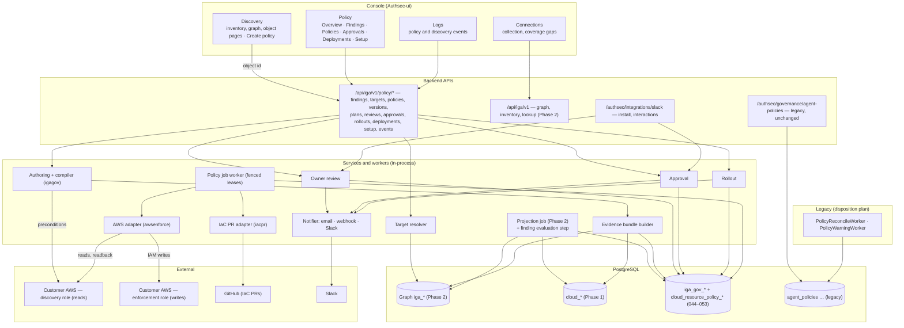
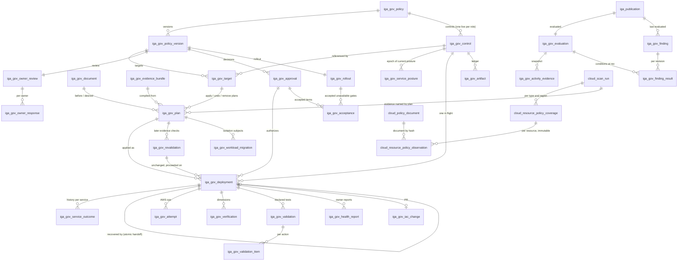

# SPEC: Phase 3 R1a — an independent policy product, from discovery to verified AWS change

**Status:** draft for review, rewritten 7 October 2026 against the current
code. This is the **R1a implementation spec**. R1b, R1k (Kubernetes), R2 and
R3 are recorded as direction in §12; each needs its own implementation spec
before any of its build tasks start.

**Requirements:** [SPEC-iga-phase3-policy-requirements.md](SPEC-iga-phase3-policy-requirements.md).
Requirement IDs (P-, C-, L-, E-, R-, K-) refer to it. Conflicts are listed in
§15, never resolved silently.

**Disposition of the existing agent-policy code:**
[PLAN-existing-policy-code-disposition.md](PLAN-existing-policy-code-disposition.md).

**Builds on:** [SPEC-iga-phase2-graph.md](SPEC-iga-phase2-graph.md) (graph,
publication, pipeline barrier, read model),
[SPEC-console-revamp.md](SPEC-console-revamp.md) (Connections, Discovery,
Policy, Logs), [SPEC-aws-quick-create-onboarding.md](SPEC-aws-quick-create-onboarding.md)
(the Quick Create callback reused for the enforcement stack).

## Architectural decision

Phase 3 is an **independent policy product** (requirements §1). It does not
extend the Kubernetes agent-lifecycle policy stack: not `agent_policies`, its
reconciler, `provisioning_instructions`, the warning worker or the retired
governance screens. Its own model is rooted in `iga_gov_policy` (§2); its
tables are prefixed `iga_gov_`, which separates them from the graph's
**discovered** `iga_policy` / `iga_policy_assignment` tables and satisfies the
`iga_*` naming rule of `scripts/ci-iga-isolation-check.sh`. A discovered
provider policy never becomes an AuthSec policy automatically. Phase 3 never
writes AuthSec's own runtime authorization (`role_bindings`,
`entitlement_provenance`).

Shared infrastructure is reused only through these contracts:

| Shared part | Contract Phase 3 relies on | Traced |
|---|---|---|
| Workspace and permissions | `AuthMiddleware` + `Require(resource, action)`; workspace from the token (`c.GetString("workspace_id")`), never the body | Present and source-traced (graph routes, `iga_routes.go`) |
| Permission rows | Global rows bound to the workspace `admin` role, as `004` / `005` do | Present and source-traced |
| Credentials | Vault KV paths per workspace and account, as discovery uses | Present and source-traced (discovery onboarding) |
| Audit | `auditAdminMutation` → `audit_events` on every mutating route, in addition to `iga_gov_event` | Present and source-traced |
| Email and webhook transport | A shared sender extracted from `policy_warning_senders.go` (§4.2); the legacy warning lifecycle is not reused | Proposed (reimplemented behind a contract) |
| Graph reads | `igaread.Reader` for AWS at the current publication; `/api/iga/v1/lookup` for identity resolution | Present and source-traced (AWS only) |
| Console primitives | `ConsolePage`, `AdaptiveTable`, `ObjectShell` / `ObjectTabs`, `StatusBadge`, `DecisionBanner`, `RightDrawer`, `CursorPager`, `LoadFailurePanel` | Present; `ImpactPreviewDialog` and `MetricStrip` exist but have no IGA caller |

## Baseline, traced

Inspected: `authsec` local `authsec-staging` at `05e8291`; **the cached
`origin/authsec-staging` is 19 commits ahead** (`caf27f1`…`c18df5e`, 5–6
October), read with `git show` only. `Authsec-ui` `authsec-staging` at
`73f59a1` with two uncommitted Discovery files. `iga-agent` local `main` at
`327f92b`; cached `origin/main` at `c3ca538` is 6 commits ahead.
`discovery-agent` `main`. Nothing was fetched, switched or changed; no
database or cluster was queried.

Status words: **traced** = present and source-traced; **not exercised** =
present, not exercised end to end; **missing**; **proposed**; **conflict**.

| Dependency | Evidence | Status |
|---|---|---|
| Highest migration | Local `042_unified_inventory.sql`; origin adds `043_discovery_ingest_auth.sql`; `037` is reserved by `migrations/contract/037_iga_access_edges_contract.sql` | traced. **Phase 3 starts at `044`** |
| AWS publication | Projector writes the graph and `iga_publication` in one fenced transaction under `iga_pipeline_lease` (`internal/igagraph/project.go:177-284`); manifest `{partition_key: run_id}` (`:286-308`) | traced; not exercised in a deployed environment |
| Publication is AWS-only | `iga_publication.scan_run_id` FK to `cloud_scan_run` (`033:150`) | traced |
| Graph history | `Reader.Read` returns `RevisionStale` for any revision but the latest (`internal/igaread/snapshot.go:139-142`); there is no historic read | traced — a plan cannot re-read the graph it was compiled from (§2.11) |
| Graph read API providers | Lists and details filter `provider = 'aws'` (`lists.go:614-627`, `workload_detail.go:213`); origin lets `/graph*` traverse Kubernetes, unrevisioned | traced (local AWS-only) |
| Graph schema verification | `GraphSchemaHead = "036"` (`services/iga_graph_projection.go:38`) checks nothing from `038`–`042` | conflict (graph gate does not verify the Kubernetes/GitHub schema); Phase 3 verifies its own head (§4.3) |
| Kubernetes graph writes | `services/k8s_rbac_service.go:109-276` writes `iga_*` rows per sweep (`iga_k8s_sweep`, `041`), no publication | traced; unrevisioned by design |
| Kubernetes ingress authentication | `POST /authsec/discovery/rbac-snapshot` and siblings have no auth middleware (`routes/routes.go:1449-1479`); workspace is body-asserted and only checked to exist (`discovery_controller.go:221-231`) | traced — **untrusted**. Origin `62a2376` adds ingest tokens with `IGA_DISCOVERY_INGEST_AUTH`, **default `warn`** (unauthenticated calls still accepted) |
| Kubernetes ordering | Sweep generation is `MAX+1` on arrival (`openSweep`); a replayed older snapshot becomes newest and ends newer grants; origin adds cluster-UID binding but no ordering guard | missing |
| Kubernetes producer | `iga-agent/internal/rbacscan` exists only on cached `origin/main`, off by default (`ACCESS_GRAPH_ENABLED=false`); sends fields the backend drops (`cluster_uid`, `oidc_issuer`, `aws_role_arn` locally; origin adds the first two) | not exercised |
| Kubernetes reads | `/authsec/discovery/k8s/*` behind auth; lists capped at 500, no cursor (`internal/k8sread/read.go:329-331,379-381`); no detail-by-id; UI finds objects among the first 500 (`K8sObjectPage.tsx:93-132`) | traced — insufficient for policy targets |
| Kubernetes activity | No audit-log or usage collection exists | missing |
| AWS activity | Access Advisor per service (`internal/awsdiscovery/activity.go:118-245`), 500-identity sample (`cloud_aws_workload_scan.go:1038`), `cloud_usage` latest report only (`cloud_workload_repository.go:260`) | traced |
| CloudTrail | 48 h, 10,000 events, `Username` name-match against 500 identities, stored as `cloud_observation` (`cloud_aws_workload_scan.go:650-708`) | traced; heuristic attribution |
| Resource policies | Only S3/KMS named by grants, summary facts only (`cloud_aws_permission_scan.go:1298-1477`); template grants `s3:GetBucketPolicy`, `kms:GetKeyPolicy` | traced — R1a builds collection (§3.9) |
| Unified inventory | `/api/iga/v1/inventory/*` (`iga_inventory_controller.go:28-42`): cursors, max 200, total cap 10,000, not revision-pinned; per-row `graph_state` (`inventory.go:360-372,799-860`) | traced; console uses it for Kubernetes only |
| Connections | `GET /authsec/discovery/connections` (`routes.go:1631-1637`, `igaread/connections.go:224-256`), independent conditions per connection | traced |
| Console | Four destinations (`IgaSidebar.tsx:43-53`); `/iga/policy` is a no-network reference preview; `/iga/logs` runs on fixtures; retired routes render `RetiredPage` (`App.tsx:839-930`) | traced |
| Legacy policy stack | UI deleted (`8e92359`); reconciler and warning workers run live every 5 min with no gate (`cmd/main.go:494-506`) | traced — disposition plan |

## 0. The completion promise

**When R1a is finished, a customer can do this, in the product, against
their own AWS accounts:**

```
Connections: AWS account connected, scanned, published
  → Policy › Findings: "RefundTaskRole: 11 services with no attempt reported in 112 days
                        through its IAM policies"
  → open the finding → Generate tighter policy
     (or Discovery › identity › Create policy, resolved server-side by RoleId)
  → see exactly what is removed, what stays and why, who else uses the role,
    which resource-policy routes exist, and the evidence the proposal rests on
  → owners of the role and of every consuming workload are asked, with a deadline
  → observe; approve in the console or Slack (author ≠ approver)
  → canary → health gates on real evidence → expand
  → AuthSec attaches an AuthSec-owned permissions boundary through a separate,
    customer-consented enforcement role, or opens a Terraform/CloudFormation PR
  → read back from AWS → the next scan shows the boundary in the graph
  → a request to a removed service is denied by AWS, attributed to the boundary
  → drift is detected; Undo restores exactly the state before the change
  → the finding resolves; Logs shows every step, actor and artifact
```

That journey, with a real AWS request denied by the deployed boundary and an
unrelated request by the same role still succeeding, is the milestone. **A
stored policy, a generated document, an approved plan, a successful API write
or a simulated denial alone is not completion.**

## 1. Scope

In plain terms: **R1a restricts whole AWS services for selected IAM roles.**
It does not produce action- or resource-level least privilege (R1b), govern
Kubernetes permissions (R1k), grant temporary access (R2) or block an agent's
individual tool calls (R3). Every screen that describes a change says this.

### 1.1 Three delivery journeys

R1a ships three ways to deliver the same approved change.

| | J1 Recommendations | J2 IaC delivery | J3 Direct enforcement |
|---|---|---|---|
| Customer grants | Discovery stack only | Discovery stack + GitHub App with contents/pull-request write on the mapped repository | Discovery stack + the separate enforcement stack (§3.6) |
| Workspace mode | `findings_only` or `enforce` | `enforce` | `enforce` |
| Delivery value | `export` | `iac_pr` | `direct` |
| AuthSec writes to AWS | Nothing | Nothing (the customer's pipeline applies the merged change) | Only `/authsec/` boundary policies and their attachment |
| Verification | When the desired state appears in AWS, as J3; correlated by role incarnation, attachment and document hash | Same, after merge **and** apply (§8.11) | §8.7 |
| Setup | none | Policy › Setup › IaC sources | Policy › Setup › Enforcement access |

A J1 or J2 deployment is a row in `iga_gov_deployment` like J3's, so
verification, drift, findings resolution and metrics are identical. Until the
desired state is read back, J2 is `awaiting_merge` then `awaiting_apply`; J1 is
`awaiting_apply` ("Awaiting your apply").

### 1.2 Provider capability, R1a

| Capability | AWS IAM roles (R1a) | Kubernetes (R1k, §12.2) |
|---|---|---|
| Discovery and relationships | Published graph | Unrevisioned graph from an untrusted ingress → not used by policy until K-1 |
| Activity evidence | Access Advisor, identity-policy scope; per-scan resource-policy observations | none |
| Recommendations | `unused_service`, `broad_grant`, `shared_role`, `missing_owner`, `missing_review_date`, `activity_not_read` | deferred |
| Static preview | yes | deferred |
| Historical what-if | R1b | not planned without activity evidence |
| Direct apply | AuthSec-owned permissions boundary | deferred (K-3) |
| IaC proposal | Terraform / CloudFormation PR | deferred (GitOps PR / export) |
| Verification | readback, graph, scoped behavior | deferred |
| Rollback | undo to recorded before-state; remove control restores baseline | deferred |
| Expiry / sessions | R2 | RBAC changes apply to the next request; tokens are not revoked |

In R1a the Policy UI shows Kubernetes objects as **not yet supported for
policy**, naming the missing prerequisite (K-1, K-2 or K-3) and linking to the
Connections remedy where one exists. No Kubernetes finding is produced.

### 1.3 Not in R1a

| Not built | What the product says instead |
|---|---|
| Effective-access evaluation | "Declared access · not evaluated" on every preview |
| Action- or resource-level right-sizing | R1b |
| Kubernetes RBAC right-sizing | R1k, after K-1 to K-3 |
| IAM users and groups | Findings shown; right-sizing not offered |
| Editing customer IAM documents in AWS | Only through J2 PRs |
| SCPs, RCPs, resource-policy right-sizing | Read as context only |
| Time-bound access, session revocation | R2 |
| Agent runtime controls | R3 |
| Automatic application without approval | Every write is bound to an approved plan (§2.8) |
| Any change to the legacy agent-policy stack | Disposition plan |

## 2. The model

### 2.1 Objects

| Object | Table | What it is |
|---|---|---|
| Policy | `iga_gov_policy` | Durable customer intent: name, purpose, family, provider, lifecycle, owner |
| Policy version | `iga_gov_policy_version` | Immutable typed intent; editing creates a new version |
| Owner | `iga_gov_owner` (+ `iga_gov_owner_rule`) | A workspace member accountable for a workload or identity |
| Finding evaluation | `iga_gov_evaluation` | One evaluation run for one published revision |
| Activity evidence | `iga_gov_activity_evidence` | Per revision, role and service: the activity facts used, copied out of the mutable `cloud_usage`, with the connector run they came from |
| Finding | `iga_gov_finding` | A condition worth acting on: identity, current status, latest complete condition |
| Finding result | `iga_gov_finding_result` | The condition of each finding **at** a revision; frozen once that evaluation completes |
| **Evidence bundle** | `iga_gov_evidence_bundle` | The immutable facts and source references a plan was compiled from (§2.11) |
| **Control** | `iga_gov_control` | The physical AWS role a policy controls and its baseline; one live control per role; the epoch of its posture |
| Target | `iga_gov_target` | A version's reference to a control |
| Document | `iga_gov_document` | Insert-once, hash-verified archive of every boundary document AuthSec read or wrote |
| Plan | `iga_gov_plan` | The compiled native change for one target, from one live read and one evidence bundle |
| Owner review | `iga_gov_owner_review` (+ `iga_gov_owner_response`) | Consultation of every known owner |
| Approval | `iga_gov_approval` | A decision bound to intent, impact, plan and material hashes |
| **Acceptance** | `iga_gov_acceptance` | One explicitly accepted uncertainty: an evidence gap, an unanalysed form, or a canary gate that could not be evaluated |
| **Revalidation** | `iga_gov_revalidation` | A later evidence check of an approved plan: `unchanged`, `material_change` or `blocked`; never rewrites the plan |
| Rollout | `iga_gov_rollout` | Observe → canary → expand |
| Deployment | `iga_gov_deployment` | One plan applied to the control it was compiled for |
| Attempt | `iga_gov_attempt` | One AWS operation, request id and outcome |
| Verification | `iga_gov_verification` | One dimension's result for one deployment |
| Validation | `iga_gov_validation` (+ `_item`) | A declared test call from a dedicated session |
| Health report | `iga_gov_health_report` | An owner's problem / working report |
| Artifact | `iga_gov_artifact` | Ledger of each native object AuthSec controls |
| Service outcome (history) | `iga_gov_service_outcome` | What one deployment established per service, and its change |
| Service posture (current) | `iga_gov_service_posture` | Current state per (account, role incarnation, service) |
| Job | `iga_gov_job` | Fenced durable work |
| Event | `iga_gov_event` | Append-only audit, the source of Logs |
| Resource-policy observation | `cloud_resource_policy_observation` (+ `_coverage`, `cloud_policy_document`) | Immutable per-scan collection (§3.9) |

Every table carries `workspace_id`, and every cross-object reference is a
composite FK on `(workspace_id, id)` (or a wider key where two references must
agree, §2.8).

**Which objects need their own persistence, and why.** A table exists only
where its rows have an independent lifecycle or an immutability guarantee:
versions (immutable intent), evidence bundles and documents (immutable
evidence), plans (one per live read), approvals (decisions), acceptances
(each accepted uncertainty, auditable on its own), revalidations (each later
check of approved evidence), deployments and
attempts (fenced execution), outcomes and posture (history vs current), events
(append-only audit). Findings keep identity and current status in one table
and per-revision conditions in another because reads at revision N must be
reproducible. There is no separate table for "proposal" (a draft version is
the proposal) or for "rollback" (an undo is a deployment of an undo plan).

### 2.2 Subjects are identity incarnations

A control binds an AWS role by its immutable `RoleId`
(`iga_identity_accounts.immutable_key`, `continuity = 'immutable'`). A role
recreated with the same name has a new `RoleId` and is a new subject: every
plan's precondition contains the `RoleId`; a recreated role fails it and the
deployment stops in `blocked`; the old incarnation's control moves to
`removed` (`role_gone`), its findings to `superseded`, its pending approvals are
revoked. A role with `continuity = 'recognition_only'` is ineligible.

### 2.3 Control: one policy per role

- `iga_gov_control` has a unique live key on `(workspace_id, account_id,
  role_id)` (state ≠ `removed`, probe DB5).
- A version's targets reference a control owned by the same policy (FK
  `(workspace_id, control_id, policy_id)`, probe DB6). Proposing a policy for a
  controlled role returns `409 role_controlled_by_policy`; the UI offers **Edit
  that policy**.
- `deployment → plan → target → control` is one FK chain, and the deployment's
  kind and delivery must equal the plan's (probes DB26–DB28). At most one
  deployment per control is in flight (probe DB7).
- The control records its **baseline** at its first applied deployment (probe
  DB30), and is the **epoch** of its role's posture: its `enforcement_seq`
  orders every enforcement observation, stops advancing once retired, and a
  replacement control takes over the role's posture rows only after the old
  control is retired (§8.7, probes DB96–DB105).
- Two workspaces connected to one AWS account cannot both control a role: the
  boundary policy carries `authsec:workspace=<ref>`; meeting another
  workspace's artifact is terminal `artifact_owned_elsewhere`.

### 2.4 Families, providers and lifecycle

`iga_gov_policy.family ∈ {governance, cloud_access, time_bound, runtime}`;
`provider ∈ {aws}` in R1a (R1k adds `k8s` in its own migration; probe DB3).
Families share the lifecycle, not semantics: a governance policy (ownership,
review dates) produces findings and rules but no provider artifact; a
cloud-access policy compiles to a provider artifact.

| `lifecycle` | Meaning | Allowed when |
|---|---|---|
| `active` | Versions may be proposed, approved, deployed | default |
| `paused` | No new deployment starts; in-flight ones finish their current op; verification and drift continue | `governance:enforce` |
| `archived` | Read-only history | no control of the policy has a live artifact |

Archiving a policy whose boundary is still in AWS is refused with
`409 policy_controls_roles`; the user first runs **Remove AuthSec control**
(§8.10).

### 2.5 Findings

**Kinds (R1a).**

| `kind` | Condition | Evidence | Next action |
|---|---|---|---|
| `unused_service` | Service S is in the role's activity report and has no authenticated attempt within the role's qualified interval for S (§2.6). Scope: access allowed by the role's **identity policies**; resource-policy routes are reported separately as known, absent or unknown (§3.4) | `iga_gov_activity_evidence` rows at the evaluated revision; route usage from the resource-policy observations of the role connector's run in the revision's manifest | Generate tighter policy |
| `broad_grant` | A live Allow statement grants `*`, `<svc>:*` on `Resource: *`, or an escalation action (§3.7) | Entitlement and statement revision | Generate tighter policy / review |
| `shared_role` | Two or more live `executes_as` / `task_execution_role` relationships target the role | `iga_relationship` | Propose dedicated identity (§11) |
| `missing_owner` | A workload-bound role has no accountable owner | absence in `iga_gov_owner` | Assign owner |
| `missing_review_date` | A finding rule requires a review date for this workload class and the owner record has none | `iga_gov_finding_rule`, `iga_gov_owner.review_due_at` | Set review date |
| `activity_not_read` | The role is workload-bound and its activity report was not collected for this revision | `iga_gov_activity_evidence.state = 'not_collected'` + reason | Link to the collection gap (L-16) |

`confidence` on an `unused_service` finding is `qualified` when the grant age is
established (§2.6) and `age_unverified` when the grant predates AuthSec's
observation; other kinds use `not_applicable`.

**Identity.** `fingerprint = sha256(kind ␟ RoleId ␟ detail_key)` where
`detail_key` is the service namespace (`unused_service`), the statement key
(`broad_grant`), or empty. Upserts key on `(workspace_id, fingerprint)`.

**Evaluation is pinned, snapshotted and published atomically.** Findings for
revision N are computed inside the projection job that published N, after the
publication commit and before the barrier is released (§8.2). Because
collection cannot run while the barrier is held, each connector's
`cloud_usage` rows still hold the reports of that connector's run named in
rev N's manifest. The evaluator:

1. inserts `iga_gov_evaluation(rev = N, status = running, attempts = 1)`
   in the publication transaction;
2. computes everything in memory from the snapshot: the role × service facts,
   the finding conditions, the service posture (§8.7), and the lifecycle
   transitions they cause. **Every role is evaluated, with evidence from its
   own connector:** a publication belongs to the workspace but is triggered by
   one connector's scan, so "rev N's scan" would be wrong for every other
   account. The evaluator resolves, per role, the run named for the role's
   partition in rev N's `manifest` (`{partition_key: run_id}`, `033`); that
   run's activity report and resource-policy observations are the role's
   evidence, and the run id is written on each `iga_gov_activity_evidence` row and
   `iga_gov_finding_result` row (`scan_run_id` / `evidence_scan_run_id`, required
   for any collected fact or route conclusion, probes DB79–DB81). Because the
   barrier is held, each connector's `cloud_usage` rows still belong to its
   manifest run; the evaluator checks the rows' generation against that run and
   records `not_collected` for a role whose rows do not match. A role whose
   partition is absent from the manifest, or whose run has no resource-policy
   coverage, gets `not_collected` / `confirm_required`, never an absence
   conclusion;
3. writes, in **one transaction** fenced on the projection job, in this order:
   the facts into `iga_gov_activity_evidence`; the `iga_gov_finding` upserts first, so
   every finding identity exists (`last_evaluated_rev = N` only where the
   stored value is lower; a trigger refuses lowering it, probe DB39); then one
   `iga_gov_finding_result` row per finding whose condition holds at N (its FK
   requires the finding, probe DB31); then the evaluation's `complete` status;
4. on error or budget overrun, writes nothing but `failed` with the reason.

**Retry and replay.** The evaluation row has a guarded state machine (trigger,
probes DB33–DB37): `running → complete | failed | superseded`;
`failed → running` only with `attempts + 1`; `failed → superseded`;
`complete` and `superseded` are terminal. A replayed projection job reads the
row: `complete` or `superseded` → the step is a no-op; `running` (a crash
mid-attempt, whose transaction rolled back) → it continues that attempt;
`failed` → it first runs the fenced `UPDATE … SET status = 'running', attempts
= attempts + 1 WHERE status = 'failed'` in the job's fenced transaction, then
evaluates. Evidence and results can only be written while the row is
`running`.

So a revision's findings are either all visible or not visible at all; there
is no partially applied evaluation. Evidence and result rows can be written
only while their evaluation is `running` and are frozen afterwards (probes
DB32, DB38).

**Reads.** A finding read at revision N joins `iga_gov_finding_result` at N (the
condition, severity, confidence and detail as of N) with `iga_gov_finding` (the
finding's identity and its **current** workflow status, labelled as current).
`?rev=N` is accepted only when evaluation N is `complete` and its results are
retained; otherwise the API returns `409 evaluation_incomplete` or `410
revision_not_retained`. Without `rev`, reads use the newest `complete`
evaluation.

The evaluation has a time budget (default 60 s). An overrun or error records
`failed` and still lets the projection job complete: **an evaluation failure
never fails or delays publication beyond the budget**. Findings then show
"evaluated at rev N−k; evaluation of rev N failed" and the next publication
evaluates again. A revision skipped because a newer one already completed is
recorded `superseded`. Evidence and results older than
`evidence_retention_revs` (default 30) are pruned, except revisions referenced
by a version's `evidence_rev`, which are kept for the life of that version.

**Lifecycle.**

```
open ──(a proposal targets it)──▶ under_review ──(posture removed)──▶ resolved ⇄ mitigated
                                         └──(posture excluded_routes_remain | _unknown)──▶ mitigated
  │                                   │                                              │
  │◀──────(proposal withdrawn)────────┘                                              │
  ├──(exception until T)──▶ excepted ──(T passes)──▶ open                            │
  ├──(condition false at a newer rev, no AuthSec change)──▶ cleared                  │
  ├──(role retired or recreated)──▶ superseded                                       │
  └◀──────────────(condition true again at a newer rev, or undo/drift)── reopened ◀──┘
```

`resolved` and `mitigated` follow the current service posture (P-11, §8.7): they move between each other as later scans add or remove routes, and to `reopened` when the posture becomes `not_removed` (undo, drift, a contradicting test); `cleared`
says the customer changed AWS themselves. There is no hide or dismiss.

### 2.6 Qualified interval and grant age

Access Advisor reports the last **authenticated attempt** per service (an
attempt, including one that was then denied, not proof of a successful call).
Two different questions decide a finding, and R1a keeps them apart:

- **Activity coverage** — for how long does AWS's report cover attempts by this
  role on this service? This is AWS history, available on the first scan.
- **Grant continuity** — for how long has the role held the grant? AuthSec can
  only *verify* this from what it has observed since its first scan.

For role R and service S, with report generation time `G` (the
`JobCompletionDate` the scanner stores as `generated_at`):

```
covered_until   = G − reporting_lag                     reporting_lag = 4 h (AWS: recent activity
                                                         usually appears within 4 hours)
tracking_from   = catalog.tracking_start(S, region set)  versioned tracking catalog (§3.7),
                                                         never a universal 400 days
role_from       = cloud_identity.created_at for R        IAM CreateDate: AWS history, not observation
coverage_start  = max(covered_until − requested_window, role_from, tracking_from)

verified_grant_from = see "Grant continuity" below; null when the grant predates observation

window_start    = verified_grant_from is null ? coverage_start
                                              : max(coverage_start, verified_grant_from)
qualified_days  = covered_until − window_start
```

- **Grant continuity is computed per grant path.** A *path* grants S to R only
  while **all** of its components hold: the assignment of a policy to R
  (`iga_policy_assignment`, including inline policies) **and** a revision of a
  statement in that policy that grants S (`iga_statement_revision`;
  consecutive revisions that all grant S form one interval). A component whose
  interval begins at the connector's first published scan is **open-start**:
  it existed when AuthSec first looked, so its true start is unknown, not
  "the first scan".

  ```
  path interval  = intersection of its components' intervals; open-start only if
                   every component is open-start, otherwise it starts at the
                   latest component start AuthSec actually observed
  granted        = union of all path intervals
  current        = the interval of `granted` that contains the evaluation time
  verified_grant_from = current is open-start ? null : start of current
  ```

  A policy attached before AuthSec's first scan whose DynamoDB statement
  AuthSec saw added 10 days ago gives `verified_grant_from` = 10 days ago,
  whatever the attachment's age. A second, independent path that is
  open-start keeps `current` open-start, because S was then continuously
  granted. A gap in every path after observation began starts a new, verified
  interval.
- **Day one.** On the first scan every component is open-start, so
  `verified_grant_from` is null and the window is the activity coverage alone:
  an old role whose report shows no `sqs` attempt in 112 days gets an
  `unused_service` finding at its first publication. The finding never claims
  the grant is 112 days old. It carries `grant_age_basis =
  predates_observation` and `confidence = age_unverified`, and says "no attempt
  reported in 112 days; AuthSec has not yet observed how long this access has
  existed". Because `current` is chosen by evaluation time, the report's
  lag-adjusted end falling before the first observation does not matter.
- **Confirmation, not assertion.** An `age_unverified` removal enters owner
  review like any other; the review asks the owner to confirm "this access was
  not added recently" (`age_confirmations`). A version cannot be approved while
  such a removal lacks that confirmation or a recorded exception. Once AuthSec
  has observed a path start, the basis becomes `observed_since_change` and the
  window is bounded by it.
- A path the graph cannot reconstruct (missing assignment or statement history)
  makes S `unreviewed`: kept, never removed.
- If `qualified_days < 30`, no `unused_service` finding is raised; the role
  shows "Not enough history (N days)".
- `LastAuthenticated = null` is "no attempt reported in the qualified
  interval", never "never used".
- A role whose report failed or fell outside the sample gets
  `activity_not_read` instead.
- **Sampling change (T3.03).** The activity scanner orders its 500-identity
  sample so identities targeted by live `executes_as` / `task_execution_role`
  relationships, and every identity with a live role control, come first.
- **Observation needs a fresh report.** Observation ends only when, for every
  target, an activity report generated at or after `observe_until +
  reporting_lag` has been collected (`observe_evidence_required_after` on the
  rollout). If no scan is scheduled to produce one in time, the
  `refresh_activity` job queues a scan of that connector through the existing
  scan queue (a `cloud_scan_run` in `queued`); the scan runs under the normal
  pipeline barrier, uses the discovery role, and its activity sample puts
  controlled roles first, so the report arrives as ordinary evidence of the
  next revision. Elapsed time alone never ends observation.

### 2.7 Policy versions and targets

A version's `intent` is typed JSON validated by `igagov.ValidateIntent`:

```json
{
  "kind": "right_size_services",
  "subjects": [{ "identity_account_id": "c41…", "role_id": "AROA…", "account_id": "429418377036" }],
  "retain": [
    { "service": "s3",       "basis": "observed",   "last_attempt": "2026-09-28T10:02:00Z" },
    { "service": "logs",     "basis": "dependency", "catalog": "ecs-task-execution@1" },
    { "service": "dynamodb", "basis": "owner",      "reason": "quarterly reconciliation job", "review_by": "2027-01-15" },
    { "service": "glue",     "basis": "unreviewed", "reason": "granted but absent from the activity report" }
  ],
  "remove": [
    { "service": "ec2", "basis": "no_attempt", "qualified_days": 112, "grant_age_basis": "observed_since_change" },
    { "service": "sqs", "basis": "no_attempt", "qualified_days": 112, "grant_age_basis": "predates_observation",
      "route_usage": "confirm_required", "route_state": "bypass_known",
      "routes": [{ "resource": "arn:aws:sqs:us-east-1:429418377036:refunds", "principal": "role_session" }] }
  ],
  "observation_days": 7,
  "rollout": { "canary_target": "AROA…", "canary_hours": 48 },
  "delivery": "direct",
  "finding_ids": ["…"],
  "evidence_rev": 812
}
```

Two more intent kinds exist in R1a:

- `{ "kind": "remove_control", "control_ids": ["…"], "reason": "…" }` —
  restores each control's baseline (§8.10).
- `{ "kind": "dedicated_identity", … }` — splits one workload off a shared role;
  its full contract is in §11.

- `subjects` are frozen into targets when the version is saved; each target
  references the policy's role control for that `RoleId` (created `planned` on
  first use). There are no selector-based AWS policies in R1a (P-06).
- `iga_gov_policy_version` rows are immutable except `status` and
  `status_changed_at`; a trigger enforces it (probe DB13). Any edit is a new
  version.
- Status: `draft → in_review → approved → superseded | withdrawn | rejected`.
  At most one version per policy is `approved` (partial unique index, probe
  DB14). `iga_gov_policy.current_version_id` is a composite FK that must point
  at a version of the same policy.

### 2.8 Hashes, and what an approval binds

Canonical JSON is RFC 8785 (JCS). AWS returns policy documents URL-encoded and
with arbitrary whitespace; they are decoded and canonicalized before hashing.
The compiler emits actions and statements in a fixed sort order.

**One definition of the artifact's state.** Compilation, execution, recovery,
undo and remove-control all use the same value, computed by one function
(`igagov.ArtifactState`) from a discovery-role read:

```
artifact_state = JCS({
  role_id,                      // the control's incarnation
  boundary_arn | null,          // the role's current boundary
  boundary_document_hash | null,// its default version, canonicalized
  attachment_set                // sorted entities using that policy, as boundary or as
})                              // permissions policy (ListEntitiesForPolicy, all usage types)
```

`artifact_state` deliberately excludes the role's own permission policies:
they decide what the role is granted, not what the artifact does to anyone
else.

| Hash | Over | Changes when |
|---|---|---|
| `intent_hash` | JCS(intent) | Anyone edits the intent (new version) |
| `desired_document_hash` | JCS(boundary document the plan installs); null when `desired_attachment` is `absent` or `unchanged` | Retained set, catalog version or compiler output changes |
| `precondition_hash` | apply: JCS({`artifact_state`, `role_arn`, `role_path`, protection tags, sorted attached managed policy ARNs with default-version document hashes, sorted inline policy names with document hashes}); undo, remove-control and role-only recovery: JCS({`artifact_state`}) of the state they start from | Apply: anything AuthSec relies on. Undo and removal: the artifact or **who uses it** changes |
| `impact_hash` | JCS({sorted consumers `(workload_id, relationship)`, sorted owner user ids, removed and retained services with basis, sorted statement-revision hashes of every identity statement granting a removed service, resource-policy routes flagged in §3.4}) | A consumer, owner or relevant grant appears or disappears |
| `plan_hash` | sha256(`control_id` ␟ `kind` ␟ `delivery` ␟ `desired_attachment` ␟ `desired_boundary_arn` ␟ `desired_document_hash` ␟ `replaced_boundary_arn` ␟ `artifact_disposition` ␟ `bundle_hash` (§2.11) ␟ `evidence_rev` ␟ `resource_policy_scan_run_id` ␟ JCS(`unanalysed`) ␟ `precondition_hash` ␟ JCS(ops)) | Any input changes, **including the evidence identifiers**: it names exactly the plan and evidence a person approved |
| `material_hash` | sha256(the same inputs **without** `bundle_hash`, `evidence_rev` and `resource_policy_scan_run_id`, plus `impact_hash` and the sorted keys and hashes of the bundle's gaps) | Only something a reviewer decided on changes — an unchanged rescan reproduces it |

**Two explicit outcomes per plan.** Every plan states separately:

- **`desired_attachment`** — what *this role's* boundary must be afterwards:
  `present` (this boundary ARN with this document), `absent` (no boundary), or
  `unchanged` (only `split` and `split_revert`, §11);
- **`replaced_boundary_arn` and `artifact_disposition`** — the policy this
  plan detaches from or replaces on the role, **named explicitly**, and what
  happens to it: `keep` (not detached or replaced), `delete` (nobody else
  uses it), or `retain_shared` (other entities use it: detach or replace for
  this role only, leave the policy and its other users untouched). A
  disposition other than `keep` must name the replaced policy, and it can
  never be the policy the plan installs (probes DB106–DB108).

The schema requires a boundary ARN and document exactly when `present`,
forbids `apply` plans that are not `present`, allows `unchanged` only for the
two split kinds, requires `delete` or `retain_shared` when `absent`, and
allows anything but `keep` only for `undo` and `remove_control` (probes
DB23–DB25, DB40–DB44, DB58–DB61). Execution (§8.5), verification (§8.7),
graph reconciliation, the ledger and UI wording all follow both fields; none
assumes a boundary exists or that a detached policy is deleted.

Each target has an **apply plan** and a derived **undo plan**, derived from
the apply's **artifact delta**, not from whether the role had a boundary
before. The undo's precondition is `artifact_state` after the apply (this
role's boundary, its document, and an attachment set of exactly what the
apply left); its desired attachment is the apply's before-state (`absent`, or
`present` with the earlier ARN and document); its replaced policy is the one
the apply installed **if that is a different policy** from the before-state
(a new AuthSec boundary, or a split copy), and its disposition is `delete`
for that policy (the apply left it used by this role alone), or `keep` when
the apply only changed the default version of the same policy (§8.3, §8.9).
An approval row stores `intent_hash`, every target's `impact_hash`, the
sorted `plan_hash`es and `material_hash`es of every apply **and** undo plan,
`evidence_rev` and `expires_at` (default 7 days). Each item the approver
accepts — an unanalysed form (§3.4) or an evidence gap of a `partial` bundle
(§2.11) — is its own `iga_gov_acceptance` row bound to the approval, the plan
and the bundle, with reason, actor and time (probes DB116–DB121, DB139). The schema
makes a deployment's approval and plan belong to the deployment's version
(composite FKs on `(workspace_id, id, version_id)`, probes DB8 and DB9).

**One classifier for every delivery.** Direct execution, recovery, IaC
verification and export verification all classify live state with the same
function, `igagov.Classify(plan, live)`. A plan is decomposed into its
**facts** — each a single native condition with a before value and an after
value:

| Fact | Before / after example (shared-boundary split undo) |
|---|---|
| this role's boundary | the copy → the shared boundary |
| the desired policy's default document (when `present` and AuthSec-owned) | — |
| the replaced policy's existence (`delete`) or attachment set (`retain_shared`) | copy exists → `NoSuchEntity` |
| other entities' use of the policies the plan touches | unchanged → unchanged (never changes) |

Classification of a read:

| Class | Meaning | Direct | IaC PR / export |
|---|---|---|---|
| `before` | every fact at its before value (`live_precondition_hash = plan.precondition_hash`) | run the ops | pending; after `apply_deadline_at`, overdue (never failed) |
| `intermediate` | every fact at its before **or** after value, not all one or the other | direct: only states reachable by a **prefix of the op order** count; resume at the next op | any combination counts, because the customer's tool orders its own calls (Terraform or CloudFormation may detach before deleting, or delete later); pending, shown as "2 of 3 changes visible in AWS: the role uses the shared boundary; the copy still exists", with the same deadline; never verified early |
| `after` | every fact at its after value, **including the disposition** | `recognised_done`; readback | `applied_unverified` |
| `conflict` | any fact at a value that is neither (a third boundary, a changed document, a new user of a policy the plan touches, a recreated role) | `blocked` (`plan_changed`) with the diff; a new plan and approval | `failed: unexpected_state` with the diff |

A direct-delivery state that is a valid combination but not a prefix of
AuthSec's own op order (for example, the copy deleted while the role still
uses it) is a `conflict`, because AuthSec did not do it.

**Revalidation, not silent recompilation.** The approved plan and its bundle
are never rewritten. When a deployment is about to start and the approved
evidence is no longer fresh (a newer published scan of the role's connector
exists, or the bundle is older than 24 hours), the deploy job builds a new
bundle, recompiles the same intent against it **in memory**, and inserts one
`iga_gov_revalidation` row (probes DB109–DB115, DB138):

| Result | When | Effect |
|---|---|---|
| `unchanged` | The recompiled `material_hash` equals the approved one | The deployment proceeds on the **approved** plan and records the revalidation it relied on (`revalidation_id`); no new approval, no owner notice |
| `material_change` | Any material input differs | The deployment is `blocked` with `changes`; the recompiled plan is stored as a new current plan, superseding the approved one; a new approval is required |
| `blocked` | The new evidence is `untrusted`, the role is now ineligible, or the live read failed | The deployment is `blocked` with the reason; nothing is recompiled |

Material inputs, each reported by name in `changes`: the control and role
incarnation; plan kind and delivery; desired attachment, ARN and document;
replaced policy and disposition; the live precondition (`precondition_hash`);
ops; impact — consumers, owners, removed and retained services with their
basis, statement revisions granting a removed service, resource-policy routes;
first attachment and its blockers; the `unanalysed` set; the bundle's gap set.
Not material: revision and scan identifiers, bundle hash, read times,
freshness figures, and activity facts of services that are kept. So an
unchanged rescan between canary and expansion yields a recorded
`unchanged` revalidation, not a new review.

The approval remains usable only if, for every target, the plan deployed is
the approved plan (its `plan_hash` is in the approval) and either its evidence
is fresh or its latest revalidation is `unchanged`; the intent is unchanged;
it is unexpired and unrevoked; and the approver still holds
`governance:approve`, is an active member and is not the author (P-10).
Acceptances survive an `unchanged` revalidation, because the unanalysed and
gap sets are material and therefore identical; any new item is a material
change and needs a new approval with its own acceptances. A changed
`impact_hash` additionally reopens the owner review for the owners and
consumers that are new (`iga_gov_owner_review.status = reopened`), because
they were never asked (L-03, L-14).

### 2.9 Ownership

`iga_gov_owner(object_kind, workload_id | identity_account_id, user_id,
role ∈ {accountable, technical}, source ∈ {manual, tag_rule}, rule_id,
review_due_at)`.

- **Manual:** set on the workload or identity page, or in bulk from Findings.
- **Tag rule:** `iga_gov_owner_rule` maps an AWS tag key to a workspace member by
  email. Rules are re-evaluated after each publication; a tag that matches no
  active member raises `missing_owner` showing the tag value.

A role's owners are its own owners **plus the accountable owners of every
workload that runs as it**. `discovered_agents.owner_user_id` belongs to the
legacy agent-lifecycle feature; Phase 3 neither reads nor migrates it.

### 2.10 Separation of duties

| Permission | Grants |
|---|---|
| `governance:read` (existing) | See findings, policies, plans, deployments, events |
| `governance:author` (new) | Create policies and versions, request review and approval, file validation requests |
| `governance:approve` (new) | Approve or reject a version; never one they authored |
| `governance:enforce` (new) | Enforcement mode, bindings, IaC sources, Slack; start, expand, pause, resume; Undo |
| `governance:emergency` (new) | Break-glass Undo or control removal without an approval reference; mandatory reason; always notified |
| `iga:admin` (existing) | Owners and owner rules |

`052` seeds the four new permissions as global rows and binds them to every
workspace `admin` role, using the same statements as `004`/`005`.
`governance:read` is an existing row that the legacy routes also use; sharing a
read permission couples nothing else. Self-approval is refused in code for
every role, including admins.

### 2.11 Evidence bundles

The graph is not uniformly revisioned, and its reader serves only the latest
AWS revision (`snapshot.go:139-142`). A plan therefore cannot rely on
"revision N" being re-readable later, and Kubernetes and GitHub rows have no
revision at all. Phase 3 never fabricates a global revision. Instead every
plan is compiled from an **evidence bundle**: an insert-once,
hash-verified row whose canonical facts are the complete basis of the plan.

```json
{
  "sources": [
    { "kind": "aws_publication", "rev": 812, "published_at": "…",
      "connector_id": "…", "connector_run": "…",          // the role's partition in rev 812's manifest
      "trust": "trusted", "freshness_hours": 3,
      "activity_report_generated_at": "…",
      "resource_policy_coverage": "complete", "resource_policy_run": "…" }
  ],
  "target": { "account_id": "429418377036", "role_id": "AROA…", "role_arn": "…",
              "estate_scope": "aws:account:429418377036" },
  "grants":    [{ "policy_arn": "…", "statement_hash": "sha256:…", "services": ["sqs","s3"] }],
  "consumers": [{ "workload_id": "…", "relationship": "executes_as" }],
  "consumers_unresolved": 0,
  "owners":    ["…"],
  "activity":  [{ "service": "sqs", "last_authenticated_at": null, "grant_age_basis": "predates_observation" }],
  "routes":    [{ "resource": "…", "principal": "role_session", "service": "sqs" }],
  "gaps":      [{ "kind": "unanalysed_form", "form": "ecr_repository" }]
}
```

- **Copied, or immutable by reference.** Facts read from mutable tables
  (graph rows, `cloud_usage`, owners) are copied into `facts`. A source is
  referenced only if it is itself immutable: per-scan resource-policy
  observations (§3.9), content-addressed documents (`iga_gov_document`,
  `cloud_policy_document`), and frozen evaluation rows. A bundle never points
  at a mutable row as if it were a snapshot.
- **Integrity.** `bundle_hash` is the sha256 of the canonical (RFC 8785) text;
  an insert trigger refuses a mismatch or a bundle with no source, and updates
  are refused (probes DB19–DB21). A plan cannot use another workspace's bundle
  (probe DB22) and cannot exist without one (probe DB18).
- **Trust.** `trust` is `trusted` only when every source is authenticated,
  ordered, fresh enough for the facts used (§3.4 gives the AWS rules) and
  complete for the namespaces the plan removes. `partial` lists the gaps the
  approver must accept; `untrusted` blocks compilation with the remedy. In R1a
  every source is an AWS publication; Kubernetes sources are `untrusted` until
  K-1 (§12.2).
- **Binding.** `plan_hash` includes `bundle_hash` (§2.8); the approval binds the
  plan hash and its `material_hash`; the deploy job re-reads live AWS state
  before every write. A newer publication produces a revalidation row against
  the approved evidence, which stays as approved; only a material change
  needs a new approval (§2.8).
- **Bounded evaluation.** Bundles are built by the compile job, outside the
  pipeline barrier, from the latest complete evaluation and the role
  connector's run; building never blocks collection or publication.

### 2.12 Target resolution

A policy target is resolved by the server from a provider identity, never
from the rows a table or graph happened to load.

- `POST /api/iga/v1/policy/targets/resolve` accepts provider-qualified
  identity keys — for AWS `{ "provider": "aws", "account_id", "role_arn" }` or
  `{ "role_id" }`, or a graph object id — and returns, for each: the resolved
  identity incarnation (`RoleId`, ARN, path, tags), eligibility with reasons,
  the existing control (if any), every consumer (`executes_as`,
  `task_execution_role`, instance profile) with a count of unresolved
  consumers, and owners. It reads by key through
  `iga_identity_accounts.immutable_key` and the relationship tables, with no
  list cap.
- A graph edge or a selected row is **context**: the UI sends its object id;
  the server resolves the holder identity and its complete grant set, and the
  preview shows independent grants beyond the selected edge (requirements
  scenario 2).
- Kubernetes keys (`cluster_uid`, namespace, ServiceAccount name and UID)
  return `not_supported` with the missing prerequisite in R1a.
- Selector targets are not offered in R1a (P-06); when they are, the resolved
  set is frozen into the version.

---

## 3. How AWS is changed

### 3.1 The artifact: an AuthSec-owned permissions boundary

R1a changes access with exactly one kind of native artifact: a
customer-managed IAM policy owned by AuthSec, attached as the role's
permissions boundary. Effective access is the intersection of identity
policies and the boundary, the boundary grants nothing, it applies to sessions
already issued, and the existing scanner already shows boundaries in the graph
(`iga_policy_assignment.assignment_kind = 'boundary'`).

Known limits, stated wherever the capability is offered:

- A role has **one** boundary (§3.3).
- A boundary changes how some **resource-based policies** evaluate: a
  same-account policy naming the role session is not limited by the boundary,
  one naming the role ARN is, `Principal: "*"` with an `aws:PrincipalArn`
  condition behaves differently from naming the role, and a `Deny` with
  `NotPrincipal` can start denying requests once any boundary is attached
  (AWS IAM user guide, "Permissions boundaries" and "Principal"). The compiler
  analyses these and refuses what it cannot preserve (§3.4).
- **Eligibility is decided by path and tag, never by name**, because customers
  name roles freely and the discovery role's name is a parameter. Ineligible:
  roles under `/aws-service-role/` or `/aws-reserved/`; roles tagged
  `ManagedBy=AuthSec` (AuthSec's own discovery and enforcement roles); roles
  tagged `authsec:protected=true`; roles with `continuity = recognition_only`.
  The enforcement role's explicit denies enforce the same set in AWS (§3.6).

### 3.2 Names, tags and document shape

| Item | Value |
|---|---|
| Policy path | `/authsec/` |
| Policy name | `AuthSecBoundary-<RoleId>` |
| Policy ARN | `arn:aws:iam::<account>:policy/authsec/AuthSecBoundary-<RoleId>` |
| Tags | `authsec:managed-by=authsec`, `authsec:workspace=<opaque workspace ref>`, `authsec:control=<control id>`, `authsec:policy=<policy id>`, `authsec:change=<deployment id>` (updated with `TagPolicy` on each version change) |
| Versions | IAM keeps at most 5. Before `CreatePolicyVersion` on a full policy, the oldest non-default version is deleted **after** its document is confirmed in `iga_gov_document` |
| Size | 6,144 characters excluding whitespace; the compiler refuses larger documents (L-08) |

R1a document: the boundary **excludes only the removed services** and allows
everything else, so it cannot take away access nobody selected:

```json
{
  "Version": "2012-10-17",
  "Statement": [{
    "Sid": "AuthSecAllowAllExceptRemoved",
    "Effect": "Allow",
    "NotAction": ["ec2:*", "sqs:*"],
    "Resource": "*"
  }]
}
```

A boundary is a ceiling and grants nothing; with this shape the ceiling is
"everything except the removed namespaces". Access to every other service
survives whatever grants it: identity policies, resource policies naming the
role ARN (which AWS limits by the boundary), or service dependencies. The
document stays small regardless of how many services the role uses.

### 3.3 Existing boundaries

| Role's current boundary | R1a behaviour |
|---|---|
| None | J3: create `AuthSecBoundary-<RoleId>` and attach it. Undo detaches and deletes it |
| AuthSec's own (`/authsec/` path, tagged for this control, ledger matches) | J3: a new default policy version. Undo restores the previous document as a new default version |
| A customer-owned boundary used **only** as this role's boundary | **Never edited by AuthSec in AWS.** J2/J1 only: the customer's boundary is narrowed in place by structure-preserving removal (§3.4). Baseline = the customer's document; Remove AuthSec control restores it |
| A customer-owned boundary used by **any other entity** (as a boundary or as a permissions policy) | The shared document is **never changed**. J2/J1 only: a **split boundary** — a new customer-owned policy `<boundary name>-<RoleId>` holding the narrowed copy, set as this role's boundary only. Other users of the shared policy are untouched. Baseline = the shared boundary; Remove AuthSec control points the role back at it and deletes the copy |

The boundary policy's full attachment set (`ListEntitiesForPolicy`, every usage
type) is read before compiling and is part of the precondition, so a customer
boundary that becomes shared after review blocks the plan with `plan_changed`
rather than silently changing another role.

### 3.4 The compiler

`igagov.Compile(intent, live, graph, catalog) → plan | ineligible(reason)`.

**Preservation is by construction.** The compiler never decides what to keep.
The boundary's only content is the exclusion list `remove` (§3.2), so every
namespace not in `remove` is allowed by the ceiling exactly as before. This
does not depend on enumerating the role's grants or on resource-policy
collection, and it holds for identity statements of any shape, including
`NotAction` and `"*"`: the boundary removes the selected namespaces from
whatever they grant and nothing else. What the compiler still must establish:

1. **Each removal is justified** — every `remove` entry carries a qualified
   basis (§2.6), is not a dependency of the workload context (`D`, §3.7), and
   appears in the role's activity report (AWS's own list of services the role
   is granted).
2. **Attaching a boundary does not change how resource policies evaluate** —
   the first-attachment proof below.
3. **The preview states what the removal does and does not reach** — the
   resource-policy routes below.

**First-attachment proof.** AWS documents one way in which merely *having* a
boundary changes access that the boundary's contents do not explain: a
resource-policy statement with `Deny` and `NotPrincipal` "will always deny any
IAM principal that has a permissions boundary policy attached, regardless of
the values specified in the `NotPrincipal` element" (AWS IAM user guide,
"Permissions boundaries"). A role that is today exempted by such a statement
(its ARN, a session of it, or its account is listed in `NotPrincipal`) would
start being denied. This can only happen when a role goes from **no boundary
to a boundary** (`first_attachment = true`); changing an existing boundary's
document, or narrowing a customer boundary, leaves it unchanged.

A first-attachment plan therefore names the scan whose resource-policy
evidence it used (`resource_policy_scan_run_id`, the role connector's run in the
manifest of the compiled revision, i.e. the newest published scan of
the role's connector) and requires, from that scan's immutable observations
(§3.9):

- every **collected** policy-bearing resource form (§3.7) has coverage
  `complete` in every region enabled in the account. A collected form that is
  `partial`, `denied` or `not_collected` makes the plan `ineligible` ("S3
  access point policies could not be read in eu-west-1"). Before T3.03b ships,
  every collected form is `not_collected`, so **no first attachment is offered
  before resource-policy collection exists** — for EC2 as for any service;
- no observed policy, of any form, has a `Deny` with `NotPrincipal` whose list
  contains the role's ARN, any of its session ARNs, or its account; and no
  observed policy is `unparseable`. Either makes the plan `ineligible`
  (`resource_policy_blocks_boundary`), naming the resource;
- every **uncollected** policy-bearing form in the catalog for the account's
  services, and every resource in other accounts, is listed in the plan's
  `unanalysed` set. The approver must accept each listed item explicitly
  (one `iga_gov_acceptance` row per item, kind `unanalysed_form`;
  `409 residuals_not_accepted` otherwise). The canary's `no_unexpected_failures` gate (§8.6) pauses on any
  resulting denial, and undo is one step.

The deploy job re-checks before the first write that the named scan is the
newest published scan of the connector and no older than 24 hours; otherwise
it revalidates against the newer scan (§2.8). Because the blockers and the
`unanalysed` set are material, an unchanged scan lets the approved plan
proceed, and any new blocker or uncollected form stops it for a new
approval.

**Resource-policy routes: what the evidence covers.** AWS documents that
last-accessed information "includes services that are allowed by an IAM
identity's policies" and that "access allowed by other policy types is not
included", naming resource-based policies (AWS IAM user guide, "Refine
permissions using last accessed information"). An `unused_service` finding
therefore establishes only **"no attempt reported for access allowed by this
role's identity policies"**. It says nothing about access a resource policy
allows on its own. For each removed namespace, the compiler reads the named
scan's observations (§3.9) and records two separate things.

*Route usage* (is the recommendation safe?):

| What the named scan shows for the namespace | `route_usage` | Consequence |
|---|---|---|
| Every collected form of the namespace complete, and no policy grants its actions to the role ARN, a session of the role, or `"*"` / `{"AWS": "*"}` | `none_observed` | The finding's evidence scope covers all access to the namespace in this account |
| One or more such policies (listed) | `confirm_required` | Usage through those routes is **unknown**. Owner review asks, per route, "does this workload use `refunds` through its queue policy?" (`route_confirmations`); approval is refused (`409 route_unconfirmed`) until each is confirmed unused or excepted |
| A form of the namespace uncollected, or not complete | `confirm_required` | Same, with the forms named: "AuthSec could not read ECR repository policies; use through them is unknown" |

A grant naming only the role's **account** is not a separate route: the
account principal delegates to identity policies, so such access is within
the report's scope. Resources in other accounts likewise need an identity-
policy grant on this role, so they are within the report's scope too.

*Route effect* (what will the removal actually achieve?):

| Route | Effect of the boundary | `route_state` for the outcome (§8.7) |
|---|---|---|
| `Allow` naming the role ARN | Limited by the boundary: the removal takes effect on this route | does not count as a remaining route |
| `Allow` naming a session of the role, same account | **Not** limited: access remains | `bypass_known`, route listed |
| `Allow` with `Principal: "*"`, with or without `aws:PrincipalArn` conditions | Not established | `effect_unknown`, route listed |
| Form not analysed | Unknown | `not_analysed`, forms listed |
| None of the above | — | `none_observed` |

Both enter `impact_hash`. The preview, review page, Slack message and policy
detail never say a service "can no longer be called" when its `route_state`
is anything but `none_observed` (§9).

**Customer boundary narrowing (J2/J1, §3.3).** The narrowed document is
produced by **removing, not rebuilding**:

- each `Allow` keeps `Sid`, `Effect`, `Resource`, `NotResource` and `Condition`
  unchanged (canonical form); only `Action` entries whose namespace is in
  `remove` are deleted, and a statement left with no actions is deleted;
- `Deny` statements are unchanged;
- narrowing is refused if any `Allow` in the boundary uses `NotAction`,
  `Action: "*"` or a namespace wildcard.

The plan records `kept | narrowed | deleted` per statement and the proof that
the result's action set is a subset of the original's (L-07). For a shared
customer boundary the same narrowed document becomes the split copy; the
shared document is not part of any plan's changes.

**Plan eligibility.** `eligible` (J3 possible), `iac_only` (customer boundary,
or no verified enforcement binding but an IaC source exists), `ineligible`
(with reason). J1 export is available for `eligible` and `iac_only` plans.

### 3.5 Who reads, who writes

| Operation | Credential |
|---|---|
| Live preconditions: `GetRole`, `ListAttachedRolePolicies`, `ListRolePolicies`, `GetRolePolicy`, `GetPolicy`, `GetPolicyVersion`, `ListPolicyVersions`, `ListEntitiesForPolicy` | **Discovery role** (`SecurityAudit` covers these) |
| Readback after a write, drift checks | Discovery role |
| `GenerateServiceLastAccessedDetails` for `refresh_activity` | Discovery role |
| `CreatePolicy`, `TagPolicy`, `CreatePolicyVersion`, `DeletePolicyVersion`, `SetDefaultPolicyVersion`, `DeletePolicy`, `PutRolePermissionsBoundary`, `DeleteRolePermissionsBoundary` | **Enforcement role** |

The enforcement role can read nothing. If the discovery connector is not
`active`, deployments block with `discovery_unavailable`.

### 3.6 The enforcement stack, its permissions and its self-test

| | Discovery | Enforcement |
|---|---|---|
| Stack | `AuthSec-Discovery-<suffix>` | `AuthSec-Enforcement-<suffix>` |
| Roles | discovery role (name is a parameter), tagged `ManagedBy=AuthSec` | `AuthSecEnforcement-<suffix>` tagged `ManagedBy=AuthSec`; `AuthSecEnforcementSelfTest-<suffix>` tagged `authsec:selftest=true` (not `ManagedBy`) |
| Template | `authsec-aws-discovery-role.yaml` | `authsec-aws-enforcement-role.yaml` (new, own `TemplateVersion`) |
| Custom resource | `Custom::AuthSecRegistration` | `Custom::AuthSecEnforcementRegistration` |
| ExternalId | Minted per workspace + account | Minted separately; never equal to discovery's |
| Vault | `kv/data/secret/workspaces/{ws}/cloud-discovery/aws/{acct}` | `kv/data/secret/workspaces/{ws}/cloud-enforcement/aws/{acct}` |
| Session name | `authsec-discovery-<16hex>` | `authsec-enforce-<deployment id 16hex>` |
| Row | `cloud_connector` | `cloud_enforcement_binding` |

**Enforcement role policy (template v1), complete:**

```yaml
Statement:
  - Sid: ManageAuthSecPolicies
    Effect: Allow
    Action: [iam:CreatePolicy, iam:TagPolicy, iam:CreatePolicyVersion,
             iam:DeletePolicyVersion, iam:SetDefaultPolicyVersion, iam:DeletePolicy]
    Resource: !Sub arn:${AWS::Partition}:iam::${AWS::AccountId}:policy/authsec/*
  - Sid: AttachOnlyAuthSecBoundaries
    Effect: Allow
    Action: [iam:PutRolePermissionsBoundary]
    Resource: !Sub arn:${AWS::Partition}:iam::${AWS::AccountId}:role/*
    Condition:
      ArnLike: { iam:PermissionsBoundary: !Sub "arn:${AWS::Partition}:iam::${AWS::AccountId}:policy/authsec/*" }
  - Sid: DetachOnlyAuthSecBoundaries
    Effect: Allow
    Action: [iam:DeleteRolePermissionsBoundary]
    Resource: !Sub arn:${AWS::Partition}:iam::${AWS::AccountId}:role/*
    Condition:
      ArnLike: { iam:PermissionsBoundary: !Sub "arn:${AWS::Partition}:iam::${AWS::AccountId}:policy/authsec/*" }
  - Sid: ProtectServiceRoles
    Effect: Deny
    Action: [iam:PutRolePermissionsBoundary, iam:DeleteRolePermissionsBoundary]
    Resource:
      - !Sub arn:${AWS::Partition}:iam::${AWS::AccountId}:role/aws-service-role/*
      - !Sub arn:${AWS::Partition}:iam::${AWS::AccountId}:role/aws-reserved/*
  - Sid: ProtectAuthSecRoles
    Effect: Deny
    Action: [iam:PutRolePermissionsBoundary, iam:DeleteRolePermissionsBoundary]
    Resource: "*"
    Condition:
      StringEquals: { aws:ResourceTag/ManagedBy: AuthSec }
  - Sid: ProtectTaggedRoles
    Effect: Deny
    Action: [iam:PutRolePermissionsBoundary, iam:DeleteRolePermissionsBoundary]
    Resource: "*"
    Condition:
      StringEquals: { aws:ResourceTag/authsec:protected: "true" }
```

The `iam:PermissionsBoundary` condition on `DeleteRolePermissionsBoundary`
evaluates the boundary currently attached, so the role can detach only
AuthSec boundaries. Whether AWS supplies the key for that action is verified by
the self-test (`detach_boundary`, and the negative probe below); if it does
not, the template must be revised before J3 ships (gate in §14.1 step 0).

**Self-test and per-capability status.** A binding is not one boolean. The
`verify_binding` job assumes the role and runs, against the stack's own
self-test role only:

| Capability | Probe | Proves |
|---|---|---|
| `assume` | `AssumeRole` with the ExternalId; `GetCallerIdentity` (through STS, no IAM permission needed) account = connector | Trust and ExternalId |
| `create_policy` | `CreatePolicy /authsec/AuthSecSelfTest-<binding id>` with tags | Create + tag |
| `version_management` | `CreatePolicyVersion` (default) then `DeletePolicyVersion` of v1 | Version writes |
| `attach_boundary` | `PutRolePermissionsBoundary` on the self-test role with the test policy | Attach condition |
| `refuses_foreign_boundary` | `PutRolePermissionsBoundary` on the self-test role with `arn:aws:iam::aws:policy/ReadOnlyAccess` → must be `AccessDenied` | The condition actually restricts |
| `detach_boundary` | `DeleteRolePermissionsBoundary` on the self-test role | Detach condition |
| `delete_policy` | `DeletePolicy` of the test policy | Cleanup |

Each capability is `ok | denied | error | untested` in
`cloud_enforcement_binding.capabilities`, with the AWS error code. State is
`verified` when all are `ok`, `partial` otherwise (J3 refused, with the failing
capabilities named), `error` when `assume` fails. Probes run at binding
creation, every 24 hours, and before each deployment batch (a cached result
younger than 1 hour is reused). The self-test never touches a customer role.

### 3.7 Catalogs

`internal/igagov/catalog.go`, versioned in code (`catalog@N`), holds three
tables. A newer catalog never widens or narrows a deployed boundary; it changes
new compilations only (C-03).

**Dependency catalog** (always retain):

| Context (from the graph) | Retain |
|---|---|
| Lambda execution role | `logs`; `xray` if `TracingConfig.Mode = Active` |
| ECS task execution role | `ecr`, `logs`; `secretsmanager` / `ssm` / `kms` when the task definition references secrets |
| ECS task role / EC2 instance profile role | none beyond `sts:GetCallerIdentity` |
| Bedrock agent / AgentCore runtime role | `bedrock`, `bedrock-agentcore`, `logs` |
| Statements using `kms:ViaService` | `kms` |

**Tracking catalog**: per service namespace, the date from which Access
Advisor tracks it (from the AWS IAM documentation of the tracking period,
recorded with the documentation date). A service absent from the tracking
catalog yields `unreviewed`, never `unused_service`.

**Policy-bearing forms catalog**: every resource form that can carry a
resource-based policy, per namespace, taken from AWS's list of services that
support resource-based policies and recorded with its documentation date. Each
form is `collected` (R1a reads it, §3.9) or `uncollected`. Completeness is
defined per **form**, never per namespace: "every S3 bucket read" says nothing
about S3 access points. An `uncollected` form is never treated as empty; it is
listed as `unanalysed` wherever a proof would need it (§3.4).

**Escalation actions** that make a statement a `broad_grant`: `iam:PassRole` on
`*`, `iam:Create*`, `iam:Attach*`, `iam:Put*Policy`, `iam:UpdateAssumeRolePolicy`,
`sts:AssumeRole` on `*`, `lambda:UpdateFunctionCode` on `*`.

### 3.8 Capability matrix (R1a)

| Capability | Supported | Artifact | Verification | Undo |
|---|---|---|---|---|
| Remove unused services from an IAM role | Eligible roles (§3.1); each removal justified (§3.4). A role's **first** boundary additionally needs the first-attachment proof: every collected policy-bearing form complete, no exempting `Deny` + `NotPrincipal`, uncollected forms accepted by the approver (§3.4, §3.9). J3: no boundary or an AuthSec boundary. J2/J1: also customer boundaries, narrowed in place when used only by this role, split when shared (§3.3, §3.4) | `AuthSecBoundary-<RoleId>` or a PR | §8.7 | Restore the before-state (§8.9) |
| Owner-retained exceptions | Any service, reason + review date | Same | Same | Same |
| IAM users, groups; action level; time-bound; runtime | No (findings only, or later increments) | — | — | — |

Every unsupported combination is shown with its reason (C-01).

### 3.9 Resource-policy collection (built in R1a)

The first-attachment proof and the route analysis (§3.4) need data no current
scanner produces. R1a builds it (T3.03b); until it ships, no role receives its
first boundary.

**Collected forms (R1a).** Completeness is per form and region:

| Form | Enumerate | Read policy | Scope |
|---|---|---|---|
| `s3_bucket` (general purpose) | `ListBuckets` | `GetBucketPolicy` (`NoSuchBucketPolicy` = no policy) | Account-wide list, read per bucket |
| `s3_directory_bucket` | `ListDirectoryBuckets` | `GetBucketPolicy` on the `s3express` endpoint | Per region |
| `s3_access_point` | `ListAccessPoints` (S3 Control) | `GetAccessPointPolicy` | Per region |
| `s3_multi_region_access_point` | `ListMultiRegionAccessPoints` | `GetMultiRegionAccessPointPolicy` | Account (control-plane region) |
| `s3_object_lambda_access_point` | `ListAccessPointsForObjectLambda` | `GetAccessPointPolicyForObjectLambda` | Per region |
| `kms_key` | `ListKeys` | `GetKeyPolicy` (`default`) | Per region |
| `sqs_queue` | `ListQueues` (paginated) | `GetQueueAttributes`, `AttributeNames=Policy` only | Per region |
| `sns_topic` | `ListTopics` | `GetTopicAttributes`, `Policy` attribute only | Per region |
| `lambda_function` | `ListFunctions` | `GetPolicy` without qualifier (`ResourceNotFoundException` = no policy) | Per region |
| `lambda_function_version` | `ListVersionsByFunction` per function | `GetPolicy` with `Qualifier=<version>` | Per region |
| `lambda_alias` | `ListAliases` per function | `GetPolicy` with `Qualifier=<alias>` | Per region |
| `lambda_layer_version` | `ListLayers`, `ListLayerVersions` | `GetLayerVersionPolicy` | Per region |
| `secretsmanager_secret` | `ListSecrets` | `GetResourcePolicy` (never `GetSecretValue`, which stays explicitly denied) | Per region |

Every other policy-bearing form in the catalog (for example ECR repositories,
EventBridge buses, API Gateway APIs, Glue catalogs, Backup vaults, OpenSearch
domains, CloudWatch Logs resource policies) is `uncollected` in R1a and
appears in a first-attachment plan's `unanalysed` set (§3.4). KMS grants are
not resource policies and are not affected by boundaries' `NotPrincipal`
behaviour; they are out of scope.

- **Discovery template.** A new `TemplateVersion` lists the enumerate and read
  actions above explicitly in the `ResourcePolicies` statement, following the
  template's rule of not relying on `SecurityAudit` for reads AuthSec depends
  on. Connectors on the older template record every collected form as
  `not_collected` ("discovery template update needed"), so no first
  attachment is offered for them.
- **Immutable evidence (`053`).** Each scan writes, per form and region, one
  `cloud_resource_policy_coverage` row, and per resource read one
  `cloud_resource_policy_observation` row — including `policy_present = false`
  for "no policy" — with the document stored once by hash in
  `cloud_policy_document`. Observations must belong to a coverage row of the
  same scan (FK, probe DB53), carry a document exactly when a policy exists
  (probe DB54), and are never updated (trigger, probes DB56, DB57).
  Documents are **insert-once**: the writer stores the RFC 8785 canonical text
  and its jsonb; an insert trigger rejects a hash that is not the sha256 of
  that text or a jsonb that differs from it (probes DB64, DB65), updates are
  rejected (probe DB66 reproduces the rewrite case), a duplicate insert uses
  `ON CONFLICT DO NOTHING` and is by construction the same content (probe
  DB68), and a document cannot be deleted while an observation references it
  (probe DB69). `iga_gov_document` follows the same rules (probe DB67). A rescan
  adds its own rows and leaves earlier scans' evidence intact (probe DB55
  reproduces the overwrite case: scan N's document survives the rescan).
- **Coverage.** `complete` requires every enumerated resource to have been read
  (CHECK `read_failed = 0 AND read_ok = enumerated`, probe DB51); anything else
  is `partial`, `denied` or `not_collected` with a reason (probe DB52). Regions
  enabled in the account but not selected on the connector are recorded
  `not_collected`.
- **Which evidence a plan used.** The compiler takes the run named for the
  role's partition in the manifest of the revision it compiles against —
  never the run that happened to trigger that publication. A plan stores `evidence_rev` (graph revision)
  and `resource_policy_scan_run_id` (the connector scan whose observations it
  read); both enter `plan_hash`, so the approval identifies the exact evidence.
  The compiler reads only that scan's rows; it never reads "current" rows.
- **Retention.** A daily `prune_evidence` job deletes observations and coverage
  of scans older than `evidence_retention_revs` publications, **except** scans
  named by any plan that is current, approved, or referenced by a deployment,
  which are kept for as long as that plan or deployment exists. It then deletes
  documents no remaining observation references; the FK makes deleting a
  referenced document impossible.
- **Budget.** Reads are paginated and rate-limited per service, run inside the
  existing scan under the pipeline barrier, and count toward its budget; a
  form that cannot finish is `partial`, never silently complete.
- **Existing evidence.** The current S3/KMS summary evidence stays for the
  graph's evidence panel; the compiler never reads it.

---

## 4. Architecture

### 4.1 Components



There is no edge between the Phase 3 services and the legacy stack: Phase 3
neither reads `agent_policies` nor enqueues `provisioning_instructions`, and
the legacy workers never read `iga_gov_*`; the schema has no reference between the two (probe DB2; E-12). The only
cross-reference is the read-only compatibility view of the disposition plan
(§7.11), served by the legacy service.

### 4.2 Packages and files

| Path | Responsibility | Pure? |
|---|---|---|
| `internal/igagov/canonical.go` | RFC 8785 canonical JSON, policy-document decoding, all hash functions (§2.8, §2.11) | Yes |
| `internal/igagov/qualify.go` | Qualified interval and grant age (§2.6) | Yes |
| `internal/igagov/catalog.go` | Dependency, tracking and escalation catalogs (§3.7) | Yes |
| `internal/igagov/findings.go` | Evaluate a revision snapshot into findings and activity evidence | Yes |
| `internal/igagov/bundle.go` | Build and canonicalise an evidence bundle; trust classification (§2.11) | Yes |
| `internal/igagov/intent.go` | Intent types, `ValidateIntent` | Yes |
| `internal/igagov/compile.go` | Retained set, boundary document, structure-preserving narrowing, eligibility, apply and undo plans, recovery classification (§3.4, §8.5) | Yes |
| `internal/igagov/health.go` | Canary gates from evidence (§8.6) | Yes |
| `internal/awsdiscovery/resource_policies.go` (extends the current S3/KMS reader) | Enumerate and read the collected forms (§3.9); per-region coverage | No |
| `internal/awsenforce/` | Discovery-role reads; enforcement-role writes; per-op recovery; error classes; binding self-test | No |
| `internal/iacpr/` | Render Terraform/CloudFormation changes; open/update PRs through the GitHub App; record reviewed and merged SHAs | No |
| `internal/slackapp/` | Signature verification, message builders, interaction parsing | Mostly |
| `internal/notify/` | Email and webhook transport extracted from `services/policy_warning_senders.go` (`SMTPWarningSender`, `HTTPWarningSender`) behind a `Send(ctx, Message)` contract; the legacy senders become thin adapters over it, with unchanged behaviour | No |
| `services/iga_gov_evaluator.go` | The evaluation step called by the projection service (§8.2) | No |
| `services/iga_gov_target_resolver.go` | `targets/resolve` (§2.12) | No |
| `services/iga_gov_ownership_service.go` | Owners, owner rules | No |
| `services/iga_gov_authoring_service.go` | Policies, versions, controls, targets, proposals, bundles | No |
| `services/iga_gov_owner_review_service.go` | Reviews, notifications, responses, deadlines | No |
| `services/iga_gov_approval_service.go` | Approvals (UI + Slack), SoD, invalidation | No |
| `services/iga_gov_rollout_service.go` | Observe, canary, gates, expand, pause | No |
| `services/iga_gov_job_worker.go` | Claims and runs `iga_gov_job` (§8.1) | No |
| `services/cloud_enforcement_binding_service.go` | Enforcement Quick Create, self-test, revoke | No |
| `services/iga_gov_iac_source_service.go` | IaC source mapping and PR lifecycle | No |
| `services/slack_integration_service.go` | Install, links, channel | No |
| `repository/iga_gov_*_repository.go` | One repository per table group; the job repository copies `iga_projection_job_repository.go`'s fenced claim/renew | No |
| `controllers/platform/iga_gov_*_controller.go` | Handlers (§7), registered in a `policy` subgroup of the graph route group | No |

Not touched: `internal/policy` (the runtime PDP behind
`oauth_as_controller.go` and `authorization_controller.go`, AuthSec runtime
authorization), `services/policy_reconcile*`, `services/policy_warning_service.go`
(except the sender extraction above) and every `agent_policies` repository.
`scripts/ci-iga-isolation-check.sh` must pass for every new file: IGA code
names only `iga_*` tables and the allowlisted shared tables.

### 4.3 Gates

| Gate | Values | Effect |
|---|---|---|
| `IGA_POLICY` env | `off` (default), `on` | `on` requires `IGA_GRAPH_PROJECTION=on` and a verified Phase 3 schema: every relation and added column of `044`–`053` checked by existence, as `VerifyGraphSchema` does for the graph (`services/iga_graph_projection.go:74-101`). Fail closed: on with verification failing, every Phase 3 route returns `503 policy_unavailable` and the evaluation step is skipped. Off: the same, and the Policy destination keeps its preview. Legacy routes and workers are unaffected either way |
| `iga_gov_settings.enforcement_mode` | `findings_only` (default), `enforce` | `findings_only`: findings, proposals, reviews, approvals and J1 export; `direct` and `iac_pr` deployments refused with `enforcement_not_enabled` |
| `cloud_enforcement_binding.state = verified` | per account | Required for `direct` (J3) |
| `iga_gov_iac_source` covering the role | per account/repository | Required for `iac_pr` (J2) |
| `iga_gov_policy.lifecycle = active` | per policy | Required to start a deployment |
| Evidence trust | per bundle (§2.11) | `untrusted` blocks compilation; `partial` requires per-gap acceptance at approval |
| `GET /api/iga/v1/capabilities` | adds `policy: { findings, proposals, export, iac, enforcement, slack, providers: { aws: "supported", k8s: "not_supported" } }` with a reason per unavailable flag | The UI explains disabled actions from these flags |

`IGA_LEGACY_AGENT_POLICY` (default `on`) belongs to the disposition plan; it
gates the legacy workers, not Phase 3.

### 4.4 Credentials

```
base credentials (pod)
  ├─ AssumeRole discovery role  (existing connector credentials)  → every read
  └─ AssumeRole enforcement role
        ExternalId      = Vault cloud-enforcement/aws/{acct}.external_id
        RoleSessionName = authsec-enforce-<deployment id 16hex>
        DurationSeconds = 900
        → the writes of one deployment attempt, then discarded
```

Credentials are never cached across deployments or logged. CloudTrail names
the deployment in every AuthSec write. No Kubernetes credential exists in
R1a; R1k's actuation credential is K-3 (§12.2).

---

## 5. Data flow, end to end

Worked example: lab workload `refund-agent` (ECS task) running as
`RefundTaskRole` in account `429418377036`.

```mermaid
sequenceDiagram
  autonumber
  participant Proj as Projection job (barrier held)
  participant User as Security engineer
  participant Comp as Compiler
  participant Own as Owners
  participant Appr as Approver
  participant Job as Job worker
  participant DR as AWS (discovery role)
  participant ER as AWS (enforcement role)
  Proj->>Proj: publish rev 812, then evaluate: evidence + findings @812, then release barrier
  User->>Comp: Generate tighter policy (finding) → targets resolved server-side
  Comp->>DR: GetRole, attached/inline policies, current boundary
  Comp->>User: evidence bundle, apply + undo plans, impact; hashes
  Comp->>Own: owner review (incl. age confirmations), deadline
  Own->>Comp: retain dynamodb → version 2, new hashes
  Job->>DR: refresh_activity after observe_until + 4 h
  Appr->>Comp: approve v2 {intent, impact, apply+undo plan hashes}
  Job->>DR: re-read live state → classify vs precondition
  Job->>ER: CreatePolicy /authsec/AuthSecBoundary-AROA… (tagged)
  Job->>ER: PutRolePermissionsBoundary
  Job->>DR: GetRole + GetPolicyVersion → hash = desired_document_hash
  Proj->>Proj: next publication shows the boundary assignment
  Job->>User: required operations succeeding; a declared test call denied by the boundary → verified
```

| # | Stage | Trigger | Reads | Writes | Failure behaviour |
|---|---|---|---|---|---|
| 1 | Collect | Scan | AWS (discovery role) | `cloud_*`, including immutable resource-policy observations and coverage per form and region (§3.9) | Coverage records gaps per form and region |
| 2 | Publish | Projection job | `cloud_*` | `iga_*`, `iga_publication` | Unchanged Phase 2 behaviour |
| 3 | Evaluate | Same job, after publication commit, barrier still held | `cloud_usage`, `cloud_identity`, graph at rev, owners, rules | In one transaction: `iga_gov_activity_evidence`, `iga_gov_finding_result`, `iga_gov_finding`, evaluation `complete`; then owner-rule owners, events | `failed` recorded; job still completes; findings show the last complete revision |
| 4 | Author | User (finding, or Create policy from a discovered object or graph edge) | Server-side target resolution (§2.12); findings; evidence at rev; owners; catalog | `iga_gov_policy`, `iga_gov_control` (`planned`), version 1, targets | `409 role_controlled_by_policy`; validation errors inline |
| 5 | Compile | Propose; before each deployment | Live AWS (discovery role); latest complete evaluation; the role connector's run (manifest); resource-policy observations | `iga_gov_evidence_bundle`, `iga_gov_document`, `iga_gov_plan` (apply + undo) | Ineligible targets with reasons |
| 6 | Owner review | Plans compiled | Owners of role + consumers | `iga_gov_owner_review`, responses, notifications | Missing owner / delivery failure blocks until resolved or excepted (L-14) |
| 7 | Retain / object | Owner responds | Response | New version; recompiled plans; review reopened if `impact_hash` changed | — |
| 8 | Observe | Review complete | Each publication's evidence; `refresh_activity` | `iga_gov_rollout(stage=observe)` | A removed service attempted → version back to `draft` |
| 9 | Approve | Approver (UI/Slack) | Version, plans, review, observation | `iga_gov_approval`; version `approved` | Self-approval, changed hashes, departed approver refused |
| 10 | Canary | `rollout/start` | Fresh live state; revalidation when the approved evidence is stale (§2.8) | Deployment, attempts, ledger, documents, AWS writes (J3) or PR (J2) or export (J1) | §8.5 recovery; terminal → `failed`, rollout `paused` |
| 11 | Verify | Deployment `applied_unverified` | Readback; publication; CloudTrail; validations; health reports | `iga_gov_verification` | `overdue` shown; never success by elapsed time |
| 12 | Gates | Canary window | Verifications, unexpected failures, reports | Rollout `expand` or `paused` | Failed gate pauses and offers Undo |
| 13 | Expand | Gates pass | Remaining targets | Deployments | Per-target; rollout `partial` if some fail (E-05) |
| 14 | Drift | Every 10 min + each publication | Readback (discovery role) | Deployment `drifted`, notices, findings reopened | Never auto-reconciled |
| 15 | Resolve | Posture changes (verify, drift, publication) | Current posture per role and service (§8.7) | Findings `resolved` / `mitigated` / `reopened` | — |
| 16 | Undo / remove control | User | Ledger, documents, live state | Undo or remove-control deployment | §8.9, §8.10 |

---

## 6. Schema

### 6.1 Rules and the bootstrap decision

- **Numbering.** The local chain ends at `042_unified_inventory.sql`; the
  cached `origin/authsec-staging` adds `043_discovery_ingest_auth.sql`;
  `037` is reserved by `migrations/contract/037_iga_access_edges_contract.sql`.
  Phase 3 therefore uses `044`–`053` in `migrations/master/`, applied by the
  existing runner. The numbers are re-checked against the actual files when
  T3.01 starts (workspace rule); if another migration lands first, the
  block moves up as a unit and this section is edited, never patched with a
  second list.
- **Independent tables.** Every Phase 3 table is new: `iga_gov_*`, plus
  `cloud_enforcement_binding`, `cloud_resource_policy_*`,
  `cloud_policy_document`, the Slack tables and `iga_gov_settings`. **No
  existing table is altered.** `agent_policies`, `agent_policy_*`,
  `provisioning_instructions`, `iga_policy` and `iga_policy_assignment` keep
  their columns, constraints and rows (probe DB1; the constraint fingerprint of
  `agent_policies` is identical before and after `044`–`053`). Existing tables
  are referenced only by FK: `workspaces`, `users`,
  `iga_identity_accounts`, `iga_workload`, `iga_publication`,
  `cloud_connector`, `cloud_scan_run`, `discovery_sources`.
- Every table: `workspace_id … REFERENCES workspaces(id) ON DELETE CASCADE`,
  `UNIQUE (workspace_id, id)`, composite FKs for every cross-object reference
  (probes DB17, DB22). **Every CHECK is NULL-safe**, because PostgreSQL
  accepts a CHECK that evaluates to NULL: a nullable column appears only
  inside `IS [NOT] NULL` or `IS DISTINCT FROM`, or in an enumeration whose NULL
  ("not yet") is tied to another column by a separate presence check; every
  `CASE`-shaped check is wrapped in `(…) IS TRUE`. A catalog query listing every
  Phase 3 CHECK that names a nullable column was reviewed against this rule
  (§6.3), and the NULL cases are probes (DB138–DB140).
- The only data change to an existing table is `052`'s insert of four global
  `governance:*` permissions and their binding to each workspace `admin` role,
  idempotent (`ON CONFLICT DO NOTHING`), as `003` / `004` / `005` do.
- Re-runnable: `IF NOT EXISTS`, guarded `DO` blocks, `DROP TRIGGER IF EXISTS`.
  Applying `044`–`053` twice succeeds (§6.3).
- **Bootstrap.** The repository rule is that every schema change also brings
  `001_bootstrap.sql` to the same end state (`authsec/AGENTS.md`, schema
  contract). On a fresh database the master runner executes `001` and then
  every later file, so parity means: `001` alone produces the final schema,
  and the later files, re-run over it, change nothing. Today `001` lacks the
  tables added from `027` (`iga_pipeline_lease`, `iga_publication` and others
  that Phase 3 references), so Phase 3 cannot add its own tables to `001`
  without first closing that gap. The resolution is a prerequisite, not a
  deferral:
  - **T3.00 (before T3.01):** bring `001` to the end state of `001`–`043` in a
    separate change, proven by three scratch databases compared with
    `pg_dump --schema-only` after normalisation: (a) the numbered chain on a
    fresh database, (b) the new `001` alone, (c) the new `001` followed by
    `002`–`043`; (a), (b) and (c) must be identical. Any later file that is not
    re-runnable over the new `001` is fixed in that change.
  - **T3.01:** adds `044`–`053` and the same objects to `001`, with the same
    three-way comparison extended to `053`.
  Neither step has been done; §6.3 rehearses only the numbered chain.
- Before deployment, `044`–`053` are rehearsed on a copy of the production
  schema (schema only, no customer data) and on a fresh database, separately.
  The fresh-database and synthetic-upgrade rehearsals are recorded in §6.3; the
  production-schema rehearsal is a Stage A exit (§13.1).

### 6.2 DDL

The SQL below is exactly what §6.3 executed. Each heading is one migration
file.

#### `044_iga_gov_ownership.sql`

```sql
CREATE TABLE IF NOT EXISTS iga_gov_owner_rule (
  id           uuid PRIMARY KEY DEFAULT gen_random_uuid(),
  workspace_id uuid NOT NULL REFERENCES workspaces(id) ON DELETE CASCADE,
  tag_key      text NOT NULL CHECK (tag_key <> ''),
  applies_to   text NOT NULL DEFAULT 'both' CHECK (applies_to IN ('workload','identity_account','both')),
  role         text NOT NULL DEFAULT 'accountable' CHECK (role IN ('accountable','technical')),
  enabled      boolean NOT NULL DEFAULT true,
  created_by   uuid NOT NULL REFERENCES users(id),
  created_at   timestamptz NOT NULL DEFAULT now(),
  UNIQUE (workspace_id, id),
  UNIQUE (workspace_id, tag_key, applies_to, role)
);

CREATE TABLE IF NOT EXISTS iga_gov_owner (
  id                  uuid PRIMARY KEY DEFAULT gen_random_uuid(),
  workspace_id        uuid NOT NULL REFERENCES workspaces(id) ON DELETE CASCADE,
  object_kind         text NOT NULL CHECK (object_kind IN ('workload','identity_account')),
  workload_id         uuid,
  identity_account_id uuid,
  user_id             uuid NOT NULL REFERENCES users(id) ON DELETE CASCADE,
  role                text NOT NULL DEFAULT 'accountable' CHECK (role IN ('accountable','technical')),
  source              text NOT NULL CHECK (source IN ('manual','tag_rule')),
  rule_id             uuid,
  review_due_at       timestamptz,
  created_by          uuid REFERENCES users(id),
  created_at          timestamptz NOT NULL DEFAULT now(),
  updated_at          timestamptz NOT NULL DEFAULT now(),
  UNIQUE (workspace_id, id),
  CONSTRAINT iga_gov_owner_one_chk CHECK (
    (object_kind = 'workload' AND workload_id IS NOT NULL AND identity_account_id IS NULL) OR
    (object_kind = 'identity_account' AND identity_account_id IS NOT NULL AND workload_id IS NULL)),
  CONSTRAINT iga_gov_owner_rule_chk CHECK ((source = 'tag_rule') = (rule_id IS NOT NULL)),
  FOREIGN KEY (workspace_id, workload_id) REFERENCES iga_workload (workspace_id, id) ON DELETE CASCADE,
  FOREIGN KEY (workspace_id, identity_account_id) REFERENCES iga_identity_accounts (workspace_id, id) ON DELETE CASCADE,
  FOREIGN KEY (workspace_id, rule_id) REFERENCES iga_gov_owner_rule (workspace_id, id) ON DELETE CASCADE
);
CREATE UNIQUE INDEX IF NOT EXISTS uq_iga_gov_owner
  ON iga_gov_owner (workspace_id, object_kind, coalesce(workload_id, identity_account_id), user_id, role);
```

#### `045_iga_gov_findings.sql`

```sql
-- One row per revision the evaluator processed. Evaluation runs inside the
-- projection job, under the pipeline barrier, so the cloud_* rows it reads are
-- still the published run's. Facts it relied on are copied into
-- iga_gov_activity_evidence and never re-read from the mutable cloud_usage later.
CREATE TABLE IF NOT EXISTS iga_gov_evaluation (
  workspace_id uuid NOT NULL REFERENCES workspaces(id) ON DELETE CASCADE,
  rev          bigint NOT NULL,
  status       text NOT NULL CHECK (status IN ('running','complete','failed','superseded')),
  attempts     int  NOT NULL DEFAULT 1 CHECK (attempts > 0),
  started_at   timestamptz NOT NULL DEFAULT now(),
  finished_at  timestamptz,
  error        text NOT NULL DEFAULT '',
  PRIMARY KEY (workspace_id, rev),
  FOREIGN KEY (workspace_id, rev) REFERENCES iga_publication (workspace_id, rev)
);

-- running -> complete | failed | superseded; failed -> running (retry, attempts+1)
-- | superseded. complete and superseded are terminal, so a replay of a
-- completed evaluation can change nothing.
CREATE OR REPLACE FUNCTION iga_gov_evaluation_transition() RETURNS trigger LANGUAGE plpgsql AS $$
BEGIN
  IF NEW.status = OLD.status AND NEW.attempts = OLD.attempts THEN
    RETURN NEW;
  END IF;
  IF NOT ((OLD.status = 'running' AND NEW.status IN ('complete','failed','superseded') AND NEW.attempts = OLD.attempts)
       OR (OLD.status = 'failed'  AND NEW.status = 'running' AND NEW.attempts = OLD.attempts + 1)
       OR (OLD.status = 'failed'  AND NEW.status = 'superseded' AND NEW.attempts = OLD.attempts)) THEN
    RAISE EXCEPTION 'iga_gov_evaluation rev %: % (attempt %) -> % (attempt %) is not allowed',
      OLD.rev, OLD.status, OLD.attempts, NEW.status, NEW.attempts;
  END IF;
  RETURN NEW;
END $$;
DROP TRIGGER IF EXISTS iga_gov_evaluation_transition ON iga_gov_evaluation;
CREATE TRIGGER iga_gov_evaluation_transition BEFORE UPDATE ON iga_gov_evaluation
  FOR EACH ROW EXECUTE FUNCTION iga_gov_evaluation_transition();

CREATE TABLE IF NOT EXISTS iga_gov_activity_evidence (
  workspace_id          uuid NOT NULL REFERENCES workspaces(id) ON DELETE CASCADE,
  rev                   bigint NOT NULL,
  identity_account_id   uuid NOT NULL,
  role_id               text NOT NULL,
  service               text NOT NULL,
  state                 text NOT NULL CHECK (state IN ('collected','not_collected')),
  reason                text NOT NULL DEFAULT '',
  last_authenticated_at timestamptz,
  report_generated_at   timestamptz,
  grant_observed_since  timestamptz,
  grant_age_basis       text NOT NULL CHECK (grant_age_basis IN ('observed_since_change','predates_observation','unknown')),
  tracking_from         timestamptz,
  -- The run of the role's own connector partition in rev's manifest: the
  -- activity report and resource-policy observations this row was built from.
  scan_run_id           uuid,
  route_usage           text NOT NULL DEFAULT 'confirm_required' CHECK (route_usage IN ('none_observed','confirm_required')),
  PRIMARY KEY (workspace_id, rev, identity_account_id, service),
  CONSTRAINT iga_gov_ae_scan_chk CHECK (state = 'not_collected' OR scan_run_id IS NOT NULL),
  CONSTRAINT iga_gov_ae_route_chk CHECK (route_usage = 'confirm_required' OR scan_run_id IS NOT NULL),
  FOREIGN KEY (workspace_id, scan_run_id) REFERENCES cloud_scan_run (workspace_id, id),
  FOREIGN KEY (workspace_id, rev) REFERENCES iga_gov_evaluation (workspace_id, rev) ON DELETE CASCADE,
  FOREIGN KEY (workspace_id, identity_account_id) REFERENCES iga_identity_accounts (workspace_id, id) ON DELETE CASCADE,
  CONSTRAINT iga_gov_ae_collected_chk CHECK (state = 'not_collected' OR report_generated_at IS NOT NULL)
);

CREATE TABLE IF NOT EXISTS iga_gov_finding (
  id                  uuid PRIMARY KEY DEFAULT gen_random_uuid(),
  workspace_id        uuid NOT NULL REFERENCES workspaces(id) ON DELETE CASCADE,
  fingerprint         text NOT NULL,
  kind                text NOT NULL CHECK (kind IN ('unused_service','broad_grant','shared_role',
                        'missing_owner','missing_review_date','activity_not_read')),
  family              text NOT NULL CHECK (family IN ('governance','cloud_access')),
  severity            text NOT NULL CHECK (severity IN ('high','medium','low','info')),
  confidence          text NOT NULL DEFAULT 'not_applicable'
                        CHECK (confidence IN ('qualified','age_unverified','not_applicable')),
  identity_account_id uuid,
  workload_id         uuid,
  role_id             text,
  connector_id        uuid,
  detail_key          text NOT NULL DEFAULT '',
  detail              jsonb NOT NULL DEFAULT '{}',
  status              text NOT NULL DEFAULT 'open' CHECK (status IN
                        ('open','under_review','excepted','mitigated','resolved','cleared','superseded','reopened')),
  excepted_until      timestamptz,
  exception_reason    text NOT NULL DEFAULT '',
  first_seen_rev      bigint NOT NULL,
  last_evaluated_rev  bigint NOT NULL,
  resolved_by_deployment_id uuid,
  first_seen_at       timestamptz NOT NULL DEFAULT now(),
  last_evaluated_at   timestamptz NOT NULL DEFAULT now(),
  status_changed_at   timestamptz NOT NULL DEFAULT now(),
  UNIQUE (workspace_id, id),
  UNIQUE (workspace_id, fingerprint),
  CONSTRAINT iga_gov_finding_exception_chk CHECK ((status = 'excepted') = (excepted_until IS NOT NULL)),
  CONSTRAINT iga_gov_finding_rev_order_chk CHECK (first_seen_rev <= last_evaluated_rev),
  FOREIGN KEY (workspace_id, last_evaluated_rev) REFERENCES iga_publication (workspace_id, rev),
  FOREIGN KEY (workspace_id, identity_account_id) REFERENCES iga_identity_accounts (workspace_id, id) ON DELETE CASCADE,
  FOREIGN KEY (workspace_id, workload_id) REFERENCES iga_workload (workspace_id, id) ON DELETE CASCADE
);
CREATE INDEX IF NOT EXISTS idx_iga_gov_finding_open ON iga_gov_finding (workspace_id, status, severity)
  WHERE status IN ('open','reopened','under_review');
CREATE INDEX IF NOT EXISTS idx_iga_gov_finding_identity ON iga_gov_finding (workspace_id, identity_account_id);

-- An older revision's evaluation can never overwrite a newer one.
CREATE OR REPLACE FUNCTION iga_gov_finding_monotonic() RETURNS trigger LANGUAGE plpgsql AS $$
BEGIN
  IF NEW.last_evaluated_rev < OLD.last_evaluated_rev THEN
    RAISE EXCEPTION 'iga_gov_finding % evaluated at rev % cannot be overwritten by rev %',
      OLD.id, OLD.last_evaluated_rev, NEW.last_evaluated_rev;
  END IF;
  RETURN NEW;
END $$;
DROP TRIGGER IF EXISTS iga_gov_finding_monotonic ON iga_gov_finding;
CREATE TRIGGER iga_gov_finding_monotonic BEFORE UPDATE OF last_evaluated_rev ON iga_gov_finding
  FOR EACH ROW EXECUTE FUNCTION iga_gov_finding_monotonic();

-- The condition of each finding AT a revision. Written in the same transaction
-- that marks the evaluation complete; frozen afterwards, so a read at rev N is
-- reproducible after later revisions change iga_gov_finding.
CREATE TABLE IF NOT EXISTS iga_gov_finding_result (
  workspace_id uuid NOT NULL REFERENCES workspaces(id) ON DELETE CASCADE,
  rev          bigint NOT NULL,
  finding_id   uuid NOT NULL,
  severity     text NOT NULL CHECK (severity IN ('high','medium','low','info')),
  confidence   text NOT NULL CHECK (confidence IN ('qualified','age_unverified','not_applicable')),
  detail       jsonb NOT NULL DEFAULT '{}',
  evidence_scan_run_id uuid,   -- the role connector's run in rev's manifest (null for governance kinds)
  PRIMARY KEY (workspace_id, rev, finding_id),
  FOREIGN KEY (workspace_id, evidence_scan_run_id) REFERENCES cloud_scan_run (workspace_id, id),
  FOREIGN KEY (workspace_id, rev) REFERENCES iga_gov_evaluation (workspace_id, rev) ON DELETE CASCADE,
  FOREIGN KEY (workspace_id, finding_id) REFERENCES iga_gov_finding (workspace_id, id) ON DELETE CASCADE
);

-- Evidence and results can be written only while their evaluation is running.
CREATE OR REPLACE FUNCTION iga_gov_evaluation_rows_frozen() RETURNS trigger LANGUAGE plpgsql AS $$
BEGIN
  IF NOT EXISTS (SELECT 1 FROM iga_gov_evaluation e
                 WHERE e.workspace_id = NEW.workspace_id AND e.rev = NEW.rev AND e.status = 'running') THEN
    RAISE EXCEPTION '% rows for rev % are frozen: evaluation is not running', TG_TABLE_NAME, NEW.rev;
  END IF;
  RETURN NEW;
END $$;
DROP TRIGGER IF EXISTS iga_gov_activity_evidence_frozen ON iga_gov_activity_evidence;
CREATE TRIGGER iga_gov_activity_evidence_frozen BEFORE INSERT OR UPDATE ON iga_gov_activity_evidence
  FOR EACH ROW EXECUTE FUNCTION iga_gov_evaluation_rows_frozen();
DROP TRIGGER IF EXISTS iga_gov_finding_result_frozen ON iga_gov_finding_result;
CREATE TRIGGER iga_gov_finding_result_frozen BEFORE INSERT OR UPDATE ON iga_gov_finding_result
  FOR EACH ROW EXECUTE FUNCTION iga_gov_evaluation_rows_frozen();

CREATE TABLE IF NOT EXISTS iga_gov_finding_rule (
  id           uuid PRIMARY KEY DEFAULT gen_random_uuid(),
  workspace_id uuid NOT NULL REFERENCES workspaces(id) ON DELETE CASCADE,
  kind         text NOT NULL CHECK (kind IN ('require_review_date','unused_window')),
  scope        jsonb NOT NULL DEFAULT '{}',
  params       jsonb NOT NULL DEFAULT '{}',
  enabled      boolean NOT NULL DEFAULT true,
  created_by   uuid NOT NULL REFERENCES users(id),
  created_at   timestamptz NOT NULL DEFAULT now(),
  UNIQUE (workspace_id, id)
);
```

#### `046_iga_gov_policy.sql`

```sql
-- The AuthSec governance policy: customer intent and its lifecycle. It is
-- independent of the legacy agent_policies table, which Phase 3 does not read
-- or alter (PLAN-existing-policy-code-disposition.md).
CREATE TABLE IF NOT EXISTS iga_gov_policy (
  id                 uuid PRIMARY KEY DEFAULT gen_random_uuid(),
  workspace_id       uuid NOT NULL REFERENCES workspaces(id) ON DELETE CASCADE,
  name               text NOT NULL CHECK (name <> ''),
  purpose            text NOT NULL DEFAULT '',
  family             text NOT NULL CHECK (family IN ('governance','cloud_access','time_bound','runtime')),
  provider           text NOT NULL CHECK (provider IN ('aws')),          -- R1k adds 'k8s'
  lifecycle          text NOT NULL DEFAULT 'active' CHECK (lifecycle IN ('active','paused','archived')),
  owner_user_id      uuid REFERENCES users(id) ON DELETE SET NULL,
  current_version_id uuid,
  created_by         uuid NOT NULL REFERENCES users(id),
  created_at         timestamptz NOT NULL DEFAULT now(),
  updated_at         timestamptz NOT NULL DEFAULT now(),
  UNIQUE (workspace_id, id),
  UNIQUE (workspace_id, name)
);

CREATE TABLE IF NOT EXISTS iga_gov_policy_version (
  id              uuid PRIMARY KEY DEFAULT gen_random_uuid(),
  workspace_id    uuid NOT NULL REFERENCES workspaces(id) ON DELETE CASCADE,
  policy_id       uuid NOT NULL,
  version_no      int  NOT NULL CHECK (version_no > 0),
  intent          jsonb NOT NULL,
  intent_hash     text NOT NULL,
  catalog_version int  NOT NULL,
  evidence_rev    bigint NOT NULL,
  status          text NOT NULL DEFAULT 'draft' CHECK (status IN
                    ('draft','in_review','approved','superseded','withdrawn','rejected')),
  created_by      uuid NOT NULL REFERENCES users(id),
  created_at      timestamptz NOT NULL DEFAULT now(),
  status_changed_at timestamptz NOT NULL DEFAULT now(),
  UNIQUE (workspace_id, id),
  UNIQUE (workspace_id, id, policy_id),
  UNIQUE (policy_id, version_no),
  FOREIGN KEY (workspace_id, policy_id) REFERENCES iga_gov_policy (workspace_id, id) ON DELETE CASCADE,
  FOREIGN KEY (workspace_id, evidence_rev) REFERENCES iga_publication (workspace_id, rev)
);
CREATE UNIQUE INDEX IF NOT EXISTS uq_iga_gov_policy_version_one_approved
  ON iga_gov_policy_version (policy_id) WHERE status = 'approved';

CREATE OR REPLACE FUNCTION iga_gov_policy_version_immutable() RETURNS trigger LANGUAGE plpgsql AS $$
BEGIN
  IF NEW.intent IS DISTINCT FROM OLD.intent OR NEW.intent_hash IS DISTINCT FROM OLD.intent_hash
     OR NEW.catalog_version IS DISTINCT FROM OLD.catalog_version OR NEW.evidence_rev IS DISTINCT FROM OLD.evidence_rev
     OR NEW.created_by IS DISTINCT FROM OLD.created_by OR NEW.policy_id IS DISTINCT FROM OLD.policy_id
     OR NEW.version_no IS DISTINCT FROM OLD.version_no THEN
    RAISE EXCEPTION 'iga_gov_policy_version % is immutable; create a new version', OLD.id;
  END IF;
  RETURN NEW;
END $$;
DROP TRIGGER IF EXISTS iga_gov_policy_version_immutable ON iga_gov_policy_version;
CREATE TRIGGER iga_gov_policy_version_immutable BEFORE UPDATE ON iga_gov_policy_version
  FOR EACH ROW EXECUTE FUNCTION iga_gov_policy_version_immutable();

DO $$ BEGIN
  IF NOT EXISTS (SELECT 1 FROM pg_constraint WHERE conname = 'iga_gov_policy_current_version_fk') THEN
    ALTER TABLE iga_gov_policy ADD CONSTRAINT iga_gov_policy_current_version_fk
      FOREIGN KEY (workspace_id, current_version_id, id)
      REFERENCES iga_gov_policy_version (workspace_id, id, policy_id) DEFERRABLE INITIALLY DEFERRED;
  END IF;
END $$;

-- Content-addressed documents are insert-once: the hash must be the sha256 of
-- the canonical (RFC 8785) text, the jsonb must equal that text, and a row can
-- never be updated. A duplicate insert of the same hash is the same content.
CREATE OR REPLACE FUNCTION authsec_document_insert_check() RETURNS trigger LANGUAGE plpgsql AS $$
BEGIN
  IF NEW.document_hash <> 'sha256:' || encode(sha256(convert_to(NEW.canonical, 'UTF8')), 'hex') THEN
    RAISE EXCEPTION '%: document_hash does not match the canonical content', TG_TABLE_NAME;
  END IF;
  IF NEW.document IS DISTINCT FROM NEW.canonical::jsonb THEN
    RAISE EXCEPTION '%: document does not equal its canonical text', TG_TABLE_NAME;
  END IF;
  RETURN NEW;
END $$;
CREATE OR REPLACE FUNCTION authsec_row_immutable() RETURNS trigger LANGUAGE plpgsql AS $$
BEGIN
  RAISE EXCEPTION '% rows are immutable', TG_TABLE_NAME;
END $$;

-- Content-addressed archive of every boundary document AuthSec read or wrote,
-- so undo never depends on IAM's five-version limit.
CREATE TABLE IF NOT EXISTS iga_gov_document (
  workspace_id  uuid NOT NULL REFERENCES workspaces(id) ON DELETE CASCADE,
  document_hash text NOT NULL,
  canonical     text NOT NULL,
  document      jsonb NOT NULL,
  first_seen_at timestamptz NOT NULL DEFAULT now(),
  PRIMARY KEY (workspace_id, document_hash)
);
DROP TRIGGER IF EXISTS iga_gov_document_insert ON iga_gov_document;
CREATE TRIGGER iga_gov_document_insert BEFORE INSERT ON iga_gov_document
  FOR EACH ROW EXECUTE FUNCTION authsec_document_insert_check();
DROP TRIGGER IF EXISTS iga_gov_document_immutable ON iga_gov_document;
CREATE TRIGGER iga_gov_document_immutable BEFORE UPDATE ON iga_gov_document
  FOR EACH ROW EXECUTE FUNCTION authsec_row_immutable();

-- The physical AWS subject. One live control per role, owned by exactly one
-- policy: every deployment, lock and conflict check keys on this row, never on
-- a version-specific target. The baseline is the role's boundary state before
-- AuthSec's first change; removing control restores it.
CREATE TABLE IF NOT EXISTS iga_gov_control (
  id                  uuid PRIMARY KEY DEFAULT gen_random_uuid(),
  workspace_id        uuid NOT NULL REFERENCES workspaces(id) ON DELETE CASCADE,
  connector_id        uuid NOT NULL,
  account_id          text NOT NULL CHECK (account_id ~ '^[0-9]{12}$'),
  role_id             text NOT NULL CHECK (role_id <> ''),
  role_arn            text NOT NULL,
  identity_account_id uuid NOT NULL,
  policy_id           uuid NOT NULL,
  boundary_policy_arn text NOT NULL,
  baseline_captured_at   timestamptz,
  baseline_boundary_arn  text,
  baseline_document_hash text,
  -- Orders every observation of what is enforced on this role (readback,
  -- verification, undo, supersession). Writers compare-and-swap it.
  enforcement_seq        bigint NOT NULL DEFAULT 0 CHECK (enforcement_seq >= 0),
  state               text NOT NULL DEFAULT 'planned' CHECK (state IN ('planned','active','removing','removed')),
  created_at          timestamptz NOT NULL DEFAULT now(),
  updated_at          timestamptz NOT NULL DEFAULT now(),
  UNIQUE (workspace_id, id),
  UNIQUE (workspace_id, id, policy_id),
  FOREIGN KEY (workspace_id, connector_id) REFERENCES cloud_connector (workspace_id, id),
  FOREIGN KEY (workspace_id, identity_account_id) REFERENCES iga_identity_accounts (workspace_id, id),
  CONSTRAINT iga_gov_rc_baseline_chk CHECK (
    (baseline_boundary_arn IS NULL) = (baseline_document_hash IS NULL)
    AND (baseline_captured_at IS NOT NULL OR baseline_boundary_arn IS NULL)
    AND (state IN ('planned','removed') OR baseline_captured_at IS NOT NULL)),
  FOREIGN KEY (workspace_id, policy_id) REFERENCES iga_gov_policy (workspace_id, id),
  FOREIGN KEY (workspace_id, baseline_document_hash) REFERENCES iga_gov_document (workspace_id, document_hash)
);
CREATE UNIQUE INDEX IF NOT EXISTS uq_iga_gov_control_live
  ON iga_gov_control (workspace_id, account_id, role_id) WHERE state <> 'removed';

-- A retired control is fenced: its sequence can advance in the same statement
-- that retires it (the removal's final observation), never afterwards. Workers
-- still holding the old control therefore always lose their compare-and-swap.
CREATE OR REPLACE FUNCTION iga_gov_control_fence() RETURNS trigger LANGUAGE plpgsql AS $$
BEGIN
  IF OLD.state = 'removed' AND NEW.enforcement_seq <> OLD.enforcement_seq THEN
    RAISE EXCEPTION 'control % is retired; its enforcement sequence cannot advance', OLD.id;
  END IF;
  IF OLD.state = 'removed' AND NEW.state <> 'removed' THEN
    RAISE EXCEPTION 'control % is retired and cannot be reactivated; create a new control', OLD.id;
  END IF;
  RETURN NEW;
END $$;
DROP TRIGGER IF EXISTS iga_gov_control_fence ON iga_gov_control;
CREATE TRIGGER iga_gov_control_fence BEFORE UPDATE ON iga_gov_control
  FOR EACH ROW EXECUTE FUNCTION iga_gov_control_fence();

CREATE TABLE IF NOT EXISTS iga_gov_target (
  id                  uuid PRIMARY KEY DEFAULT gen_random_uuid(),
  workspace_id        uuid NOT NULL REFERENCES workspaces(id) ON DELETE CASCADE,
  version_id          uuid NOT NULL,
  policy_id           uuid NOT NULL,
  control_id          uuid NOT NULL,
  provider            text NOT NULL DEFAULT 'aws' CHECK (provider = 'aws'),
  is_canary           boolean NOT NULL DEFAULT false,
  created_at          timestamptz NOT NULL DEFAULT now(),
  UNIQUE (workspace_id, id),
  UNIQUE (workspace_id, id, version_id),
  UNIQUE (workspace_id, id, version_id, control_id),
  UNIQUE (version_id, control_id),
  FOREIGN KEY (workspace_id, version_id, policy_id) REFERENCES iga_gov_policy_version (workspace_id, id, policy_id) ON DELETE CASCADE,
  FOREIGN KEY (workspace_id, control_id, policy_id) REFERENCES iga_gov_control (workspace_id, id, policy_id)
);
CREATE UNIQUE INDEX IF NOT EXISTS uq_iga_gov_target_one_canary
  ON iga_gov_target (version_id) WHERE is_canary;
```

#### `047_iga_gov_plans_reviews.sql`

```sql
-- The immutable evidence a proposal was compiled from: per-source references
-- (publication, connector run, sweep, scan) with trust and freshness, plus the
-- copied facts the plan relies on. Insert-once, hash-verified, never updated.
CREATE TABLE IF NOT EXISTS iga_gov_evidence_bundle (
  id           uuid PRIMARY KEY DEFAULT gen_random_uuid(),
  workspace_id uuid NOT NULL REFERENCES workspaces(id) ON DELETE CASCADE,
  provider     text NOT NULL CHECK (provider IN ('aws')),          -- R1k adds 'k8s'
  trust        text NOT NULL CHECK (trust IN ('trusted','partial','untrusted')),
  bundle_hash  text NOT NULL,
  canonical    text NOT NULL,
  facts        jsonb NOT NULL,
  created_at   timestamptz NOT NULL DEFAULT now(),
  UNIQUE (workspace_id, id),
  UNIQUE (workspace_id, bundle_hash)
);
CREATE OR REPLACE FUNCTION iga_gov_bundle_insert_check() RETURNS trigger LANGUAGE plpgsql AS $$
BEGIN
  IF NEW.bundle_hash <> 'sha256:' || encode(sha256(convert_to(NEW.canonical, 'UTF8')), 'hex') THEN
    RAISE EXCEPTION 'evidence bundle hash does not match its canonical facts';
  END IF;
  IF NEW.facts IS DISTINCT FROM NEW.canonical::jsonb THEN
    RAISE EXCEPTION 'evidence bundle facts do not equal their canonical text';
  END IF;
  IF jsonb_typeof(NEW.facts -> 'sources') IS DISTINCT FROM 'array' OR jsonb_array_length(NEW.facts -> 'sources') = 0 THEN
    RAISE EXCEPTION 'evidence bundle must name at least one source';
  END IF;
  RETURN NEW;
END $$;
DROP TRIGGER IF EXISTS iga_gov_bundle_insert ON iga_gov_evidence_bundle;
CREATE TRIGGER iga_gov_bundle_insert BEFORE INSERT ON iga_gov_evidence_bundle
  FOR EACH ROW EXECUTE FUNCTION iga_gov_bundle_insert_check();
DROP TRIGGER IF EXISTS iga_gov_bundle_immutable ON iga_gov_evidence_bundle;
CREATE TRIGGER iga_gov_bundle_immutable BEFORE UPDATE ON iga_gov_evidence_bundle
  FOR EACH ROW EXECUTE FUNCTION authsec_row_immutable();

CREATE TABLE IF NOT EXISTS iga_gov_plan (
  id                    uuid PRIMARY KEY DEFAULT gen_random_uuid(),
  workspace_id          uuid NOT NULL REFERENCES workspaces(id) ON DELETE CASCADE,
  version_id            uuid NOT NULL,
  target_id             uuid NOT NULL,
  control_id            uuid NOT NULL,
  kind                  text NOT NULL CHECK (kind IN ('apply','undo','remove_control','split','split_revert')),
  delivery              text NOT NULL CHECK (delivery IN ('direct','iac_pr','export')),
  eligibility           text NOT NULL CHECK (eligibility IN ('eligible','iac_only','ineligible')),
  ineligible_reason     text NOT NULL DEFAULT '',
  basis                 text NOT NULL CHECK (basis IN ('live_read','graph_rev')),
  basis_read_at         timestamptz NOT NULL,
  precondition          jsonb NOT NULL,
  precondition_hash     text NOT NULL,
  before_document_hash  text,
  desired_attachment    text NOT NULL CHECK (desired_attachment IN ('present','absent','unchanged')),
  desired_boundary_arn  text,
  desired_document_hash text,
  -- The policy this plan detaches from or replaces on the role, named
  -- explicitly (never inferred from whether the role had a boundary before an
  -- earlier apply), and what happens to it: keep (not detached or replaced),
  -- delete (nobody else uses it), or retain_shared (others use it; detach from
  -- this role only). An undo of a split copy names the copy here.
  replaced_boundary_arn text,
  artifact_disposition  text NOT NULL DEFAULT 'keep' CHECK (artifact_disposition IN ('keep','delete','retain_shared')),
  -- The exact evidence: graph revision and the role connector's scan whose
  -- immutable resource-policy observations the compiler read.
  evidence_bundle_id    uuid NOT NULL,
  evidence_rev          bigint NOT NULL,
  resource_policy_scan_run_id uuid,
  -- none -> present: the first boundary this role will ever have under AuthSec.
  first_attachment      boolean NOT NULL DEFAULT false,
  -- Policy-bearing resource forms the proof could not analyse; approval must accept each.
  unanalysed            jsonb NOT NULL DEFAULT '[]',
  impact                jsonb NOT NULL,
  impact_hash           text NOT NULL,
  operations            jsonb NOT NULL,
  diff                  jsonb NOT NULL,
  plan_hash             text NOT NULL,
  -- What an approver decided on, without the evidence identifiers: control,
  -- kind, delivery, attachment, desired and replaced ARNs, document, disposition,
  -- precondition, ops, impact, first attachment, unanalysed items and evidence
  -- gaps. An unchanged rescan reproduces it (§2.8 Revalidation).
  material_hash         text NOT NULL,
  superseded_at         timestamptz,
  created_at            timestamptz NOT NULL DEFAULT now(),
  UNIQUE (workspace_id, id),
  UNIQUE (workspace_id, id, version_id),
  UNIQUE (workspace_id, id, version_id, control_id, kind, delivery),
  UNIQUE (workspace_id, id, material_hash),
  CONSTRAINT iga_gov_plan_ineligible_chk CHECK ((eligibility = 'ineligible') = (ineligible_reason <> '')),
  -- present: a named boundary with a document; absent/unchanged: neither.
  CONSTRAINT iga_gov_plan_attachment_chk CHECK (
    eligibility = 'ineligible' OR CASE desired_attachment
      WHEN 'present' THEN desired_boundary_arn IS NOT NULL AND desired_document_hash IS NOT NULL
      ELSE desired_boundary_arn IS NULL AND desired_document_hash IS NULL
    END),
  CONSTRAINT iga_gov_plan_kind_chk CHECK (
    (kind IN ('split','split_revert')) = (desired_attachment = 'unchanged')
    AND (kind <> 'apply' OR desired_attachment = 'present')
    AND (kind NOT IN ('split','split_revert') OR delivery IN ('iac_pr','export'))),
  CONSTRAINT iga_gov_plan_disposition_chk CHECK (
    (desired_attachment <> 'absent' OR artifact_disposition IN ('delete','retain_shared'))
    AND (kind IN ('undo','remove_control') OR artifact_disposition = 'keep')
    AND (artifact_disposition = 'keep'
         OR (replaced_boundary_arn IS NOT NULL AND replaced_boundary_arn IS DISTINCT FROM desired_boundary_arn))),
  CONSTRAINT iga_gov_plan_first_attachment_chk CHECK (
    NOT first_attachment
    OR (desired_attachment = 'present' AND resource_policy_scan_run_id IS NOT NULL)),
  FOREIGN KEY (workspace_id, evidence_bundle_id) REFERENCES iga_gov_evidence_bundle (workspace_id, id),
  FOREIGN KEY (workspace_id, evidence_rev) REFERENCES iga_publication (workspace_id, rev),
  FOREIGN KEY (workspace_id, resource_policy_scan_run_id) REFERENCES cloud_scan_run (workspace_id, id),
  FOREIGN KEY (workspace_id, target_id, version_id, control_id)
    REFERENCES iga_gov_target (workspace_id, id, version_id, control_id) ON DELETE CASCADE,
  FOREIGN KEY (workspace_id, before_document_hash) REFERENCES iga_gov_document (workspace_id, document_hash),
  FOREIGN KEY (workspace_id, desired_document_hash) REFERENCES iga_gov_document (workspace_id, document_hash)
);
CREATE UNIQUE INDEX IF NOT EXISTS uq_iga_gov_plan_current
  ON iga_gov_plan (target_id, kind) WHERE superseded_at IS NULL;

CREATE TABLE IF NOT EXISTS iga_gov_owner_review (
  id               uuid PRIMARY KEY DEFAULT gen_random_uuid(),
  workspace_id     uuid NOT NULL REFERENCES workspaces(id) ON DELETE CASCADE,
  version_id       uuid NOT NULL,
  impact_hashes    text[] NOT NULL,
  status           text NOT NULL DEFAULT 'open' CHECK (status IN ('open','complete','excepted','cancelled','reopened')),
  deadline_at      timestamptz NOT NULL,
  exception_by     uuid REFERENCES users(id),
  exception_reason text NOT NULL DEFAULT '',
  created_at       timestamptz NOT NULL DEFAULT now(),
  closed_at        timestamptz,
  UNIQUE (workspace_id, id),
  UNIQUE (version_id),
  CONSTRAINT iga_gov_owner_review_exception_chk CHECK (
    (status = 'excepted') = (exception_by IS NOT NULL AND exception_reason <> '')),
  FOREIGN KEY (workspace_id, version_id) REFERENCES iga_gov_policy_version (workspace_id, id) ON DELETE CASCADE
);

CREATE TABLE IF NOT EXISTS iga_gov_owner_response (
  id                uuid PRIMARY KEY DEFAULT gen_random_uuid(),
  workspace_id      uuid NOT NULL REFERENCES workspaces(id) ON DELETE CASCADE,
  review_id         uuid NOT NULL,
  user_id           uuid NOT NULL REFERENCES users(id),
  owner_of          jsonb NOT NULL,
  delivery          text NOT NULL DEFAULT 'pending' CHECK (delivery IN ('pending','delivered','failed')),
  delivery_channels text[] NOT NULL DEFAULT '{}',
  response          text CHECK (response IN ('acknowledge','retain','object')),
  retain_items      jsonb NOT NULL DEFAULT '[]',
  age_confirmations jsonb NOT NULL DEFAULT '[]',
  -- Per removed service with a resource-policy route (or unanalysed forms):
  -- the owner's statement that the role does not rely on that route.
  route_confirmations jsonb NOT NULL DEFAULT '[]',
  comment           text NOT NULL DEFAULT '',
  responded_at      timestamptz,
  responded_via     text CHECK (responded_via IN ('ui','slack','email_link')),
  UNIQUE (workspace_id, id),
  UNIQUE (review_id, user_id),
  CONSTRAINT iga_gov_orr_response_chk CHECK ((response IS NULL) = (responded_at IS NULL)),
  FOREIGN KEY (workspace_id, review_id) REFERENCES iga_gov_owner_review (workspace_id, id) ON DELETE CASCADE
);

CREATE TABLE IF NOT EXISTS iga_gov_approval (
  id             uuid PRIMARY KEY DEFAULT gen_random_uuid(),
  workspace_id   uuid NOT NULL REFERENCES workspaces(id) ON DELETE CASCADE,
  version_id     uuid NOT NULL,
  decision       text NOT NULL CHECK (decision IN ('approve','reject')),
  decided_by     uuid NOT NULL REFERENCES users(id),
  channel        text NOT NULL CHECK (channel IN ('ui','slack')),
  intent_hash    text NOT NULL,
  impact_hashes  text[] NOT NULL,
  plan_hashes    text[] NOT NULL,
  -- Revalidation compares against these (§2.8); accepted items are rows of
  -- iga_gov_acceptance, never a list on this row.
  material_hashes text[] NOT NULL,
  evidence_rev   bigint NOT NULL,
  reason         text NOT NULL DEFAULT '',
  expires_at     timestamptz NOT NULL,
  revoked_at     timestamptz,
  revoked_reason text NOT NULL DEFAULT '',
  decided_at     timestamptz NOT NULL DEFAULT now(),
  UNIQUE (workspace_id, id),
  UNIQUE (workspace_id, id, version_id),
  CONSTRAINT iga_gov_approval_reject_reason_chk CHECK (decision = 'approve' OR reason <> ''),
  FOREIGN KEY (workspace_id, version_id) REFERENCES iga_gov_policy_version (workspace_id, id) ON DELETE CASCADE
);
CREATE UNIQUE INDEX IF NOT EXISTS uq_iga_gov_approval_live
  ON iga_gov_approval (version_id) WHERE decision = 'approve' AND revoked_at IS NULL;

-- A later evidence check of an approved plan. It never rewrites the plan or
-- its bundle: the approved evidence stays as approved, and each check is its
-- own insert-once row. Only an 'unchanged' check lets a deployment proceed.
CREATE TABLE IF NOT EXISTS iga_gov_revalidation (
  id                     uuid PRIMARY KEY DEFAULT gen_random_uuid(),
  workspace_id           uuid NOT NULL REFERENCES workspaces(id) ON DELETE CASCADE,
  plan_id                uuid NOT NULL,
  approved_material_hash text NOT NULL,
  evidence_bundle_id     uuid NOT NULL,
  evidence_rev           bigint NOT NULL,
  resource_policy_scan_run_id uuid,
  basis_read_at          timestamptz NOT NULL,
  material_hash          text,
  result                 text NOT NULL CHECK (result IN ('unchanged','material_change','blocked')),
  changes                jsonb NOT NULL DEFAULT '[]',
  blocked_reason         text NOT NULL DEFAULT '',
  created_at             timestamptz NOT NULL DEFAULT now(),
  UNIQUE (workspace_id, id),
  UNIQUE (workspace_id, id, plan_id, result),
  -- IS TRUE: a branch that evaluates to NULL (e.g. a NULL material_hash) must
  -- fail, not pass, because 'unchanged' authorizes proceeding without approval.
  CONSTRAINT iga_gov_rv_result_chk CHECK ((CASE result
    WHEN 'unchanged' THEN material_hash IS NOT NULL AND material_hash = approved_material_hash
                          AND changes = '[]'::jsonb AND blocked_reason = ''
    WHEN 'material_change' THEN material_hash IS NOT NULL AND material_hash <> approved_material_hash
                                AND jsonb_array_length(changes) > 0 AND blocked_reason = ''
    ELSE material_hash IS NULL AND blocked_reason <> '' END) IS TRUE),
  FOREIGN KEY (workspace_id, plan_id, approved_material_hash) REFERENCES iga_gov_plan (workspace_id, id, material_hash),
  FOREIGN KEY (workspace_id, evidence_bundle_id) REFERENCES iga_gov_evidence_bundle (workspace_id, id),
  FOREIGN KEY (workspace_id, evidence_rev) REFERENCES iga_publication (workspace_id, rev),
  FOREIGN KEY (workspace_id, resource_policy_scan_run_id) REFERENCES cloud_scan_run (workspace_id, id)
);
DROP TRIGGER IF EXISTS iga_gov_revalidation_immutable ON iga_gov_revalidation;
CREATE TRIGGER iga_gov_revalidation_immutable BEFORE UPDATE ON iga_gov_revalidation
  FOR EACH ROW EXECUTE FUNCTION authsec_row_immutable();
```

#### `048_iga_gov_rollout.sql`

```sql
CREATE TABLE IF NOT EXISTS iga_gov_rollout (
  id                uuid PRIMARY KEY DEFAULT gen_random_uuid(),
  workspace_id      uuid NOT NULL REFERENCES workspaces(id) ON DELETE CASCADE,
  version_id        uuid NOT NULL,
  stage             text NOT NULL CHECK (stage IN ('observe','awaiting_approval','canary','expand',
                      'complete','partial','paused','undone')),
  observe_until     timestamptz,
  observe_evidence_required_after timestamptz,
  canary_started_at timestamptz,
  canary_min_until  timestamptz,
  gate_results      jsonb NOT NULL DEFAULT '{}',
  paused_reason     text NOT NULL DEFAULT '',
  updated_at        timestamptz NOT NULL DEFAULT now(),
  UNIQUE (workspace_id, id),
  UNIQUE (version_id),
  FOREIGN KEY (workspace_id, version_id) REFERENCES iga_gov_policy_version (workspace_id, id) ON DELETE CASCADE
);

-- Each uncertainty a person explicitly accepted, one row per item: an evidence
-- gap of a partial bundle or an unanalysed resource-policy form (bound to the
-- approval, the plan and the bundle), or a canary gate that could not be
-- evaluated (bound to the rollout, stage and evidence window). Insert-once.
CREATE TABLE IF NOT EXISTS iga_gov_acceptance (
  id                 uuid PRIMARY KEY DEFAULT gen_random_uuid(),
  workspace_id       uuid NOT NULL REFERENCES workspaces(id) ON DELETE CASCADE,
  kind               text NOT NULL CHECK (kind IN ('evidence_gap','unanalysed_form','gate_not_available')),
  item_key           text NOT NULL CHECK (item_key <> ''),
  item_hash          text NOT NULL,
  version_id         uuid NOT NULL,
  approval_id        uuid,
  plan_id            uuid,
  evidence_bundle_id uuid,
  rollout_id         uuid,
  stage              text,
  window_start       timestamptz,
  window_end         timestamptz,
  reason             text NOT NULL CHECK (reason <> ''),
  accepted_by        uuid NOT NULL REFERENCES users(id),
  accepted_at        timestamptz NOT NULL DEFAULT now(),
  UNIQUE (workspace_id, id),
  CONSTRAINT iga_gov_acc_subject_chk CHECK ((CASE kind
    WHEN 'gate_not_available' THEN rollout_id IS NOT NULL AND stage IS NOT NULL AND stage IN ('canary','expand')
      AND window_start IS NOT NULL AND window_end IS NOT NULL AND window_end > window_start
      AND approval_id IS NULL AND plan_id IS NULL
    ELSE approval_id IS NOT NULL AND plan_id IS NOT NULL AND evidence_bundle_id IS NOT NULL AND rollout_id IS NULL
      AND stage IS NULL AND window_start IS NULL AND window_end IS NULL END) IS TRUE),
  FOREIGN KEY (workspace_id, approval_id, version_id) REFERENCES iga_gov_approval (workspace_id, id, version_id),
  FOREIGN KEY (workspace_id, plan_id, version_id) REFERENCES iga_gov_plan (workspace_id, id, version_id),
  FOREIGN KEY (workspace_id, evidence_bundle_id) REFERENCES iga_gov_evidence_bundle (workspace_id, id),
  FOREIGN KEY (workspace_id, rollout_id) REFERENCES iga_gov_rollout (workspace_id, id)
);
CREATE UNIQUE INDEX IF NOT EXISTS uq_iga_gov_acceptance_item
  ON iga_gov_acceptance (approval_id, plan_id, kind, item_key) WHERE approval_id IS NOT NULL;
DROP TRIGGER IF EXISTS iga_gov_acceptance_immutable ON iga_gov_acceptance;
CREATE TRIGGER iga_gov_acceptance_immutable BEFORE UPDATE ON iga_gov_acceptance
  FOR EACH ROW EXECUTE FUNCTION authsec_row_immutable();

CREATE TABLE IF NOT EXISTS iga_gov_deployment (
  id                 uuid PRIMARY KEY DEFAULT gen_random_uuid(),
  workspace_id       uuid NOT NULL REFERENCES workspaces(id) ON DELETE CASCADE,
  version_id         uuid NOT NULL,
  plan_id            uuid NOT NULL,
  control_id         uuid NOT NULL,
  approval_id        uuid,
  emergency_by       uuid REFERENCES users(id),
  emergency_reason   text NOT NULL DEFAULT '',
  kind               text NOT NULL CHECK (kind IN ('apply','undo','remove_control','split','split_revert')),
  delivery           text NOT NULL CHECK (delivery IN ('direct','iac_pr','export')),
  state              text NOT NULL DEFAULT 'queued' CHECK (state IN
                       ('queued','blocked','applying','outcome_unknown','outcome_unresolved','recovered',
                        'awaiting_merge','awaiting_apply','applied_unverified','verified','failed','drifted',
                        'superseded','undone')),
  state_reason       text NOT NULL DEFAULT '',
  completed_ops      jsonb NOT NULL DEFAULT '[]',
  attempts           int  NOT NULL DEFAULT 0,
  applied_at         timestamptz,
  verified_at        timestamptz,
  verify_deadline_at timestamptz,
  apply_deadline_at  timestamptz,
  -- A mutation whose AWS outcome could not be established (§8.1): no
  -- conflicting operation on the control may start before settle_after.
  outcome_unknown_op text NOT NULL DEFAULT '',
  settle_after       timestamptz,
  -- Operator recovery (§8.1): the unresolved deployment and the deployment that
  -- takes over the role point at each other, written in one transaction.
  recovered_by_deployment_id uuid,
  recovers_deployment_id     uuid,
  -- The 'unchanged' revalidation this deployment proceeded on, if the
  -- approved plan's evidence was no longer fresh (§2.8).
  revalidation_id     uuid,
  revalidation_result text CHECK (revalidation_result = 'unchanged'),
  created_at         timestamptz NOT NULL DEFAULT now(),
  updated_at         timestamptz NOT NULL DEFAULT now(),
  UNIQUE (workspace_id, id),
  UNIQUE (workspace_id, id, control_id, recovers_deployment_id),
  CONSTRAINT iga_gov_pd_unknown_chk CHECK (
    state NOT IN ('outcome_unknown','outcome_unresolved','recovered')
    OR (settle_after IS NOT NULL AND outcome_unknown_op <> '')),
  CONSTRAINT iga_gov_pd_recovered_chk CHECK ((state = 'recovered') = (recovered_by_deployment_id IS NOT NULL)),
  CONSTRAINT iga_gov_pd_revalidation_chk CHECK ((revalidation_id IS NULL) = (revalidation_result IS NULL)),
  CONSTRAINT iga_gov_pd_delivery_state_chk CHECK (
    (state NOT IN ('applying','outcome_unknown','outcome_unresolved','recovered') OR delivery = 'direct')
    AND (state <> 'awaiting_merge' OR delivery = 'iac_pr')
    AND (state <> 'awaiting_apply' OR delivery IN ('iac_pr','export'))),
  CONSTRAINT iga_gov_pd_authority_chk CHECK (
    approval_id IS NOT NULL OR (kind IN ('undo','remove_control','split_revert') AND emergency_by IS NOT NULL AND emergency_reason <> '')),
  -- The plan fixes the control, kind and delivery: the role locked below is the
  -- role the approved plan was compiled for.
  FOREIGN KEY (workspace_id, plan_id, version_id, control_id, kind, delivery)
    REFERENCES iga_gov_plan (workspace_id, id, version_id, control_id, kind, delivery),
  FOREIGN KEY (workspace_id, approval_id, version_id) REFERENCES iga_gov_approval (workspace_id, id, version_id),
  FOREIGN KEY (workspace_id, control_id) REFERENCES iga_gov_control (workspace_id, id),
  FOREIGN KEY (workspace_id, revalidation_id, plan_id, revalidation_result)
    REFERENCES iga_gov_revalidation (workspace_id, id, plan_id, result),
  -- The successor must exist, be on the same role, and name this deployment
  -- as the one it recovers; checked at commit so both rows land together.
  CONSTRAINT iga_gov_pd_recovered_by_fk FOREIGN KEY (workspace_id, recovered_by_deployment_id, control_id, id)
    REFERENCES iga_gov_deployment (workspace_id, id, control_id, recovers_deployment_id)
    DEFERRABLE INITIALLY DEFERRED,
  CONSTRAINT iga_gov_pd_recovers_fk FOREIGN KEY (workspace_id, recovers_deployment_id)
    REFERENCES iga_gov_deployment (workspace_id, id) DEFERRABLE INITIALLY DEFERRED
);
-- One in-flight change per physical role, whichever policy or version asks. A
-- deployment whose outcome is unknown or unresolved stays in flight, so nothing
-- conflicting (including an ordinary undo) can start on the role. Only the
-- atomic handoff to 'recovered' (with its successor inserted in the same
-- transaction) releases it.
CREATE UNIQUE INDEX IF NOT EXISTS uq_iga_gov_deployment_inflight
  ON iga_gov_deployment (control_id)
  WHERE state IN ('queued','applying','outcome_unknown','outcome_unresolved','awaiting_merge','awaiting_apply');

-- WRITE-AHEAD record of every AWS mutation (§8.1). 'prepared' is committed
-- with the exact request before anything is sent; 'dispatched' is committed,
-- with the signing time, immediately before the SDK call (automatic SDK retries
-- off); the response makes it 'completed', and no response makes it 'unknown'.
-- A prepared attempt was never sent; a dispatched one may have been.
CREATE TABLE IF NOT EXISTS iga_gov_attempt (
  id            uuid PRIMARY KEY DEFAULT gen_random_uuid(),
  workspace_id  uuid NOT NULL REFERENCES workspaces(id) ON DELETE CASCADE,
  deployment_id uuid NOT NULL,
  op_seq        int  NOT NULL CHECK (op_seq >= 0),
  attempt_no    int  NOT NULL CHECK (attempt_no >= 1),
  lease_version bigint NOT NULL,
  operation     text NOT NULL,
  request_hash  text NOT NULL,          -- sha256 of the canonical request parameters
  document_hash text,                   -- the policy document the request carries, if any
  status        text NOT NULL CHECK (status IN ('prepared','dispatched','completed','unknown','abandoned')),
  prepared_at   timestamptz NOT NULL DEFAULT now(),
  signed_at     timestamptz,
  dispatched_at timestamptz,
  completed_at  timestamptz,
  request_id    text NOT NULL DEFAULT '',
  outcome       text CHECK (outcome IN ('ok','retryable','terminal','recognised_done','not_needed')),
  error_code    text NOT NULL DEFAULT '',
  error_message text NOT NULL DEFAULT '',
  -- an unknown attempt is later resolved from readback and CloudTrail
  resolved_as   text CHECK (resolved_as IN ('applied','not_applied')),
  resolved_at   timestamptz,
  UNIQUE (workspace_id, id),
  UNIQUE (deployment_id, op_seq, attempt_no),
  CONSTRAINT iga_gov_at_status_chk CHECK ((CASE status
    WHEN 'prepared'   THEN signed_at IS NULL AND dispatched_at IS NULL AND completed_at IS NULL AND outcome IS NULL
    WHEN 'abandoned'  THEN dispatched_at IS NULL AND completed_at IS NOT NULL AND outcome IS NULL
    WHEN 'dispatched' THEN signed_at IS NOT NULL AND dispatched_at IS NOT NULL AND completed_at IS NULL AND outcome IS NULL
    WHEN 'completed'  THEN signed_at IS NOT NULL AND dispatched_at IS NOT NULL AND completed_at IS NOT NULL AND outcome IS NOT NULL
    WHEN 'unknown'    THEN signed_at IS NOT NULL AND dispatched_at IS NOT NULL AND outcome IS NULL
  END) IS TRUE),
  CONSTRAINT iga_gov_at_resolved_chk CHECK (
    (resolved_as IS NULL OR status = 'unknown') AND ((resolved_as IS NULL) = (resolved_at IS NULL))),
  FOREIGN KEY (workspace_id, deployment_id) REFERENCES iga_gov_deployment (workspace_id, id) ON DELETE CASCADE,
  FOREIGN KEY (workspace_id, document_hash) REFERENCES iga_gov_document (workspace_id, document_hash)
);
-- At most one attempt per deployment is open: prepared, dispatched, or unknown
-- and not yet resolved.
CREATE UNIQUE INDEX IF NOT EXISTS uq_iga_gov_attempt_open ON iga_gov_attempt (deployment_id)
  WHERE status IN ('prepared','dispatched') OR (status = 'unknown' AND resolved_as IS NULL);
CREATE OR REPLACE FUNCTION iga_gov_attempt_transition() RETURNS trigger LANGUAGE plpgsql AS $$
BEGIN
  IF TG_OP = 'INSERT' THEN
    IF NEW.status <> 'prepared' THEN
      RAISE EXCEPTION 'an attempt is recorded as prepared before it is dispatched';
    END IF;
    RETURN NEW;
  END IF;
  IF (NEW.deployment_id, NEW.op_seq, NEW.attempt_no, NEW.lease_version, NEW.operation, NEW.request_hash, NEW.document_hash)
     IS DISTINCT FROM
     (OLD.deployment_id, OLD.op_seq, OLD.attempt_no, OLD.lease_version, OLD.operation, OLD.request_hash, OLD.document_hash) THEN
    RAISE EXCEPTION 'the prepared request of an attempt is immutable';
  END IF;
  IF NEW.status IS DISTINCT FROM OLD.status AND NOT (
       (OLD.status = 'prepared'   AND NEW.status IN ('dispatched','abandoned'))
    OR (OLD.status = 'dispatched' AND NEW.status IN ('completed','unknown'))) THEN
    RAISE EXCEPTION 'attempt % -> % is not allowed', OLD.status, NEW.status;
  END IF;
  IF OLD.resolved_as IS NOT NULL AND NEW.resolved_as IS DISTINCT FROM OLD.resolved_as THEN
    RAISE EXCEPTION 'a resolved attempt stays resolved';
  END IF;
  RETURN NEW;
END $$;
DROP TRIGGER IF EXISTS iga_gov_attempt_transition ON iga_gov_attempt;
CREATE TRIGGER iga_gov_attempt_transition BEFORE INSERT OR UPDATE ON iga_gov_attempt
  FOR EACH ROW EXECUTE FUNCTION iga_gov_attempt_transition();

CREATE TABLE IF NOT EXISTS iga_gov_verification (
  id            uuid PRIMARY KEY DEFAULT gen_random_uuid(),
  workspace_id  uuid NOT NULL REFERENCES workspaces(id) ON DELETE CASCADE,
  deployment_id uuid NOT NULL,
  dimension     text NOT NULL CHECK (dimension IN ('artifact','graph','application_health','restriction')),
  outcome       text NOT NULL CHECK (outcome IN ('passed','failed','awaiting_evidence','overdue','not_available','not_applicable')),
  attribution   text NOT NULL DEFAULT 'not_applicable'
                  CHECK (attribution IN ('not_applicable','boundary_attributed','cause_unknown','validation_request')),
  evidence      jsonb NOT NULL DEFAULT '{}',
  checked_at    timestamptz NOT NULL DEFAULT now(),
  UNIQUE (workspace_id, id),
  UNIQUE (deployment_id, dimension),
  FOREIGN KEY (workspace_id, deployment_id) REFERENCES iga_gov_deployment (workspace_id, id) ON DELETE CASCADE
);

-- HISTORY: what one deployment established for each service it changed, at
-- its verification. `change` is relative to the boundary it replaced, so
-- successive deployments never count the same exclusion twice. Current state
-- is iga_gov_service_posture, not this table.
CREATE TABLE IF NOT EXISTS iga_gov_service_outcome (
  workspace_id  uuid NOT NULL REFERENCES workspaces(id) ON DELETE CASCADE,
  deployment_id uuid NOT NULL,
  service       text NOT NULL CHECK (service ~ '^[a-z0-9-]+$'),
  change        text NOT NULL CHECK (change IN ('newly_excluded','already_excluded','newly_unexcluded')),
  exclusion     text NOT NULL DEFAULT 'pending' CHECK (exclusion IN ('pending','applied','failed','reverted')),
  route_state   text NOT NULL CHECK (route_state IN ('none_observed','bypass_known','effect_unknown','not_analysed')),
  routes        jsonb NOT NULL DEFAULT '[]',
  restriction   text NOT NULL DEFAULT 'not_observed' CHECK (restriction IN ('not_observed','observed','contradicted')),
  outcome       text NOT NULL DEFAULT 'pending' CHECK (outcome IN
                  ('pending','removed','excluded_routes_remain','excluded_routes_unknown','not_removed')),
  updated_at    timestamptz NOT NULL DEFAULT now(),
  PRIMARY KEY (workspace_id, deployment_id, service),
  CONSTRAINT iga_gov_so_routes_chk CHECK ((route_state = 'none_observed') = (jsonb_array_length(routes) = 0)),
  CONSTRAINT iga_gov_so_outcome_chk CHECK (
    CASE outcome
      WHEN 'removed' THEN exclusion = 'applied' AND route_state = 'none_observed' AND restriction <> 'contradicted'
      WHEN 'excluded_routes_remain' THEN exclusion = 'applied' AND route_state = 'bypass_known' AND restriction <> 'contradicted'
      WHEN 'excluded_routes_unknown' THEN exclusion = 'applied' AND route_state IN ('effect_unknown','not_analysed') AND restriction <> 'contradicted'
      WHEN 'not_removed' THEN exclusion IN ('failed','reverted') OR restriction = 'contradicted'
      ELSE exclusion = 'pending'
    END),
  FOREIGN KEY (workspace_id, deployment_id) REFERENCES iga_gov_deployment (workspace_id, id) ON DELETE CASCADE
);

-- CURRENT POSTURE, one row per (role incarnation, service) AuthSec has ever
-- excluded. Two independent sets of facts, each with its own ordering:
--   route facts       (route_state, routes, evidence_scan_run_id) ordered by evidence_rev,
--                     written only by publication evaluation;
--   enforcement facts (exclusion, current_deployment_id, boundary_document_hash,
--                     restriction) ordered by the control's enforcement_seq, written
--                     only by readback / verification / undo / supersession writers
--                     that compare-and-swap iga_gov_control.enforcement_seq.
-- The outcome is GENERATED from the row's current facts, so no writer can
-- store an outcome derived from a stale snapshot of the other set.
CREATE TABLE IF NOT EXISTS iga_gov_service_posture (
  workspace_id         uuid NOT NULL REFERENCES workspaces(id) ON DELETE CASCADE,
  account_id           text NOT NULL CHECK (account_id ~ '^[0-9]{12}$'),
  role_id              text NOT NULL CHECK (role_id <> ''),
  service              text NOT NULL CHECK (service ~ '^[a-z0-9-]+$'),
  control_id           uuid NOT NULL,
  -- enforcement facts
  current_deployment_id uuid,
  boundary_document_hash text,
  exclusion            text NOT NULL CHECK (exclusion IN ('pending','applied','not_applied')),
  restriction          text NOT NULL DEFAULT 'not_observed' CHECK (restriction IN ('not_observed','observed','contradicted')),
  enforcement_seq      bigint NOT NULL,
  enforcement_observed_at timestamptz NOT NULL,
  -- route facts
  route_state          text NOT NULL CHECK (route_state IN ('none_observed','bypass_known','effect_unknown','not_analysed')),
  routes               jsonb NOT NULL DEFAULT '[]',
  evidence_rev         bigint NOT NULL,
  evidence_scan_run_id uuid,
  -- derived, never written
  outcome              text GENERATED ALWAYS AS (
    CASE
      WHEN exclusion = 'pending' THEN 'pending'
      WHEN exclusion = 'not_applied' OR restriction = 'contradicted' THEN 'not_removed'
      WHEN route_state = 'none_observed' THEN 'removed'
      WHEN route_state = 'bypass_known' THEN 'excluded_routes_remain'
      ELSE 'excluded_routes_unknown'
    END) STORED,
  assessed_at          timestamptz NOT NULL DEFAULT now(),
  PRIMARY KEY (workspace_id, account_id, role_id, service),
  CONSTRAINT iga_gov_sp_routes_chk CHECK ((route_state = 'none_observed') = (jsonb_array_length(routes) = 0)),
  CONSTRAINT iga_gov_sp_in_force_chk CHECK (
    exclusion <> 'applied' OR (current_deployment_id IS NOT NULL AND boundary_document_hash IS NOT NULL)),
  CONSTRAINT iga_gov_sp_evidence_chk CHECK (route_state = 'not_analysed' OR evidence_scan_run_id IS NOT NULL),
  FOREIGN KEY (workspace_id, control_id) REFERENCES iga_gov_control (workspace_id, id),
  FOREIGN KEY (workspace_id, current_deployment_id) REFERENCES iga_gov_deployment (workspace_id, id),
  FOREIGN KEY (workspace_id, boundary_document_hash) REFERENCES iga_gov_document (workspace_id, document_hash),
  FOREIGN KEY (workspace_id, evidence_rev) REFERENCES iga_publication (workspace_id, rev),
  FOREIGN KEY (workspace_id, evidence_scan_run_id) REFERENCES cloud_scan_run (workspace_id, id)
);

-- Route facts never move to older evidence. Enforcement facts are ordered per
-- control: the control is the epoch. Within one control they change only with
-- a newer enforcement_seq equal to the control's current value (the writer won
-- the compare-and-swap in this transaction). Moving a row to another control
-- (handoff) is allowed only from a retired control, to a control of the same
-- role, with that control's current sequence; the row's old sequence belongs to
-- the old epoch and is not compared.
CREATE OR REPLACE FUNCTION iga_gov_service_posture_order() RETURNS trigger LANGUAGE plpgsql AS $$
DECLARE c iga_gov_control%ROWTYPE; old_state text;
BEGIN
  SELECT * INTO c FROM iga_gov_control
   WHERE workspace_id = NEW.workspace_id AND id = NEW.control_id;
  IF c.role_id <> NEW.role_id OR c.account_id <> NEW.account_id THEN
    RAISE EXCEPTION 'posture %/% cannot belong to control % of role %', NEW.role_id, NEW.service, c.id, c.role_id;
  END IF;
  IF TG_OP = 'INSERT' THEN
    IF NEW.enforcement_seq <> c.enforcement_seq THEN
      RAISE EXCEPTION 'posture %/% inserted with enforcement_seq % but the control is at %',
        NEW.role_id, NEW.service, NEW.enforcement_seq, c.enforcement_seq;
    END IF;
    RETURN NEW;
  END IF;
  IF NEW.evidence_rev < OLD.evidence_rev THEN
    RAISE EXCEPTION 'route facts for %/% at rev % cannot be replaced by rev %',
      OLD.role_id, OLD.service, OLD.evidence_rev, NEW.evidence_rev;
  END IF;
  IF NEW.control_id IS DISTINCT FROM OLD.control_id THEN
    SELECT state INTO old_state FROM iga_gov_control WHERE workspace_id = OLD.workspace_id AND id = OLD.control_id;
    IF old_state <> 'removed' THEN
      RAISE EXCEPTION 'posture %/% can be handed to a new control only from a retired one (control % is %)',
        OLD.role_id, OLD.service, OLD.control_id, old_state;
    END IF;
    IF NEW.enforcement_seq <> c.enforcement_seq THEN
      RAISE EXCEPTION 'handoff of %/% must carry the new control''s current sequence %', OLD.role_id, OLD.service, c.enforcement_seq;
    END IF;
    RETURN NEW;
  END IF;
  IF (NEW.exclusion, NEW.current_deployment_id, NEW.boundary_document_hash, NEW.restriction, NEW.enforcement_seq)
     IS DISTINCT FROM
     (OLD.exclusion, OLD.current_deployment_id, OLD.boundary_document_hash, OLD.restriction, OLD.enforcement_seq) THEN
    IF NEW.enforcement_seq <= OLD.enforcement_seq OR NEW.enforcement_seq <> c.enforcement_seq THEN
      RAISE EXCEPTION 'enforcement facts for %/% need a newer observation that won the control''s compare-and-swap (row %, new %, control %)',
        OLD.role_id, OLD.service, OLD.enforcement_seq, NEW.enforcement_seq, c.enforcement_seq;
    END IF;
  END IF;
  RETURN NEW;
END $$;
DROP TRIGGER IF EXISTS iga_gov_service_posture_order ON iga_gov_service_posture;
CREATE TRIGGER iga_gov_service_posture_order BEFORE INSERT OR UPDATE ON iga_gov_service_posture
  FOR EACH ROW EXECUTE FUNCTION iga_gov_service_posture_order();

CREATE TABLE IF NOT EXISTS iga_gov_artifact (
  id                    uuid PRIMARY KEY DEFAULT gen_random_uuid(),
  workspace_id          uuid NOT NULL REFERENCES workspaces(id) ON DELETE CASCADE,
  control_id            uuid NOT NULL,
  kind                  text NOT NULL CHECK (kind IN ('boundary_policy','boundary_attachment','dedicated_role','workload_binding')),
  native_arn            text NOT NULL,
  owned_by              text NOT NULL CHECK (owned_by IN ('authsec_direct','customer_iac')),
  state                 text NOT NULL CHECK (state IN ('intended','present','removed','released','drifted','lost')),
  document_hash         text,
  aws_version_id        text NOT NULL DEFAULT '',
  last_readback_at      timestamptz,
  last_readback_hash    text NOT NULL DEFAULT '',
  last_deployment_id    uuid NOT NULL,
  updated_at            timestamptz NOT NULL DEFAULT now(),
  UNIQUE (workspace_id, id),
  FOREIGN KEY (workspace_id, control_id) REFERENCES iga_gov_control (workspace_id, id),
  FOREIGN KEY (workspace_id, last_deployment_id) REFERENCES iga_gov_deployment (workspace_id, id),
  FOREIGN KEY (workspace_id, document_hash) REFERENCES iga_gov_document (workspace_id, document_hash)
);
CREATE UNIQUE INDEX IF NOT EXISTS uq_iga_gov_artifact_live
  ON iga_gov_artifact (control_id, kind) WHERE state IN ('intended','present','drifted');

-- Dedicated-identity isolation (§11): what moves, from which graph workloads
-- to which, and the live evidence that it has moved. Graph workloads are never
-- merged: an ECS task-definition revision is its own workload, so the old and
-- new revisions are linked here, not in the graph.
CREATE TABLE IF NOT EXISTS iga_gov_workload_migration (
  id                 uuid PRIMARY KEY DEFAULT gen_random_uuid(),
  workspace_id       uuid NOT NULL REFERENCES workspaces(id) ON DELETE CASCADE,
  plan_id            uuid NOT NULL,
  control_id         uuid NOT NULL,     -- the source role's control
  subject_kind       text NOT NULL CHECK (subject_kind IN ('ecs_service','lambda_function','ec2_auto_scaling_group','ec2_instance')),
  subject_arn        text NOT NULL CHECK (subject_arn <> ''),
  from_role_arn      text NOT NULL,
  to_role_arn        text NOT NULL,
  from_workload_keys text[] NOT NULL,  -- graph workload keys bound to the source role
  to_workload_keys   text[] NOT NULL DEFAULT '{}',
  state              text NOT NULL DEFAULT 'pending' CHECK (state IN ('pending','moving','moved','incomplete','reverted')),
  evidence           jsonb NOT NULL DEFAULT '{}',   -- per API: pages read, items read, items failed
  evidence_complete  boolean NOT NULL DEFAULT false,
  remaining_old_refs int CHECK (remaining_old_refs >= 0),
  checked_at         timestamptz,
  UNIQUE (workspace_id, id),
  UNIQUE (plan_id, subject_kind, subject_arn),
  CONSTRAINT iga_gov_wm_roles_chk CHECK (from_role_arn <> to_role_arn),
  -- moved only on complete evidence, nothing left on the old role, and the new
  -- workload seen; IS TRUE so a missing count cannot pass.
  CONSTRAINT iga_gov_wm_moved_chk CHECK (state <> 'moved' OR (
    evidence_complete AND remaining_old_refs = 0 AND checked_at IS NOT NULL
    AND cardinality(to_workload_keys) > 0) IS TRUE),
  FOREIGN KEY (workspace_id, plan_id) REFERENCES iga_gov_plan (workspace_id, id),
  FOREIGN KEY (workspace_id, control_id) REFERENCES iga_gov_control (workspace_id, id)
);

CREATE TABLE IF NOT EXISTS iga_gov_health_report (
  id            uuid PRIMARY KEY DEFAULT gen_random_uuid(),
  workspace_id  uuid NOT NULL REFERENCES workspaces(id) ON DELETE CASCADE,
  deployment_id uuid NOT NULL,
  reported_by   uuid NOT NULL REFERENCES users(id),
  kind          text NOT NULL CHECK (kind IN ('problem','working')),
  service       text NOT NULL DEFAULT '',
  detail        text NOT NULL DEFAULT '',
  channel       text NOT NULL CHECK (channel IN ('ui','slack')),
  created_at    timestamptz NOT NULL DEFAULT now(),
  UNIQUE (workspace_id, id),
  CONSTRAINT iga_gov_hr_problem_detail_chk CHECK (kind = 'working' OR detail <> ''),
  FOREIGN KEY (workspace_id, deployment_id) REFERENCES iga_gov_deployment (workspace_id, id) ON DELETE CASCADE
);

CREATE TABLE IF NOT EXISTS iga_gov_validation (
  id            uuid PRIMARY KEY DEFAULT gen_random_uuid(),
  workspace_id  uuid NOT NULL REFERENCES workspaces(id) ON DELETE CASCADE,
  deployment_id uuid NOT NULL,
  created_by    uuid NOT NULL REFERENCES users(id),
  -- An event belongs to this test only if it comes from this role incarnation
  -- (sessionIssuer.principalId = role_id), this session name, one of the
  -- declared actions, inside the window. Anything else is ordinary traffic.
  role_id       text NOT NULL CHECK (role_id <> ''),
  correlation   text NOT NULL CHECK (correlation IN ('assumed_session','dedicated_workload')),
  session_name  text NOT NULL CHECK (session_name ~ '^[A-Za-z0-9+=,.@_-]{2,64}$'),
  dedicated_workload_id uuid,
  window_start  timestamptz NOT NULL,
  window_end    timestamptz NOT NULL,
  note          text NOT NULL DEFAULT '',
  result        text NOT NULL DEFAULT 'pending' CHECK (result IN ('pending','matched','partial','not_seen','contradicted')),
  created_at    timestamptz NOT NULL DEFAULT now(),
  UNIQUE (workspace_id, id),
  CONSTRAINT iga_gov_vr_window_chk CHECK (window_end > window_start),
  CONSTRAINT iga_gov_vr_correlation_chk CHECK (
    (correlation = 'dedicated_workload') = (dedicated_workload_id IS NOT NULL)
    AND (correlation <> 'assumed_session' OR session_name LIKE 'authsec-validate-%')),
  FOREIGN KEY (workspace_id, deployment_id) REFERENCES iga_gov_deployment (workspace_id, id) ON DELETE CASCADE,
  FOREIGN KEY (workspace_id, dedicated_workload_id) REFERENCES iga_workload (workspace_id, id)
);
CREATE UNIQUE INDEX IF NOT EXISTS uq_iga_gov_validation_session
  ON iga_gov_validation (deployment_id, session_name, window_start);

-- One row per declared action: what the test expects and what CloudTrail showed.
CREATE TABLE IF NOT EXISTS iga_gov_validation_item (
  workspace_id    uuid NOT NULL REFERENCES workspaces(id) ON DELETE CASCADE,
  validation_id   uuid NOT NULL,
  action          text NOT NULL CHECK (action ~ '^[a-z0-9-]+:[A-Za-z0-9]+$'),
  expected        text NOT NULL CHECK (expected IN ('denied','allowed')),
  result          text NOT NULL DEFAULT 'pending' CHECK (result IN ('pending','matched','not_seen','contradicted')),
  matched_events  int  NOT NULL DEFAULT 0 CHECK (matched_events >= 0),
  opposite_events int  NOT NULL DEFAULT 0 CHECK (opposite_events >= 0),
  evidence        jsonb NOT NULL DEFAULT '{}',
  PRIMARY KEY (workspace_id, validation_id, action),
  CONSTRAINT iga_gov_vi_result_chk CHECK (
    result = 'pending'
    OR (result = 'contradicted' AND opposite_events > 0)
    OR (result = 'matched' AND matched_events > 0 AND opposite_events = 0)
    OR (result = 'not_seen' AND matched_events = 0 AND opposite_events = 0)),
  FOREIGN KEY (workspace_id, validation_id) REFERENCES iga_gov_validation (workspace_id, id) ON DELETE CASCADE
);
```

#### `049_iga_gov_jobs_events.sql`

```sql
CREATE TABLE IF NOT EXISTS iga_gov_job (
  id               uuid PRIMARY KEY DEFAULT gen_random_uuid(),
  workspace_id     uuid NOT NULL REFERENCES workspaces(id) ON DELETE CASCADE,
  kind             text NOT NULL CHECK (kind IN ('evaluate_owner_rules','compile_plans','notify','refresh_activity',
                     'observe_tick','deploy','verify','drift_check','verify_binding','iac_sync','prune_evidence','metrics_rollup')),
  subject_id       uuid,
  rev              bigint,
  dedupe_key       text NOT NULL,
  status           text NOT NULL DEFAULT 'queued' CHECK (status IN ('queued','running','complete','failed','abandoned')),
  run_after        timestamptz NOT NULL DEFAULT now(),
  lease_owner      text NOT NULL DEFAULT '',
  lease_expires_at timestamptz,
  lease_version    bigint NOT NULL DEFAULT 0,
  attempts         int NOT NULL DEFAULT 0,
  max_attempts     int NOT NULL DEFAULT 5,
  last_error       text NOT NULL DEFAULT '',
  created_at       timestamptz NOT NULL DEFAULT now(),
  completed_at     timestamptz,
  UNIQUE (workspace_id, id)
);
CREATE UNIQUE INDEX IF NOT EXISTS uq_iga_gov_job_open
  ON iga_gov_job (workspace_id, kind, dedupe_key) WHERE status IN ('queued','running');
CREATE INDEX IF NOT EXISTS idx_iga_gov_job_claim ON iga_gov_job (status, run_after) WHERE status = 'queued';

CREATE TABLE IF NOT EXISTS iga_gov_event (
  id            bigint GENERATED ALWAYS AS IDENTITY PRIMARY KEY,
  workspace_id  uuid NOT NULL REFERENCES workspaces(id) ON DELETE CASCADE,
  occurred_at   timestamptz NOT NULL DEFAULT now(),
  event         text NOT NULL,
  actor_kind    text NOT NULL CHECK (actor_kind IN ('user','system','slack_user','aws')),
  actor_id      text NOT NULL DEFAULT '',
  policy_id     uuid,
  version_id    uuid,
  deployment_id uuid,
  finding_id    uuid,
  payload       jsonb NOT NULL DEFAULT '{}'
);
CREATE INDEX IF NOT EXISTS idx_iga_gov_event_policy ON iga_gov_event (workspace_id, policy_id, occurred_at);
CREATE OR REPLACE FUNCTION iga_gov_event_immutable() RETURNS trigger LANGUAGE plpgsql AS $$
BEGIN
  IF TG_OP = 'DELETE' AND current_setting('authsec.workspace_purge', true) = 'on' THEN
    RETURN OLD;
  END IF;
  RAISE EXCEPTION 'iga_gov_event is append-only';
END $$;
DROP TRIGGER IF EXISTS iga_gov_event_no_update ON iga_gov_event;
CREATE TRIGGER iga_gov_event_no_update BEFORE UPDATE OR DELETE ON iga_gov_event
  FOR EACH ROW EXECUTE FUNCTION iga_gov_event_immutable();

CREATE TABLE IF NOT EXISTS iga_gov_metrics_hourly (
  workspace_id          uuid NOT NULL REFERENCES workspaces(id) ON DELETE CASCADE,
  hour                  timestamptz NOT NULL CHECK (date_trunc('hour', hour) = hour),
  -- Current posture at the end of the hour: (role incarnation, service) pairs by outcome.
  posture_removed                 int NOT NULL DEFAULT 0,
  posture_excluded_routes_remain  int NOT NULL DEFAULT 0,
  posture_excluded_routes_unknown int NOT NULL DEFAULT 0,
  posture_pending                 int NOT NULL DEFAULT 0,
  -- Changes during the hour, from deployment history: each pair counted once per change.
  changes_newly_excluded          int NOT NULL DEFAULT 0,
  changes_newly_unexcluded        int NOT NULL DEFAULT 0,
  roles_right_sized     int NOT NULL DEFAULT 0,
  roles_eligible        int NOT NULL DEFAULT 0,
  approval_p50_seconds  int,
  approval_p95_seconds  int,
  approvals_pending     int NOT NULL DEFAULT 0,
  apply_to_verified_p95_seconds int,
  unexpected_failures   int NOT NULL DEFAULT 0,
  undos                 int NOT NULL DEFAULT 0,
  computed_at           timestamptz NOT NULL DEFAULT now(),
  PRIMARY KEY (workspace_id, hour)
);
```

#### `050_cloud_enforcement_binding.sql`

```sql
CREATE TABLE IF NOT EXISTS cloud_enforcement_binding (
  id               uuid PRIMARY KEY DEFAULT gen_random_uuid(),
  workspace_id     uuid NOT NULL REFERENCES workspaces(id) ON DELETE CASCADE,
  connector_id     uuid NOT NULL,
  account_id       text NOT NULL CHECK (account_id ~ '^[0-9]{12}$'),
  role_arn         text NOT NULL DEFAULT '',
  selftest_role_arn text NOT NULL DEFAULT '',
  auth_ref         text NOT NULL DEFAULT '',
  template_version text NOT NULL DEFAULT '',
  state            text NOT NULL DEFAULT 'pending' CHECK (state IN ('pending','verifying','verified','partial','error','revoked')),
  capabilities     jsonb NOT NULL DEFAULT '{}',
  last_error       text NOT NULL DEFAULT '',
  last_error_code  text NOT NULL DEFAULT '',
  consented_by     uuid NOT NULL REFERENCES users(id),
  verified_at      timestamptz,
  created_at       timestamptz NOT NULL DEFAULT now(),
  updated_at       timestamptz NOT NULL DEFAULT now(),
  UNIQUE (workspace_id, id),
  FOREIGN KEY (workspace_id, connector_id) REFERENCES cloud_connector (workspace_id, id) ON DELETE CASCADE
);
CREATE UNIQUE INDEX IF NOT EXISTS uq_cloud_enforcement_binding_live
  ON cloud_enforcement_binding (workspace_id, connector_id) WHERE state <> 'revoked';

CREATE TABLE IF NOT EXISTS iga_gov_iac_source (
  id                  uuid PRIMARY KEY DEFAULT gen_random_uuid(),
  workspace_id        uuid NOT NULL REFERENCES workspaces(id) ON DELETE CASCADE,
  connector_id        uuid NOT NULL,
  format              text NOT NULL CHECK (format IN ('terraform','cloudformation')),
  discovery_source_id uuid NOT NULL,
  repository          text NOT NULL CHECK (repository ~ '^[^/]+/[^/]+$'),
  base_branch         text NOT NULL DEFAULT 'main',
  directory           text NOT NULL,
  role_match          jsonb NOT NULL DEFAULT '{}',
  created_by          uuid NOT NULL REFERENCES users(id),
  created_at          timestamptz NOT NULL DEFAULT now(),
  UNIQUE (workspace_id, id),
  FOREIGN KEY (workspace_id, connector_id) REFERENCES cloud_connector (workspace_id, id) ON DELETE CASCADE,
  -- the GitHub organisation's discovery source (041 made (workspace_id, id) unique there)
  FOREIGN KEY (workspace_id, discovery_source_id) REFERENCES discovery_sources (workspace_id, id)
);

CREATE TABLE IF NOT EXISTS iga_gov_iac_change (
  id             uuid PRIMARY KEY DEFAULT gen_random_uuid(),
  workspace_id   uuid NOT NULL REFERENCES workspaces(id) ON DELETE CASCADE,
  deployment_id  uuid NOT NULL,
  source_id      uuid NOT NULL,
  branch         text NOT NULL,
  pr_number      int,
  pr_url         text NOT NULL DEFAULT '',
  proposed_sha   text NOT NULL DEFAULT '',
  reviewed_sha   text NOT NULL DEFAULT '',
  merged_sha     text NOT NULL DEFAULT '',
  merged_at      timestamptz,
  apply_run_ref  text NOT NULL DEFAULT '',
  state          text NOT NULL DEFAULT 'opening' CHECK (state IN
                   ('opening','open','changed_after_review','merged','applied','closed','failed')),
  updated_at     timestamptz NOT NULL DEFAULT now(),
  UNIQUE (workspace_id, id),
  UNIQUE (deployment_id),
  CONSTRAINT iga_gov_ic_merged_chk CHECK ((state IN ('merged','applied')) = (merged_at IS NOT NULL AND merged_sha <> '')),
  FOREIGN KEY (workspace_id, deployment_id) REFERENCES iga_gov_deployment (workspace_id, id) ON DELETE CASCADE,
  FOREIGN KEY (workspace_id, source_id) REFERENCES iga_gov_iac_source (workspace_id, id)
);
```

#### `051_slack_and_notifications.sql`

```sql
CREATE TABLE IF NOT EXISTS workspace_slack_integration (
  workspace_id         uuid PRIMARY KEY REFERENCES workspaces(id) ON DELETE CASCADE,
  slack_team_id        text NOT NULL,
  slack_team_name      text NOT NULL DEFAULT '',
  bot_token_ref        text NOT NULL,
  approvals_channel_id text NOT NULL DEFAULT '',
  installed_by         uuid NOT NULL REFERENCES users(id),
  installed_at         timestamptz NOT NULL DEFAULT now(),
  revoked_at           timestamptz
);
CREATE UNIQUE INDEX IF NOT EXISTS uq_workspace_slack_team
  ON workspace_slack_integration (slack_team_id) WHERE revoked_at IS NULL;

CREATE TABLE IF NOT EXISTS slack_user_link (
  workspace_id  uuid NOT NULL REFERENCES workspaces(id) ON DELETE CASCADE,
  slack_user_id text NOT NULL,
  user_id       uuid NOT NULL REFERENCES users(id) ON DELETE CASCADE,
  linked_via    text NOT NULL CHECK (linked_via IN ('verified_email','console_confirmation')),
  linked_at     timestamptz NOT NULL DEFAULT now(),
  PRIMARY KEY (workspace_id, slack_user_id)
);

CREATE TABLE IF NOT EXISTS iga_gov_notification (
  id            uuid PRIMARY KEY DEFAULT gen_random_uuid(),
  workspace_id  uuid NOT NULL REFERENCES workspaces(id) ON DELETE CASCADE,
  subject_kind  text NOT NULL CHECK (subject_kind IN ('owner_review','approval_request','deployment','drift','canary_gate','finding_digest')),
  subject_id    uuid NOT NULL,
  channel       text NOT NULL CHECK (channel IN ('email','webhook','slack')),
  recipient     text NOT NULL,
  state         text NOT NULL DEFAULT 'pending' CHECK (state IN ('pending','sent','failed','dead')),
  attempt_count int NOT NULL DEFAULT 0,
  last_error    text NOT NULL DEFAULT '',
  slack_ts      text NOT NULL DEFAULT '',
  last_action_ts text NOT NULL DEFAULT '',
  available_at  timestamptz NOT NULL DEFAULT now(),
  sent_at       timestamptz,
  created_at    timestamptz NOT NULL DEFAULT now(),
  UNIQUE (workspace_id, id),
  UNIQUE (subject_kind, subject_id, channel, recipient),
  CONSTRAINT iga_gov_pn_sent_chk CHECK ((state = 'sent') = (sent_at IS NOT NULL))
);
```

#### `052_iga_gov_settings_permissions.sql`

```sql
CREATE TABLE IF NOT EXISTS iga_gov_settings (
  workspace_id             uuid PRIMARY KEY REFERENCES workspaces(id) ON DELETE CASCADE,
  enforcement_mode         text NOT NULL DEFAULT 'findings_only' CHECK (enforcement_mode IN ('findings_only','enforce')),
  default_window_days      int NOT NULL DEFAULT 90 CHECK (default_window_days BETWEEN 30 AND 400),
  default_observation_days int NOT NULL DEFAULT 7  CHECK (default_observation_days BETWEEN 1 AND 90),
  owner_review_days        int NOT NULL DEFAULT 3  CHECK (owner_review_days BETWEEN 1 AND 30),
  approval_valid_days      int NOT NULL DEFAULT 7  CHECK (approval_valid_days BETWEEN 1 AND 30),
  canary_hours             int NOT NULL DEFAULT 48 CHECK (canary_hours BETWEEN 1 AND 336),
  iac_apply_hours          int NOT NULL DEFAULT 24 CHECK (iac_apply_hours BETWEEN 1 AND 336),
  evidence_retention_revs  int NOT NULL DEFAULT 30 CHECK (evidence_retention_revs BETWEEN 5 AND 365),
  updated_by               uuid REFERENCES users(id),
  updated_at               timestamptz NOT NULL DEFAULT now()
);

INSERT INTO public.permissions (id, workspace_id, resource, action, description, full_permission_string, created_at)
VALUES
  (gen_random_uuid(), NULL, 'governance', 'author',    'Create policies, versions and proposals',                 'governance:author',    NOW()),
  (gen_random_uuid(), NULL, 'governance', 'approve',   'Approve or reject policy versions',                       'governance:approve',   NOW()),
  (gen_random_uuid(), NULL, 'governance', 'enforce',   'Enable enforcement; start, pause, undo deployments',      'governance:enforce',   NOW()),
  (gen_random_uuid(), NULL, 'governance', 'emergency', 'Break-glass undo or control removal without new approval', 'governance:emergency', NOW())
ON CONFLICT (resource, action) WHERE workspace_id IS NULL DO NOTHING;

INSERT INTO public.role_permissions (role_id, permission_id)
SELECT r.id, p.id FROM public.roles r CROSS JOIN public.permissions p
WHERE r.name = 'admin' AND r.workspace_id IS NOT NULL AND p.workspace_id IS NULL
  AND p.resource = 'governance' AND p.action IN ('author','approve','enforce','emergency')
ON CONFLICT (role_id, permission_id) DO NOTHING;
```

#### `053_cloud_resource_policy.sql`

```sql
-- Resource policies collected by enumeration, as IMMUTABLE observations per
-- scan, so a later compilation reads exactly the evidence of the scan it names.
-- A rescan adds rows; it never rewrites or removes another scan's rows.
CREATE TABLE IF NOT EXISTS cloud_policy_document (
  workspace_id  uuid NOT NULL REFERENCES workspaces(id) ON DELETE CASCADE,
  document_hash text NOT NULL,
  canonical     text NOT NULL,
  document      jsonb NOT NULL,
  first_seen_at timestamptz NOT NULL DEFAULT now(),
  PRIMARY KEY (workspace_id, document_hash)
);
DROP TRIGGER IF EXISTS cloud_policy_document_insert ON cloud_policy_document;
CREATE TRIGGER cloud_policy_document_insert BEFORE INSERT ON cloud_policy_document
  FOR EACH ROW EXECUTE FUNCTION authsec_document_insert_check();
DROP TRIGGER IF EXISTS cloud_policy_document_immutable ON cloud_policy_document;
CREATE TRIGGER cloud_policy_document_immutable BEFORE UPDATE ON cloud_policy_document
  FOR EACH ROW EXECUTE FUNCTION authsec_row_immutable();

CREATE TABLE IF NOT EXISTS cloud_resource_policy_coverage (
  workspace_id   uuid NOT NULL REFERENCES workspaces(id) ON DELETE CASCADE,
  connector_id   uuid NOT NULL,
  scan_run_id    uuid NOT NULL,
  resource_form  text NOT NULL CHECK (resource_form IN (
                   's3_bucket','s3_directory_bucket','s3_access_point','s3_multi_region_access_point',
                   's3_object_lambda_access_point','kms_key','sqs_queue','sns_topic','lambda_function',
                   'lambda_function_version','lambda_alias','lambda_layer_version','secretsmanager_secret')),
  region         text NOT NULL,
  state          text NOT NULL CHECK (state IN ('complete','partial','denied','not_collected')),
  enumerated     int  NOT NULL DEFAULT 0 CHECK (enumerated >= 0),
  read_ok        int  NOT NULL DEFAULT 0 CHECK (read_ok >= 0),
  read_failed    int  NOT NULL DEFAULT 0 CHECK (read_failed >= 0),
  reason         text NOT NULL DEFAULT '',
  collected_at   timestamptz NOT NULL DEFAULT now(),
  PRIMARY KEY (workspace_id, scan_run_id, resource_form, region),
  CONSTRAINT cloud_rpc_complete_chk CHECK (
    state <> 'complete' OR (read_failed = 0 AND read_ok = enumerated)),
  CONSTRAINT cloud_rpc_reason_chk CHECK (state = 'complete' OR reason <> ''),
  FOREIGN KEY (workspace_id, connector_id) REFERENCES cloud_connector (workspace_id, id) ON DELETE CASCADE,
  FOREIGN KEY (workspace_id, scan_run_id) REFERENCES cloud_scan_run (workspace_id, id) ON DELETE CASCADE
);

-- One row per resource read in a scan, including "no policy". Its coverage row
-- must exist, so an observation always belongs to a stated (form, region) set.
CREATE TABLE IF NOT EXISTS cloud_resource_policy_observation (
  workspace_id   uuid NOT NULL REFERENCES workspaces(id) ON DELETE CASCADE,
  scan_run_id    uuid NOT NULL,
  resource_form  text NOT NULL,
  region         text NOT NULL,
  resource_arn   text NOT NULL CHECK (resource_arn LIKE 'arn:%'),
  policy_present boolean NOT NULL,
  document_hash  text,
  parse_state    text NOT NULL DEFAULT 'parsed' CHECK (parse_state IN ('parsed','unparseable')),
  read_at        timestamptz NOT NULL,
  PRIMARY KEY (workspace_id, scan_run_id, resource_arn),
  CONSTRAINT cloud_rpo_document_chk CHECK (policy_present = (document_hash IS NOT NULL)),
  FOREIGN KEY (workspace_id, scan_run_id, resource_form, region)
    REFERENCES cloud_resource_policy_coverage (workspace_id, scan_run_id, resource_form, region) ON DELETE CASCADE,
  FOREIGN KEY (workspace_id, document_hash) REFERENCES cloud_policy_document (workspace_id, document_hash)
);
CREATE INDEX IF NOT EXISTS idx_cloud_rpo_scan_form ON cloud_resource_policy_observation (workspace_id, scan_run_id, resource_form);

-- Observations and coverage are immutable. Rows are removed only by deleting
-- the scan's evidence (retention pruning, workspace purge), never by a rescan.
-- A document cannot be deleted while an observation references it (FK).
DROP TRIGGER IF EXISTS cloud_rpo_immutable ON cloud_resource_policy_observation;
CREATE TRIGGER cloud_rpo_immutable BEFORE UPDATE ON cloud_resource_policy_observation
  FOR EACH ROW EXECUTE FUNCTION authsec_row_immutable();
DROP TRIGGER IF EXISTS cloud_rpc_immutable ON cloud_resource_policy_coverage;
CREATE TRIGGER cloud_rpc_immutable BEFORE UPDATE ON cloud_resource_policy_coverage
  FOR EACH ROW EXECUTE FUNCTION authsec_row_immutable();
```

### 6.3 Rehearsal, the end-to-end path, and probes

**Proof level.** Everything in this section is an executed SQL rehearsal on a
local scratch PostgreSQL 16 instance, never a deployed database. It proves the
schema accepts the prescribed states and rejects the forbidden ones. It does
not prove any Go service, worker, AWS call or UI behaviour; those are proved
only by §14.

Run on 7 October 2026 on a newly created UTF-8 database: the 41 local files
`001`–`042` in order, **each in one transaction** as the runner applies them
(all succeeded), then the cached origin's `043_discovery_ingest_auth.sql`
(read with `git show`), then `044`–`053` above in one transaction, then
`044`–`053` a second time (idempotence; succeeded). The constraint fingerprint
of `agent_policies` was identical before and after.

**One complete path across two accounts, executed.** A script on a copy of
that database performs the R1a journey in the order this spec prescribes, every
statement required to succeed; every evaluation and observer transaction in it
takes its locks in the shared order of §8.7. Each plan in it is compiled from
its own evidence bundle (§2.11):

1. **rev 1** — account A's first scan with immutable resource-policy evidence;
   publication and evaluation (`running` → `complete`), evidence and results
   citing A's run;
2. version 1 (remove `sqs`): evidence bundle, plans, review with age
   confirmation, approval with one `iga_gov_acceptance` row for the
   unanalysed ECR repository-policy form; apply verified; history
   `sqs newly_excluded`; enforcement observer wins the swap (sequence 0 → 1)
   and inserts posture `sqs`: outcome derives `removed`; finding `resolved`;
3. **rev 2** — account B publishes; role A's route facts still cite A's rev-1
   run through the manifest;
4. version 2 (remove `sqs` and `sns`): a second bundle; apply verified,
   version 1's deployment `superseded`; history `sqs already_excluded`,
   `sns newly_excluded`; swap 1 → 2; posture `sqs` moves to version 2's
   boundary, posture `sns` inserted;
5. **interleaving** — account A rescans and rev 3 publishes. The undo plan
   was approved at rev 2, so the deploy job revalidates against rev 3: the
   material hash is unchanged, one `unchanged` revalidation row is written,
   and the undo proceeds on the approved plan, whose `plan_hash` is
   untouched. Before rev 3's evaluation commits, the undo commits (swap 2 → 3): per-service
   recomputation from the restored version-1 boundary keeps `sqs` `applied`
   and makes `sns` `not_applied`; history `sns newly_unexcluded` only; `sns`
   finding `reopened`. A drift check that saw sequence 2 then fails its swap.
   The delayed rev-3 evaluation commits route facts only. Checkpoint asserted
   in SQL: `sqs` `removed` and still `resolved`, `sns` `not_removed`, posture
   count 1 removed, 2 exclusions in history;
6. **rev 4** — account A rescans; the queue policy of `refunds` now grants a
   session of the role. Route facts become `bypass_known`; `sqs` derives
   `excluded_routes_remain`; its finding becomes `mitigated`.

Final row, as printed:

```
evidence run per rev  1:e1, 2:e1, 3:e2, 4:e3
deployments           apply:superseded, apply:undone, undo:verified
posture               sns=not_removed@rev4/seq3, sqs=excluded_routes_remain@rev4/seq3
changes               2 excluded / 1 unexcluded
findings              sns=reopened, sqs=mitigated
bundles               2
revalidations         1 unchanged / plan_hash kept true
acceptances           1
control sequence      3
```

**Probes.** On another copy, each statement below ran in its own
sub-transaction against fixtures for two workspaces, two policies, two roles
and one connected account; 143 of 143 matched. Constraints that are
deferred to commit are forced with `SET CONSTRAINTS ALL IMMEDIATE` inside the
probe, so their result is observed.

| # | Probe | Expected | Result |
|---|---|---|---|
| DB1 | Legacy agent_policies row still insertable unchanged by 044-053 | accepted | pass |
| DB2 | A governance policy cannot reference a legacy agent policy | FK violation | pass |
| DB3 | Governance policy with an unsupported provider (R1k adds k8s) | CHECK violation | pass |
| DB4 | Governance policy with an unknown family | CHECK violation | pass |
| DB5 | Second live control for role A, owned by p2 | unique violation | pass |
| DB6 | p2 version targets p1's control | FK violation | pass |
| DB7 | Second in-flight deployment on role A from another version | unique violation | pass |
| DB8 | Version 1 deployment using version 2's approval | FK violation | pass |
| DB9 | Version 1 deployment using version 2's plan | FK violation | pass |
| DB10 | apply deployment with no approval and no emergency | CHECK violation | pass |
| DB11 | Rollout stage partial | accepted | pass |
| DB12 | Metrics row at hh:05 | CHECK violation | pass |
| DB13 | Version intent updated | trigger exception | pass |
| DB14 | Two approved versions of one policy | unique violation | pass |
| DB15 | Event updated | trigger exception | pass |
| DB16 | Event deleted outside purge | trigger exception | pass |
| DB17 | Target in workspace 2 on workspace 1's control | FK violation | pass |
| DB18 | Plan without an evidence bundle | NOT NULL violation | pass |
| DB19 | Evidence bundle whose hash does not match its facts | trigger exception | pass |
| DB20 | Evidence bundle naming no source | trigger exception | pass |
| DB21 | Evidence bundle rewritten after use | trigger exception | pass |
| DB22 | Plan using another workspace's evidence bundle | FK violation | pass |
| DB23 | Undo plan to no boundary | accepted | pass |
| DB24 | apply plan with an absent boundary | CHECK violation | pass |
| DB25 | present plan without a document | CHECK violation | pass |
| DB26 | Deployment of role A's plan locking role B | FK violation | pass |
| DB27 | apply plan run as undo | FK violation | pass |
| DB28 | direct plan delivered as a PR | FK violation | pass |
| DB29 | Role B's own plan while role A is in flight | accepted | pass |
| DB30 | Control active without a baseline | CHECK violation | pass |
| DB31 | Finding result inserted before its finding exists | FK violation | pass |
| DB32 | Evidence written while the evaluation runs | accepted | pass |
| DB33 | Evaluation failed; evidence write on replay without the retry transition | trigger exception | pass |
| DB34 | Persist the failed state | accepted | pass |
| DB35 | Retry without incrementing attempts | trigger exception | pass |
| DB36 | Fenced retry failed -> running, attempts + 1, then evidence and result | accepted | pass |
| DB37 | Completed evaluation reopened on replay | trigger exception | pass |
| DB38 | Result changed after completion | trigger exception | pass |
| DB39 | Finding moved to an older revision | trigger exception | pass |
| DB40 | split plan delivered direct | CHECK violation | pass |
| DB41 | split plan as a PR | accepted | pass |
| DB42 | split_revert plan (unchanged boundary) as a PR | accepted | pass |
| DB43 | split_revert plan delivered direct | CHECK violation | pass |
| DB44 | undo plan claiming an unchanged boundary | CHECK violation | pass |
| DB45 | export deployment in awaiting_merge | CHECK violation | pass |
| DB46 | Restriction outcome not_applicable | accepted | pass |
| DB47 | Validation with an ordinary session name | CHECK violation | pass |
| DB48 | Validation with a dedicated session and per-action items | accepted | pass |
| DB49 | Item matched while an opposite outcome was seen | CHECK violation | pass |
| DB50 | Item contradicted with an opposite outcome | accepted | pass |
| DB51 | Resource-policy coverage complete with a failed read | CHECK violation | pass |
| DB52 | Resource-policy coverage partial without a reason | CHECK violation | pass |
| DB53 | Observation for a (form, region) with no coverage row | FK violation | pass |
| DB54 | Observation marked present without a document | CHECK violation | pass |
| DB55 | Scan N observations survive a rescan | accepted | pass |
| DB56 | Observation rewritten in place | trigger exception | pass |
| DB57 | Coverage rewritten in place | trigger exception | pass |
| DB58 | Absent attachment that keeps the artifact | CHECK violation | pass |
| DB59 | apply plan that retains a shared artifact | CHECK violation | pass |
| DB60 | Role-only recovery: detach here, retain the shared policy | accepted | pass |
| DB61 | Role-only recovery to an earlier document under a new policy | accepted | pass |
| DB62 | First attachment without a named resource-policy scan | CHECK violation | pass |
| DB63 | First attachment naming the scan whose evidence it used | accepted | pass |
| DB64 | Document whose hash does not match its canonical text | trigger exception | pass |
| DB65 | Document whose jsonb differs from its canonical text | trigger exception | pass |
| DB66 | Policy document rewritten under its hash | trigger exception | pass |
| DB67 | Boundary document rewritten under its hash | trigger exception | pass |
| DB68 | Duplicate insert of the same content | accepted | pass |
| DB69 | Delete a document an observation references | FK violation | pass |
| DB70 | Outcome removed while a bypass route is known | CHECK violation | pass |
| DB71 | Outcome removed with routes listed | CHECK violation | pass |
| DB72 | Outcome removed before the exclusion is applied | CHECK violation | pass |
| DB73 | Outcome excluded, bypass route known | accepted | pass |
| DB74 | Outcome excluded, routes not analysed | accepted | pass |
| DB75 | Outcome removed while a denied-expected test call succeeded | CHECK violation | pass |
| DB76 | Outcome not removed because the test contradicted the exclusion | accepted | pass |
| DB77 | Finding mitigated | accepted | pass |
| DB78 | Open a running evaluation for rev 5 | accepted | pass |
| DB79 | Collected activity evidence without its connector run | CHECK violation | pass |
| DB80 | Route usage concluded without its connector run | CHECK violation | pass |
| DB81 | Evidence naming the role connector's run from the manifest | accepted | pass |
| DB82 | Posture outcome written by a caller | generated-column error | pass |
| DB83 | Posture exclusion applied with no boundary in force | CHECK violation | pass |
| DB84 | Posture route conclusion without its connector run | CHECK violation | pass |
| DB85 | Posture inserted with a sequence the control does not hold | trigger exception | pass |
| DB86 | Verification wins the compare-and-swap (0 -> 1) and records the exclusion; outcome derives removed | accepted | pass |
| DB87 | Second current posture row for the same role and service | unique violation | pass |
| DB88 | Publication at rev 2 records a session bypass; outcome derives excluded_routes_remain | accepted | pass |
| DB89 | Route facts overwritten from older evidence | trigger exception | pass |
| DB90 | Drift readback wins the compare-and-swap (1 -> 2): boundary gone, outcome derives not_removed | accepted | pass |
| DB91 | Delayed evaluation (rev 5, snapshot taken before the drift) writes route facts only; outcome stays not_removed | accepted | pass |
| DB92 | Delayed evaluation tries to restore the boundary state it snapshotted | trigger exception | pass |
| DB93 | Stale readback (saw sequence 1) loses the compare-and-swap and cannot write | trigger exception | pass |
| DB94 | Successive deployments count each exclusion once | accepted | pass |
| DB95 | Outcome history requires the change relative to the previous boundary | NOT NULL violation | pass |
| DB96 | Posture moved to another role's control | trigger exception | pass |
| DB97 | Replacement control created while the old one is still live | unique violation | pass |
| DB98 | Retire role A's control: final observation advances 2 -> 3 in the retiring statement | accepted | pass |
| DB99 | Retired control's worker cannot advance its sequence | trigger exception | pass |
| DB100 | Retired control cannot be reactivated | trigger exception | pass |
| DB101 | Replacement control for role A (owned by p2, sequence starts at 0) | accepted | pass |
| DB102 | Handoff with a sequence the new control does not hold | trigger exception | pass |
| DB103 | Replacement control's first deployment verifies; swap 0 -> 1 hands the posture over; outcome removed; finding resolved | accepted | pass |
| DB104 | Retired control's late observation after the handoff | trigger exception | pass |
| DB105 | Replacement control's next observation (1 -> 2) updates the handed-over row | accepted | pass |
| DB106 | Plan deleting a replaced policy it does not name | CHECK violation | pass |
| DB107 | Plan deleting the policy it installs | CHECK violation | pass |
| DB108 | Undo of a split copy: shared boundary restored, the copy named and deleted | accepted | pass |
| DB109 | Revalidation claiming unchanged with a different material hash | CHECK violation | pass |
| DB110 | Revalidation against a hash the plan was not approved with | FK violation | pass |
| DB111 | Unchanged rescan recorded as a revalidation; the approved plan is not rewritten | accepted | pass |
| DB112 | Material change recorded with its changes | accepted | pass |
| DB113 | Revalidation rewritten | trigger exception | pass |
| DB114 | Deployment proceeding on a material-change revalidation | FK violation | pass |
| DB115 | Deployment proceeding on the unchanged revalidation | accepted | pass |
| DB116 | Evidence gap accepted without a reason | CHECK violation | pass |
| DB117 | Evidence gap accepted against the approval, plan and bundle | accepted | pass |
| DB118 | Acceptance from another version's approval | FK violation | pass |
| DB119 | Acceptance rewritten | trigger exception | pass |
| DB120 | Unavailable gate accepted without an evidence window | CHECK violation | pass |
| DB121 | Unavailable gate accepted for its stage and window | accepted | pass |
| DB122 | Attempt recorded as dispatched without a prepared record | trigger exception | pass |
| DB123 | Prepared attempt with its exact request, committed before dispatch | accepted | pass |
| DB124 | Second open attempt on the same deployment | unique violation | pass |
| DB125 | Prepared request changed before dispatch | trigger exception | pass |
| DB126 | Dispatched without a signing time | CHECK violation | pass |
| DB127 | Dispatched with its signing time, committed immediately before the call | accepted | pass |
| DB128 | No response: the dispatched attempt becomes unknown | accepted | pass |
| DB129 | Unknown attempt reported as completed | trigger exception | pass |
| DB130 | Outcome unknown without a settle time | CHECK violation | pass |
| DB131 | Undo started on the role while a mutation's outcome is unknown | unique violation | pass |
| DB132 | Unresolved outcome still holds the role: another deployment is refused | unique violation | pass |
| DB133 | Unresolved deployment released without a successor | CHECK violation | pass |
| DB134 | Release naming a successor that does not name it back | FK violation | pass |
| DB135 | Atomic handoff: the unresolved deployment and its operator-approved successor in one transaction | accepted | pass |
| DB136 | Unknown attempt resolved from readback and CloudTrail | accepted | pass |
| DB137 | Resolved attempt re-resolved | trigger exception | pass |
| DB138 | Revalidation 'unchanged' with no material hash | CHECK violation | pass |
| DB139 | Gate acceptance with no stage and no window end | CHECK violation | pass |
| DB140 | Migration marked moved with no count of what remains on the old role | CHECK violation | pass |
| DB141 | Migration marked moved while tasks still run on the old revision | CHECK violation | pass |
| DB142 | Migration marked moved on incomplete evidence | CHECK violation | pass |
| DB143 | ECS service moved: complete evidence, no task on the old revision, revisions linked not merged | accepted | pass |

**Two concurrent sessions.** On the database left by the probes, two `psql`
sessions ran at once, an evaluation-shaped transaction and an
enforcement-observer transaction on the same role, the first pausing one
second and the second one and a half seconds between lock acquisitions:

| Lock orders | Result |
|---|---|
| Evaluation finding → posture; observer control → posture → finding | Observer aborted: `ERROR: deadlock detected` |
| Both control → posture → finding (§8.7) | Both committed; the second waited on the control row |

This shows the ordering rule removes that deadlock; it is two SQL sessions,
not the worker implementation.

**NULL-safety sweep.** A catalog query listed every CHECK on the Phase 3
tables that names a nullable column (33 constraints). Each was read against
the rule in §6.1; the three `CASE`-shaped checks (revalidation result,
acceptance subject, attempt status) and the migration `moved` check are
wrapped in `IS TRUE`, and the NULL cases are probes DB138–DB140.

**Upgrade over existing rows (synthetic).** A second scratch database was built
to `043` the same way, given a workspace, its `admin` role and two legacy
selector policies in `agent_policies`, and then `044`–`053` were applied. The
two legacy rows were byte-identical afterwards (row-text hash compared), and
the `admin` role received `governance:author`, `approve`, `enforce` and
`emergency`. This is not the production-schema rehearsal, which remains a
Stage A exit.

The path and probe scripts (generated by two small Python files) are
reproduced in the T3.01 pull request; they are not committed tests (the
workspace rule is no new tests unless asked), so T3.01's reviewer re-runs them.

### 6.4 ERD (Phase 3 tables)



---

## 7. APIs

All Phase 3 routes are under **`/api/iga/v1/policy`**, a subgroup of the graph
route group (envelope, `AuthMiddleware`, `Require(resource, action)`), except
the enforcement binding and IaC sources (under `/authsec/discovery/aws`,
because the binding reuses the connector's Quick Create callback) and Slack
(under `/authsec/integrations/slack`). Paths below are relative to their
group. The `policy` prefix keeps Phase 3 out of the graph's own namespace
(`/identities/:id`, `/graph*`, `/inventory/*`).

- **Workspace.** Always the authenticated one (`c.GetString("workspace_id")`);
  a workspace id in a body or query is ignored (P-03). Another workspace's
  object id returns `404`, never `403`, so ids do not leak existence.
- **Audit.** Every mutating route writes an `iga_gov_event` in the same
  transaction and an `audit_events` row through `auditAdminMutation`.
- **Envelope.** `{ "data": …, "meta": { "evaluated_rev": 812, "latest_rev": 813, "next_cursor": null } }`;
  errors `{ "error": { "code": "…", "message": "…", "detail": {…} } }`.
- **Pagination.** Cursor-based, `limit` ≤ 200, as the inventory API. No list
  is used to resolve a target (§2.12).
- **Concurrency.** Writes that change a version or a decision carry the
  expected state (`base_version_no`, hashes); a mismatch is `409`, never a
  silent overwrite.
- **Gate.** With `IGA_POLICY` off or unverified, every route returns
  `503 policy_unavailable` with the reason from `/capabilities`.

**Evaluation rule.** Findings are evaluated per AWS publication (§8.2). Finding
reads take `?rev=` and default to the newest revision whose
`iga_gov_evaluation.status = 'complete'`, not the newest publication. A read
at rev N returns the conditions from `iga_gov_finding_result` at N and each
finding's current workflow status, labelled as current (§2.5). `?rev=N` for an
evaluation that is not `complete` returns `409 evaluation_incomplete`; for
results already pruned, `410 revision_not_retained`. This revision is the AWS
publication's; plans never depend on re-reading it (§2.11).

### 7.1 Findings, evidence and owners

| Method + path | Permission | Purpose |
|---|---|---|
| `GET /findings?status&kind&severity&confidence&identity_id&workload_id&account&q&rev&cursor` | `governance:read` | Findings, grouped by role on request (`group=role`) |
| `GET /findings/summary?rev` | `governance:read` | Counts by kind/status; `evaluated_rev`, `latest_rev`, last evaluation status |
| `GET /readiness?account&cursor` | `governance:read` | Remediation readiness per role with open findings, in **one** category each, by precedence: `blocked_by_collection` > `ineligible` > `needs_owner` > `iac_only` > `direct_eligible`; plus `no_change_needed`. Returns counts per category (they sum to the roles reviewed) and per role the category, every reason (not only the deciding one) and the remedy link. Computed server-side from the latest complete evaluation, coverage, ownership, binding and IaC-source state; no proposal is compiled |
| `GET /findings/:id` | `governance:read` | Finding, rationale, interval, grant age, owners, linked policy, the collection gap it depends on (link to the connection, L-16) |
| `GET /identities/:id/activity-evidence?rev` | `governance:read` | The evidence rows behind the role's findings at `rev` |
| `POST /findings/:id/exception` · `DELETE /findings/:id/exception` | `governance:author` | `{ until, reason }` |
| `GET /owners?object_kind&object_id` | `governance:read` | Owners, including derived consumer owners |
| `PUT /owners` | `iga:admin` | `{ object_kind, object_id, owners: [{ user_id, role, review_due_at }] }` (manual only) |
| `GET /owner-rules` · `POST` · `DELETE /:id` | `iga:admin` | Tag rules |
| `GET /finding-rules` · `POST` · `PATCH /:id` · `DELETE /:id` | `governance:author` | Review-date and window rules (governance family) |

### 7.2 Targets and evidence

| Method + path | Permission | Purpose |
|---|---|---|
| `POST /targets/resolve` | `governance:read` | §2.12. Body `{ "keys": [ { "provider": "aws", "account_id": "…", "role_arn": "…" } \| { "provider": "aws", "role_id": "AROA…" } \| { "object_id": "…" } ] }`, at most 50 keys. Per key: `status ∈ {resolved, not_found, ambiguous, not_supported}`, the identity incarnation, eligibility with reasons, existing control, consumers with `unresolved_count`, owners, evidence trust. `not_supported` names the prerequisite (`k8s: K-1`) |
| `GET /evidence-bundles/:id` | `governance:read` | The bundle: canonical facts, sources with trust and freshness, gaps, `bundle_hash` |

Resolve response for one key:

```json
{
  "key": { "provider": "aws", "role_arn": "arn:aws:iam::429418377036:role/RefundTaskRole" },
  "status": "resolved",
  "identity": { "id": "…", "role_id": "AROA…", "path": "/", "continuity": "immutable" },
  "eligible": true, "ineligible_reasons": [],
  "control": null,
  "consumers": [{ "workload_id": "…", "name": "refund-agent", "relationship": "executes_as" },
                { "workload_id": "…", "name": "refund-reconciler", "relationship": "executes_as" }],
  "consumers_unresolved": 0,
  "owners": [{ "user_id": "…", "for": "refund-agent" }],
  "evidence": { "trust": "trusted", "published_rev": 812, "freshness_hours": 3,
                "resource_policy_coverage": "complete" }
}
```

### 7.3 Policies, versions and plans

| Method + path | Permission | Purpose |
|---|---|---|
| `GET /policies?family&provider&status&lifecycle&q&cursor` | `governance:read` | Phase 3 policies only: `{ id, name, family, provider, lifecycle, scope_summary, status, last_verified_at, owner, next_action }`. Legacy agent policies are not mixed in (§7.10) |
| `POST /proposals` | `governance:author` | From `{ "from": { "finding_ids": [...] } }`, `{ "template": "right_size_services", "keys": [...] }` or `{ "context": { "object_id": "…" } }` (a Discovery object or graph relationship). The server resolves targets (§2.12), builds evidence bundles, and creates the policy, controls (`planned`), version 1 and targets; returns the draft and recommendation. `409 role_controlled_by_policy` with `detail.policy_id`; `422 target_not_supported` / `evidence_untrusted` per key |
| `GET /policies/:id` | `governance:read` | Policy, current version, controls, rollout, per-target state, next action |
| `PATCH /policies/:id` | `governance:author` | `{ name?, purpose?, owner_user_id? }` |
| `POST /policies/:id/pause` · `/resume` | `governance:enforce` | `{ reason }`; lifecycle `paused`/`active` |
| `POST /policies/:id/archive` | `governance:author` | `409 policy_controls_roles` unless every control is `removed` |
| `GET /policies/:id/versions` · `GET /policies/:id/versions/:no` | `governance:read` | Versions |
| `POST /policies/:id/versions` | `governance:author` | New draft `{ intent, base_version_no }`; `409 version_conflict` |
| `POST /policies/:id/versions/:no/propose` | `governance:author` | Compile apply and undo plans from live reads and a fresh bundle, create/reopen the owner review, notify; `422` lists ineligible targets |
| `GET /policies/:id/versions/:no/plans` | `governance:read` | Per target: eligibility, statements kept/narrowed/deleted, before and desired documents, ops, all hashes, `bundle_id`, `basis_read_at` |
| `GET /policies/:id/versions/:no/export` | `governance:read` | J1: the boundary document plus AWS CLI and Terraform snippets for each approved target |
| `POST /policies/:id/versions/:no/withdraw` | `governance:author` | Withdraw; reviews cancelled; findings back to `open`; unused `planned` controls released |

Proposal response (rendered directly by the new-policy flow):

```json
{
  "data": {
    "policy": { "id": "…", "name": "Right-size RefundTaskRole", "family": "cloud_access", "provider": "aws" },
    "version": { "no": 1, "status": "draft", "intent": { "…": "…" }, "intent_hash": "sha256:…" },
    "evidence": { "bundle_id": "…", "bundle_hash": "sha256:…", "trust": "trusted", "gaps": [] },
    "recommendation": {
      "qualified_days": 112,
      "retain": [{ "service": "s3", "basis": "observed", "last_attempt": "…" },
                 { "service": "logs", "basis": "dependency", "catalog": "ecs-task-execution@1" },
                 { "service": "glue", "basis": "unreviewed" }],
      "remove": [{ "service": "ec2", "basis": "no_attempt", "grant_age_basis": "observed_since_change" },
                 { "service": "sqs", "basis": "no_attempt", "grant_age_basis": "predates_observation" }],
      "consumers": [{ "workload_id": "…", "name": "refund-agent", "relationship": "executes_as" }],
      "independent_grants": [{ "policy_arn": "…", "services": ["sqs"] }],
      "resource_policy_routes": [{ "resource": "arn:aws:s3:::refund-exports", "principal": "role", "boundary_applies": true }],
      "warnings": ["shared_role: 2 workloads run as this role"]
    }
  },
  "meta": { "evaluated_rev": 812 }
}
```

`independent_grants` lists every grant of a removed service beyond the
selected context, so a proposal opened from one graph edge never reports the
edge's removal as revocation (requirements scenario 2).

### 7.4 Owner review

| Method + path | Permission | Purpose |
|---|---|---|
| `GET /reviews?mine=true&status` | member | Reviews where the caller is an owner |
| `GET /reviews/:id` | owner of a subject or `governance:read` | Version, diff, consumers, age and route confirmations requested, the caller's response, deadline |
| `POST /reviews/:id/respond` | owner of a subject | `{ response: "acknowledge" \| "retain" \| "object", retain_items: [{ service, reason, review_by }], age_confirmations: [{ service, confirmed: true }], route_confirmations: [{ service, route, confirmed: true }], comment }`. `retain`/`object` creates a draft version and reopens the review when `impact_hash` changes |
| `POST /reviews/:id/exception` | `governance:approve` | `{ reason }` — proceed without a missing owner or response |
| `POST /reviews/:id/remind` | `governance:author` | Re-send to non-responders |

### 7.5 Approval and rollout

| Method + path | Permission | Purpose |
|---|---|---|
| `GET /approvals?status` | `governance:approve` | Versions awaiting the caller's decision (Policy › Approvals) |
| `POST /policies/:id/versions/:no/approve` | `governance:approve` | `{ intent_hash, impact_hashes, plan_hashes, material_hashes, acceptances: [{ kind: "unanalysed_form" \| "evidence_gap", plan_id, item_key, item_hash, reason }], reason? }` — hashes must equal the current values; every unanalysed item and bundle gap of every plan must appear once in `acceptances`, each stored as an `iga_gov_acceptance` row. `403 self_approval`, `409 plan_changed`, `409 impact_changed`, `409 review_incomplete`, `409 age_unconfirmed`, `409 route_unconfirmed`, `409 residuals_not_accepted`, `409 evidence_gaps_not_accepted` |
| `POST /policies/:id/versions/:no/reject` | `governance:approve` | `{ reason }` |
| `POST /policies/:id/rollout/start` | `governance:enforce` | Start observation, or the canary once approved and observed |
| `POST /policies/:id/rollout/expand` | `governance:enforce` | `409 gates_not_passed` with failing gates; `{ accept_not_available: [{ gate, reason }] }` to accept gates that could not be evaluated, each stored as a `gate_not_available` acceptance bound to the rollout, stage and the canary window it covers. Each expansion deployment revalidates (§2.8); `409 material_change` with `changes` |
| `POST /policies/:id/rollout/pause` · `/resume` | `governance:enforce` | `{ reason }` |

### 7.6 Deployments, validations, health reports

| Method + path | Permission | Purpose |
|---|---|---|
| `GET /deployments?policy_id&state&account&kind&cursor` | `governance:read` | Policy › Deployments and policy detail |
| `GET /deployments/:id` | `governance:read` | Attempts with their write-ahead status (`prepared`, `dispatched`, `completed`, `unknown`, `abandoned`), request hash, signing time and AWS request id; for isolation plans, each migration subject with its evidence and remaining references; verifications, per-service outcomes, validations, health reports, ledger rows, PR, the approved evidence bundle, revalidations with their `changes`, acceptances |
| `POST /deployments/:id/resolve` | `governance:enforce` (`governance:emergency` for `emergency_undo`) | For `outcome_unresolved` (§8.1): `{ action: "reread" \| "accept_observed" \| "emergency_undo", reason }`. `accept_observed` compiles a plan and opens its review; the role stays held until that plan is approved and its deployment takes over in the atomic handoff. `409 outcome_unknown_pending` while still `outcome_unknown` before `settle_after` |
| `POST /deployments/:id/undo` | `governance:enforce` | Undo to the recorded before-state (§8.9), authorized by the original approval's undo plan hash; `409 not_latest_deployment`, `409 plan_changed`, `409 artifact_consumers_changed` |
| `POST /deployments/:id/emergency-undo` | `governance:emergency` | `{ reason }` — undo without an approval reference; notifies approvers and owners |
| `POST /deployments/:id/validations` | `governance:author` | `{ items: [{ action: "sqs:ListQueues", expected: "denied" }, { action: "s3:ListAllMyBuckets", expected: "allowed" }], correlation: "assumed_session" \| "dedicated_workload", dedicated_workload_id?, window_start, window_end, note }`; `role_id` is taken from the deployment; returns the `authsec-validate-…` session name |
| `GET /deployments/:id/validations` | `governance:read` | Results: `matched`, `not_seen`, `contradicted` |
| `POST /deployments/:id/health-reports` | owner of a consumer, or `governance:author` | `{ kind: "problem" \| "working", service?, detail }` |
| `GET /deployments/:id/health-reports` | `governance:read` | Reports |

### 7.7 Removing AuthSec control

| Method + path | Permission | Purpose |
|---|---|---|
| `POST /policies/:id/remove-control` | `governance:author` | Creates a version with intent `remove_control` for chosen controls; compiles `remove_control` plans that restore each control's baseline; opens an owner review whose impact is the access that returns |
| `POST /policies/:id/emergency-remove-control` | `governance:emergency` | `{ control_ids, reason }` — immediate, no approval; notified |

The version then follows the normal approve → deploy path (§8.10).

### 7.8 Settings, events and metrics

| Method + path | Permission | Purpose |
|---|---|---|
| `GET /settings` | `governance:read` | `iga_gov_settings` (defaults when no row) |
| `PUT /settings` | `governance:enforce` | Mode, windows, observation, review, approval validity, canary hours, IaC apply hours, evidence retention; switching to `enforce` requires a reason and is notified |
| `GET /events?kind&object_kind&object_id&actor&from&to&cursor` | `governance:read` | `iga_gov_event`, redacted payloads; the Logs feed for policy events (§9.6) |
| `GET /events/export?…&format=csv\|json` | `governance:read` | Same filter, streamed |
| `GET /metrics?from&to` | `governance:read` | Hourly rows from `iga_gov_metrics_hourly` (§8.12) |

### 7.9 Enforcement binding and IaC sources (under `/authsec/discovery/aws`)

| Method + path | Permission | Purpose |
|---|---|---|
| `GET /connectors/:id/enforcement` | `discovery:read` | Binding state, capabilities, template version, last self-test |
| `POST /connectors/:id/enforcement/sessions` | `governance:enforce` | Quick Create session for the enforcement stack (distinct custom resource type) |
| `GET /connectors/:id/enforcement/sessions/:sid` | `governance:enforce` | Poll |
| `POST /connectors/:id/enforcement` | `governance:enforce` | Manual path: `{ role_arn, selftest_role_arn }` with the server-minted ExternalId |
| `POST /connectors/:id/enforcement/verify` | `governance:enforce` | Run the self-test now |
| `DELETE /connectors/:id/enforcement` | `governance:enforce` | Revoke (blocks new J3 deployments; lists artifacts still in AWS) |
| `GET /connectors/:id/iac-sources` · `POST` · `DELETE /:sid` | `governance:enforce` | Map a GitHub repository/directory (from an existing GitHub discovery source of the same workspace, enforced by FK) to this account; `role_match` rules |

### 7.10 Legacy compatibility (disposition plan §3)

| Method + path | Permission | Purpose |
|---|---|---|
| `GET /api/iga/v1/legacy/agent-policies?cursor` | `governance:read` | Read-only list of the workspace's legacy agent policies, served by the legacy service: target, enabled, last reconcile outcome, pending destructive deadline |
| `POST /api/iga/v1/legacy/agent-policies/:id/pause` | `governance:enforce` | Proxied to the legacy manager: sets the policy disabled; audited |
| `DELETE /api/iga/v1/legacy/agent-policies/:id` | `governance:enforce` | Proxied removal; audited; `{ reason }` |

These routes exist only while `agent_policies` has rows or
`IGA_LEGACY_AGENT_POLICY=on`. They never create or edit a legacy policy, and
no Phase 3 route reads or writes `agent_policies`. The legacy
`/authsec/governance/agent-policies` routes keep their current behaviour.

### 7.11 Slack (under `/authsec/integrations/slack`)

| Method + path | Auth | Purpose |
|---|---|---|
| `GET /install` | `governance:enforce` | Slack OAuth v2 |
| `GET /oauth/callback` | OAuth `state` bound to workspace + session | Bot token to Vault; team to `workspace_slack_integration` |
| `POST /interactions` | **Slack signature only** | Approve, reject, acknowledge, retain, report problem/working. Verifies `X-Slack-Signature`, rejects timestamps older than 5 minutes and an `action_ts` already recorded on the notification; maps the Slack user through `slack_user_link`; re-runs the UI route's authorization |
| `PUT /settings` · `DELETE /` | `governance:enforce` | Channel; disconnect |
| `POST /link/confirm` | member | Confirm an ambiguous Slack ↔ member link |

### 7.12 Error codes the UI must handle

| Code | Status | Meaning and remedy |
|---|---|---|
| `policy_unavailable` | 503 | Gate off or schema unverified; reason from `/capabilities` |
| `target_not_supported` | 422 | Provider or object kind not in this release; `detail.prerequisite` (`K-1`…) |
| `evidence_untrusted` | 422 | A source is unauthenticated, stale or unordered; `detail.sources` with the Connections remedy |
| `evidence_gaps_not_accepted` | 409 | `partial` bundle gaps not accepted at approval |
| `enforcement_not_enabled`, `binding_not_verified`, `binding_partial`, `iac_source_missing` | 409 | Journey setup missing; link to Policy › Setup |
| `discovery_unavailable` | 503 | Live read through the discovery role failed |
| `target_ineligible` | 422 | Per-target reasons |
| `role_controlled_by_policy`, `policy_controls_roles` | 409 | One control per role; archive needs every control removed |
| `version_conflict`, `plan_changed`, `impact_changed` | 409 | Re-read and review the new state |
| `review_incomplete`, `age_unconfirmed`, `route_unconfirmed`, `residuals_not_accepted` | 409 | Owner gate and residual acceptance |
| `self_approval` | 403 | Author cannot approve |
| `approval_expired` | 409 | Re-approve |
| `resource_policy_blocks_boundary`, `resource_policy_evidence_incomplete` | 422 | First-attachment proof (§3.4) |
| `evaluation_incomplete` / `revision_not_retained` | 409 / 410 | Finding reads at a revision |
| `session_not_unique`, `action_not_mappable` | 422 | Validation declaration |
| `artifact_consumers_changed`, `artifact_owned_elsewhere`, `artifact_changed_outside_authsec` | 409 | Ledger conflicts (§8.9) |
| `gates_not_passed`, `deployment_in_flight`, `not_latest_deployment` | 409 | Rollout and undo ordering |
| `material_change` | 409 | Revalidation found a material difference; `detail.changes` lists it; a new approval is needed |
| `outcome_unknown_pending` | 409 | An earlier mutation on this role has no established outcome; `detail.settle_after`; conflicting work waits (§8.1) |
| `slack_user_not_linked`, `slack_signature_invalid` | 403 / 401 | Slack |

---

## 8. Workers, recovery, observation, verification, drift and undo

### 8.1 The policy job worker and fencing

`PolicyJobWorker` starts from `cmd/main.go` only when `IGA_POLICY=on` and the
schema is verified. It claims `iga_gov_job` rows with the fenced lease of
`iga_projection_job`: one `UPDATE … WHERE id = (SELECT … FOR UPDATE SKIP LOCKED
LIMIT 1) RETURNING *` that bumps `lease_version` and `attempts`. Every write the
job makes is fenced on `(id, lease_owner, lease_version)` and returns
`ErrPolicyJobLeaseLost` on zero rows. Lease 2 minutes, renewed every 30 s.

**Fencing around AWS calls.** A database fence cannot stop an AWS call that is
already in flight, a client timeout does not prove that AWS did not, or will
not, apply the request, and the IAM write APIs AuthSec uses take no client
idempotency token (`CreatePolicyVersion`'s parameters are the policy ARN, the
document and `SetAsDefault`). Exactly-once is therefore not available.
AuthSec instead records, before anything is sent, what might be sent, and
refuses conflicting work until what happened is established.

**Write-ahead attempts.** Every mutating call goes through one
`iga_gov_attempt` row with a fixed lifecycle (probes DB122–DB129):

| Step | Committed, fenced on the job lease | Guarantee |
|---|---|---|
| 1. `prepared` | Operation, `op_seq`, `attempt_no`, `lease_version`, `request_hash` (sha256 of the canonical request parameters) and `document_hash` | Nothing has been sent. The prepared request is immutable from here on |
| 2. `dispatched` | `signed_at`, `dispatched_at`, written **immediately before** the SDK call; the lease must have at least 60 s left or the worker stops before sending | The request may have been sent from this point |
| 3a. `completed` | `outcome` (`ok`, `retryable`, `terminal`, `recognised_done`, `not_needed`), AWS request id, error code; the deployment's `completed_ops` in the same transaction | AWS answered |
| 3b. `unknown` | — | A request may have reached AWS and no answer was recorded |

At most one attempt per deployment is open (`prepared`, `dispatched`, or
`unknown` and unresolved); transitions other than prepared → dispatched or
abandoned, and dispatched → completed or unknown, are refused. **SDK automatic
retries are disabled for mutating IAM calls**: the SDK must not re-sign and
re-send a request AuthSec has not recorded. A retry is a new attempt
(`attempt_no + 1`) and is allowed only after a definitive response that
proves the first request was not applied (§8.5).

**What a replacement worker does**, finding the deployment's open attempt:

| Open attempt | Meaning | Action |
|---|---|---|
| `prepared` | Never sent (dispatch is committed before sending) | Mark it `abandoned`; re-read live state, classify (§2.8), continue |
| `dispatched` | May have been sent; no answer recorded (crash after AWS accepted and before the response was written, timeout, connection reset, lease lost mid-call) | Mark it `unknown`; deployment → `outcome_unknown` with the op and `settle_after = signed_at + 15 min` |
| `completed` | Answer recorded | Re-read live state and classify as usual |

**Unknown and unresolved outcomes hold the role.** `outcome_unknown` and
`outcome_unresolved` are both in-flight states of the
one-deployment-per-control index, so no other deployment on the role —
another version, an undo, a remove-control — can be created while either
holds (probes DB131, DB132). Drift checks keep running.

1. **Settle.** AWS documents that a signed request must, in most cases, reach
   AWS within five minutes of its timestamp, and the enforcement session
   expires 15 minutes after it is issued; `settle_after` is after both. "In
   most cases" is not a guarantee, so resolution does not rely on the bound
   alone.
2. **Resolve (job `resolve_unknown`).** After `settle_after` the worker reads
   live state and classifies it against the plan (§2.8), and looks up the
   enforcement session's CloudTrail events for the op. The precondition (or the
   state before this op) or the state after it, on two reads 5 minutes apart
   and consistent with CloudTrail, resolves the attempt (`resolved_as =
   not_applied` or `applied`) and returns the deployment to `applying`, which
   resumes or recognises the op as done (probes DB136, DB137). Otherwise the deployment becomes
   **`outcome_unresolved`**, which still holds the role.
3. **Operator.** An `outcome_unresolved` deployment is assigned to the
   policy's owner and every holder of `governance:enforce` (notified at once,
   reminded hourly, shown first in Policy › Overview and Deployments). Its
   page states what AuthSec tried, what AWS shows now, and the three choices:
   **Re-read** (repeat step 2); **Accept observed state** (compile a plan from
   what is in AWS; it needs owner review and approval); **Emergency undo**
   (`governance:emergency`, an undo plan whose precondition is the observed
   state).
4. **Atomic handoff.** Only the deployment that takes over may release the
   role, and only in the same transaction: the unresolved deployment moves to
   `recovered` naming its successor, and the successor is inserted naming it
   back, on the same control; both foreign keys are checked at commit, so the
   role is never free in between, a release without a successor is refused,
   and a successor that does not name it back is refused (probes
   DB133–DB135). Until an "Accept observed state" plan is approved, the
   unresolved deployment keeps holding the role.
5. **Late arrival.** For 24 hours after any `unknown` attempt the control's
   drift check runs every 5 minutes and compares the live boundary with the
   latest verified state; a change matching the document of the unknown op is
   reported as `drifted: late_mutation_suspected`, never re-applied or
   reverted automatically.

Every op is idempotent or recognisable (§8.5), so a duplicate of the same op
is classified as post-state. Acceptance scenario A58 injects a crash after
AWS accepted a call and before its response was recorded, and a delayed old
mutation after a newer change and after an undo; until it has run, this
protocol is a design, not a verified property.

| Job | Enqueued by | Dedupe key | Does |
|---|---|---|---|
| `evaluate_owner_rules` | Evaluation step (§8.2) | `rev:<rev>` | Tag rules → owners; `missing_owner` findings |
| `compile_plans` | Propose; before each deployment batch | `version:<id>` | §8.3 |
| `notify` | Any notification row | `notification:<id>` | Deliver; retry `attempt × 10 min`; `dead` after 5 |
| `refresh_activity` | Observation nearing `observe_until` without a fresh report scheduled | `connector:<id>:after:<ts>` | Queue a connector scan (§2.6) |
| `observe_tick` | Each publication while a rollout observes or is in canary | `rollout:<id>:rev:<rev>` | §8.6 |
| `deploy` | Rollout start/expand; undo; remove control | `deployment:<id>` | §8.4–§8.5, §8.11 |
| `verify` | After apply; each publication; every 10 min until terminal | `deployment:<id>` | §8.7 |
| `drift_check` | Every 10 min per deployment in `verified`; every 5 min for 24 h after an `unknown` attempt on the control | `deployment:<id>` | §8.8, §8.1 |
| `resolve_unknown` | `settle_after` of an `outcome_unknown` deployment | `deployment:<id>` | §8.1 step 5 |
| `verify_binding` | Every 24 h per binding; before a deployment batch | `binding:<id>` | §3.6 self-test |
| `iac_sync` | Every 10 min per open IaC change | `iac:<id>` | PR state, head SHA, merge (§8.11) |
| `prune_evidence` | Daily | `ws:<id>:day:<date>` | §2.5 retention |
| `metrics_rollup` | Hourly | `hour:<ts>` | §8.12 |

At most one deployment per role control is in flight (schema), and at most 10
deployments per workspace run concurrently.

### 8.2 Finding evaluation inside the projection job

`ProjectionService` gains one step between the publication commit and
`completeAndRelease`:

```
publish rev N (existing transaction; inserts iga_gov_evaluation(N, running, attempts 1) in it)
if IGA_POLICY=on:
    ev := read iga_gov_evaluation(N)
    if ev.status in (complete, superseded): skip                                       // replay is a no-op
    if a newer revision's evaluation is complete: set N superseded; skip
    if ev.status = failed: fenced UPDATE status=running, attempts=attempts+1 WHERE status='failed'
    with deadline 60 s:
        runs := rev N manifest: partition_key → run_id                               // one run per connector
        snap := snapshot(rev N graph, cloud_usage, cloud_identity,
                         for each role: observations + coverage of runs[role.partition],   // §3.9
                         owners, rules)                                              // barrier held
        out  := igagov.Evaluate(snap)                                              // pure, in memory
        one transaction, fenced on the job, locks in the shared order (§8.7):
            insert iga_gov_activity_evidence(N, out.evidence)                             // new rows only
            SELECT … FROM iga_gov_control WHERE state <> 'removed'
              ORDER BY account_id, role_id FOR UPDATE                                  // 1. controls
            update iga_gov_service_posture route facts only, evidence_rev = N,
              ORDER BY account_id, role_id, service                                    // 2. posture; never enforcement facts
            upsert iga_gov_finding … WHERE last_evaluated_rev < N, ORDER BY fingerprint,
              statuses from the derived outcomes (resolved / mitigated / reopened)     // 3. findings
            insert iga_gov_finding_result(N, out.results)                                 // FK needs the finding
            set evaluation N complete; enqueue evaluate_owner_rules(N)
        on 40P01 (deadlock) or 40001 (serialization): retry the transaction, at most 3
          attempts with 50–500 ms jittered backoff, within the 60 s budget
    on error or deadline: set evaluation N failed(reason), nothing else written       // never fails the job
completeAndRelease (existing)
```

A replayed projection job (crash after publication) hits `AlreadyPublished`
and runs this step again before releasing: a `complete` evaluation is left
untouched, a `running` one is continued, and a `failed` one is retried through
the fenced transition. When rev N+1's evaluation has already completed, N is marked
`superseded` and skipped. With `IGA_POLICY=off` the row is not inserted and the
step does nothing.

### 8.3 Compiling plans

```
for each target of the version:
  live  := awsenforce.ReadPreconditions(discovery role, role)            // §3.5
  state := igagov.ArtifactState(live)                                 // the one definition, §2.8
  if live.RoleId != target.role_id            → ineligible "role was recreated"
  if role ineligible by path/tag (§3.1)       → ineligible with reason
  for each s in intent.remove: require qualified basis, s ∉ D, s in the activity report   // §3.4 (1)
  archive every document read (boundary, attached and inline policies) in iga_gov_document
  scan  := newest published scan of the role's connector                 // resource-policy evidence
  switch live.boundary:
    none      → desired := present(AuthSecBoundary-<RoleId>, ExcludeOnly(intent.remove)), replaced := none, disposition := keep
                first_attachment := true
                proof := FirstAttachmentProof(scan observations + coverage, role, account)  // §3.4 (2)
                if proof.blocked                → ineligible (incomplete collected form, exempting
                                                  Deny+NotPrincipal, or unparseable policy), naming it
                unanalysed := proof.uncollected_forms ∪ {"resources in other accounts"}
                ops := [CreatePolicy, PutRolePermissionsBoundary]
    authsec   → desired := present(same ARN, ExcludeOnly(intent.remove)), replaced := none, disposition := keep
                if state.attachment_set ≠ {this role} → blocked artifact_consumers_changed (§8.9)
                ops := [PruneOldestNonDefault?, CreatePolicyVersion(default), TagPolicy]
    customer, used only by this role (state.attachment_set = {this role})
              → desired := present(same ARN, NarrowCustomerBoundary(live.boundary_document, intent.remove))
                replaced := none, disposition := keep; eligibility := iac_only
    customer, used by any other entity
              → desired := present(<name>-<RoleId>, NarrowCustomerBoundary(...)) as a split copy
                replaced := live.boundary_arn (the shared policy), disposition := keep (untouched)
                eligibility := iac_only
  if size(desired.document) > 6144             → ineligible "document too large"
  if state already equals desired              → ops := [] ("already in place")
  routes := ResourcePolicyRoutes(scan, role, intent.remove)               // §3.4 (3), impact only
  apply := plan(kind=apply, control, evidence_rev, scan, first_attachment, unanalysed,
                precondition = {state, role's own policies}, desired, disposition, ops)
  // undo is derived from the apply's artifact delta, never from "had a boundary before"
  installed := apply.desired_boundary_arn
  undo  := plan(kind=undo, control, evidence_rev, scan,
                precondition = {ArtifactState(post-state of apply)},       // attachment set = {this role}
                desired  = live.boundary ? present(live.boundary_arn, live document) : absent,
                replaced = installed ≠ live.boundary_arn ? installed : none, // new AuthSec policy or split copy
                disposition = replaced ? delete : keep,                     // the apply left it to this role alone
                ops = inverse(apply))
  impact := consumers, owners, removed/kept, statement revisions, routes
```

The four before-states give:

| Apply | Undo desired | Undo replaced / disposition |
|---|---|---|
| none → new AuthSec boundary | `absent` | the AuthSec boundary / `delete` |
| AuthSec boundary → new default version | `present`, same ARN, earlier document | none / `keep` |
| exclusive customer boundary narrowed in place (PR) | `present`, same ARN, earlier document | none / `keep` |
| shared customer boundary → split copy (PR) | `present`, the shared ARN | the copy / `delete` (probe DB108) |

If at undo time the replaced policy is used by anything besides this role,
the undo is `blocked` (`artifact_consumers_changed`) and the role-only
recovery plan uses `retain_shared` instead (§8.9).

The undo plan's precondition is exactly the `artifact_state` the apply leaves
behind, including its attachment set, and it enters the undo `plan_hash` that
the approval binds. Execution and recovery compare live state with the same
function, so an attachment added after the apply makes the undo's precondition
fail instead of silently changing the new user.

The previous current plans for the target are superseded in the same
transaction (`uq_iga_gov_plan_current` per target and kind). A revalidation
(§2.8) recompiles in memory and writes a plan only on `material_change`.

### 8.4 Deployment state machine

```
queued ──live state changed──▶ blocked (new plan + approval)
  │
  ├─ direct ─▶ applying ──ops done + readback──▶ applied_unverified ──artifact+graph pass──▶ verified
  │              │  ▲                                 │                                       │
  │              │  └─resolved after settle_after─┐   └─deadline──▶ overdue shown, stays       ├─drift──▶ drifted
  │              ├─dispatched, no answer──▶ outcome_unknown ──unresolvable──▶ outcome_unresolved (operator, §8.1)
  │              │                                                   └─successor takes over atomically──▶ recovered
  │              └─terminal──▶ failed
  │                                                                                          └─undone──▶ undone
  ├─ iac_pr ─▶ awaiting_merge ──merged──▶ awaiting_apply ──after (incl. disposition)──▶ applied_unverified
  │                └─PR closed unmerged──▶ failed   │
  │                                                 ├─before or intermediate──▶ stays (overdue after apply_deadline_at)
  │                                                 └─conflict──▶ failed: unexpected_state
  └─ export ─▶ awaiting_apply (same rules as after merge; shown as "Awaiting your apply")
superseded: a newer version's deployment on the same control replaced this one's artifact
queued ──evidence stale──▶ revalidation: unchanged → proceeds on the approved plan;
                                         material_change / blocked → blocked (§2.8)
```

"Verified" means **both** of the plan's outcomes were proven (§8.7): the
attachment (`present`: the boundary with the desired document; `absent`: no
boundary on this role; `unchanged`: the split's new role and binding, §11) and
the disposition of the previous policy (`keep`: untouched; `delete`: gone;
`retain_shared`: still present, unchanged, used by exactly the others). A
verified deployment proves the boundary state, not that a service is
unreachable; per-service results are separate (§8.7, `iga_gov_service_outcome`).

Rollout stages: `observe → awaiting_approval → canary → expand → complete`,
with `partial` when expansion ended with some targets verified and others
`failed`/`blocked`, `paused` on a failed gate or manual pause, and `undone` when
every target's latest deployment was undone.

### 8.5 Direct execution and recovery

Ops by plan:

| Plan (attachment, disposition) | Ops | Post-state recognised as done |
|---|---|---|
| apply, no boundary before (`present`, `keep`) | `CreatePolicy` (path, name, tags, document) → `PutRolePermissionsBoundary` | Our ARN attached, default document = desired, attachment set = this role |
| apply, AuthSec boundary before (`present`, `keep`) | (`DeletePolicyVersion` oldest non-default, if 5 exist) → `CreatePolicyVersion` (`SetAsDefault`) → `TagPolicy` (`authsec:change`) | Same |
| undo of a first deployment; remove control with an empty baseline (`absent`, `delete`) | `DeleteRolePermissionsBoundary` → `DeletePolicyVersion` × non-default → `DeletePolicy` | `GetRole` shows no boundary **and** `GetPolicy` returns `NoSuchEntity` |
| undo to an earlier AuthSec document (`present`, `keep`) | (`DeletePolicyVersion` oldest non-default, if 5 exist) → `CreatePolicyVersion` (earlier document, default) → `TagPolicy` | Our ARN attached, default document = the earlier one |
| role-only recovery to no boundary (`absent`, `retain_shared`) | `DeleteRolePermissionsBoundary` on this role only | No boundary on this role; the policy still exists with its document unchanged and its attachment set = the previous set minus this role |
| role-only recovery to an earlier document (`present` new ARN, `retain_shared`) | `CreatePolicy AuthSecBoundary-<RoleId>-u<id>` (earlier document) → `PutRolePermissionsBoundary` (replaces the shared one on this role only) | New ARN attached to this role with the earlier document; the shared policy unchanged, attachment set minus this role |

Customer-boundary plans (J2/J1) have no AuthSec ops; their desired state is
reached by the customer's pipeline and recognised by the same readback
(§8.11).

Each op, before it runs, is checked against live state (discovery role); each
result is classified. Only a response that proves the request was **not**
applied is retryable. A `5xx`/`ServiceFailure`, a timeout or a connection
error on a mutating call is **not** retried: the attempt is `unknown` and §8.1
applies, because AWS may have applied it:

| Op | Already-done recognition (before or after a failure) | Retryable | Terminal |
|---|---|---|---|
| `CreatePolicy` | `EntityAlreadyExists` → `GetPolicy` + tags + default version: tagged `authsec:control=<this control>` and default document hash = desired → `recognised_done` | Throttling (`Throttling`, `LimitExceeded` rate errors): AWS rejected the request, so a new attempt may follow | Exists with another workspace's tag → `artifact_owned_elsewhere`; ours with another document → `blocked` |
| `CreatePolicyVersion` | Default version's document hash = desired → `not_needed` | same | `LimitExceeded` after one prune → terminal |
| `DeletePolicyVersion` | `NoSuchEntity` → `recognised_done` | same | Version is default → `blocked` |
| `TagPolicy` | idempotent | same | — |
| `PutRolePermissionsBoundary` | `GetRole` shows our ARN → `recognised_done` (the call is idempotent anyway) | same | `AccessDenied` → `binding_partial` (re-verify); `NoSuchEntity` → role gone |
| `DeleteRolePermissionsBoundary` | `GetRole` shows no boundary → `recognised_done` | same | Another boundary attached → `blocked` (not ours) |
| `DeletePolicy` | `NoSuchEntity` → `recognised_done` | same | `DeleteConflict` → `ListEntitiesForPolicy`; attached elsewhere → terminal |

Before any version is deleted its document must already be in
`iga_gov_document`; the adapter refuses otherwise. Retryable errors use
jittered exponential backoff, at most 5 attempts within 15 minutes. After the
last op the worker reads back **both outcomes** with `igagov.ArtifactState`
(§2.8) and the post-state rule of the plan's row in the table above:

| Attachment + disposition | Readback must show | Ledger after readback |
|---|---|---|
| `present` + `keep` | `desired_boundary_arn` attached, default document = desired | that policy's `boundary_policy` row `present`; `boundary_attachment` `present` |
| `present` + `retain_shared` (role-only recovery) | the new `-u` policy attached with the earlier document; the shared policy unchanged, attachment set = previous minus this role | new `boundary_policy` `present`; the shared policy's row `released` |
| `present` + `delete` (undo or removal of a split copy, J2/J1) | the shared boundary attached to this role; the copy named in `replaced_boundary_arn` `NoSuchEntity`; the shared policy's document and other users unchanged | the copy's `boundary_policy` `removed`; `boundary_attachment` points at the shared ARN with `owned_by = customer_iac` |
| `absent` + `delete` | no boundary on this role; the policy `NoSuchEntity` | `boundary_policy` `removed`; `boundary_attachment` `removed` |
| `absent` + `retain_shared` | no boundary on this role; the policy still exists, document unchanged, attachment set = previous minus this role | `boundary_attachment` `removed`; `boundary_policy` **`released`** (AuthSec no longer manages it through this control) |

Then `last_readback_*` is written, the deployment moves to
`applied_unverified` with `verify_deadline_at = applied_at + 60 min`, and
`verify` is enqueued. A readback that matches neither the plan's post-state nor
a known intermediate state stops the deployment as `blocked` with the diff.
When the deployment later reaches `verified`, `undone` or `superseded`, the
deploy job writes the role's posture as an enforcement observer (§8.7), from
that readback, under the control's compare-and-swap.

The ledger row for an artifact is written `intended` before its first op and
moves to `present`, `removed` or `released` only after readback. A crash at
any point leaves either an `intended` row or a consistent one; recovery runs
the same classification (§2.8) against the plan's post-state, so a crash after
`DeleteRolePermissionsBoundary` of an `absent` + `retain_shared` plan is
recognised as done and finishes with the shared policy `released`, never by
trying to delete it.

### 8.6 Observation and canary

**Observe (before approval).** On each publication, `observe_tick` reads the
targets' activity evidence at that revision. A service in `remove` whose
`last_authenticated_at` is later than the version's evidence revision's report
time sends the version back to `draft` with "sqs was attempted during
observation on <date>". Observation ends when `observe_until` has passed **and**
every target has evidence with `report_generated_at ≥
observe_evidence_required_after` (= `observe_until` + 4 h, §2.6).

**Canary choice.**

- A single-target policy has no separate expansion: its canary is the whole
  rollout, and the stage goes `canary → complete` when gates pass.
- For several targets, the canary is one target chosen in the new-policy flow. A shared
  role (two or more consumers) may be the canary only when every consumer's
  owner acknowledged in the review (an exception does not count).
- A role with administration-level statements (`iam:*`, `AdministratorAccess`,
  `organizations:*`) cannot be the canary.

**Gates (canary → expand).** Evidence is CloudTrail management events from the
role's sessions, attributed by `userIdentity.sessionContext.sessionIssuer.arn`
(T3.04), plus declared validations and owner reports.

| Gate | Passes when | Pauses when |
|---|---|---|
| `artifact_verified` | `artifact` dimension passed | it failed |
| `no_unexpected_failures` | No event from the role in the window with an authorization error code (`AccessDenied`, `AccessDeniedException`, `UnauthorizedOperation`, `Client.UnauthorizedOperation`) on **any** service, except an event that matches a declared validation item with `expected = denied` on **all** of: role incarnation, session name, action, window and outcome (§8.7) | any such event, on a retained or removed service. Other actions from the test session, and every event from other sessions, are ordinary traffic |
| `required_operations` | Each retained service with activity in the qualified interval has success evidence after `applied_at`: a management event without `errorCode`, a matched `expected = allowed` validation, or an owner "working" report naming it. Access Advisor attempts are not success evidence. A service whose calls are data events only (for example S3 object reads) needs a validation or owner confirmation in R1a | a matched `allowed` validation was denied |
| `no_problem_reports` | No `problem` health report | any |
| `window_elapsed` | `canary_hours` elapsed **and** a CloudTrail read covers the whole window (a scan at least every 48 h, the region's 10,000-event cap not hit) **and** a publication after `applied_at` | — |

A gate that cannot be evaluated (no CloudTrail coverage, cap hit) is
`not_available` with the reason. The approver may accept named `not_available`
gates when expanding; the acceptance and reason are recorded. A failed gate
pauses the rollout and offers **Undo canary**.

**T3.04 reader change.** The existing CloudTrail reader extracts the session
issuer ARN and `principalId` (the role's `RoleId`), the session name (the last segment of the assumed-role
`userIdentity.arn`), `errorCode` and a classification of `errorMessage` into
`sanitized_facts`: `denial_policy_type ∈ {permissions_boundary,
identity_policy, scp, rcp, resource_policy, session_policy, unknown}` from the
documented phrases of AWS's access-denied messages (for example "no permissions
boundary allows"). The message text itself is not stored. `authorization_denied`
is set only for the authorization error codes above.

### 8.7 Verification

| Dimension | `passed` | `failed` | otherwise |
|---|---|---|---|
| `artifact` | Readback on the control's `RoleId` matches **both** outcomes. Attachment — `present`: `desired_boundary_arn` attached, default document hash = `desired_document_hash`; `absent`: no boundary on this role. Disposition — `keep`: nothing further; `delete`: the previous policy returns `NoSuchEntity`; `retain_shared`: the previous policy still exists, its document unchanged, its attachment set = the plan's expected set (the previous set minus this role) | Any other attachment, document, existence or attachment set | — |
| `graph` | A publication after `applied_at` agrees: `present`: a live `boundary` assignment for the role whose `iga_policy.document_hash` matches; `absent`: no live `boundary` assignment for the role. Disposition — `delete`: the policy retired in the graph; `retain_shared`: the policy still live, with its other assignments unchanged | The publication shows a different state | `awaiting_evidence`; `overdue` after `verify_deadline_at` |
| `application_health` | All of `no_unexpected_failures`, `required_operations`, `no_problem_reports` pass over the verification window | Any of them failed | `awaiting_evidence` / `not_available` |
| `restriction` | A denial from the role on a **removed** service after `applied_at` with `denial_policy_type = permissions_boundary` (`attribution = boundary_attributed`), or a matched `expected = denied` validation whose event is boundary-attributed (`validation_request`) | — (absence is never failure) | A denial with another or unknown cause is shown as "denied — cause not attributed" (`cause_unknown`), never as proof |

A deployment is **`verified`** when `artifact` and `graph` pass: the desired
attachment is proven. Application health and restriction are reported beside
it, never folded into it: "Boundary verified · application health passing ·
restriction observed (boundary)". `restriction` applies only to `present`
plans that remove services; for `absent`, `split` and `split_revert` plans
it is recorded as `not_applicable` (an allowed outcome, probe DB46), never as
`passed`. Rollout gates use application health.

**Per-service results: history and current posture.** Verification of the
boundary is not a claim that a service is unreachable, and a result true at
verification can stop being true. R1a keeps two records:

- **History** (`iga_gov_service_outcome`, per deployment and service): what that
  deployment established when it was verified, plus its `change` relative to
  the boundary it replaced — `newly_excluded`, `already_excluded` or
  `newly_unexcluded`. It is never rewritten by later events and is what audit,
  change counts and the deployment page show.
- **Current posture** (`iga_gov_service_posture`, keyed by `(workspace, account,
  role incarnation, service)`): the state now, for every service AuthSec has
  ever excluded on that role. Findings, posture metrics, the policy detail and
  the graph overlay read only this. There is exactly one current row per key
  (probe DB87).

Both carry the same three facts and the outcome they establish:

| Fact | Values | Source |
|---|---|---|
| `exclusion` | `pending`, `applied`, then `failed` / `reverted` (history) or `not_applied` (posture) | History: the deployment's `artifact` + `graph` dimensions. Posture: whether the boundary **in force** — the latest readback of the role's boundary, `boundary_document_hash` — excludes the service |
| `route_state` (+ `routes`) | `none_observed`, `bypass_known`, `effect_unknown`, `not_analysed` | History: the plan's named scan. Posture: the resource-policy evidence of the role's own connector in the newest evaluated revision's manifest (§2.5), recorded as `evidence_rev` and `evidence_scan_run_id` |
| `restriction` | `not_observed`, `observed`, `contradicted` | Boundary-attributed denials and validations since the boundary in force was applied |

| Outcome | Derived when | Shown as |
|---|---|---|
| `removed` | exclusion `applied`, `route_state = none_observed`, restriction not contradicted | "sqs removed" |
| `excluded_routes_remain` | exclusion `applied`, `bypass_known` | "sqs excluded from the role's IAM permissions; still reachable through the queue policy of `refunds`" |
| `excluded_routes_unknown` | exclusion `applied`, `effect_unknown` or `not_analysed` | "ecr excluded from the role's IAM permissions; access through ECR repository policies not analysed" |
| `not_removed` | exclusion `failed`, `reverted` or `not_applied`, or restriction `contradicted` | "sqs not removed" |
| `pending` | exclusion `pending` | "sqs: applying" |

In history the outcome is written once and checked by `iga_gov_so_outcome_chk`,
which refuses `removed` with a known or unknown route, before the exclusion is
applied, or after a contradicting test (probes DB70–DB76). In posture the
outcome is a **generated column** computed from the row's current facts by the
table above; no writer can set it (probe DB82). A posture with exclusion
`applied` must name the deployment and boundary document in force, and a route
conclusion must name the scan it came from (probes DB83, DB84).

**Who writes posture, and in what order.** The two halves of a posture row
change for different reasons, at different times, from different jobs, so
each half has its own writer and its own ordering. The original approval
evidence is never changed.

| Facts | Written only by | Ordered by | Rule |
|---|---|---|---|
| **Route facts**: `route_state`, `routes`, `evidence_rev`, `evidence_scan_run_id` | The evaluation step of each publication (§8.2), from the role connector's run in that revision's manifest | `evidence_rev` | A write with an older `evidence_rev` is refused (trigger, probe DB89). The evaluation never reads or writes the boundary state |
| **Enforcement facts**: `exclusion`, `current_deployment_id`, `boundary_document_hash`, `restriction`, `enforcement_seq`, `enforcement_observed_at` | Enforcement observers: the deploy job at verification, undo and supersession; `drift_check` at each readback; the verify job when a restriction is observed or contradicted | `iga_gov_control.enforcement_seq`, by compare-and-swap | The trigger refuses any change to enforcement facts unless `enforcement_seq` is newer than the row's **and** equal to the control's current value, which only the writer that won the swap in the same transaction can supply (probes DB85, DB92, DB93) |

An enforcement observer follows one protocol:

```
seen := SELECT enforcement_seq FROM iga_gov_control WHERE id = :control       -- before reading AWS
state := ArtifactState(discovery-role readback)                                   // or the deployment's verified post-state
BEGIN                                                                             // shared lock order (below)
  UPDATE iga_gov_control SET enforcement_seq = enforcement_seq + 1
   WHERE id = :control AND enforcement_seq = :seen                                 // 1. control: compare-and-swap
  if 0 rows: ROLLBACK; discard `state`; start again from a fresh readback          // someone observed later
  update iga_gov_deployment / iga_gov_artifact rows of this control         // 2. deployment, ledger
  for each posture row of this role, ORDER BY service:                             // 3. posture
    exclusion := state.boundary in force excludes service ? applied : not_applied  //    per-service recomputation
    UPDATE iga_gov_service_posture SET control_id = :control, <enforcement facts>, enforcement_seq = :seen + 1 …
  update findings of the role from the derived outcomes, ORDER BY fingerprint      // 4. findings
COMMIT
on 40P01 or 40001: ROLLBACK and start again from a fresh readback, at most 3 times
  with 50–500 ms jittered backoff; then the job fails and is retried by the worker
```

**The control is the posture epoch.** Posture is keyed by role incarnation
and outlives any one control, but enforcement ordering is per control: a new
control's sequence starts at 0. The schema makes the handover explicit:

- **Retirement fences the old control.** A control's sequence can advance in
  the same statement that sets `state = 'removed'` (the removal's final
  observation) and never afterwards, and a retired control cannot be
  reactivated (trigger on `iga_gov_control`, probes DB99, DB100). Any worker
  still holding the old control fails its compare-and-swap.
- **Handoff.** A posture row may move to another control only if its current
  control is retired, the new control belongs to the same account and role,
  and the row carries the new control's current sequence; the old sequence
  belongs to the old epoch and is not compared (probes DB96, DB102, DB103, DB104).
  The replacement control's first enforcement observation (its first
  deployment's verification) re-points every posture row of the role in its
  swap transaction, recomputing each service from its own boundary in force.
- **Live uniqueness** still allows only one control per role at a time
  (probe DB97), so a handoff cannot race a live control.

The path is probe DB103: role A's control is retired at sequence 3; a
replacement control (sequence 0, another policy) is created; its first
deployment verifies, wins its swap 0 → 1, takes over the `sqs` posture row,
the outcome derives `removed` and the finding is `resolved`; a late write from
the retired control is refused (DB104); the replacement's next observation
(1 → 2) updates the row normally (DB105).

**One lock order for every writer.** Evaluation and enforcement observers
touch the same rows, so all of them acquire row locks in one order, and in a
stable order within each table:

| Order | Rows | Within the table |
|---|---|---|
| 1 | `iga_gov_control` | `(account_id, role_id)`; the evaluation locks the workspace's live controls `FOR UPDATE`, an observer takes its control through the compare-and-swap `UPDATE` |
| 2 | `iga_gov_deployment`, then `iga_gov_artifact` | by `id` (observers only) |
| 3 | `iga_gov_service_posture` | `(account_id, role_id, service)` |
| 4 | `iga_gov_finding` | `fingerprint` |

Inserts of evidence, results, history and events take no locks that conflict
with these. With this order an observer waits for an evaluation that holds
the control (or the reverse) instead of deadlocking. Checked with two real
PostgreSQL sessions (§6.3): the opposite orders reported in review produce
`deadlock detected`; the shared order lets both commit, the observer having
waited on the control row. Deadlock or serialization failures are still
handled by the bounded retries above, because the order covers AuthSec's
writers, not every possible future one.

The evaluation step updates only route facts, under the locks above,
and then updates findings from the outcome it reads back — which PostgreSQL
has just derived from the route facts it wrote **and the enforcement facts
already committed**. Because the outcome is derived inside the writing
transaction from whatever is current, the order in which an evaluation and an
enforcement observer commit does not matter:

- **Delayed evaluation.** Rev 11's evaluation snapshots while the boundary is
  attached; a drift check then records `not_applied` (sequence 1 → 2); the
  delayed evaluation commits route facts at rev 11. The row ends
  `not_applied` and `not_removed`, because the evaluation never wrote the
  boundary state it had seen (probes DB90, DB91), and writing it is refused
  (probe DB92).
- **A stale observer.** A drift check that read the boundary before an undo,
  having seen sequence 2, fails its swap after the undo moved the sequence to
  3; it re-reads AWS rather than writing what it saw (probe DB93; the path
  script in §6.3 runs exactly this sequence).

| Trigger | Writer | What changes |
|---|---|---|
| Every publication | Evaluation step | Route facts: a new session-ARN grant → `bypass_known`; a `"*"` grant → `effect_unknown`; a collected form now `partial`, `denied` or `not_collected` → `not_analysed`; a removed bypass → `none_observed` |
| Every boundary readback (`drift_check`, §8.8) | Enforcement observer | Exclusion recomputed per service from the boundary in force; a detached, replaced or edited boundary → `not_applied` for each service it no longer excludes |
| A deployment on the role verifies, is undone or is superseded | Enforcement observer | `current_deployment_id`, `boundary_document_hash` and, per service, `exclusion` from the new boundary in force; posture rows are inserted for services this deployment excludes for the first time |
| A restriction is observed or contradicted | Enforcement observer | `restriction` |

**Finding resolution follows the current posture**, inside the same
transaction that changed it, never `verified` alone
and never the history row: a covered finding is `resolved` while its posture
is `removed`; `mitigated` (amber) while it is `excluded_routes_remain` or
`excluded_routes_unknown`, with the routes listed and "Remove the remaining
route" as the next action; `reopened` when the posture becomes `not_removed`.
Each change of posture outcome is an `iga_gov_event` naming the revision and
scan behind it, and notifies the policy owner.

**Declared validations.** A deliberate test declares, before it runs, the
session it will use and each action with its expected outcome
(`iga_gov_validation` + one `iga_gov_validation_item` per action):

- `assumed_session`: AuthSec issues `authsec-validate-<12hex>`; the tester
  assumes the role with exactly that `RoleSessionName` (the role's trust policy
  must allow the tester).
- `dedicated_workload`: a test-only workload that runs as the role (for example
  a separate Lambda function, whose session name is its function name),
  accepted only if no other workload in the graph runs as the role with the
  same session name.

An event **belongs to an item** only when all of these match: the session
issuer's `principalId` equals the request's `role_id` (the control's
incarnation, so a recreated role's events never match); the session name
equals `session_name`; the event maps to the item's `action` through the
catalog's event→action map (an action not in the map is rejected at
declaration, `422 action_not_mappable`); and `eventTime` is inside the window.
For each item, events with the expected outcome count as `matched_events`,
events with the opposite outcome as `opposite_events`:

| Item counts | Item result |
|---|---|
| `opposite_events > 0` | `contradicted` (wins over any matches; the opposite outcome is the finding) |
| `matched_events > 0`, no opposite | `matched` |
| neither | `not_seen` |

The schema enforces these combinations (probes DB49, DB50). The request's
result is `matched` when every item matched, `contradicted` when any item was
contradicted, `partial` when some matched and the rest were not seen, and
`not_seen` otherwise. A `contradicted` `expected = allowed` item fails
`required_operations`; a `contradicted` `expected = denied` item is a restriction
failure shown on the deployment.

Only events that belong to an `expected = denied` item are exempt from
`no_unexpected_failures`. In the lab (§14.1), the test session declares
`sqs:ListQueues → denied` and `s3:ListAllMyBuckets → allowed`; an unexpected
`AccessDenied` on any third action from the same session, or any denial from
the Lambda's own sessions, still pauses the rollout.

### 8.8 Drift

Every 10 minutes and on each publication, `drift_check` reads the role and the
boundary through the discovery role. It is an enforcement observer (§8.7): it
records `enforcement_seq` before the readback and writes posture only if it
wins the control's compare-and-swap, otherwise it re-reads.

| Observed | Classification | Action |
|---|---|---|
| Same ARN, same document hash | none | `last_readback_at` |
| Boundary detached or another attached | `boundary_replaced` | Deployment `drifted`; posture re-assessed (exclusion `not_applied` where the boundary in force no longer excludes the service); findings follow the posture (`reopened`); notices to the policy owner and approvers |
| Our policy has a default version AuthSec did not create | `document_changed` | Same; diff shown (the document is archived) |
| Our policy deleted | `artifact_deleted` | Same; ledger `lost` |
| AuthSec's policy used by any entity other than this role (as a boundary, or attached as a permissions policy, which would **grant** its Allow statements) | `artifact_attached_elsewhere` | Deployment `drifted`, high-severity notice naming the entity; undo and re-apply are restricted to role-only plans (§8.9) until it is resolved. AuthSec does not detach it from the other entity |
| Role deleted or recreated | `target_gone` | Deployment closes; control `removed` (`role_gone`); findings `superseded` |

Drift of the **boundary** is only half of what can change an outcome. Routes
around it change in resource policies, which `drift_check` does not read. They
are re-assessed on every publication by the evaluation step from the role
connector's newest run (§8.7), so a session-ARN grant added to a queue after
apply turns the posture from `removed` to `excluded_routes_remain` at the next
scan of that account, and the finding to `mitigated`, without any change to
the boundary.

R1a never auto-reconciles. The policy detail offers **Re-apply** (a new plan,
which needs approval because the world changed) or **Accept drift** (closes the
deployment as `drifted`; if AuthSec's boundary is no longer attached, the
control moves to `removed` with reason `drift_accepted`).

### 8.9 Undo

Undo restores **exactly the state recorded before the deployment**, using the
undo plan compiled and approved with it.

| Before-state of the deployment | Undo plan's desired attachment | Undo does |
|---|---|---|
| No boundary | `absent` | Detach and delete the AuthSec boundary. The control returns to `planned` (no artifact in AWS; Re-apply possible) |
| An earlier AuthSec document (a previous version of this policy) | `present`, earlier document | Installs that document, from `iga_gov_document`, as a new default version. **The earlier restriction stays in force** |
| A customer boundary, narrowed in place (J2/J1) | `present`, the customer's previous document | A revert PR (J2) or export (J1) restoring the previous document |
| A customer boundary, split (J2/J1) | `present`, the shared boundary; replaced = the copy, `delete` | A PR or export pointing the role back at the shared boundary and deleting the copy; verified only when the copy is gone and the shared policy and its other users are unchanged |

Rules:

- Only the latest non-undone deployment of a control can be undone
  (`409 not_latest_deployment`); undoing further back means undoing in order.
- The undo plan's precondition is `artifact_state` (§2.8) as the apply left
  it — role id, boundary ARN, document hash and **attachment set** — compiled
  into the undo plan and bound by its hash (§8.3). Execution compares live
  state with the same function. Changes to the role's *own* permission
  policies are not part of `artifact_state`, so they do not block an urgent
  undo. A different boundary or document → `blocked`
  (`artifact_changed_outside_authsec`).
- **Changed consumers.** If the attachment set is no longer exactly what the
  apply left (for example someone attached `AuthSecBoundary-<RoleId>` to role
  B), changing or deleting that policy would change role B without any review.
  The undo is `blocked` (`artifact_consumers_changed`) and the policy detail
  offers a **role-only recovery plan** (kind `undo`, disposition
  `retain_shared`) that never touches the shared artifact:
  - before-state "no boundary": `desired_attachment = absent`,
    `artifact_disposition = retain_shared` — `DeleteRolePermissionsBoundary` on
    this role only, **no** `DeletePolicy`;
  - before-state "earlier document": `desired_attachment = present` with a new
    policy `AuthSecBoundary-<RoleId>-u<deployment id 8hex>` holding the earlier
    document, `artifact_disposition = retain_shared` for the shared one.

  Its plan hash is not in the original approval, so it needs its own approval
  (or `governance:emergency` with a reason). It reaches `verified` on the
  disposition-aware rules of §8.7: this role's attachment as desired, and the
  shared policy still present, unchanged, used by exactly the others. The
  ledger records the shared policy as `released` (AuthSec no longer manages
  it through this control) and, for the second case, a new `boundary_policy`
  row for the `-u` policy. The policy detail says: "Boundary removed from
  LabRightSizeRole. The policy AuthSecBoundary-AROA… was kept because
  ReportsRole uses it; AuthSec no longer changes it." The attachment to the
  other role is reported as drift (§8.8) for its owners to resolve.
- The same attachment-set check guards every plan that writes a customer
  document: an in-place narrowed boundary is restored only while it is still
  used by this role alone.
- Authorization: `governance:enforce` plus the original approval, whose
  `plan_hashes` include the undo plan. Approval expiry and revocation do not
  disable undo, because undo returns to the state that existed before that
  approval took effect. `governance:emergency` may undo without the approval
  reference (mandatory reason, notified).
- On verified undo, the undone deployment becomes `undone`, and the undo's
  enforcement observer (§8.7) recomputes **every service** of the role from the
  restored boundary and the current route facts, in one compare-and-swap
  transaction. A service the restored boundary still excludes keeps
  `exclusion = applied`, and its outcome and finding stay as they are; only a
  service the restored boundary no longer excludes becomes `not_applied`, its
  outcome `not_removed`, and its finding `reopened`. The undo's history rows
  record only those actual differences (`newly_unexcluded`, or
  `newly_excluded` when the restored boundary excludes something the undone
  one did not). Posture metrics read the resulting posture rows; change counts
  read the history rows. Example (A48): version 1 excludes `sqs`, version 2
  excludes `sqs` and `sns`, undo of version 2 restores version 1 — `sqs` stays
  `removed` and `resolved` and is still counted; only `sns` is unexcluded. The
  result never says "access restored": "AuthSec's change was undone; other
  controls may still restrict this role."

### 8.10 Remove AuthSec control

Ending AuthSec's involvement with a role **restores the control's baseline**:
the boundary state the role had before AuthSec's first change. It never removes
a restriction AuthSec did not introduce. Because it usually widens access, it
is a separate, deliberate change, not a variant of undo:

| Baseline | `remove_control` plan |
|---|---|
| No boundary (J3, or J2/J1 that created a new boundary) | `absent` + `delete`: detach and delete AuthSec's policy (J3), or a PR/export removing the boundary the earlier PR added. If the policy has gained other users, `absent` + `retain_shared` instead: detach from this role only |
| A customer boundary narrowed in place | `present` + `keep`, the baseline document: a PR/export restoring the customer's original document |
| A shared customer boundary that was split | `present` + `delete` of the copy (or `retain_shared` if the copy gained other users), the shared boundary ARN: a PR/export pointing the role back at it |

Restoring a baseline never writes a document other entities use:

- **In place** (exclusive customer boundary): the precondition requires the
  boundary's attachment set to still be this role alone; otherwise `blocked`
  (`artifact_consumers_changed`), because restoring the document would change
  the new users too.
- **Split**: the role is pointed back at the shared boundary **as it is now**;
  the shared document is never written. If it changed since the baseline was
  recorded, the impact shows the role receives the current shared document,
  not the recorded one, and owner review covers that difference. The copy is
  deleted only if its attachment set is still this role alone; otherwise the
  role is re-pointed and the copy is left with its other users, reported.

- It is a new version with intent `remove_control`, compiled into one
  `remove_control` plan per control from the baseline above. If the role's
  current boundary is not the one AuthSec last deployed (the customer changed
  it since), the plan is `blocked` with the diff: restoring the baseline would
  also discard the customer's later change, so a person must decide.
- Its impact is the access that returns: the services the current boundary
  excludes, by consumer, plus the same consumers and owners as any plan.
- It requires an owner review and an approval by someone other than the
  requester, like any version.
- On verified removal, the control is `removed`, its ledger rows `removed`, and
  the policy can be archived. Unused services resurface as findings at the next
  evaluation.
- Emergency removal (`governance:emergency`) skips review and approval, never
  the live-state classification.

### 8.11 IaC and export delivery

**Supported forms (R1a).** AuthSec edits only forms it can locate and change
mechanically; anything else falls back to Export with the reason, decided at
compile time (`iac_only` → Export), never after a PR is opened.

| Source form | Role located by | Change AuthSec makes | R1a |
|---|---|---|---|
| Terraform `aws_iam_role` in a mapped directory, literal `name` or a `role_match` rule | resource address | sets `permissions_boundary` to a new `aws_iam_policy` resource added in the same directory (no boundary before), or edits that `aws_iam_policy`'s `policy` (AuthSec-added before) | Supported |
| Terraform: customer boundary as `aws_iam_policy` with a literal `jsonencode({...})` or heredoc document | resource address | structure-preserving narrowing (§3.4) or a split-copy resource | Supported |
| CloudFormation YAML/JSON `AWS::IAM::Role` with `PermissionsBoundary` (literal ARN, `!Ref`/`!GetAtt` to an `AWS::IAM::ManagedPolicy` in the same template) | logical id | same, on `AWS::IAM::ManagedPolicy.PolicyDocument` | Supported |
| Role or policy inside a remote or registry Terraform module; `for_each`/`count` with computed keys; documents from `data "aws_iam_policy_document"` | — | none | Export, reason `iac_form_unsupported` |
| CDK, Pulumi, Terragrunt, SAM transforms, CloudFormation macros | — | none | Export, reason `iac_generated_source` |
| Role not found in the mapped source, or found in more than one place | — | none | Export, reason `iac_role_not_found` / `iac_role_ambiguous` |

The PR description states the plain-language effect ("restricts these AWS
services for this role; does not change actions or resources within kept
services"), the plan hash, and how AuthSec will recognise the applied
result.

**J2.** `deploy` with `delivery = iac_pr` renders the change for the mapped
source (`iga_gov_iac_source.role_match` identifies the resource block or CFN
logical id), opens a branch and PR through the GitHub App, and records
`proposed_sha`. `iac_sync` tracks it:

- the PR head moves after AuthSec opened it → `changed_after_review` (shown;
  the merged result is judged by document hash, not trusted);
- merged → `merged_sha`, `merged_at`; the deployment moves to
  **`awaiting_apply`** with `apply_deadline_at = merged_at + iac_apply_hours`
  (default 24 h). Merging is not applying: the customer's pipeline may still be
  queued or running;
- where the repository reports a deployment or check run for `merged_sha`
  (GitHub deployments or check runs), its id is recorded in `apply_run_ref`
  and its status is shown; AuthSec does not depend on it;
- while `awaiting_apply`, the verify job classifies the live state with the
  same classifier as direct delivery (§2.8): `before` → still pending (after
  `apply_deadline_at`, overdue, not failed); `intermediate` → still pending,
  with the facts already visible and those still awaited, and the same
  deadline — a pipeline that detaches a boundary before deleting a policy
  is mid-way, not wrong; `after`, **including the disposition** (for a split
  undo, the role on the shared boundary *and* the copy gone) →
  `applied_unverified`; `conflict` or a recreated role → `failed:
  unexpected_state`, with the diff, because what was applied is not what was
  reviewed;
- closed unmerged → `failed`.

`reviewed_sha` records the head SHA at the moment the PR received its first
approving review in GitHub, so the audit trail can show which commit people
reviewed.

**J1.** `deploy` with `delivery = export` makes the approved document and the
snippets available and enters `awaiting_apply` ("Awaiting your apply")
directly, with the same deadline and classification as J2 after merge. The
customer's own apply is recorded in the events as "applied outside AuthSec,
matched by role, attachment and document hash".

### 8.12 Metrics

`metrics_rollup` upserts `iga_gov_metrics_hourly` per workspace and hour.
Two kinds of number are kept apart:

- **Current posture** (`posture_*`), from the derived outcomes in `iga_gov_service_posture` at the end of
  the hour: one count per `(account, role incarnation, service)` by outcome —
  removed, excluded with routes remaining, excluded with routes unknown,
  pending. Because there is one posture row per key, successive deployments,
  supersession and partial rollouts cannot double-count: version 1 excluding
  `sqs` and version 2 excluding `sqs` and `sns` on the same role give a posture
  of 2, not 3. Rows of controls in state `removed` (role gone or control
  removed) are not counted.
- **Changes** (`changes_*`), from `iga_gov_service_outcome` during the hour: each
  deployment's `newly_excluded` and `newly_unexcluded` services, relative to
  the boundary that deployment replaced. The same example gives 1 change for
  version 1 (`sqs`) and 1 for version 2 (`sns`); `already_excluded` is never
  counted (probe DB94). An undo counts its `newly_unexcluded` services; a
  deployment that never verified contributes no change.

Plus roles right-sized / eligible (from posture), approval p50/p95 and pending
count, apply-to-verified p95, unexpected failures and undos. "Removed" never
includes an `excluded_routes_*` outcome. Denominators and pending counts are
stored, not inferred. `GET /api/iga/v1/policy/metrics?from&to` reads it.

---

## 9. Console

The console keeps its four destinations (`IgaSidebar.tsx:43-53`):
**Connections, Discovery, Policy, Logs**. Phase 3 adds no sidebar entry and
restores none of the retired governance screens. Policy's secondary views and
Logs' real events are the whole of the new surface.

### 9.1 Principles

- **Recommendation first, detail on demand.** Every screen leads with the one
  next action; ARNs, JSON and raw evidence are progressive detail.
- **One workflow.** Findings, templates, Discovery object pages and graph
  relationships open the same new-policy flow; every path lands on the policy
  detail page.
- **Targets come from the server.** Every entrypoint sends an object id or a
  provider key to `POST /policy/targets/resolve` (§2.12). No screen builds a
  target from the rows a table loaded, a 500-row Kubernetes list, a capped
  inventory page or a truncated graph.
- **Truthful status.** "Boundary verified" never implies application health or
  observed restriction; each is its own labelled line. Every status is text
  plus colour. A Kubernetes object says **Not yet supported for policy** and
  names the missing prerequisite; it never shows a disabled button without a
  reason.
- **Each problem lives in one place (L-16).** Estate issues are findings in
  Policy; a deployment's problems show on that deployment; collection gaps stay
  in Connections and are linked, never copied.
- **Journey-aware.** Each action states which journey it uses (Export, Pull
  request, AuthSec applies) and, when unavailable, which Setup step enables it.
- **Reuse.** `ConsolePage`, `AdaptiveTable` (`sizing="fit"`, `cardsBelow`,
  `loading`/`failure`/`emptyState`), `MetricStrip`, `CursorPager`,
  `RightDrawer`, `ObjectShell`/`ObjectTabs`, `StatusBadge`, `DecisionBanner`,
  `ImpactPreviewDialog`, `LoadFailurePanel`. Primary buttons white-on-blue
  (`text-[length:var(--text-sm)] text-white`). Every `SheetContent` has a
  `SheetTitle` and `SheetDescription`.

### 9.2 Routes

| Route | View |
|---|---|
| `/iga/policy` | Overview: **readiness** first (below), then what needs a decision now (approvals, reviews due, deployments needing attention), coming deadlines. With `IGA_POLICY` off, the current reference preview stays |
| `/iga/policy/findings` (`?finding=<id>` opens the drawer) | S1 Findings, S2 drawer |
| `/iga/policy/policies` | S7 Policies |
| `/iga/policy/policies/:id/:tab?` | S5 Policy detail: `overview`, `targets`, `owners`, `rollout`, `deployments`, `events`, `versions` |
| `/iga/policy/new?finding=<id>[,<id>]` · `?object=<id>` · `?template=<key>&key=<provider key>` | S3 New-policy flow (`?step=1..4`) |
| `/iga/policy/approvals` | S6 Approvals awaiting the caller |
| `/iga/policy/reviews` · `/iga/policy/reviews/:id` | S4b My reviews · S4 Owner review (the link in email and Slack) |
| `/iga/policy/deployments` · `/iga/policy/deployments/:id` | S8 Deployments: everything in flight or needing attention, across policies |
| `/iga/policy/setup/:section?` | S9 Setup: `enforcement`, `iac`, `notifications`, `settings` |
| `/iga/policy/legacy` | Read-only **Legacy agent policies** (§7.10), shown only when the compatibility read returns rows |
| `/iga/logs` | Logs (§9.6) |

**Retired-route replacements.** Once `IGA_POLICY` is on, the bookmarks that
today render `RetiredPage` (`App.tsx:839-930`) redirect:

| Bookmark | Replacement |
|---|---|
| `/iga/policies` | `/iga/policy/policies` (with a link to `/iga/policy/legacy` when legacy rows exist) |
| `/iga/policy-warnings` | `/iga/policy/deployments?attention=1` |
| `/iga/enforcement` | `/iga/policy/deployments` |
| `/iga/upcoming` | `/iga/policy` (Overview › Coming up) |
| `/iga/provenance`, `/iga/certification[/:id]`, `/iga/sod`, `/iga/birthrights` | Unchanged: `RetiredPage` |

With `IGA_POLICY` off they keep rendering `RetiredPage`.

### 9.3 Policy views

**S0 — Readiness (Overview).** Before anyone opens a proposal, the Overview
shows what the account can actually do, from `GET /policy/readiness` (§7.1):

```
What AuthSec can change today                                   429418377036 ▾
This release restricts whole AWS services for selected roles. It does not narrow
actions or resources within the services a role keeps.

 42 roles with findings
   8  Ready for AuthSec to apply
  12  Pull request or export only        no enforcement access, or a customer boundary
   9  Need owner review first            no owner, or owner unreachable
  11  Blocked by collection gaps         e.g. S3 access point policies unreadable in eu-west-1
   2  Not eligible                       service-linked or protected roles
 Each role is counted once, in the first category that applies. [See every reason ▸]
```

Each row opens Findings filtered to that category; "Blocked by collection
gaps" links to the connection's Coverage tab. The counts come from the server
and sum to the total; the UI never derives them from loaded rows.

**S1 — Findings**

```
Policy › Findings
Recommendations from the latest evaluated scan.

 41 Unused services   6 Broad grants   3 Shared roles   9 No owner   2 Activity not read
[Search role or workload        ]  [All accounts (2) ▾]  [Severity ▾]  [Confidence ▾]
Evaluated at the scan published 2 hours ago (rev 812).

 Role / workload               Finding                    Evidence                         Owner      Next
 RefundTaskRole                11 services unused         3 of 14 used · 112 days          Akash M.   [Generate tighter policy]
   refund-agent · ECS task     shared by 2 workloads      4 grants predate AuthSec ⓘ
 LabIngestRole                 Wildcard s3:* on *         1 statement · inline             —          [Review]
 OpsBotRole                    Activity not read          Outside this scan's sample       Priya K.   [View in Connections]
```

- Tiles filter by kind. One row per role, findings grouped beneath it.
- "Grants predate AuthSec" explains `age_unverified`: the owner will be asked
  to confirm the access was not added recently.
- `activity_not_read` links to the connection's coverage tab
  (`/iga/connections/:id/coverage`); the gap itself is not repeated here.
- Evaluation failed for the newest revision: a quiet line "Showing rev 811;
  evaluation of rev 812 failed — retried at the next scan."
- `findings_only` banner: "Enforcement is off for this workspace. You can
  review, approve and export changes; AuthSec writes nothing to AWS."

**S2 — Finding drawer** (`RightDrawer`)

```
RefundTaskRole                                          [High]
IAM role · 429418377036 · used by 2 workloads
───────────────────────────────────────────────────────────────
11 services have no reported attempt in the last 112 days
The window is 112 days because the role was created on 10 Jun 2026.
Access Advisor reports attempts up to about 4 hours before the report (generated 2 h ago).

Unused       ec2 · sqs · sns · kinesis · athena · +6
Used         s3 (2 h ago) · dynamodb (41 d ago)
Kept anyway  logs (ECS execution dependency) · glue (granted, not in the activity report)
Grant age    sqs, sns, kinesis, athena existed before AuthSec's first scan — owner confirmation needed
Who uses it  refund-agent (runs as) · refund-reconciler (runs as)
Owners       Akash M. (refund-agent) · Priya K. (refund-reconciler)
Controlled   No AuthSec policy controls this role

[Generate tighter policy]   Retain with reason…   Assign owner   Open in Discovery
```

When a policy already controls the role, "Controlled" names it and the primary
action becomes **Edit <policy name>**.

**S3 — New-policy flow** (`ConsolePage variant="object"`, four steps in a
left rail; input is never lost on Back/Next; leaving with unsaved changes
asks). Opening it resolves the targets first; a key that resolves to
`not_supported`, `not_found` or `ambiguous` is shown with its reason and
cannot be added.

Step 1 — Recommendation:

```
Right-size RefundTaskRole                                     Step 1 of 4
Evidence: scan published 2 h ago · trusted · resource policies complete
───────────────────────────────────────────────────────────────────────
Remove (11)                           Keep (4)
☑ ec2      no attempt · 112 d         s3        used 2 h ago
☑ sqs      no attempt · 112 d  ⚠ age  dynamodb  used 41 d ago
☑ sns      no attempt · 112 d  ⚠ age  logs      ECS execution dependency
…                                     glue      granted, not in the activity report
                                      + Keep a service…
Window: [112 days ▾]  (longest supportable for this role: 112)
⚠ age: the grant existed before AuthSec's first scan; owners will be asked to confirm.
This restricts whole services for this role. Actions and resources within the
services it keeps are not narrowed.
                                                           [Back]  [Next: impact]
```

Opened from a graph relationship, step 1 adds: "You started from
`RefundTaskRole → sqs:*` on `refunds`. sqs is also granted by
`RefundExtraPolicy`; the change removes sqs for this role whichever policy
grants it." (`independent_grants`, §7.3.)

Step 2 — Impact and owners:

```
What changes                                          How AWS is changed
• 10 services removed for refund-agent and            A permissions boundary owned by AuthSec:
  refund-reconciler (listed)                          AuthSecBoundary-AROA… (new)
• 1 service excluded from the role's IAM permissions  [View boundary document ▸]
  but still reachable: sqs, through the queue         Undo: removes this boundary (role had none)
  policy of refunds, which names this role's session
• Nothing is granted · applies to running sessions immediately
Owners must confirm: sqs use through the queue policy of refunds is not
reported by AWS's activity report, so AuthSec cannot tell whether it is used.

Owners who will be asked (2)
Akash M.   owner of refund-agent        email · Slack
Priya K.   owner of refund-reconciler   email
Review deadline: [3 business days ▾]
                                                        [Back]  [Next: rollout]
```

Step 3 — Rollout and delivery:

```
Observe first     [7 days ▾]   Ends after a fresh activity report following the window.
Canary            RefundTaskRole is the only role, so the canary is the whole rollout.
                  It is shared by 2 workloads: both owners must acknowledge first.
Canary window     [48 h ▾]   Pauses on any unexpected access denial or reported problem.
Delivery          (•) AuthSec applies it         Enforcement on in 429418377036 · verified 3 h ago
                  ( ) Pull request               acme/infra · terraform/iam (Terraform)
                  ( ) Export                     You apply it; AuthSec verifies it
Undo              One step back to the role's current state (no boundary).
                                                         [Back]  [Next: review]
```

With several targets, "Canary" is a picker offering isolated roles first;
shared roles are listed with "needs all consumer owners to acknowledge" and
administration roles are not offered. Unavailable deliveries are shown disabled
with the Setup link.

Step 4 — Review and submit: plan summary, evidence bundle (trust, sources,
gaps), hashes (collapsed), **Submit for owner review**. Submitting compiles
against live AWS; a `422` lists targets that became ineligible and why. On
success the user lands on S5 › Rollout.

**S4 — Owner review** (`/iga/policy/reviews/:id`)

```
Akash, please review a change to the role refund-agent runs as      Due Fri 3 Oct
Requested by Asif A. · Right-size RefundTaskRole · version 1
───────────────────────────────────────────────────────────────────────
AWS reports no attempt in the last 112 days, through this role's IAM policies, to
11 services. AuthSec proposes removing them. It keeps s3, dynamodb, logs and glue.

Please confirm these were not added recently (they predate AuthSec's first scan):
☐ sqs   ☐ sns   ☐ kinesis   ☐ athena

AWS's report does not cover access granted by resource policies. Please confirm
refund-agent does not use these routes:
☐ sqs through the queue policy of refunds (names this role's session; it would
  stay reachable after the change)
☐ ecr repository policies (AuthSec could not read them)

[ Looks fine ]   [ Keep a service… ]   [ This will break something… ]
```

- "Looks fine" requires the age and route confirmations listed (or "Keep" for
  any not confirmed).
- "Keep a service" asks for service, reason, review date; it creates a version
  and tells the author.
- "This will break something" requires a comment and blocks the version.
- During and after rollout the page shows status plus **Report a problem** and
  **It's working**, which feed the gates. S4b lists the caller's reviews, due
  dates first.

**S5 — Policy detail** (`ObjectShell` + `ObjectTabs`)

```
Right-size RefundTaskRole                     Canary · boundary verified     [Pause] [⋯]
Cloud access · AWS · 1 role · version 2 · AuthSec applies · owner Asif A.
[Overview] Targets  Owners & review  Rollout  Deployments  Events  Versions

Next: canary window 31 h left; needs one more CloudTrail read and a scan.
  ✓ Owners reviewed 2/2 (4 age confirmations)   ✓ Observed 7 d + fresh report
  ✓ Approved by Priya K. in Slack
  ● Canary RefundTaskRole
      Boundary            verified (readback + scan rev 815)
      Application         passing: s3, dynamodb succeeding · logs confirmed by owner
      Unexpected denials  none
      Restriction         observed: sqs:ListQueues denied by the boundary
      Window              17 / 48 h
Removed 10 · excluded with a remaining route 1 (sqs) · keeps 4 · nothing granted
Findings: 10 resolved · 1 mitigated
```

| Tab | Content |
|---|---|
| Overview | Progress, next action, summary, findings covered; approvers see **Approve / Reject** |
| Targets | Per role: eligibility, statements kept/narrowed/deleted, documents (before, desired), evidence bundle, current deployment state |
| Owners & review | Owners, delivery, response, retain items, confirmations; Remind; Exception (approvers) |
| Rollout | Stages, gates with evidence and `not_available` reasons, Expand / Pause / Resume |
| Deployments | Per deployment: kind, state, attempts (operation, AWS request id, outcome, recovery classification), verification dimensions, validations (**Declare a test call**), health reports, ledger, PR link; **Undo** on the latest |
| Events | The policy's `iga_gov_event` trail; **Open in Logs** with the policy filter |
| Versions | List, diff between any two, status |

The `⋯` menu: **Edit** (new version), **Pause policy**, **Remove AuthSec
control…** (the access that returns, owners asked, submit for review),
**Archive** (disabled with the reason while a boundary is in AWS).

Undo dialog (`ImpactPreviewDialog`): "Undo deployment of version 2 on
RefundTaskRole. The boundary returns to version 1's document: ec2, sqs stay
removed; dynamodb is removed again." or, for a first deployment, "The role had
no boundary before. AuthSec's boundary is detached and deleted." Primary
button: **Undo**.

**S6 — Approvals** (`/iga/policy/approvals`, and the Overview panel of S5):
for users with `governance:approve` who are not the author: summary, review
result, confirmations, observation result, evidence trust and any gaps to
accept item by item, undo summary, hashes (collapsed), **Approve** and
**Reject** (reason required). If any hash changed since load: "This plan
changed — review the new version". Slack (approvals channel):

```
Approval requested: Right-size RefundTaskRole (v2)
Removes 10 AWS services from RefundTaskRole; sqs excluded but still reachable through a queue policy · keeps s3, dynamodb, logs, glue
Affects refund-agent, refund-reconciler · Owners 2/2 · Observed 7 days, no attempts
Undo: removes the boundary (role had none) · Requested by Asif A.
1 residual to accept (sqs route through the queue policy of refunds)
[Accept in AuthSec]  [Reject]
```

Without residuals or evidence gaps the message offers **Approve**,
**Reject** and **Open in AuthSec**.

After a click: "Approved by Priya K. at 14:02", or the refusal ("You authored
this version", "Link your Slack account", "The plan changed — open AuthSec").
A version whose bundle has gaps or whose plan has residuals to accept cannot
be approved from Slack: acceptance is item by item in the console.

**S7 — Policies.** Tiles: `In review`, `Observing`, `Canary`, `Verified`,
`Drifted`, `Failed`, `Partial`. Columns: Policy, Family, Provider, Scope,
Delivery, Status (boundary state + application health), Last verified, Owner,
Next action. **New policy** opens a chooser of templates:

| Template | R1a state |
|---|---|
| Right-size AWS roles from observed use (service level) | Available |
| Remove a broad wildcard grant | Available as a review |
| Assign owners from AWS tags | Available (owner rules) |
| Require a review date for production workloads | Available (finding rule) |
| Kubernetes RBAC right-size | "Not yet supported — needs authenticated collection (K-1)" |
| Action-level right-size | "Needs CloudTrail history — R1b" |
| Time-bounded access / session revocation | "Planned — R2" |
| Gateway tool controls | "Planned — R3" |

**S8 — Deployments.** Every deployment across policies, newest first; filters
by state, account, kind, delivery. `attention=1` shows `blocked`, `failed`,
`drifted`, `overdue`, `awaiting_apply` past deadline and gate failures — the
`outcome_unknown` (with the settle time and **Resolve**) — the
execution notices that the retired Policy warnings screen used to hold, now on
the object they concern. Row → S5 › Deployments.

**S9 — Setup**

- `enforcement`: one row per connected AWS account; **Enable enforcement**
  runs the enforcement-stack Quick Create; the self-test checklist:

```
Enforcement · 429418377036                                   Partial
AuthSec can read this account. A second, separate role lets AuthSec apply approved
changes: it can only create, attach and remove AuthSec-owned permissions boundaries.
It cannot read data, read your policies, or change your own policies.

Self-test (1 h ago)
  Assume role ................. ok
  Create policy ............... ok
  Manage versions ............. ok
  Attach boundary ............. ok
  Refuses other boundaries .... ok
  Detach boundary ............. denied  (AccessDenied — stack template changed?)
  Delete policy ............... ok
AuthSec cannot apply changes in this account until every check passes.
[Re-run self-test]   Update stack   What it can do ▸
```

  States: `Off` → `Waiting for stack` → `Verifying` → `On · verified` |
  `Partial` | `Error`. Turning off lists the boundaries AuthSec still owns.
- `iac`: map a repository and directory from an existing GitHub connection,
  format, role matching; shows the GitHub App permission still needed.
- `notifications`: Slack connect, approvals channel, member links; email and
  webhook targets.
- `settings`: enforcement mode, default window, observation days, review
  deadline, approval validity, canary window, IaC apply deadline, evidence
  retention.

The connection detail page (`/iga/connections/:id`) shows one read-only line
for an AWS account — "Enforcement: On · verified 3 h ago" or "Off" — linking
to Setup. Connections never shows policy findings.

### 9.4 Discovery and graph entrypoints

- **Identity page** (`/iga/identities/:id`): status chip (`Boundary · verified`
  / `applying` / `drifted`) when controlled; **Findings** and **Owners**
  panels; **Create policy** (or **Edit <policy>**) opens
  `/iga/policy/new?object=<id>`.
- **Workload page** (`/iga/estate/:id`): **Owners** panel; findings for its
  execution identity.
- **Graph `SelectionCard`**: for an identity, **Right-size this role** when it
  has open `unused_service`/`broad_grant` findings; for a statement→resource
  relationship, **Create policy** with the relationship as context. The
  overlay never paints a path "blocked"; declared grants stay drawn.
- **Kubernetes object pages** (`/iga/k8s/:kind/:id`) and Kubernetes inventory
  rows: a quiet line "Policy is not yet supported for Kubernetes. It needs
  authenticated, ordered collection from this cluster (K-1)", linking to the
  cluster's connection. No Create policy action.

### 9.5 Legacy agent policies

`/iga/policy/legacy` lists the compatibility read (§7.10): name, target
agent or selector, enabled, last reconcile outcome, pending destructive
deadline. Actions: **Pause** and **Remove** (confirmation names what the
legacy reconciler will do next). No create or edit. A banner explains that
these are the previous Kubernetes agent-lifecycle policies, still run by the
legacy reconciler until its retirement gate.

### 9.6 Logs

`/iga/logs` keeps its layout (`LogsPage`, `EventDrawer`, `KindGlyph`). With
`IGA_POLICY` on it is an audit feed of **recorded events only**: policy kinds
from `GET /policy/events` (§7.8) — proposal, review response, approval and
each acceptance, revalidation, rollout stage, deployment attempt (with AWS
request id, including `unknown` attempts), verification, drift, undo, control
removal, settings change, legacy pause/remove. Each event links to its object
in Policy. Event categories that have no source yet (connection added or
revoked, scan, publication) appear in the kind filter as **Not recorded yet**,
disabled, with one line explaining it; no sample event is mixed into the
feed. Export uses `/policy/events/export` and contains only recorded events.

The fixture timeline (`fixtures.ts`) remains only as the separate preview
shown while `IGA_POLICY` is off, under its *Preview — sample events* banner;
it is never shown beside real events.

### 9.7 States and copy

| Situation | What the user sees |
|---|---|
| `IGA_POLICY` off | Policy shows the current reference preview; Logs stays a preview |
| Never evaluated | "Findings appear after the next scan publishes" |
| `findings_only` | Banner; deliveries other than Export disabled with the reason |
| Evidence untrusted | "AuthSec cannot propose a change from this evidence: <source> is <stale / not authenticated / incomplete>." with the Connections link |
| Evidence partial | Approval lists each gap with a checkbox: "Accept to continue" |
| Kubernetes target | "Not yet supported for policy (needs K-1)" |
| Role already controlled | "RefundTaskRole is controlled by 'Right-size refund roles'. Edit that policy instead." |
| Plan changed | Deployment `blocked`: "AWS changed since approval: <diff>. Review the new plan." |
| Overdue verification | "Applied 3 h ago — no scan has published since. Next scan in ~40 min." |
| Outcome unknown | `Outcome unknown` chip, owner named: "AWS did not answer when AuthSec changed the boundary of RefundTaskRole at 14:02. AuthSec will check AWS and CloudTrail at 14:17; until then nothing else changes this role. No action needed from you yet." |
| Outcome unresolved | First in Overview and Deployments, assigned to the policy owner and enforcers: "AuthSec could not confirm whether its 14:02 change reached AWS. AWS now shows: <state>. Choose: Re-read · Accept what AWS shows (needs approval) · Emergency undo. This role stays locked until you choose." Reminded hourly |
| IaC change partly applied | `Awaiting apply` chip: "2 of 3 changes visible in AWS: the role uses the shared boundary; the copy has not been deleted yet. Due in 22 h." |
| Isolation in progress | "refund-agent: 3 of 4 tasks run revision 5 (new role); 1 task still on revision 4. AuthSec checks every 10 minutes." |
| Revalidated, unchanged | Deployment detail: "Evidence rechecked against the scan of 9 Oct — nothing material changed; proceeding on the approved plan." |
| Revalidated, changed | `Blocked`: "Since approval: refund-batch now runs as this role (new consumer). Review the new plan." |
| Dedicated identity | Impact: "refund-reconciler moves to its own role with the same IAM policies, inline copies and boundary. Access granted to RefundTaskRole by name elsewhere does not follow unless updated: 2 updated in this pull request, 1 confirmed by the owner, KMS grants not analysed (accepted). Narrowing the new role is a later, separate change." |
| Restriction not observed | "No request to a removed service has been seen. Declare a test call to prove it." |
| Denied, cause not attributed | "A request was denied, but AWS did not say the boundary caused it." |
| Drift | `Drifted` chip, the diff, **Re-apply** / **Accept drift** |
| Undo done | "AuthSec's change was undone. Other controls may still restrict this role." |
| Route appeared after removal | Amber `Mitigated` chip: "sqs was removed on 2 Oct. The scan of 429418377036 on 9 Oct found the queue policy of `refunds` granting this role's session directly, which the boundary does not limit." |
| J2 merged, pipeline not yet applied | `Awaiting apply`: "Merged 2 h ago (a1b2c3d). Waiting for your pipeline to apply it; due in 22 h." |
| J1 export | `Awaiting your apply` with the document and snippets; "AuthSec checks for it at every scan." |
| Applied state differs from the plan | `Failed`: "What was applied is not what was reviewed: <diff>." |
| First boundary needs evidence | "This role has no boundary yet. Before AuthSec attaches one, every collected resource-policy form must be read: S3 access point policies could not be read in eu-west-1." |
| Resource policy blocks a boundary | "The policy of queue `refunds` uses Deny with NotPrincipal. Attaching any boundary could break access, so AuthSec will not attach one." |
| Undo blocked by a new consumer | "AuthSecBoundary-AROA… is now also used by role ReportsRole. Undoing would change that role too. Use the role-only recovery plan, which needs its own approval." |
| Shared customer boundary | "Boundary `TeamBoundary` is also used by 3 other roles. AuthSec proposes a copy for this role only; the shared boundary is not changed." |

Keyboard: every step and tab reachable; Escape closes drawers; focus returns to
the trigger. Tables are fitted with card mode below 640 px.

### 9.8 Frontend implementation map

| File | Change |
|---|---|
| `src/app/api/igaPolicyApi.ts` (new) | `baseApi.injectEndpoints`; tags `IgaGovFinding`, `IgaGovPolicy`, `IgaGovReview`, `IgaGovDeployment`, `IgaGovOwner`, `IgaGovSettings`, `IgaGovEvent`; §7.1–§7.8, §7.10 |
| `src/app/api/cloudDiscoveryApi.ts` | Binding and IaC source endpoints (§7.9) |
| `src/app/api/slackIntegrationApi.ts` (new) | §7.11 |
| `src/app/api/igaGraphApi.ts` | `GraphCapabilities.policy` |
| `src/features/iga/policy/` | `PolicyPage` becomes Overview (preview kept for gate off); new `findings/`, `policies/` (`PolicyDetailPage` + `tabs/*`), `new/` (`NewPolicyFlow` + `steps/*`), `reviews/`, `approvals/`, `deployments/`, `setup/`, `legacy/`, shared `UndoDialog`, `RemoveControlFlow`, `ValidationDialog` |
| `src/features/iga/logs/` | With the gate on, recorded policy events from `igaPolicyApi` only, and unrecorded kinds shown as *Not recorded yet*; `fixtures.ts` only in the gate-off preview |
| `src/features/iga/connections/OverviewTab.tsx` | Enforcement line (read-only) |
| `src/features/iga/identities/`, `estate/`, `graph/SelectionCard.tsx`, `k8s/K8sObjectPage.tsx` | §9.4 |
| `src/App.tsx` | Routes in §9.2; retired-route redirects gated on `capabilities.policy` |
| `src/components/layout/IgaSidebar.tsx` | No new entry. Policy and Logs drop their `Preview` tags when `capabilities.policy` is on |

---

## 10. Security and threat model

| Threat | Control |
|---|---|
| Discovery credentials used to write | Writes only with enforcement credentials; the discovery role has no write action and keeps its explicit denies |
| Enforcement role used beyond purpose | §3.6: writes only `/authsec/` policies and attachments whose boundary is `/authsec/`; explicit denies by path and tag (`aws-service-role`, `aws-reserved`, `ManagedBy=AuthSec`, `authsec:protected`); it reads nothing; the self-test proves the attach condition refuses a foreign policy |
| Protection bypass by renaming | Protection never depends on role names (§3.1) |
| Two policies fighting over one role | One live role control per role, enforced by the schema (§2.3) |
| Undo removes a restriction it did not add | Undo restores the recorded before-document; removing control restores the baseline, never deletes a boundary AuthSec did not create (§8.9, §8.10) |
| A change to one role alters another | Plans lock the control their plan names (chained FKs); a shared customer boundary is never edited, only split; its attachment set is part of the precondition (§2.3, §3.3) |
| Boundary drops access nobody selected | The boundary only excludes the removed namespaces (`Allow` + `NotAction`), so unselected access survives whatever grants it; a role's first boundary additionally requires the first-attachment proof against `Deny` + `NotPrincipal`, with uncollected forms accepted explicitly (§3.4) |
| A declared test hides a production failure | Validations match only their own session name (§8.7) |
| Locking a customer out of administration | Administration roles need an explicit confirmation in step 2 and cannot be the canary; AuthSec's own roles are protected |
| Stale or forged approval | Approval binds intent, impact, apply and undo plan hashes; live state classified before every write; expiry; approver re-checked; Slack signature, 5-minute timestamp and `action_ts` replay check |
| Self-approval | Refused in code for every role |
| Evidence changed under an evaluation | Evaluation under the pipeline barrier, snapshot into `iga_gov_activity_evidence`, monotonic finding updates |
| False success | Boundary verification, application health and restriction are separate; per-service outcomes distinguish removed, excluded-with-routes-remaining and excluded-with-routes-unknown, and findings, metrics and headlines follow the outcome; Access Advisor attempts never count as success and its scope (identity-policy access) is stated; denials count as restriction only when AWS attributes them to the boundary |
| Forged or replayed discovery evidence | A plan is compiled only from a `trusted` or explicitly accepted `partial` bundle (§2.11); Kubernetes evidence arrives through an ingress that is unauthenticated today (`routes.go:1449-1479`) and has no ordering guard, so it is `untrusted` and produces no finding or plan until K-1 (§12.2) |
| Evidence changed after compilation | The bundle is insert-once and hash-verified; its hash is inside the plan hash the approval binds; the deploy job re-reads live AWS state before every write and stops on a changed precondition (§2.8, §2.11, §8.5) |
| Wrong target from a partial list | Targets are resolved server-side by immutable key (`RoleId`), never from capped lists or a truncated graph (§2.12) |
| Two systems owning one artifact | Phase 3 never reads or writes `agent_policies`, `provisioning_instructions`, `role_bindings` or the runtime PDP's `policies`; the legacy stack never touches AuthSec boundaries; R1k refuses a cluster whose workspace has an enabled legacy policy (disposition plan §3; E-12) |
| Cross-workspace access | Authenticated workspace only; composite FKs (probe DB17); the AWS policy tag rejects another workspace's artifact; Slack team bound to one workspace |
| Confused deputy on the enforcement stack | Separate ExternalId per workspace+account, HMAC-bound like discovery's; single-use Quick Create session |
| Secrets in evidence | `igagov.RedactEventPayload`; CloudTrail facts store ids, codes and a denial classification, never request parameters or message text; documents archived are policy documents only |
| Crash or duplicate worker | Fenced leases, lease margin before AWS calls, live-state classification, idempotent ops (§8.1, §8.5) |
| Delayed AWS mutation landing after a newer change | No exactly-once claim: a write-ahead attempt is committed before dispatch; a dispatched call without an answer is `unknown`; `outcome_unknown` and `outcome_unresolved` hold the role until resolved, and only an atomic handoff releases it; SDK retries are off for mutating calls; late arrivals are reported as `late_mutation_suspected` drift (§8.1). Not yet proven by fault injection (A58) |
| Approval silently carried across changed evidence, or re-requested for nothing | Approved evidence is never rewritten; each recheck is an insert-once revalidation; only a named material change needs re-approval (§2.8) |
| Audit tampering | `iga_gov_event` append-only trigger (deletable only during workspace purge); `audit_events` on every Phase 3 mutating route (T3.20). The legacy handlers `ForceEvictAgent` and `UpdateNotificationSettings` (`governance_controller.go:831,922`) write no audit row today; that repair belongs to the disposition plan |
| Slack token leak | Bot token in Vault; scopes `chat:write`, `users:read`, `users:read.email` |

---

## 11. Shared roles in R1a

**Attribution limits.** Access Advisor reports per role, not per workload. When
several workloads run as one role, R1a cannot tell which used a service. The
retained set is therefore the **union** of all consumers' use; the impact names
every consumer; every consumer's owner is asked; and a shared role is the
canary only with all of them acknowledging. Where CloudTrail management events
carry a session name that the graph maps to one workload (for example an ECS
task's session name containing the task id, or a Lambda function name), the
preview shows per-workload use as supporting detail, labelled "from CloudTrail
session names, management events only"; it never removes a service on that
basis in R1a.

**Propose dedicated identity (P-05): isolation first, reduction later.**
When the owners do not accept shared impact, R1a proposes moving one workload
off the shared role. That is **two separate changes, approved separately**:

1. **Isolate** (`split` plan, this section): the workload gets its own role
   with **the source role's authorization unchanged**. No permission is
   removed for anyone. Observed use by another consumer never decides what
   this workload keeps: seeing workload B use S3 does not show that workload A
   (say, a monthly job) does not need it.
2. **Reduce** (a later, ordinary `apply` version on the new role's own
   control): only after the new role has its own qualified evidence (§2.6:
   its window starts when the new role starts being used, so at least 30 days)
   or the workload's owners state its requirements in an owner-reviewed
   `retain` list. The same is true of reducing the source role for its
   remaining consumers.

Isolation is delivered only as a J2 pull request or J1 step list; AuthSec
does not create roles or change bindings in R1a, and the enforcement role
cannot.

Intent:

```json
{
  "kind": "dedicated_identity",
  "source": { "identity_account_id": "c41…", "role_id": "AROA…", "account_id": "429418377036" },
  "workload": { "workload_id": "w17…", "binding_kind": "ecs_task_role | lambda_role | ec2_instance_profile",
                "binding_ref": "arn:aws:ecs:…:service/payments/refund-reconciler" },
  "new_role": {
    "name": "refund-reconciler-role", "path": "/",
    "trust_policy_hash": "sha256:…",
    "managed_policy_arns": ["arn:aws:iam::429418377036:policy/RefundAccess"],
    "inline_policies": [{ "name": "refund-inline", "document_hash": "sha256:…" }],
    "boundary_arn": "arn:aws:iam::429418377036:policy/TeamBoundary"
  },
  "delivery": "iac_pr"
}
```

**Baseline-preserving contents.** The new role gets the source role's trust
policy, the same customer-managed and AWS-managed policies attached **by
ARN** (not copied, so later edits apply to both), copies of its inline
policies, the same permissions boundary, and the same tags except AuthSec's.
All documents are archived in `iga_gov_document` and referenced by hash.
This makes the new role's **identity-policy** authorization equal to the
source role's. It does not make its **effective** access equal: anything that
grants the source role by name elsewhere does not follow, as the next table
lists. The impact therefore never says "no permission change" without that
qualification (§9.7).

**Compatibility checks.** From the named scan (§3.9) and the graph:

| Reference to the source role | Handling in the isolation plan |
|---|---|
| Resource policies of collected forms naming the source role ARN or its sessions | Each listed; the PR adds the new role's ARN beside the source role's where the policy is in the mapped source; otherwise owner confirmation per resource and approval refused (`409 route_unconfirmed`) until confirmed or excepted |
| Other roles' trust policies allowing the source role to assume them | Listed (collected by IAM discovery); the PR adds the new role where in the mapped source; otherwise confirmation |
| Conditions on `aws:PrincipalArn` / `aws:userid` in collected policies | Listed as `effect_unknown` for owner confirmation |
| **KMS grants** to the source role | **Not collected in R1a** (§3.9 reads key policies only). Listed as an `unanalysed` item, `kms_grants`, accepted item by item after the owner confirms |
| SCPs, RCPs, uncollected forms, other accounts | `unanalysed`, accepted item by item (§3.4) |

**The migration subject.** Isolation moves a named **subject**, not a graph
workload, because the graph keys runtimes by their native ARN and some of
those change on migration. The collector stores an ECS workload as its
task-definition **revision** (`internal/awsdiscovery/workloads.go:300-329`,
keyed by `TaskDefinitionArn`; the graph key is that ARN,
`internal/igagraph/sourcekey.go:73-85`), so `refund-agent:4` and
`refund-agent:5` are two workloads and stay two. Each subject is one
`iga_gov_workload_migration` row: subject kind and ARN, source and new role,
the graph workload keys bound to the source role (`from_workload_keys`), the
keys of the new workloads once published (`to_workload_keys`), the live
evidence and its completeness. Workloads are **linked** through this row and
never merged; the console shows "refund-agent:4 → refund-agent:5 for service
refund-agent (moved 9 Oct)".

| Binding | Subject | Graph workloads | Native change in the PR |
|---|---|---|---|
| ECS task role | Each **ECS service** running a source-role revision of the family | From: the family's revisions bound to the source role. To: the new revision | A new task-definition revision with `taskRoleArn` = new role; each service updated to it. Standalone or scheduled tasks of the family are listed as `unanalysed` (`standalone_tasks:<family>`) for owner confirmation. The task **execution** role is not split |
| Lambda execution role | The **function** | The same workload (the collector reads `$LATEST`); its `executes_as` moves | `Role` on `$LATEST`; because a published version's configuration is immutable, a new version is published and every alias moves to it |
| EC2 instance profile | The **Auto Scaling group**, or each instance outside one | The same instance workloads; `executes_as` moves | A new instance profile with the new role; the group's launch template version updated and an instance refresh, or each instance re-associated |
| Anything else (EKS pod identity or IRSA, Batch, App Runner, Step Functions, Glue) | — | — | Not offered in R1a; shown with the reason |

**Migration evidence, read by the discovery role.** The current discovery
role cannot read services, tasks, aliases or Auto Scaling groups (its
workload actions are `lambda:ListFunctions`, `ecs:ListTaskDefinitions`,
`ecs:DescribeTaskDefinition`, `ec2:DescribeInstances`,
`ec2:DescribeRegions`, `iam:GetInstanceProfile`; `authsec-aws-discovery-role.yaml:192-197`). The
discovery template version that adds resource-policy collection (T3.03b)
also adds these **read-only** actions, used only by isolation plans at
compile and verification time and never projected into the graph:

| Subject | Reads (permissions added) | `moved` when (all must hold) | Counted in `remaining_old_refs` |
|---|---|---|---|
| ECS service | `ecs:ListClusters`, `ecs:ListServices`, `ecs:DescribeServices`, `ecs:ListTasks`, `ecs:DescribeTasks` | The service has one deployment, `PRIMARY`, `rolloutState = COMPLETED`, on the new revision, `runningCount = desiredCount`; every `RUNNING` task of the service (all pages, every task described) runs the new revision | Running tasks of the service, and running tasks of the family, on a source-role revision |
| Lambda function | `lambda:GetFunctionConfiguration` (per version), `lambda:ListAliases`, `lambda:ListVersionsByFunction`, `lambda:ListEventSourceMappings` | `$LATEST`'s role is the new role; every alias's version, and each version in its weighted routing, has the new role; no event-source mapping targets a version with the source role | Aliases, weighted versions and event-source mappings on the source role. Versions behind no alias are listed as `unanalysed` (direct invocation by qualified ARN) |
| EC2 Auto Scaling group or instance | `autoscaling:DescribeAutoScalingGroups`, `ec2:DescribeLaunchTemplateVersions`, `ec2:DescribeIamInstanceProfileAssociations` (plus the existing `ec2:DescribeInstances`) | The group's launch template version names the new profile; every `InService` instance (or the named instance) has an `associated` association to the new profile | Instances still associated with the source profile. Credentials already issued by instance metadata stay valid until they expire |

**Completeness.** `evidence_complete` is true only when every list call
returned all its pages, every describe call succeeded, and every region of
the subject was read; `evidence` records pages, items and failures per API.
Anything less makes the row `incomplete`, never `moved`. The schema refuses
`moved` without complete evidence, a zero remaining count and a published new
workload (probes DB140–DB143). A connector on an older discovery template is
offered no isolation (`migration_evidence_unavailable`, with the template
update as the remedy).

- **Plans.** One `split` plan and its inverse `split_revert`, both with
  `desired_attachment = unchanged` and delivered only as `iac_pr` or `export`.
  Both are on the source role's control, so no other change to that role can
  run while either is in flight; the approval binds both hashes, as apply and
  undo do (DB40–DB44). The impact names the subjects, their owners, every
  compatibility item with its handling, and the migration steps.
- **Ledger.** `dedicated_role` and `workload_binding` rows, `owned_by =
  customer_iac`.
- **Verification.** `artifact`: the new role's trust, attached-policy set,
  inline documents and boundary equal the plan's (its `RoleId` is recorded and
  a control is created for it, `planned`), **and every migration row of the
  plan is `moved`**. `graph`: a publication after apply shows the new
  workloads with `executes_as` to the new role (for Lambda and EC2, the same
  workload's relationship moved; for ECS, the new revision present). The old
  ECS revision stays in the graph with its relationship to the source role
  until it is deregistered; that is correct, and the migration row says no
  service runs it. Adoption: CloudTrail shows sessions of the new role from
  the subject and no source-role session attributable to it for one canary
  window. `restriction` is `not_applicable`.
- **Undo** runs `split_revert`. Its precondition is the split's post-state:
  every subject on the new role and the new role's consumers exactly these
  subjects. It restores the binding (for ECS, a further revision with the
  source role rather than re-pointing to the old one; alias moves; profile
  re-association), verified by the same migration evidence in the other
  direction, and removes the resources the split added.
  If anything else now runs as the new role, the revert restores the binding
  only and leaves the role, saying so.
- **Afterwards**, reducing either role is an ordinary version of the policy
  that controls it, with its own evidence and approval.

---

## 12. Beyond R1a

None of the following is specified to implementation depth here. Each needs
its own implementation spec, with its own schema, API, UI and acceptance,
approved before its tasks start. What is recorded is the contract the R1a model
was shaped to accept, so R1a does not foreclose it, and — for Kubernetes — what
must be true before that spec can be written.

### 12.1 R1b — action-level right-sizing

Direction: a CloudTrail history pipeline (90-day management history,
checkpointed per region; optional data events from a customer trail through a
separate opt-in), session-issuer attribution, a versioned event→action map with
`unknown` kept as unknown, `unused_action` findings, action-level boundary
statements that collapse to `svc:*` to fit the size limit, and a historical
what-if (`retained / would_block / indeterminate`) with stored denominators.
Optional IAM Access Analyzer unused-access findings as an input. The R1b spec
must decide the event store's retention and partitioning, and how data-event
coverage is shown.

### 12.2 R1k — Kubernetes RBAC

**Status: blocked.** No R1k task may start until K-1 to K-3 (requirements
§5.2) are built and verified for at least one lab cluster. The R1k
implementation spec is written after K-1 and K-2 exist, because its schema
depends on their keys.

**Prerequisites, as build items, traced against today's code:**

| ID | Today | Required |
|---|---|---|
| K-1 | `POST /authsec/discovery/rbac-snapshot` and siblings have no auth middleware (`routes.go:1449-1479`); the workspace is taken from the body and only checked to exist (`discovery_controller.go:221-231`). Cached origin `62a2376` adds ingest tokens behind `IGA_DISCOVERY_INGEST_AUTH`, default `warn`, and binds the cluster UID. Sweep generation is `MAX+1` on arrival, so a replayed older snapshot becomes newest | Ingest auth in `enforce` for every cluster used by policy; workspace and cluster taken from the credential; a per-cluster collector sequence (or snapshot timestamp signed into the token's session) stored with the sweep, and any snapshot not newer than the last accepted one rejected with `409` instead of projected; credential revocation that stops ingestion immediately and marks the cluster's evidence `untrusted` |
| K-2 | `/authsec/discovery/k8s/*` lists are capped at 500 with no cursor (`internal/k8sread/read.go:329-331,379-381`); there is no detail-by-identity read; the UI finds objects within the first 500 rows (`K8sObjectPage.tsx:93-132`) | Reads by `(cluster_uid, namespace, kind, name)` and by object UID for ServiceAccounts, Roles, ClusterRoles and both binding kinds; `targets/resolve` accepts these keys |
| K-3 | No cluster write credential exists for policy; `iga-agent` has a separately enabled actuation mode for legacy quarantine | A distinct actuation identity per cluster, opt-in, with only the verbs below; never the collector's credential |

The producer is also unproven: `iga-agent/internal/rbacscan` exists only on
cached `origin/main`, off by default (`ACCESS_GRAPH_ENABLED=false`), and sends
fields (`cluster_uid`, `oidc_issuer`, `aws_role_arn`) the local backend drops.
K-1's verification must therefore be a real agent-to-backend run, not a
fixture.

**Findings without activity evidence.** No Kubernetes usage history is
collected, so R1k never produces "unused permission" findings. It may
produce: wildcard or `cluster-admin` bindings to a ServiceAccount, a
ServiceAccount shared by several workloads, a ServiceAccount granted through
group subjects (`system:serviceaccounts`, `system:serviceaccounts:<ns>`,
`system:authenticated`), default ServiceAccount use, missing owner.

**Mechanisms.** RBAC is additive with no deny rules, so access is reduced only
by removing what grants it:

| Change | Native operation | Notes |
|---|---|---|
| Remove a ServiceAccount from a shared binding | `PATCH` the RoleBinding/ClusterRoleBinding `subjects`, with `resourceVersion` as precondition | `subjects` is mutable |
| Narrow a ServiceAccount's role | A dedicated Role (or ClusterRole) with the retained rules and a dedicated RoleBinding, then removal of the subject from the old binding | GitOps PR or export only (see K-3 below). `roleRef` is immutable; a binding is never re-pointed, only replaced |
| Remove a dedicated binding | `DELETE` the binding | Only for bindings whose sole subject is the target |

**Alternate paths.** The preview and verification enumerate every path that
grants the ServiceAccount the removed rules: other bindings naming it, group
subjects that include it, and aggregated ClusterRoles (whose rules the
aggregation controller rewrites; R1k never edits an aggregated ClusterRole's
rules). If any remaining path still grants a rule, the preview says so and the
outcome is "excluded, other binding remains", never "removed" (requirements
scenario 12).

**Actuation permissions (K-3).** Native RBAC constrains this more than a
"narrow only" intuition suggests, and the R1k spec must design within it:

- RBAC rules name API groups, resources, verbs and `resourceNames`; there is
  **no label selector**, so "objects AuthSec labelled" cannot be a permission
  boundary.
- "You cannot restrict **deletecollection** or top-level **create** requests
  by resource name" (Kubernetes RBAC documentation), so any `create` grant on
  roles or bindings covers every name in its scope.
- Creating or updating a Role requires the caller to **hold every permission
  in it** or to have `escalate`. Being narrower than the *target's* role does
  not help; the actuator's own privileges decide. An actuator able to create
  arbitrary narrowed roles would need those permissions itself, or
  `escalate`, which is equivalent to administration.
- Creating **or updating** a binding requires holding every permission of the
  referenced role, or `bind` on that role; `bind` can be limited with
  `resourceNames`. Removing a subject is an update, so it is covered.

The contract this leaves for R1k direct apply: **subject removal only** —
`get`, `list`, `update`/`patch` on `rolebindings`/`clusterrolebindings` in
the opted-in namespaces, `bind` limited by `resourceNames` to the specific
roles referenced by approved targets (the customer extends that list as part
of approving, in their own tooling), and `create` on `subjectaccessreviews` for
verification; no `escalate`, no role creation. Narrowing by a new dedicated
Role and binding is offered only as a GitOps PR or export, applied with the
customer's own privileges. The R1k spec must record this decision and a
self-test for it, as §3.6 does for AWS.

**Propagation and verification.** An RBAC change applies to the next
authorization decision; ServiceAccount tokens are not revoked, and whether an
already-established watch keeps its stream until it ends is to be confirmed in
the lab before the spec claims a propagation bound. Verification is readback
of the binding objects, the next authenticated sweep, and a
`SubjectAccessReview` per removed rule for the ServiceAccount (which evaluates
the cluster's authorizers, not admission).

**Reversal.** The before-state of each binding's `subjects` is recorded; undo
re-adds the subject with a `resourceVersion` precondition; a narrowing
delivered by PR is reverted by a revert PR. An out-of-band change to the binding blocks
undo with the diff (as §8.9). Objects managed by GitOps controllers (labels or
annotations of Argo CD or Flux, `app.kubernetes.io/managed-by`) are
ineligible for direct apply, because the controller would revert the change;
they are offered the manifest-PR or export journey.

**Coexistence.** The R1k deployment job refuses a cluster whose workspace has
an enabled legacy agent policy (disposition plan §3.3). NetworkPolicy
containment and admission policies are not R1k mechanisms (requirements §5.1).

**Schema.** R1k adds `k8s` to `iga_gov_policy.provider` and a Kubernetes
control key `(workspace_id, cluster_uid, namespace, service_account_uid)` in
its own migration; nothing in `044`–`053` is pre-built for it.

### 12.3 R2 — time-bound access and session response

Direction: time-conditioned retention inside the boundary (`DateLessThan` on
`aws:CurrentTime`, which narrows without AuthSec running); temporary grants as
AuthSec-owned attached policies (privilege expansion, separately permitted);
revoking existing sessions with an inline deny on `aws:TokenIssueTime`; and
executed dedicated-identity splits for Lambda. Each needs enforcement template
v2 permissions and a new permission (`governance:grant`) for expansion.

**Requirements conflict, unresolved — R-08 (MUST, R2) "scoped temporary
sessions".** Time-conditioned grants on a role are not brokered sessions. A
broker (AuthSec calling `AssumeRole` with a session policy on the agent's
behalf) requires the agent to obtain credentials from AuthSec, a runtime
dependency of the R3 kind. Product must either restate R-08 as "time-bounded
access" for R2 and move brokered sessions to R3, or keep it in R2 and require
the R2 spec to include a broker design. R2 cannot be specified until this is
decided.

### 12.4 R3 — agent runtime controls

Direction: controls on traffic through an AgentCore Gateway the graph already
discovers: tool allow-lists, human approval for designated tools, per-session
budgets. Before the R3 spec can be written, these contracts must be
established in a lab account and recorded: the AgentCore policy API surface;
the approval flow (how a held request resumes or fails, timeouts); routing
proof that tools are reachable only through the gateway (otherwise the control
is advisory and must say so); and the budget decision path (where the check
runs, latency budget, atomic reservation and settlement). R3 also decides
whether a rules engine is needed (requirements §5.3); R1a has none. AgentCore
already provides one: its Policy feature "uses Cedar to provide precise,
verifiable access control for gateway tools", evaluating every tool
invocation with default-deny and forbid-wins (AWS AgentCore documentation,
"Core concepts"). The R3 spec evaluates authoring and verifying Cedar policies
in that engine before choosing to build an AuthSec evaluator.

---

## 13. Implementation handoff

### 13.1 Order

Following the workspace build sequence (schema and design locked → UI/UX →
backend), with the lab integration last. The disposition plan's first two
steps run in parallel with Stage A, because R1a owns no artifact the legacy
stack touches.

| Stage | Exit |
|---|---|
| **0. Legacy containment** (disposition plan §5 steps 1–2) — stale-report repair, legacy audit gaps, `IGA_LEGACY_AGENT_POLICY` (default `on`), compatibility read | Gate and compatibility read merged; G1 counts requested from the operator |
| **A. Lock** — this spec approved; migration numbers re-checked against the files; bootstrap parity to `043` (T3.00); `044`–`053` rehearsed on a production-schema copy (the fresh-database rehearsal is §6.3); enforcement template written; its §3.6 self-test run by hand in the lab account, including the `DeleteRolePermissionsBoundary` condition-key check | Rehearsal log; template review; self-test transcript |
| **B. UI/UX** — every §9 view against the §7 contracts with typed fixtures, reviewed in the running console | `ui-reviewer` pass; walkthrough recorded |
| **C. Backend** — services, workers, adapters, routes | `authsec-reviewer` pass; existing checks and `ci-iga-isolation-check.sh` green; §6.3 probes re-run |
| **D. Integrate** — UI on real APIs; lab account end to end | §14.1 passed and recorded |

R1k does not enter this order. Its prerequisites K-1 to K-3 are separate
work items owned by the discovery and agent repositories (§12.2).

### 13.2 Tasks

| Task | What | Depends on |
|---|---|---|
| T3.00 | Bring `001_bootstrap.sql` to the end state of `001`–`043`, proven by the three-way schema comparison of §6.1; fix any later file that is not re-runnable over it | A |
| T3.01 | Migrations `044`–`053` as in §6.2, and the same objects in `001` (three-way comparison to `053`); Go models; repositories | T3.00 |
| T3.02 | `IGA_POLICY` gate; Phase 3 schema verification by relation and column; capabilities `policy` block with provider support | T3.01 |
| T3.03 | Activity sample prioritises workload-bound and controlled roles (§2.6) | — |
| T3.03b | Discovery template version: resource-policy collection (§3.9) — the collected forms; immutable observations, documents and coverage; region completeness; retention — and the read-only migration-evidence actions of §11 (ECS services and tasks, Lambda aliases, versions and event-source mappings, Auto Scaling groups, launch template versions, instance-profile associations) | T3.01 |
| T3.04 | CloudTrail reader: session-issuer and session-name attribution, authorization error codes, denial classification (§8.6) | — |
| T3.05 | `internal/igagov`: canonical/hashes, catalogs, qualify + grant-path intervals, findings, intent, bundle canonicalisation and trust, compiler (exclusion-only boundary, removal justification, first-attachment proof, routes, structure-preserving narrowing and split copies, attachment and disposition, undo / role-only recovery / remove-control plans), recovery classification, health | T3.01 |
| T3.06 | Evaluation step in the projection job (§8.2): in-memory computation, single-transaction write in the shared lock order with bounded retries; guarded `failed → running` retry and no-op replay; revision reads; pruning | T3.05 |
| T3.06b | Target resolver (`targets/resolve`, §2.12), evidence bundle builder (§2.11) and readiness (`GET /readiness`, §7.1), outside the pipeline barrier | T3.05 |
| T3.07 | Ownership service, owner rules, `missing_owner` / `missing_review_date` | T3.01 |
| T3.08 | `iga_gov_job` worker, fenced job repository, scheduler, lease margin around AWS calls | T3.01 |
| T3.09 | Enforcement template (incl. self-test role), `Custom::AuthSecEnforcementRegistration`, binding service, self-test | T3.01 |
| T3.10 | `awsenforce`: discovery-role reads, enforcement-role writes with SDK retries off for mutating calls, the write-ahead attempt lifecycle (§8.1), response classification (§8.5), readback, ledger and document archive discipline | T3.09 |
| T3.11 | Authoring, controls, proposals (from findings, templates and Discovery context), apply/undo plans from the artifact delta with explicit replaced policy, `material_hash`, acceptance rows | T3.03b, T3.06b, T3.10 |
| T3.12 | `internal/notify` extracted from `policy_warning_senders.go` (legacy senders become adapters, behaviour unchanged); owner review (age and route confirmations, reopen on impact change), email/webhook notices | T3.07, T3.08 |
| T3.13 | Approval (UI), SoD, invalidation | T3.11 |
| T3.14 | Slack app | T3.13 |
| T3.15 | Rollout: observation with fresh-report rule, `refresh_activity`, canary choice, gates, expand, pause | T3.04, T3.12, T3.13 |
| T3.16 | The single classifier with fact-level intermediate states (§2.8); revalidation before stale deployments (§2.8); replacement-worker handling of open attempts, `outcome_unknown` / `outcome_unresolved`, settle, resolution, operator choices, atomic handoff, late-mutation drift (§8.1); deploy, verify (four dimensions, session-correlated validations, health reports, per-deployment history, current posture with the control as epoch, generated outcome, shared lock order and bounded retries, posture-based finding resolution), drift, undo with the attachment-set check and role-only recovery plans, remove control, `split_revert` | T3.10, T3.15 |
| T3.17 | IaC sources and the supported-form matrix with fallback reasons (§8.11), PR adapter, `iac_sync` (merge, `awaiting_apply`, intermediate states, deadline, run correlation), export delivery; dedicated-identity isolation: migration subjects, compatibility list, per-subject migration evidence and completeness (§11) | T3.03b, T3.11 |
| T3.18 | Metrics rollup: posture counts from `iga_gov_service_posture`, change counts from `iga_gov_service_outcome`; API | T3.16 |
| T3.19 | `/api/iga/v1/legacy/agent-policies` read and proxied Pause/Remove (§7.10), on the disposition plan's compatibility read | Stage 0 |
| T3.20 | `iga_gov_event` on every Phase 3 mutation; `auditAdminMutation` on every Phase 3 route; events API and export | T3.01 |
| T3.21–T3.30 | UI: §9.2 routes and redirects, S1–S9, Discovery entrypoints (§9.4), legacy view (§9.5), Logs policy kinds (§9.6), §9.8 map | Stage B, §7 |

### 13.3 Requirement → task → proof (R1a MUSTs)

Proof IDs: `DB` = executed SQL probe (§6.3, schema only); `A` = §14 scenario
(not yet run).

| Requirement | Tasks | Proof |
|---|---|---|
| P-01, P-02 versions, families, providers | T3.01, T3.11 | DB3, DB4, DB13, DB14; A7 |
| P-03 workspace scoping | T3.01, every controller | DB17, DB22; A17 |
| P-04 incarnation binding | T3.10, T3.11 | A12 |
| P-05 shared role | T3.03b, T3.05, T3.11, T3.17 | DB40–DB43, DB140–DB143; A10, A33, A61 |
| P-08, P-09 conflicts, unknown evidence | T3.03b, T3.05, T3.11 | DB51–DB57, DB62–DB69; A2, A3, A20, A34, A36, A38, A39, A42, A44 |
| P-10 separation of duties | T3.13, T3.14 | A14 |
| P-11, P-12, P-13 findings, revisions, R1a evidence | T3.03, T3.05, T3.06 | DB31–DB39, DB70–DB93; A1, A2, A21, A30, A32, A36, A37, A43, A45–A47, A50 |
| P-14 metrics | T3.18 | DB12, DB94, DB95; A19, A43, A48, A49 |
| P-16 evidence bundle, revalidation, acceptances | T3.05, T3.06b, T3.11, T3.16 | DB18–DB22, DB109–DB121, DB138, DB139; A38, A53, A59, A62 |
| C-01–C-07 capability and interpretation | T3.05, T3.10 | A4, A9, A11, A29, A34, A39 |
| C-09 AuthSec-owned ceiling | T3.09, T3.10 | A1, A11, A22 |
| L-01–L-09 preview, approval, ownership | T3.11–T3.13, T3.16, T3.17 | A5–A9, A15, A23, A31, A52 |
| L-11 Slack | T3.14 | A14 |
| L-12 rollout | T3.15 | DB11, DB47–DB50; A6, A24, A28 |
| L-14 owner gate | T3.12 | A5 |
| L-16 one place per problem; readiness | T3.06, T3.06b, T3.21–T3.30 | A3, A57, A63 |
| L-17 server-side targets | T3.06b | A54 |
| E-01–E-08 execution and recovery | T3.08, T3.10, T3.16 | DB5–DB10, DB23–DB30, DB44–DB46, DB58–DB61, DB96–DB108, DB122–DB137; A58, A60, A64, A6, A13, A15, A16, A18, A25–A27, A35, A40, A41, A49–A51, A55 |
| E-10 audit | T3.20 | DB15, DB16; A19 |
| E-11 targets | T3.18 + pilot | §14.4 |
| E-12 legacy coexistence | T3.19, Stage 0 | DB1, DB2; A8, A56 |

---

## 14. Acceptance

**Proof levels.** Each scenario names the level that proves it. *Walkthrough*:
the spec text shows the behaviour (design only). *SQL probe*: executed on
scratch PostgreSQL (§6.3; schema only). *Fixture*: UI against typed fixtures
(Stage B). *Real run*: real producer → backend → provider, recorded (Stage D).
Only a real run proves behaviour. **As of this revision, only the SQL probes
have been executed; no scenario below has been run.**

### 14.0 The requirements' scenarios

| Requirements §10 scenario | Proved by | Level required | Executed now |
|---|---|---|---|
| 1 AWS right-sizing end to end | §14.1, A1 | Real run | No |
| 2 Graph edge with an independent grant | A52 | Real run (API) + fixture (UI) | No |
| 3 Shared identity, several workloads | A10, A33, A61 | Real run | Schema part only (DB140–DB143) |
| 4 Role recreated under the same name | A12; DB5, DB97 (one live control per role) | Real run | Schema part only |
| 5 Collection incomplete, stale or unauthenticated | A3, A34, A46, A53 | Real run | Schema part only (DB51–DB57) |
| 6 Target beyond an inventory page cap | A54 | Real run | No |
| 7 Evidence changes after approval | A15, A23, A38, A59 | Real run | Schema part only (DB18–DB22, DB109–DB115) |
| 8 Crash before and after a provider write, and a delayed mutation | A13, A25–A27, A41, A58 | Real run (fault injection) | Schema part only (DB122–DB137) |
| 9 Customer edits the artifact before rollback | A15, A35, A40, A60 | Real run | Schema part only (DB106–DB108) |
| 10 Provider update succeeds, verification unknown | A18, A55 | Real run | No |
| 11 Legacy and new workers coexist | A8, A56 | Real run | Schema part only (DB1, DB2) |
| 12 Kubernetes alternate binding (R1k) | Not provable in R1a; the R1k spec (§12.2) | — | — |
| 13 Retired screen bookmark | A57 | Fixture + real console | No |
| 14 One target fails in a multi-target rollout | A16, A49 | Real run | Schema part only (DB11) |
| 15–18 Owner, Slack, IaC, metrics/audit | A5, A14, A31, A64, A19, A43, A48, A62 | Real run | Schema part only (DB116–DB121, DB139) |

### 14.1 The end-to-end gate (lab account)

Run in the dedicated lab account, never a customer account, with a fixture
workload whose behaviour is controlled.

0. Connect the lab account with the discovery template version that carries
   the resource-policy reads (§3.9), selecting every region enabled in the
   account, and deploy the enforcement stack. **Expect:** every self-test
   capability `ok`, including `refuses_foreign_boundary`.
1. Lab role `LabRightSizeRole` (no AuthSec prefix, no `ManagedBy` tag). Its
   trust policy allows `lambda.amazonaws.com` and the lab tester principal (so
   validations can use a dedicated assumed session). One customer-managed
   policy grants `s3:*`, `dynamodb:*`, `sqs:*`, `sns:*` and `logs:*`,
   and no resource policy names the role. A
   Lambda `lab-rightsize` runs as the role and on a schedule calls the S3 API
   `ListBuckets` (IAM action `s3:ListAllMyBuckets`) and the DynamoDB API
   `DescribeTable`, both CloudTrail **management** events, and writes logs.
   SQS and SNS are never called. The role and policy are older than 30 days
   and existed before the connector was created.
2. The connector's **first** scan → publication. **Expect:** on that first
   publication, `unused_service` findings for `sqs` and `sns` with
   `grant_age_basis = predates_observation`, `confidence = age_unverified`,
   the qualified interval taken from activity coverage alone and the report
   time shown (§2.6); `cloud_resource_policy_coverage` `complete` for
   every collected form in every enabled region, with one observation per
   resource read;
   `iga_gov_evaluation` `complete`, with `iga_gov_finding_result` rows for that
   revision.
3. Generate a proposal. **Expect:** remove `sqs`, `sns`; keep `s3`, `dynamodb`
   (observed) and `logs` (Lambda dependency). The owner (second lab user) is
   notified by email and Slack and asked to confirm both grants' age.
4. The owner confirms `sqs`'s age and retains `sns` ("monthly alert job", with
   a review date). **Expect:** version 2 removes only `sqs`. One day of
   observation passes and a report generated after `observe_until` + 4 h is
   collected.
5. A third lab user opens the Slack approval request. **Expect:** Slack says
   the residuals must be accepted in AuthSec and offers no Approve button; in
   Policy › Approvals the plan is a first attachment naming the step-2 scan's
   evidence bundle, every collected form `complete`, and an `unanalysed` list
   the approver accepts item by item before approving; the author's own
   approval attempt (console and Slack) is refused.
6. Rollout starts (single target, so the canary is the rollout). **Expect:**
   `CreatePolicy` + `PutRolePermissionsBoundary` with session
   `authsec-enforce-…` in CloudTrail; readback passes; `applied_unverified`;
   the control's baseline is recorded as "no boundary".
7. Next scan. **Expect:** graph shows the boundary; deployment `verified`;
   `sqs` outcome `removed` (exclusion applied, no resource-policy route to the
   role in the named scan) and its finding `resolved`;
   `required_operations` passes from the `ListBuckets` and `DescribeTable`
   management events of the Lambda's sessions.
8. **The real denial.** Declare a validation (`assumed_session`) with items
   `sqs:ListQueues → denied` and `s3:ListAllMyBuckets → allowed`; assume the
   role with the returned `authsec-validate-…` session name and call the SQS
   API `ListQueues` and the S3 API `ListBuckets` (both management events).
   **Expect:** AWS denies `ListQueues` with a message naming the permissions
   boundary; both items `matched` (each on its own action); `restriction`
   passes with `boundary_attributed`; `ListBuckets` succeeds and counts toward
   `required_operations`. A test call that failed before the deployment does
   not count.
9. Out of band, detach the boundary in the AWS console. **Expect:**
   `drifted: boundary_replaced` within 15 minutes; finding `reopened`.
10. Re-apply (new plan, approval) → `verified`. Then version 3 also removes
    `sns` (the owner withdraws the retain); deploy it and confirm `sns:ListTopics`
    is denied from a new validation session. **Undo** version 3. **Expect:**
    the boundary returns to version 2's document: `ListTopics` is allowed
    again and `ListQueues` is still denied, both checked from a new validation
    session.
11. **Remove AuthSec control** through review and approval. **Expect:** the
    plan's desired attachment is `absent` (the baseline); the boundary is
    detached and the policy deleted; `artifact` passes on "no boundary, policy
    gone" and `graph` on "no boundary assignment"; the deployment is
    `verified`; `ListQueues` is allowed again; the result says other controls
    may still restrict.
12. Logs, filtered to the policy, shows every step with actor and AWS request
    ids; export it.

The gate passes only when every expectation is observed and recorded (§14.4).

### 14.2 Scenarios

| ID | Scenario | Procedure | Pass |
|---|---|---|---|
| A1 | Service-level right-sizing | §14.1 | All steps |
| A2 | Interval rules | Role created 10 days ago; null last-attempt; role outside the sample; grant added 20 days ago to an old role | No 90-day claim; "not enough history"; `activity_not_read`; window starts at the grant |
| A3 | One place per problem | Activity read fails for one role | One collection gap in Connections; the `activity_not_read` finding links to it; nothing duplicated in Policy |
| A4 | Customer boundary | A customer boundary used only by the role; the same boundary also attached to a second role; one with `NotAction` | J3 refused. Exclusive: PR narrows in place (Sids, conditions kept). Shared: PR adds a split copy for this role only; the shared document and the second role are unchanged. `NotAction`: ineligible. Remove control restores the original (exclusive) or re-points the role at the shared boundary (split) |
| A5 | Owner gate | No response; missing owner; retain `dynamodb`; age not confirmed | Blocked until exception; new version; `age_unconfirmed` |
| A6 | Observation and canary | Attempt a removed service during observation; deny a retained service during canary | Version to draft; rollout paused with Undo offered |
| A7 | Versions immutable | Edit an approved version | New version; old approval does not apply |
| A8 | Legacy stack untouched | With `IGA_LEGACY_AGENT_POLICY=on`, existing legacy policies reconcile while A1 runs; compare `agent_policies` and `agent_policy_actions` before and after | Legacy rows and reconcile outcomes as without Phase 3; no Phase 3 route reads or writes `agent_policies`; `/authsec/governance/agent-policies` responses unchanged |
| A9 | Duplicate grants | Two policies grant `sqs:*` | Boundary still removes it; both grants remain declared |
| A10 | Shared role | Two workloads, one role | Both owners asked; canary requires both acknowledgements |
| A11 | Ineligible roles | Service-linked; `authsec:protected`; a role tagged `ManagedBy=AuthSec` with a customer name; oversized document | Ineligible with reasons; nothing written; AWS denies a forced attempt |
| A12 | Role recreation | Recreate between approval and deploy | `blocked`; nothing applied |
| A13 | Crash after `CreatePolicy` | Kill the worker before attaching | Resume attaches; one policy; ledger consistent |
| A14 | Slack security | Forged signature; replay; stale timestamp; unlinked user; author approves | All rejected with the documented error |
| A15 | Concurrent customer edit | Change the AuthSec policy's default version before undo | Undo `blocked`, diff shown |
| A16 | Partial | Two roles, one binding made `partial` | One verified, one failed; rollout `partial` |
| A17 | Workspace boundary | A second workspace calls every route with the first's ids; same AWS account connected to both | 404/403 everywhere; `artifact_owned_elsewhere` on the second workspace's apply |
| A18 | No traffic | Deploy to a role with no traffic | `verified` (boundary); application health `awaiting_evidence`; restriction not observed; canary gates `not_available` until accepted |
| A19 | Audit and metrics | Export events; metrics after an undo | Complete chain; undone removals subtracted |
| A20 | Second policy for a controlled role | Propose a policy for `LabRightSizeRole` while one controls it | `409 role_controlled_by_policy`; Edit offered |
| A21 | Evaluation pinning | Fail an evaluation; publish twice quickly | Findings stay at the last complete rev; failure shown; no older rev overwrites newer |
| A22 | Binding self-test | Remove `DeleteRolePermissionsBoundary` from the stack | Binding `partial`, `detach_boundary: denied`; J3 refused |
| A23 | Impact change | A new workload starts running as the role after approval | `impact_changed`; review reopened for the new owner; deploy refused until re-approved |
| A24 | Unexpected denial on a removed service | During canary, the workload calls a removed service it was not expected to use | Gate fails, rollout paused (not counted as restriction success) |
| A25 | Crash after `PutRolePermissionsBoundary` | Kill before the attempt row commits | New owner classifies post-state, `recognised_done`, readback, `applied_unverified`; no `plan_changed` |
| A26 | Crash during a version update | Kill after `CreatePolicyVersion` | Classified as post-state; no duplicate default change |
| A27 | Crash during undo | Kill after `DeleteRolePermissionsBoundary`, before `DeletePolicy` | Resume deletes the policy; undo verified |
| A28 | Test does not mask an outage | During a validation declaring only `sqs:ListQueues → denied`: (a) the Lambda (another session of the same role) makes the same call; (b) the test session itself is denied `s3:ListAllMyBuckets`; (c) the role is recreated and the new incarnation makes the call with the same session name | (a) and (b) are unexpected failures and pause the rollout; (c) does not match the item (different `RoleId`) and is evaluated as ordinary traffic |
| A29 | Preservation by construction | The role is granted `ec2:*` by an identity policy and `s3:GetObject` on bucket `exports` **only** through the bucket policy (role ARN principal); it also has an identity statement using `NotAction`; remove `ec2` | The boundary is `Allow NotAction ec2:*`: `GetObject` on `exports` still succeeds after apply (checked from a validation session), the `NotAction` statement does not block compilation, `ec2` calls are denied |
| A30 | Grant age by path | Policy attached 120 days ago; its `dynamodb` statement added 10 days ago; no other path | `grant_from` = 10 days ago; no `unused_service` (window < 30 days) |
| A31 | IaC merge is not apply; supported forms | Merge the PR while the pipeline is held; then let the pipeline apply a hand-edited document; separately, map a role defined inside a registry module | `awaiting_apply` while held (overdue after the deadline, not failed); `failed: unexpected_state` with the diff after the edited apply; the module-defined role is offered Export only with `iac_form_unsupported`, decided at compile time |
| A32 | Revision-consistent reads | Read findings at rev N after rev N+1 changed them; make evaluation N+2 fail after computing half its results | Rev N results unchanged; rev N+2 has no results and `?rev=N+2` returns `409 evaluation_incomplete`; default reads stay at N+1 |
| A33 | Dedicated identity, per compute type | Three shared roles, each with two consumers: an ECS service (4 tasks), a Lambda behind alias `live` with 10% weighted routing to an older version, and an EC2 Auto Scaling group; owners reject shared impact | Each `split` PR adds a role with the source's attached policies by ARN, inline copies and boundary, and the subject's migration (§11). Migration rows stay `moving` while any task runs revision 4, while the weighted version still uses the source role, or while any `InService` instance has the old profile; an unreadable `DescribeTasks` page makes the row `incomplete`, not `moved`; `artifact` passes only when every row is `moved`. The graph keeps `refund-agent:4` and `refund-agent:5` as two workloads linked by the migration row. The impact names the compatibility items, including KMS grants as not analysed |
| A34 | First-attachment proof | Connector on the older template; then one S3 access point policy unreadable; then a queue policy `Deny` + `NotPrincipal` listing the role's account; then all collected forms complete with ECR uncollected | First attachment refused with each reason in turn (`resource_policy_evidence_incomplete`, then `resource_policy_blocks_boundary`); finally offered with `unanalysed = [ecr repository policies, resources in other accounts]`, and approval refused (`409 residuals_not_accepted`) until each is accepted |
| A35 | Undo after the artifact gained a consumer | After apply, attach `AuthSecBoundary-<RoleId>` to a second role (as boundary, then as permissions policy) | `artifact_attached_elsewhere` drift; Undo `blocked` (`artifact_consumers_changed`); the role-only recovery plan needs its own approval and leaves the second role unchanged |
| A36 | Day-one finding | A role older than 90 days, first scan of the connector | `unused_service` at the first publication, `age_unverified`; approval refused until the owner confirms the age or an exception is recorded |
| A37 | Evaluation retry | Fail evaluation N on its budget; replay the projection job; replay it again after completion | First replay moves `failed → running` (attempt 2) and completes; second replay changes nothing |
| A38 | Evidence survives rescans | Compile against scan N; rescan twice (one rescan sees a queue policy deleted); deploy | The plan reads scan N's observations only; the deploy job sees a newer scan and recompiles; the new plan hash differs and needs re-approval; scan N's observations are unchanged |
| A39 | Lambda and S3 forms | A function with no function policy but an alias policy granting the role; an S3 access point policy granting the role | Both appear as observations of their own forms; coverage reports each form; routes name the alias and the access point |
| A40 | Role-only recovery reaches verified | After apply, attach the boundary policy to a second role; run the role-only recovery to "no boundary" | Recovery `verified`: this role has no boundary, the policy still exists unchanged and is used by the second role; ledger `released`; the UI says the policy was kept and why |
| A41 | Role-only recovery after a crash | Kill the worker after `DeleteRolePermissionsBoundary` of an `absent` + `retain_shared` plan | The new owner classifies post-state, finishes with the shared policy `released`, never calls `DeletePolicy`; deployment verified |
| A42 | Route usage is unknown, not unused | Remove `sqs` from a role whose identity policy grants `sqs:*` and whose queue `refunds` grants the role ARN `sqs:ReceiveMessage` | Finding scoped to identity-policy access; owner asked to confirm the route; approval `409 route_unconfirmed` until confirmed; after apply the route is limited and the outcome is `removed` |
| A43 | Known bypass is not counted as removal | As A42 but the queue policy names a session of the role | After apply: outcome `excluded_routes_remain`, finding `mitigated`, metrics count it under routes remaining, headline names the route |
| A44 | Evidence documents cannot change | Try to update a stored resource-policy document and an archived boundary document; insert a document with a wrong hash | All rejected; the plan's evidence reads the same statements as at compile time |
| A45 | A bypass appears after removal | After `sqs` is `removed`, add a queue-policy grant to a session of the role; rescan the account | Next publication: posture `excluded_routes_remain` with the route and the new scan id, finding `mitigated`, posture metrics move the pair, owner notified; the deployment and its history row are unchanged |
| A46 | Coverage lost after removal | After `removed`, make SQS queue policies unreadable in one region; rescan | Posture `excluded_routes_unknown` (`not_analysed`), finding `mitigated`; restoring access and rescanning returns it to `removed` and `resolved` |
| A47 | Two accounts in one workspace | Accounts A and B connected; A publishes rev 1, B publishes rev 2, A rescans for rev 3 | Rev 2's results for A's roles cite A's rev-1 run (from the manifest), not B's; B's roles cite B's run; no coverage gaps or absence claims are invented for either |
| A48 | Successive deployments and undo | Version 1 excludes `sqs`; version 2 excludes `sqs` and `sns` on the same role; then undo version 2 | Posture 2 removed, then 1 (`sqs`) after undo with `sqs` still `resolved`; changes: `sqs` +1 (v1), `sns` +1 (v2), `sns` −1 (undo); never 3 removed and never `sqs` reopened |
| A49 | Partial rollout | Two roles; one deployment verifies, the other fails | Posture counts only the verified role's services; the failed role's services stay `pending`/`not_removed`; findings follow each role's posture |
| A50 | Interleaved writers | Deliberately interleave: (a) start a publication's evaluation, then detach the boundary in AWS and let `drift_check` record it, then let the evaluation commit; (b) start a `drift_check` readback, run an undo to completion, then let the drift check commit; (c) hold an evaluation inside its transaction after it has locked the controls while an enforcement observer for one of those roles starts, and the reverse; (d) run (a)–(c) with the jobs on different workers | (a) posture `not_applied` / `not_removed` with the newer route facts, finding `reopened`; (b) the drift check loses the compare-and-swap, re-reads, and records the post-undo boundary; (c) the second transaction waits on the control row and both commit, with no `deadlock detected`; an injected deadlock or serialization failure is retried at most 3 times and then surfaces as a failed job; (d) same results; no posture row ever shows an outcome its committed facts do not produce |
| A51 | Replacement control | Remove AuthSec control from role A (control retired), then create a new policy for role A and deploy it; meanwhile let a worker of the old control attempt one more readback | Old control fenced: its compare-and-swap fails and its write is refused; the new control's first verified deployment takes over every posture row of the role, recomputed from its own boundary; outcomes and findings follow; posture metrics count the role once |
| A52 | Independent grant beyond the selected edge | Role has `sqs:*` in `PolicyA` and `sqs:SendMessage` in `PolicyB`; open Create policy from the graph relationship of `PolicyA` | Proposal lists `PolicyB` under independent grants; the change removes sqs for the role (boundary) and says so; nothing reports `PolicyA`'s edge as the only access |
| A53 | Evidence not trustworthy | (a) Activity report older than the freshness rule; (b) resource-policy coverage `partial`; (c) a Kubernetes ServiceAccount key | (a) `422 evidence_untrusted` naming the source, Connections link; (b) bundle `partial`, approval `409 evidence_gaps_not_accepted` until each gap is accepted; (c) `not_supported` with `K-1`, no finding, no plan |
| A54 | Target beyond list caps | A workspace with more than 10,000 inventory rows; target a role absent from the first inventory page and from the graph's loaded view, by ARN and by Discovery object id | Resolved by `RoleId`; consumers and owners complete (`consumers_unresolved = 0`); the proposal matches one made for a role on the first page |
| A55 | Verification stays unknown | Apply succeeds; block scans of the account (stop the scanner) for longer than the verification deadline | `applied_unverified`, then `overdue` with the reason; never `verified` by elapsed time; restoring scans verifies it |
| A56 | Legacy coexistence | A workspace with one enabled legacy policy: list it in Policy › Legacy; Pause it; Remove another; turn `IGA_LEGACY_AGENT_POLICY` off and on | Both actions audited in `audit_events` and shown in Logs; workers stop with the gate off and resume with it on; no Phase 3 artifact or row changes |
| A57 | Bookmarks and placement | Open `/iga/policies`, `/iga/policy-warnings`, `/iga/enforcement`, `/iga/upcoming`, `/iga/sod` with `IGA_POLICY` on and off | On: redirects of §9.2; `/iga/sod` stays retired. Off: `RetiredPage` for all. No sidebar entry beyond the four destinations |
| A58 | Unknown and late mutations | Fault injection at the adapter: (a) kill the worker after AWS accepted `CreatePolicyVersion` and before the response is recorded; (b) delay a `CreatePolicyVersion` past the client timeout; (c) try an undo and a version-3 deployment while (a) or (b) is unknown; (d) make readback disagree with CloudTrail; (e) release (b)'s request after version 3 verified; (f) in (d), choose Accept observed state | (a) the replacement finds the attempt `dispatched`, marks it `unknown`, never re-sends; a `prepared` attempt is `abandoned` and re-prepared; (b) `unknown`, no SDK retry; (c) refused (`409 outcome_unknown_pending`); (d) `outcome_unresolved`, owner notified, role still locked; (e) `late_mutation_suspected` drift within 5 minutes, nothing reverted; (f) the role stays locked until the new plan is approved, then the handoff releases it in one transaction |
| A59 | Rescan after approval | Approve; publish two unchanged scans before the canary and one between canary and expansion; then add a consumer of the role and rescan | Three `unchanged` revalidations, the approved `plan_hash` untouched, no new approval or owner notice; after the new consumer: `material_change` naming `consumers`, deployment `blocked`, review reopened for the new owner, re-approval required |
| A60 | Undo of a split copy | A customer boundary shared by two roles; J2 split copy for role A merged and applied; then Undo | The undo plan names the copy as replaced with `delete`; the revert PR re-points role A to the shared boundary and deletes the copy; verified only when the copy is `NoSuchEntity` and the shared policy and role B are unchanged. If the copy is attached to a third role first: undo `blocked: artifact_consumers_changed`, role-only recovery `retain_shared` |
| A61 | Isolation does not remove rarely used access | Role shared by workload A (monthly S3 job, no S3 use in the window) and workload B (daily S3 use); split A off | A's new role keeps S3 (the source role's policies by ARN); no service is removed by the split; a later reduction of A's role is a separate version that needs A's own ≥ 30-day evidence or an owner-reviewed retain list |
| A62 | Accepted uncertainty is auditable | Approve with one unanalysed form and one evidence gap; expand with one unavailable gate; rescan unchanged; then a new uncollected form appears | Three `iga_gov_acceptance` rows with item, binding, actor, reason and time, shown in the deployment and in Logs; the unchanged rescan keeps them; the new form is a material change needing a new approval with its own acceptance |
| A63 | Readiness | Account with roles in every category, some in several | `GET /readiness` counts sum to the roles reviewed, each role once by precedence, every reason listed; Overview matches the API; links reach Findings and Coverage |
| A64 | IaC applies in steps | Undo of a J2 split copy; hold the customer's pipeline after it re-points the role and before it deletes the copy; then let it finish; separately, have the pipeline attach a third policy | Mid-way: `awaiting_apply`, "2 of 3 changes visible", not verified and not failed; after: `applied_unverified` only with the copy gone; the third policy: `failed: unexpected_state` with the diff |

### 14.3 UI gates

Every §9 view: loading, empty, filtered-empty, failed (Retry), forbidden,
`policy_unavailable` and partial states; keyboard-only journey through the
new-policy flow, owner review and undo dialog; card mode below 640 px;
primary-button contract; `npx tsc -p tsconfig.app.json --noEmit` and lint;
`ui-reviewer` pass.

### 14.4 Recording results

Each run records date, backend and UI commits, account id, scan run ids,
revisions, deployment ids, AWS request ids, screenshots of S1/S4/S5/S6/S9, and
the exported event trail, in `.claude/specs/P3-EVIDENCE.md`. A gate passes only
by a recorded run, never by code review.

---

## 15. Decisions and open items

**Made here (change only by editing this section):**

1. Phase 3 is an independent policy product rooted in `iga_gov_policy`; it
   does not extend, read or write the legacy agent-policy stack, the
   discovered `iga_policy` tables, or AuthSec's runtime authorization
   (`role_bindings`, `entitlement_provenance`, `internal/policy`) (§4.1).
2. This document specifies R1a only: AWS service-level right-sizing and
   governance findings. R1b, R1k, R2 and R3 need their own specs (§12).
3. Kubernetes is not in R1a. R1k starts only after K-1 to K-3 (§12.2), never
   produces "unused permission" findings, and never claims a deny.
4. No rules engine in R1a; R3 decides whether one is needed.
5. Every plan is compiled from an immutable, hash-verified evidence bundle; no
   global revision is fabricated; the approval binds the bundle through the
   plan hash and the decision through the material hash; later evidence is an
   insert-once revalidation, and only a named material change needs
   re-approval; live state is re-read before every write (§2.8, §2.11).
6. Targets are resolved server-side by immutable identity, never from a list
   page or a loaded graph (§2.12).
7. The R1a artifact is an AuthSec-owned permissions boundary; customer
   documents are changed only through reviewed PRs (§3.1, §3.4).
8. One live AuthSec control per role, owned by one policy (§2.3).
9. Every plan states its desired attachment (`present`, `absent`,
   `unchanged`); recovery and verification follow it (§2.8, §8.7).
10. Undo restores the recorded before-state; removing control restores the
    control's baseline and is a separate reviewed change (§8.9, §8.10).
11. A shared customer boundary is never modified; R1a proposes a per-role copy
    (§3.3).
12. The AuthSec boundary excludes only the removed services; a role's first
    boundary requires the first-attachment proof and explicit acceptance of
    unanalysed forms (§3.4).
13. All reads use the discovery role; the enforcement role writes only (§3.5).
14. Protection is by path and tag, never by name (§3.1).
15. Findings are evaluated under the pipeline barrier from snapshotted evidence
    and published atomically per AWS revision (§2.5, §8.2).
16. Boundary verification, application health and restriction are separate
    results; findings, posture metrics and headlines follow the current
    per-service posture, whose route facts and enforcement facts have separate
    writers taking locks in one shared order, and whose outcome is derived,
    never written; history and change counts come from per-deployment
    outcomes; an `unused_service` finding speaks only for identity-policy
    access (§3.4, §8.7).
17. Drift is never auto-reconciled in R1a.
18. Phase 3 tables live in numbered migrations `044`–`053`, alter no existing
    table, and are verified by their own gate (§4.3, §6.1).
19. The console keeps four destinations; Policy holds the workflow in
    secondary views; Logs carries policy events; Connections keeps collection
    gaps (§9).
20. Legacy agent policies stay visible and manageable through a read-only
    compatibility view with proxied Pause/Remove until the disposition plan's
    retirement gate; no artifact is owned by both systems (§7.10, E-12).
21. AWS mutations are not exactly-once. Each is a write-ahead attempt
    committed before dispatch, SDK retries are off, and a dispatched call
    without an answer is `unknown`; `outcome_unknown` and `outcome_unresolved`
    hold the role, and only an atomic handoff to a named successor releases it
    (§8.1).
22. Undo derives from the apply's artifact delta and names the policy it
    replaces; a split copy is deleted on undo (§8.3).
23. Every accepted uncertainty is its own immutable row (§2.8).
24. Dedicated identity is isolation with the same identity policies, not
    "no permission change"; it moves a named subject (ECS service, Lambda
    function, Auto Scaling group or instance), links old and new graph
    workloads without merging them, and is verified by complete live
    migration evidence; reduction of either role is a later, separately
    approved change (§11).
25. Bootstrap parity to `043` is a prerequisite of the Phase 3 migrations, not
    a deferred question (§6.1).
26. Logs shows recorded events only; sample events exist only in the preview
    shown while `IGA_POLICY` is off (§9.6).
27. One classifier, by fact, decides before / intermediate / after /
    conflict for direct, PR and export delivery; an intermediate IaC state is
    pending, never verified or failed (§2.8).
28. Every CHECK is NULL-safe; `CASE`-shaped checks are wrapped in `IS TRUE`
    (§6.1).

**Open:**

| Question | Default if not decided by Stage A | Owner |
|---|---|---|
| Origin divergence: cached `origin/authsec-staging` is 19 commits ahead (including `043`); the local branch was not updated for this review | T3.01 re-checks numbering and §6.3 is re-run on the merged chain | Backend |
| Production-schema rehearsal of `044`–`053` | Stage A exit; not done | Backend + operator |
| Legacy usage in production (disposition G1) | Gate stays `on`; compatibility view ships | Operator |
| Slack app distribution | One AuthSec app; signing secret in env `AUTHSEC_SLACK_SIGNING_SECRET`, client id/secret in Vault | Product + platform |
| GitHub App permission upgrade (contents + pull requests write) | Requested only when a customer maps an IaC source | Product |
| Default enforcement mode for existing workspaces | `findings_only` | Product |
| Compliance mapping (L-13, SHOULD) | Deferred out of R1a with the exception the requirements require | Product |
| Discovery event source for Logs | Those kinds show *Not recorded yet* until a source exists (§9.6) | Console |
| R-08 conflict (§12.3) | Must be decided before the R2 spec starts | Product |
| K-1 to K-3 ownership and schedule | None started; R1k blocked | Discovery + agent |
| Kubernetes `bind` / `escalate` contract and watch propagation (§12.2) | Decided in the R1k spec after a lab test | R1k author |
| Bootstrap parity (T3.00): which later files are not re-runnable over a complete `001` | Found and fixed in T3.00; T3.01 does not start before it | Backend |
| Settle time and late-mutation watch values (15 min, 24 h) | As stated until A58's fault-injection results; then revised here | Backend |
| KMS grant collection for isolation | Not collected in R1a; an accepted `unanalysed` item (§11) | Backend |
| Discovery template update for migration-evidence reads | Shipped with T3.03b; isolation not offered to older templates | Backend + product |
