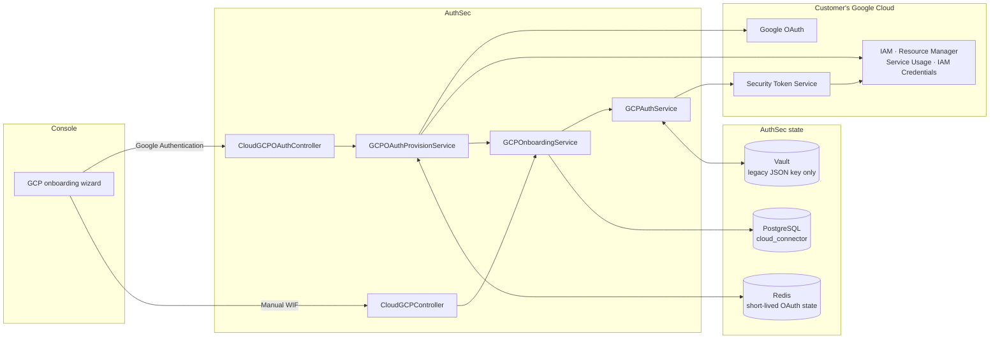
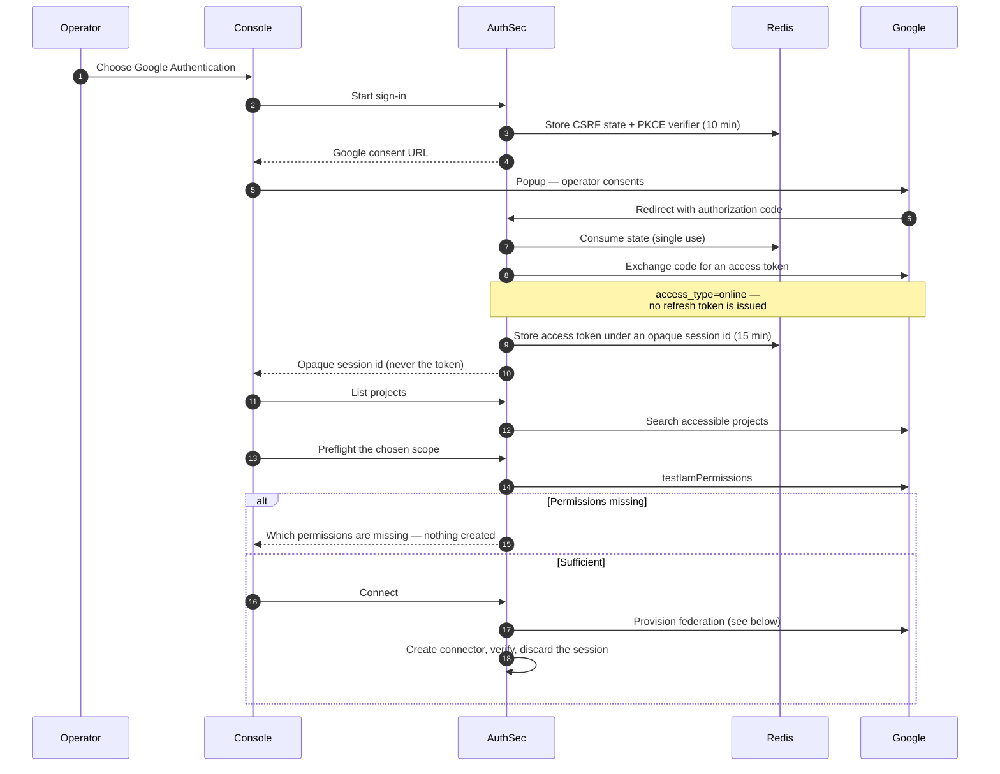
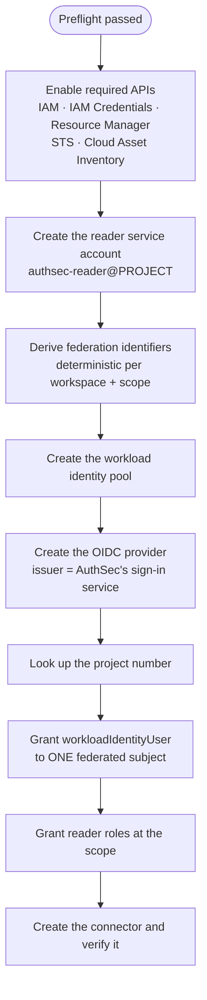
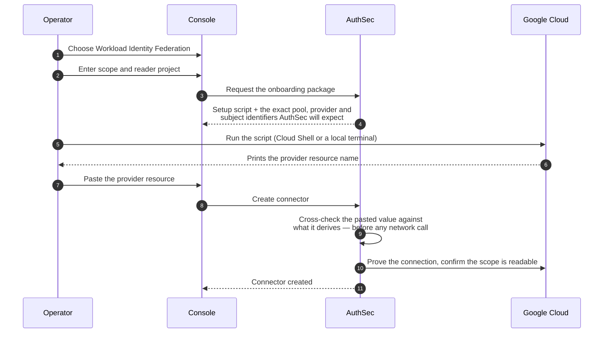
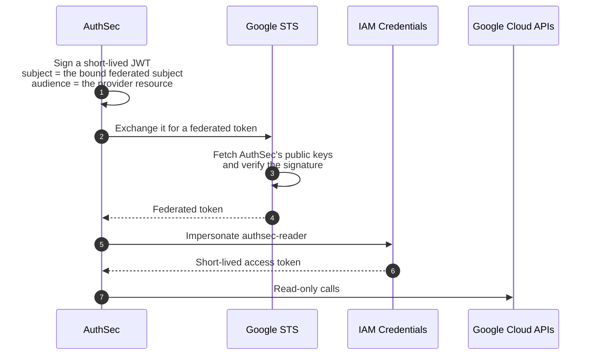
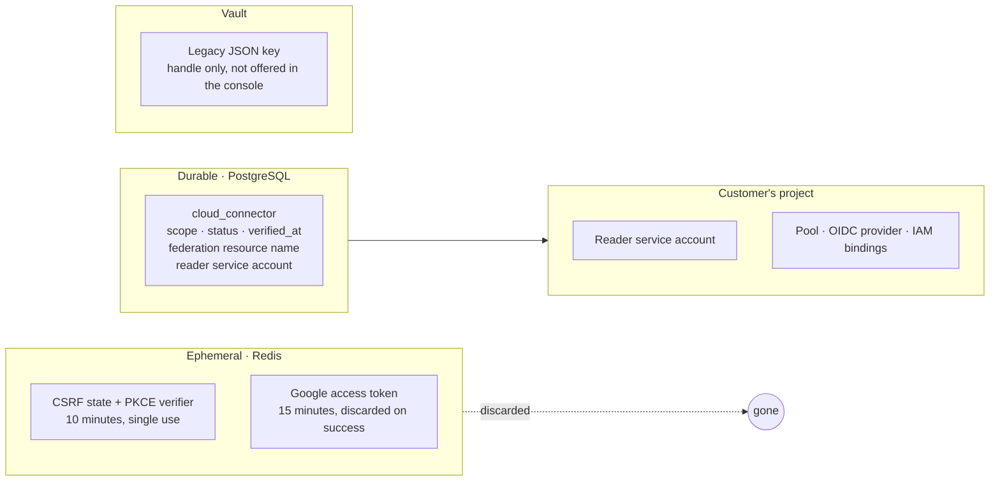
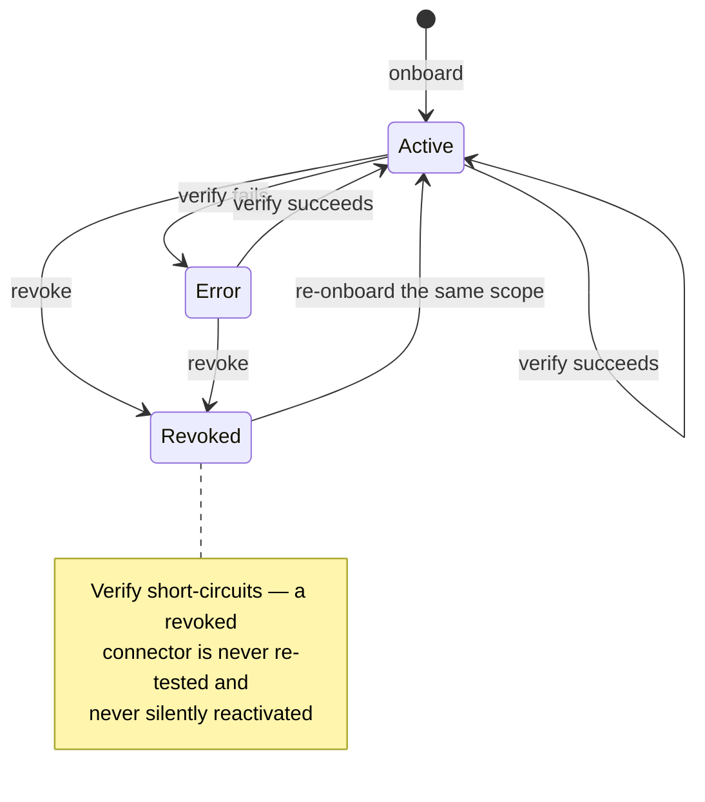
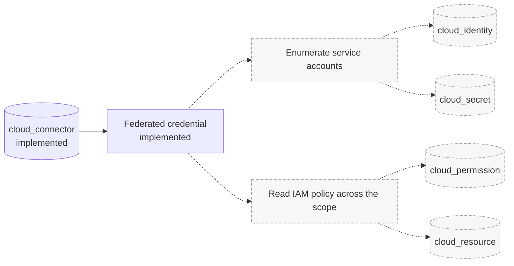

# GCP cloud discovery — onboarding and the workload identity foundation

How AuthSec connects to a customer's Google Cloud scope, what that connection is
allowed to do, where credentials live, and what is stored.

Two onboarding paths reach the same end state — one `cloud_connector` row that
everything else resolves against:

1. **Google Authentication** — a one-time Google sign-in that AuthSec spends
   immediately to configure Workload Identity Federation on the customer's
   behalf, then discards.
2. **Manual Workload Identity Federation** — the customer runs a setup script in
   their own project and pastes back one value.

Both end with a connector authenticated by **Workload Identity Federation**:
AuthSec holds no long-lived Google credential, and neither path stores key
material. (A legacy JSON-key path still exists for connectors created before
these — see below.)

> **Discovery is not implemented yet.** Onboarding establishes and proves the
> connection. Enumerating service accounts, IAM bindings, keys and resources is
> later work. See [Implementation status](#implementation-status) — nothing in
> this document describes discovery as working today.

**Scope:** this document covers GCP only. AWS onboarding and discovery are a
separate implementation with their own flow, and nothing here describes them.

Related: `aws-cloud-discovery-onboarding.md` for the AWS equivalent;
`connectors.md` for why discovery does not sit on the connector broker.

---

## The flow

A connector is one row per **scope** — a project, folder or organization. The
scope is what AuthSec is permitted to read; the **reader project** is where the
service account and federation resources live. They are usually the same
project.

---

## Path 1 — Google Authentication

The operator signs in with Google once. AuthSec uses that short-lived
authorization to create the federation resources, then throws it away. Nothing
about the operator's Google account is retained.

The consent screen requests a deliberately narrow scope set — enough to create a
service account, a workload identity pool and provider, and to set IAM policy on
the chosen scope. Full `cloud-platform` access is **not** requested.

Preflight runs before anything is created, so a customer whose account lacks the
necessary permissions is told exactly which ones are missing without any partial
setup being left behind.

### Automatic federation provisioning

Every step is idempotent: each checks for the resource before creating it,
restores a soft-deleted pool or provider rather than recreating it, and repairs a
provider whose issuer has drifted by patching it in place. Re-running a failed
connection is safe and creates nothing twice.

The `workloadIdentityUser` grant names **one specific federated subject** — never
a wildcard over the whole pool. Only AuthSec's own signed assertion for that
workspace and scope can impersonate the reader service account.

Immediately after the resources exist, Google needs a short time to apply the new
IAM binding. AuthSec polls for this rather than failing on the first attempt, so
a first-time connection can take up to about a minute and a half.

---

## Path 2 — Manual Workload Identity Federation

For customers whose policy or permissions do not allow AuthSec to configure their
project directly.

The identifiers are **derived deterministically** from the workspace and scope,
so AuthSec knows what they must be before the customer runs anything. A pasted
value from the wrong project or a stale run is rejected locally, with no wasted
round trip to Google.

The script grants the same reader roles and creates the same single-subject
binding as the automatic path. It never uploads anything to AuthSec.

### What the customer runs

The script enables the required APIs, creates the `authsec-reader` service
account, grants the reader roles at the chosen scope, creates the pool and OIDC
provider, and binds exactly one federated subject to the service account. It
prints the provider resource name to paste back.

The rendered script still carries a trailing legacy JSON-key section. The
console shows only the federation part of it, so a customer following the
wizard never runs those commands.

---

## How AuthSec authenticates afterwards

No Google credential is stored for a federated connector. Every call mints a
fresh, short-lived assertion:

Two consequences worth stating plainly:

- **AuthSec's sign-in service must be reachable over HTTPS from Google.** Google
  fetches the OIDC metadata and public keys directly. A deployment that is not
  publicly reachable over HTTPS cannot use federation at all.
- **Revocation is the customer's.** Removing the binding, the pool or the service
  account in their project immediately and permanently cuts AuthSec's access.
  For a federated connector there is no AuthSec-held secret that could outlive
  it.

### Token lifetimes and refresh

Nothing here is cached between calls, and nothing needs an operator present.
A scan that pages for hours refreshes transparently.

| Token | Lives | Who mints it | Refreshed by |
|---|---|---|---|
| Subject assertion (AuthSec-signed) | 5 minutes | AuthSec's native signer | Minted fresh on **every** exchange, including every refresh |
| Federated token (STS) | ~1 hour | Google STS | A new subject assertion is exchanged for a new one |
| Impersonated access token | ~1 hour | IAM Credentials | A new federated token is used to impersonate again |

The subject assertion is deliberately short-lived, so it is minted on demand
rather than held. When the impersonated access token expires mid-scan, the
credential re-runs the whole chain by itself — mint, exchange, impersonate —
and the page loop continues. A long scan does not die at the one-hour mark,
and no part of this path re-reads a stored secret, because there is none.

If AuthSec's own signing path is broken, that surfaces at onboarding rather
than hours into a scan: the connection attempt mints once up front purely to
fail fast, and discards the result.

### Legacy JSON-key authentication

**No new connector can be created with a service-account key.** The method is
refused at the API, not merely hidden in the console — it used to be hidden
there while the HTTP surface still accepted it, which meant a keyed connector
could be created through the API and handed to discovery.

Connectors created before that change keep working. They still verify, so an
operator can see whether one is healthy before migrating it, and they still
revoke cleanly with the stored key purged from Vault. Only the key *handle* was
ever recorded against the connector, never the key itself, and such a
connector now carries a `keyed_credential` capability limit so discovery can
apply its own policy to it.

Many organizations set `constraints/iam.disableServiceAccountKeyCreation`, which
blocks key creation outright. Federation is unaffected by that policy, which is
the main reason it is the only path offered for new connectors.

---

## Permissions

### Reader roles

Granted at the scope AuthSec reads:

| Role | Why |
|---|---|
| `roles/iam.serviceAccountViewer` | Enumerate service accounts — the candidate identities |
| `roles/iam.securityReviewer` | Read allow policies across the scope, and the audit configuration attached to them |
| `roles/cloudasset.viewer` | Read IAM policy across the scope in one paginated call |
| `roles/browser` | Resolve the project, folder and organization hierarchy |
| `roles/iam.organizationRoleViewer` **or** `roles/iam.roleViewer` | Read role definitions, to expand a binding into the actions it permits |

The last row depends on the scope. An organization gets
`organizationRoleViewer`, which is what gives org-wide sight of custom role
definitions; a folder or project gets `roleViewer`. They are not
interchangeable, and the second is not a narrower version of the first.

All of them are read-only. AuthSec never requests write, delete or
impersonation permission on customer resources beyond the single binding that
lets it act as the reader service account it created.

The set is versioned, and the version is recorded on the connector, so an
operator can tell which roles a given connector actually holds rather than
inferring it from when it was onboarded.

> Roles that later discovery phases will need — deny policies, Principal
> Access Boundary, workload hosts, Vertex, Agent Registry, private logs — are
> deliberately **not** granted here. Two of them carry open questions:
> `roles/aiplatform.viewer` also permits *invoking* an agent, and no read-only
> predefined role exists for reading IAM policy bindings. Granting them ahead
> of that review would be exactly the silent scope creep this set exists to
> prevent.

### Permissions the operator needs to connect

Only for the Google Authentication path, and only during setup — to create the
pool and provider, create the service account, set IAM policy on it, enable the
required APIs, and set IAM policy at the chosen scope. Preflight checks these
before anything is created.

### Cloud Asset Inventory quota project

Cloud Asset Inventory bills each call against a quota project, and the caller
must hold `serviceusage.services.use` there. This is a per-call concern, not a
per-client one — the connector's own reader project is the appropriate quota
project. The value is recorded at onboarding for use when discovery is built.

---

## What AuthSec stores

| Stored | Where | Lifetime |
|---|---|---|
| CSRF state, PKCE verifier | Redis | 10 min, consumed once |
| Google access token | Redis | 15 min, deleted on successful connect |
| Scope, status, federation resource name, reader service account | PostgreSQL | Life of the connector |
| Capability profile, API enablement, scope enumerability, readiness | PostgreSQL | Refreshed on every verify |
| Customer-declared hints (environment, naming, owning team) | PostgreSQL | Life of the connector |
| Legacy key handle | Vault | Only for connectors created before the keyed path closed |

Everything in the two middle rows is an *observation* — permission names, API
names, states, timestamps. None of it is a credential, and none of it names
anything inside the customer's estate beyond the scope they told us about.

**Never stored anywhere:** the Google refresh token (none is ever issued — the
consent is online-only), the operator's Google password, or any service-account
private key from the federation paths.

The connector row records a federation **resource name**, which is a
non-sensitive Google identifier, not a credential.

---

## Connector lifecycle

**Verify** mints a fresh assertion, impersonates the reader service account and
confirms the scope is still readable. Success records the time; failure records
the reason without discarding the last known-good verification time.

**Reconnect** re-onboards the same scope and updates the row in place. Scan
state is preserved. A revoked connector returning this way becomes active again.

**Revoke** marks the row revoked and keeps it for audit. **AuthSec never deletes
anything in the customer's project** — the service account, pool and provider
remain until the customer removes them, which is the step that truly ends access.

---

## Errors say whose problem it is

Every failure is classified so the console can say who needs to act:

| Fault | Means |
|---|---|
| `customer_account` | Something in the customer's Google Cloud — missing permission, unreadable scope, federation not configured as expected |
| `constrained` | A VPC Service Controls perimeter or an organization policy refused the request by design |
| `gcp` | Google rejected the exchange or the request |
| `authsec` | An AuthSec-side deployment problem, such as a sign-in service Google cannot reach |

`constrained` exists because the other three all imply somebody made a mistake,
and this one means somebody made a decision. Both a perimeter violation and a
missing role arrive as a 403; telling a customer to grant a role when a
perimeter is blocking the call sends them to make a change that cannot work.
The remedy is an access level, an ingress rule, or a policy exception, from
whoever owns the constraint.

Error messages are sanitized — they never carry a token, a key, or an
authorization code.

---

## Implementation status

Stated plainly so nothing here is mistaken for a promise.

### Implemented

- Google Authentication onboarding, including automatic federation provisioning
- Manual Workload Identity Federation onboarding
- Federated authentication with service-account impersonation, refreshing
  transparently across a long scan
- Connector create, verify, reconnect and revoke
- Preflight permission checks before anything is created
- One `cloud_connector` row per scope, with fault-classified errors
- **A live per-surface permission probe**, run at onboarding and on every
  verify. The row records what the reader was *proved* to reach, not what the
  setup script was supposed to grant.
- **A zero-write assertion** asked of GCP directly, rather than inferred from
  the fact that the granted roles are all named "viewer"
- **API enablement state** per API, and enablement repair on the path that
  holds a credential able to do it
- **Quota-project verification**, including the case where the reader project
  sits outside the onboarded scope
- **Scope enumerability**, probed by both routes independently
- **A pre-created coverage skeleton**, so the first scan updates rather than
  invents
- **A discovery-readiness verdict** — ready, partial or blocked — derived from
  the evidence above with the reasons attached

### Partially implemented

- **Scan generation tracking** — the column exists and is initialised to zero,
  but nothing advances it, because no scan exists. Coverage is now pre-created
  rather than empty, but every surface reads `unknown` until something scans.

### Planned — not built

- Service-account discovery
- Service-account key metadata
- IAM binding and resource discovery, and role expansion
- Impersonation and federation edges
- Workload and agent signals
- Audit-log activity and usage aggregation

The shared discovery schema exists and is already written by other providers.
GCP discovery is not implemented, so **GCP writes only `cloud_connector`
today** — no `cloud_identity`, `cloud_permission`, `cloud_resource` or
`cloud_secret` row originates from GCP.

### Deliberately not done

These are decisions, not omissions, and each has a reason:

- **Later-phase reader roles** — deny policies, Principal Access Boundary,
  workload hosts, Vertex, Agent Registry, private logs. Two carry open
  questions: `roles/aiplatform.viewer` also permits *invoking* an agent, and no
  read-only predefined role exists for reading IAM policy bindings. The probe
  reports these surfaces as unreachable so the gap is visible rather than
  assumed away.
- **Audit-log configuration, org-policy enumeration and log-sink detection** —
  signals discovery needs, but reads discovery should perform. Onboarding
  reports whether the *permissions* for them exist and stops there.
- **Scope selection state** — deselecting a scope without tombstoning it needs
  somewhere to persist the selection, which is a schema decision this work did
  not take.
- **Persisting the scope tree** — onboarding proves the tree can be walked;
  walking it is a scan's job, bounded by the documented ten-level and
  300-per-parent limits.

### Unverified

Everything below needs a real organization to settle, and none of it is
settled by the tests:

- Whether the reader role set is sufficient in practice, and whether
  `roles/iam.organizationRoleViewer` binds anywhere below an organization —
  the code takes the conservative reading and says so
- Organization- and folder-scoped onboarding end to end
- Behaviour under organization policies that restrict federation
- Whether the org-policy half of the constrained-vs-denied classification
  matches what Google actually returns; the VPC Service Controls half is
  documented, that one is inferred from the constraint id alone

---

## Future discovery — planned shape

Not implemented. Shown only so the intended direction is clear; dashed elements
do not exist.

Provider differences belong in column **values**, not in new tables — GCP adds no
table of its own.
