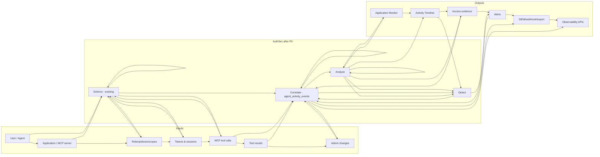

# P0 — Productize Observability (grounded spec)

**Status:** draft **v4.2.1** · 2026-07-19 · **Step 1 locked.** v4.2.1 (labels + typed JSON-RPC id, alert `token_key`/`resolved_*`, ack dedup covers open+ack, broker coverage). v4.2 (consistency pass): single `reports[]` ingest envelope everywhere (removed old top-level `events[]`/receipt + `telemetry_enabled` payload); Hydra SDK JWT-only gap (introspect-once or mark `partial`); SDK delivery = bounded best-effort (not at-least-once); watermark workspace-scoped; typed validation-denial emitted by callers with request-derived `source_event_id`; revocation consolidated via `tokens.RevokeAccessToken`. v4.1: `token.validation_denied` for pre-tool rejections (so revoked/suspended alerts fire); `token_kind`/`token_key`/`token_expires_at` in the spine DDL; ID-JAG issuance wrapped in a tx; Hydra `token.issued` best-effort/outbox (Hydra already minted); XAA cross-workspace visibility rule; alert time-gating + retention on `received_at`; coverage terminal set incl. denied/not_executed + heartbeat contract; `unexpired_known_tokens`. Prior: reporter trust, per-token receipt envelope, per-producer reliability, ingest-health coverage, NFRs.
**Owner:** aditya
**Scope:** turn AuthSec from an enforcement product into *enforcement + runtime observability*, built on the tables and enforcement points that already exist. No ML, no NHI discovery, no external provisioning (see §12).

> One-line change: today AuthSec decides **whether access should happen**. After P0 it also records **what happened before, during, and after that decision**, correlated into one activity chain:
> `User → Agent → Session → Token → Application → Tool → Decision → Result`.

**Locked decisions (through v3):**
- **`agent_activity_events` is the single spine.** Enforcement points **emit to it directly** (via `activity.Record()`), not an async normalizer. Existing tables (`connector_action_audit`, `native_tokens`, `audit_events`) stay their own sources of truth; the spine references them.
- **Uniform tool lifecycle** for broker and SDK: `tool.requested → tool.allowed | tool.denied → tool.completed | tool.failed | tool.not_executed`, correlated by `tool_call_id`. UI folds into one call. **Every `tool.*` event carries the full correlation envelope (§3.4)** — no event is interpretable only in the presence of its siblings.
- **`tool.completed` = a successful MCP tool result** (JSON-RPC ok AND `isError=false`), not merely an HTTP handler returning (§5.4).
- **SDK telemetry reporter = the resource server, authenticated with its EXISTING introspection credential** (`rs_id:introspection_secret`, `ValidateIntrospectionCredentials`, `oauth_as_controller.go:2244`) — never the observed agent, and no second credential.
- **Idempotency is scoped per workspace + reporter:** unique `(workspace_id, reporter_id, source_event_id, event_type)`.
- **Reliability is per-producer, not universal** (§6): only token issuance is transactionally guaranteed; the broker is best-effort-with-metric (its provider action is irreversible and its audit write is already best-effort, `connector_broker_controller.go:611`).
- **Always emit `token.issued` for every new ACCESS token** (M2M, XAA-via-jwt-bearer, CIBA, Hydra); distinguish via `grant_type`. **Token-exchange emits `delegation.issued` (an ID-JAG, not an access token)** — never counted as a token. Count tokens by `DISTINCT token_key WHERE token_kind='access_token'`, never raw rows.
- **Pre-tool rejections emit `token.validation_denied`.** A revoked/suspended/RBAC-invalid token is rejected in verification *before* any tool event exists, so security alerts must fire on this dedicated event (§3.2/§9), not on absent tool events.
- **P0 = a normal indexed events table with one platform-wide retention.** No partitioning, no per-workspace retention until volume justifies it.
- **Hydra (authcode/refresh) correlation is in P0.2**, not deferred — via a telemetry receipt from the existing introspection call (§7), so the `User→Agent→Token→Application→Tool` chain works for Hydra flows too.

---

## 1. Why this is the closest P0 to the current codebase

AuthSec already **produces most of the raw material** — it just isn't collected into one correlated stream, and the SDK-enforced path reports nothing. The gap is *correlation + one trustworthy report channel + read/detect surfaces*, not new enforcement.

What already exists (verified in repo):

| Capability | Where | Note |
|---|---|---|
| Per-tool-call runtime record (request+decision+result), **broker path only** | `connector_action_audit` — DDL `001_bootstrap.sql:3237`, model `models/connector.go:178`, writer `connector_broker_controller.go:570` | `authz_outcome`, `action_outcome (success\|provider_error\|policy_deny)`, `provider_status`, `deny_reason`, `subject_id`, `actor_client_id`, `owner_email/team`, `token_family`, `token_jti`, `latency_ms`. Correlates by `token_jti` (a token, **not a call**). |
| Token authority hub | `native_tokens` — DDL `:1810` | `jti`, `token_family (xaa\|m2m\|ciba)`, `subject_*`, `actor_client_id`, `source_grant_jti`, `issued_at`, `expires_at`. **native tokens only.** |
| Revocation (authoritative) | `revoked_tokens (iss, kind, jti)` — DDL `:1850` | `native_tokens.revoked_at` is display-only. |
| **Hydra-issued tokens** | `tokenAuthCodeGrant` proxies to Hydra (`oauth_as_controller.go:462`); grant types: authorization_code, refresh_token (Hydra) + client_credentials, jwt-bearer, token-exchange, CIBA (native) `oauth_as_controller.go:434-441` | authz-code / refresh tokens are **not in `native_tokens`** and `VerifyProtectedResourceToken` (`protected_resource_verifier.go:36`) rejects them. Must be handled explicitly (§ token coverage). |
| Registries (supply) | `mcp_tools:557` + `mcp_tool_scope_map:548` (`source='admin_override'`) + `oauth_scopes`; `connector_actions.required_scopes` + `connector_assignments` | tool → required scope. |
| Application = resource server | `resource_servers` (`application_type ∈ mcp_server\|ai_agent\|connector_broker`) | the "Application" in the monitor and the SDK reporter identity. |
| Accountable human | `service_accounts.owner_email/owner_team` (`:918`) | already stamped onto broker rows. |
| XAA on-behalf-of | `act` claim → `native_tokens.actor_*`; `AuthContext.Actor` (`protected_resource_verifier.go:150`) | agent-for-human. |
| Admin events | `audit_events` (`:189`, workspace_id **text**), `auditAdminMutation` (`audit_helper.go:13`) | role/scope/policy changes. |
| request_id | `RequestIDMiddleware` (`security.go:63`) | in context; **not persisted**, and one request_id can cover a **batch** of calls (`runtime.go:407`). |

**Gaps P0 closes (all confirmed against code):**
1. **No single correlated event stream** — four shapes, four keys.
2. **SDK-enforced tool calls are invisible to AuthSec.** The SDK authorizes *locally* — `Runtime.AuthorizeTool` (`sdk-authsec/packages/go-sdk/runtime.go:304`) uses a cached tool-scope map; AuthSec is not consulted per call and **denied calls never reach the handler** (`runtime.go:394,420`). Token verification gives identity+scopes, **not the tool decision**. So the SDK must report the *whole attempt* (requested → allowed/denied → completed/failed), not just the result.
3. **No call-level correlation key.** `token_jti` = a token; `request_id` = possibly a whole batch. Need a `tool_call_id`.
4. **No first-class agent session**; no traceparent/OTLP. Correlation = `tool_call_id` + `token_jti` + `request_id`.
5. **Reporter trust:** the observed agent must not be the author of its own activity record.

---

## 2. Architecture — the black box, grounded



- **Enforce** — unchanged: `oauth_as_controller`, `connector_broker_controller.runAction`, revocation, `simple_pdp`, and the **SDK's own local `AuthorizeTool`**.
- **Correlate** — new: `agent_activity_events`, written directly at each enforce point (server side) and reported by the resource server (SDK side).
- **Analyse / Detect** — new: read services + a deterministic rule evaluator.

---

## 3. The correlated runtime event model (the spine)

### 3.1 `agent_activity_events` (v2 — normal indexed table, correlation IDs, idempotent)

```sql
-- Single correlated runtime event stream. Append-only. Never holds secrets
-- (arguments/results are redacted metadata only). One event per lifecycle step;
-- steps of one call share tool_call_id. Idempotent per workspace+reporter.
CREATE TABLE public.agent_activity_events (
    event_id        uuid        NOT NULL DEFAULT gen_random_uuid(),
    workspace_id    uuid        NOT NULL,
    occurred_at     timestamptz NOT NULL,           -- producer clock; skew-checked at ingest (§NFR)
    received_at     timestamptz NOT NULL DEFAULT now(),
    -- provenance & idempotency (v3: reporter-scoped)
    producer        text        NOT NULL,           -- broker | sdk-go | sdk-py | sdk-ts | as | admin
    reporter_id     text        NOT NULL,           -- SDK: authenticated resource_server_id; server-side: producer name
    source_event_id text        NOT NULL,           -- producer's own id for THIS event
    schema_version  int         NOT NULL DEFAULT 1,
    -- taxonomy
    category        text        NOT NULL,           -- token | authz | tool | admin
    event_type      text        NOT NULL,           -- see 3.2
    outcome         text,                            -- allow | deny | success | error | not_executed | null
    -- call correlation
    tool_call_id    text,                            -- the specific call; lifecycle rows share it
    mcp_request_id  text,                            -- JSON-RPC id (matches result within a batch)
    operation_id    text,                            -- optional: groups a batch / higher-level op
    request_id      text,
    session_id      text,                            -- §3.3 (derived / SDK-supplied, nullable)
    -- token chain (v3: engine + grant_type separated; token_ref for opaque/Hydra)
    token_jti       text,                            -- native tokens
    token_ref       text,                            -- opaque activity_token_ref / receipt id (Hydra/SDK)
    token_ref_verified bool     NOT NULL DEFAULT false,
    token_engine    text,                            -- native | hydra
    token_family    text,                            -- m2m | xaa | ciba (native only; null for Hydra)
    grant_type      text,                            -- client_credentials | jwt-bearer | token-exchange | ciba | authorization_code | refresh_token
    token_kind      text,                            -- access_token | id_jag  (id_jag never counted as a token)
    token_expires_at timestamptz,                    -- powers tokens.unexpired_known for BOTH native + Hydra (§ metrics)
    token_key       text GENERATED ALWAYS AS (COALESCE(token_jti, token_ref)) STORED,  -- canonical token id
    source_grant_jti text,
    oauth_client_id text, actor_client_id text, actor_spiffe_id text,
    subject_type    text, subject_id uuid,
    owner_email     text, owner_team text,
    -- application / tool / decision
    application_id  uuid,                            -- = resource_server_id (from reporter cred on SDK path)
    connector_id    uuid,
    tool_name       text,
    scopes_requested text[], scopes_granted text[],
    -- result (v3: MCP-aware, not just HTTP)
    transport       text,                            -- http | sse | streamable
    http_status     int,
    jsonrpc_error_code int,
    mcp_is_error    bool,
    latency_ms      int,
    error_category  text,
    reason          text,
    attributes      jsonb       NOT NULL DEFAULT '{}',  -- redacted arg/result metadata + source row id
    CONSTRAINT agent_activity_events_pkey PRIMARY KEY (event_id)
);

-- v3: idempotency scoped to workspace + reporter (producer name alone is shared by every install)
CREATE UNIQUE INDEX uq_aae_idem ON public.agent_activity_events (workspace_id, reporter_id, source_event_id, event_type);
CREATE INDEX idx_aae_ws_time   ON public.agent_activity_events (workspace_id, occurred_at DESC);
CREATE INDEX idx_aae_ws_client ON public.agent_activity_events (workspace_id, oauth_client_id, occurred_at DESC);
CREATE INDEX idx_aae_ws_app    ON public.agent_activity_events (workspace_id, application_id, occurred_at DESC);
CREATE INDEX idx_aae_ws_type   ON public.agent_activity_events (workspace_id, event_type, occurred_at DESC);
CREATE INDEX idx_aae_call      ON public.agent_activity_events (workspace_id, tool_call_id);
CREATE INDEX idx_aae_jti       ON public.agent_activity_events (token_jti);
CREATE INDEX idx_aae_tokenkey  ON public.agent_activity_events (workspace_id, token_key);
```

> **No partitioning in P0.** Retention = one platform-wide window via scheduled delete keyed on **`received_at`** (`received_at < now() - interval`), never SDK-controlled `occurred_at`. A monthly partition would hold many workspaces, so it can't express per-workspace retention; both deferred until volume justifies. Retention is a **platform setting, decoupled from delivery destinations**. `occurred_at` is the producer clock (timeline display only); `received_at` is AuthSec's and drives retention + time-gated alerts; ingest flags events beyond the skew tolerance (§NFR).

### 3.4 Correlation envelope — required on every `tool.*` event

An event must be interpretable alone (events arrive out of order, get lost, or split across retried batches). Every `tool.*` event **must** carry: `tool_call_id`, `tool_name`, `token_jti`|`token_ref`, `mcp_request_id`, `occurred_at`, `source_event_id`, and `session_id` when available. AuthSec **stamps** `workspace_id`, `application_id`, `reporter_id`, `owner_*` from the authenticated reporter — the SDK never asserts those. Aggregations key on `tool.completed`/`tool.failed` directly and still resolve identity without needing the sibling `tool.requested`.

### 3.2 Event taxonomy — one uniform lifecycle

- **token**: `token.issued` (**every new ACCESS token, always** — M2M, XAA via jwt-bearer, CIBA, Hydra authcode/refresh), `token.revoked` (P0); `token.introspected`, `token.expired` (P1 / derived — §7). **`delegation.issued`** is a *separate* event for an **ID-JAG** (RFC 8693 token-exchange output) — an intermediary assertion, **not** an access token and **not** in `native_tokens` (`issuer.go:76`). Every event carries `token_kind ∈ {access_token, id_jag}`. **ID-JAGs are never counted as issued/active tokens.** Monitor "tokens issued" = `COUNT(DISTINCT token_key)` where `token_key = COALESCE(token_jti, token_ref)` and `token_kind='access_token'` — so Hydra tokens (which use `token_ref`) are counted and ID-JAGs are excluded.
- **authz**: `authz.allowed`, `authz.denied` (mint-time PDP); **`token.validation_denied`** — a *runtime* token rejection at introspection / broker verification (`VerifyProtectedResourceToken`), `reason ∈ revoked | suspended | rbac_revoked | registration_revoked | inactive`. **This is the linchpin for security alerts:** a revoked/suspended token is rejected here *before* any `tool.*` event exists, so `revoked_token_use`/`access_after_suspension` fire on this event, not on absent tool activity.
- **tool** (broker AND SDK, same sequence): `tool.requested` → `tool.allowed` | `tool.denied` → `tool.completed` | `tool.failed` | `tool.not_executed`. All rows for one call share `tool_call_id`.
- **admin**: `admin.role_changed`, `admin.scope_changed`, `admin.policy_changed`, `admin.client_disabled`, `admin.identity_suspended`, `admin.token_revoked`.

`tool.completed` means a **successful MCP tool result** — JSON-RPC OK **and** `mcp_is_error=false`; anything else (HTTP≠200, JSON-RPC error, `isError=true`, transport abort) is `tool.failed` (§5.4). A denied call emits `tool.requested` + `tool.denied` (no completion). The broker holds all facts and can emit in one write; the SDK emits as they happen. **UI folds by `tool_call_id`.**

### 3.3 Session (unchanged from v1): derive `session_id = hash(oauth_client_id, coalesce(source_grant_jti, token_jti))`; accept SDK-supplied when present; nullable.

---

## 4. Capture — producers write directly to the spine

**Server-side producers** call `activity.Record(ctx, ev)`. `source_event_id` is a **UUID generated before the write** (idempotency); `reporter_id = producer` (`as | broker | admin`) for server-side (SDK uses `rs_id`). The write mode differs by producer per §6 — **do not treat them uniformly:**

| Producer | Write mode |
|---|---|
| **Issuance / exchange** (`as`) | **Inside the issuance transaction** — atomic with the token row; if the event insert fails, issuance fails. |
| **Broker** (`broker`) | **Best-effort after execution** — the provider action already ran and is irreversible (`connector_broker_controller.go:611`); a failed insert increments an operational-error metric, never blocks or alters the result. |
| **Admin** (`admin`) | **Best-effort**, matching existing `auditAdminMutation` behavior. |

| Event | Emit point (existing fn) | producer |
|---|---|---|
| `token.issued` (access) | native M2M/XAA `internal/tokens/issuer.go:117` `NativeIssuer.Issue` (in-tx, `grant_type`, `token_kind=access_token`); **CIBA native issuance in `services/workspace_ciba_service.go:~435`** (confirm fn) | as |
| `delegation.issued` (ID-JAG) | `internal/tokens/issuer.go:80` `IssueIDJAG` — **wrap in a tx** (§6): sign → `RecordTx` → commit → return. `token_kind=id_jag`, never counted | as |
| `token.issued` (Hydra) | `tokenAuthCodeGrant`/`tokenRefreshGrant` on success — **best-effort/outbox, NOT in-tx** (Hydra already minted; AuthSec can't fail it atomically). `token_ref`+`token_expires_at`+engine=hydra | as |
| `token.revoked` | **every** native revocation entry point (single revoke, issuer/bulk revoke, admin token revoke) → `revoked_tokens` | as |
| `token.validation_denied` | introspection + `services.VerifyProtectedResourceToken` reject path (`protected_resource_verifier.go:~86`) with `reason` | as |
| `authz.allowed/denied` | `oauth_as_controller.go:78` `evalPDP` | as |
| `tool.requested/allowed/denied/completed/failed` (broker) | `connector_broker_controller.go:570` `auditAction`; `tool_call_id` = the pre-generated audit row UUID | broker |
| `tool.*` (SDK) | resource-server-authenticated ingest §5 | sdk-go/py/ts |
| `admin.*` | `audit_helper.go:13` `auditAdminMutation` | admin |

**XAA cross-workspace visibility:** `delegation.issued` (ID-JAG) is written in the *home* workspace; the XAA `token.issued` it is redeemed into is written in the *target* resource-server workspace (`oauth_as_controller.go:1261`). A workspace timeline shows **only its own** events. The target workspace sees the external `actor_client_id`/`actor_spiffe_id` + `source_grant_jti`, but **not** the home workspace's private `delegation.issued` unless an approved cross-workspace trust view exists.

---

## 5. SDK telemetry ingest — reporter trust model (review-corrected)

**The reporter is the protected MCP server (via the SDK), authenticated with its EXISTING resource-server introspection credential — not the observed agent.** Self-reporting by the observed agent would let a compromised agent fabricate/suppress its own record, and the agent's token may be Hydra-issued (which `VerifyProtectedResourceToken` rejects).

```
POST /authsec/activity/tool-events    (guard: RS Basic auth  rs_id:introspection_secret)
```

- **Reporter auth = the existing introspection credential.** RS Basic auth `rs_id:introspection_secret`, validated by the same `ValidateIntrospectionCredentials` that guards `/oauth/introspect` (`oauth_as_controller.go:2244`). **No new credential.** `reporter_id = rs_id`; `application_id` derived from it — never from the observed token.
- **Token reference is per-report (not per-event) — two transports:**
  - *native token* → the report carries **`token_jti`**. AuthSec confirms the jti in `native_tokens` **and** that its `workspace_id`, resource server, and audience match the authenticated reporter (not mere existence) → `token_ref_verified=true`.
  - *Hydra token (authcode/refresh)* → the report carries the **whole signed receipt** as `activity_receipt` (§5.5), **never** a bare `token_ref`. AuthSec verifies it, **extracts the embedded `token_ref`, stores only that `trf_…` value, discards the receipt**, and attaches `token_ref` to every event in the report. Raw token never stored/retransmitted.
- **Each event** carries `tool_call_id`, `tool_name`, `mcp_request_id`, `occurred_at`, `source_event_id` (§3.4) — token identity comes from the enclosing report. Ingestion is **idempotent** on `(workspace_id, reporter_id, source_event_id, event_type)`; retries are safe.

**Canonical request shape = the `reports[]` envelope in [`p0-schema-and-api.md` §4.2](./p0-schema-and-api.md). One report = one observed token**, carrying exactly one of `activity_receipt` (Hydra) or `token_jti` (native) plus that token's `events[]`. There is **no** top-level `events[]` and **no** top-level receipt; the SDK never sends a bare `token_ref` (AuthSec extracts it from the receipt). Sketch:
```jsonc
{ "reporter": { "sdk":"sdk-go", "sdk_version":"1.4.0" },   // rs_id from Basic auth
  "reports": [
    { "token_jti":"8f2c…", "events":[ /* tool.requested→allowed→completed for this native token */ ] },
    { "activity_receipt":"<signed JWT>", "events":[ /* tool.* for this Hydra token */ ] }
  ] }
```

**SDK change (P0.2, Go/Python/TS):** emit `tool.requested` before `AuthorizeTool`; `tool.allowed`/`tool.denied` from its result (denials never reach the handler, so they must be reported here); and record the **response** (the Go SDK currently passes `tools/call` straight through without capturing it — `runtime.go:384`) to emit `tool.completed`/`tool.failed`.

### 5.4 Interpreting the MCP result (review-added)

"Handler returned" ≠ success. The SDK must classify each result by JSON-RPC id:
- match the response to its call via `mcp_request_id` (batches return mixed results), using a **type-preserving** canonical form — `n:3` (number) / `s:3` (string) / `null:<tool_call_id>` — so numeric `3` and string `"3"` in one batch don't collide;
- `http_status`, `jsonrpc_error_code`, and MCP `isError` all feed the verdict;
- `tool.completed` only when JSON-RPC OK **and** `isError=false`; else `tool.failed` with `error_category`;
- **Streamable HTTP / SSE:** the call may not finish like a sync response — emit `tool.requested`/`tool.allowed` at start, and `tool.completed`/`tool.failed` on stream terminal state (or `tool.not_executed` + `error_category=stream_abandoned` on disconnect). `transport` records which mode applied.

---

### 5.5 Hydra activity receipt (the telemetry token reference)

Hydra-issued (authorization_code / refresh) tokens aren't in `native_tokens`, so the SDK proves the token via a **signed receipt AuthSec returns from the introspection it already performs**, then replays it as `token_ref` on activity events. Reuses the native RSA keyset — `NativeKeyManager.SignWithTyp(claims, typ)` (`internal/tokens/keys.go:156`) to sign, `PublicKeyForKID` (`:171`) to verify.

**Header:** `typ: authsec-activity-receipt+jwt` · `alg: RS256` · `kid:` active native signing key.

**Claims:**
```jsonc
{ "iss":"<OAUTH_ISSUER_URL>", "aud":"urn:authsec:activity-ingest", "jti":"receipt-uuid",
  "iat":…, "exp":<token_exp + 300>,                 // access-token expiry + 5-min reporting grace
  "token_ref":"trf_<hmac>", "token_engine":"hydra", "token_exp":<access-token exp>,
  "workspace_id":"…", "resource_server_id":"…", "resource_uri":"https://jira-mcp.example",
  "sub":"user-uuid", "subject_type":"user",
  "client_id":"authsec-agent-client-id", "hydra_client_id":"…",
  "scope":"jira:read jira:write" }
```

**Stable token reference (not the receipt jti — re-introspecting the same token must give the same ref):**
```
token_ref = "trf_" || HMAC-SHA256(activity_token_ref_key, raw_access_token)
```
`activity_token_ref_key` lives in Vault/config; the raw access token is **never stored**. Non-reversible, stable per token.

**When AuthSec returns it:** add `activity_receipt` to a **successful, active** introspection response **only** after RS auth succeeds **and** token active **and** audience matches the RS **and** client registration approved **and** live RBAC passes. **Never** with `active:false`.

**Transport:** the receipt rides **inside its `reports[]` entry** as `activity_receipt` (one per observed Hydra token) — **not** top-level, **not** a bare `token_ref`. AuthSec extracts `token_ref` from the verified receipt, attaches it to that report's events, stores only the `trf_…` value, and discards the receipt.

**SDK-mode gap (Hydra + local JWT validation):** the SDK can validate a Hydra token locally (JWT-only) without introspecting, which produces **no receipt**. When telemetry is enabled: (a) the SDK **must introspect the Hydra token at least once** to obtain `activity_receipt` and retain it from `Principal.Claims`; (b) if it can't/won't (pure JWT-only), Hydra tool events for that token are either **rejected** or the application is marked **`partial`/`not_instrumented`** for coverage — never silently dropped as if complete. Native tokens are unaffected (they use `token_jti`).

**Ingest validation at `POST /authsec/activity/tool-events`:**
1. Authenticate `rs_id:introspection_secret`.
2. Verify receipt signature (by `ref`/`kid`) + **exact** `typ = authsec-activity-receipt+jwt`.
3. Verify `iss` and `aud = urn:authsec:activity-ingest`; not expired.
4. Require receipt `resource_server_id == authenticated reporter`.
5. Require receipt `workspace_id ==` the RS's workspace.
6. Extract `subject_*`, `client_id`, `scope`, `token_ref` **from the receipt**.
7. **Ignore any conflicting identity fields** the SDK put on events.
8. Store `token_ref` + extracted claims — **never the signed receipt**.

**HMAC key rotation (P0.2):** `activity_token_ref_key` is a long-lived **versioned** Vault key; the receipt carries `ref_kid`; retain previous key versions ≥ (max token lifetime + reporting grace), and old RSA public keys ≥ max receipt lifetime. An emergency HMAC rotation may split one Hydra token into old/new `token_ref` values — accept that rather than adding a persistent raw-token→ref mapping table just to preserve correlation across rare rotations.

**Security boundary:** the receipt **cannot authorize MCP access** — distinct `typ`, restricted `aud=urn:authsec:activity-ingest`, and RS binding make it telemetry evidence only. Its use still requires the reporter's Basic credentials. Native tokens skip all of this (they use `token_jti`, verified against reporter workspace/RS/audience).

## 6. Write reliability & delivery guarantees (new)

There is no universal "events can never be lost" guarantee — that would contradict "telemetry never fails enforcement" for the broker, whose provider action is already irreversible and whose audit write is best-effort *after* the call (`connector_broker_controller.go:611`). Guarantees are **explicit per producer:**

| Producer | Guarantee |
|---|---|
| **Native issuance (M2M/XAA/CIBA) + ID-JAG** | Event written **in the issuance transaction**. `IssueIDJAG` currently signs-and-returns with no tx, so it must be wrapped: open tx → `RecordTx(delegation.issued)` → commit → return the signed ID-JAG. If the event insert fails, issuance fails — atomic. |
| **Hydra issuance (authcode/refresh)** | **Not transactionally controllable** — Hydra already minted the token; AuthSec cannot roll it back. `token.issued` is **best-effort / durable local outbox**, never in-tx; failure → operational-error metric. |
| **Broker (tool)** | The provider result is **never** changed by a telemetry failure. Persist the audit + outbox **best-effort**; on failure increment an **operational error metric** (observable gap, not a blocked call). |
| **SDK** | **Bounded best-effort with idempotent retry** — the SDK retries within limits (§NFR) then **drops + counts** (no durable SDK-local queue in P0, so it is *not* at-least-once). Server-side ingestion is idempotent on `(workspace_id, reporter_id, source_event_id, event_type)`, so retries never double-count. |
| **Webhook / delivery** | **Durable delivery queue** with retries and a **dead-letter** state. |

**Ordering:** events carry `occurred_at` (producer clock); the timeline orders by it. Ingest checks skew against `received_at` (§NFR).

---

## 7. Token coverage matrix (review-added, P1 to complete)

Access-token issuances emit `token.issued` (`token_kind=access_token`) with a `grant_type`; the ID-JAG output of token-exchange emits `delegation.issued` (`token_kind=id_jag`, **not** an access token, **not** counted). `token_family` stays `m2m|xaa|ciba` (native only). Correlation reference by engine:

| grant_type | event | engine | in `native_tokens`? | reference | phase |
|---|---|---|---|---|---|
| client_credentials | token.issued (access) | native | yes | `token_jti` | P0.1 |
| **token-exchange** | **delegation.issued (ID-JAG)** | native | **no** (id_jag_replay_cache only) | `token_jti` of the ID-JAG | P0.1 |
| jwt-bearer (XAA — redeems the ID-JAG) | token.issued (access) | native | yes | `token_jti` (+ `source_grant_jti` = the ID-JAG) | P0.1 |
| ciba | token.issued (access) | native | yes | `token_jti` | P0.1 |
| authorization_code | token.issued (access) | **Hydra** | **no** | `token_ref` | **P0.2** |
| refresh_token | token.issued (access) | **Hydra** | **no** | `token_ref` | **P0.2** |

Hydra correlation is **in P0.2**: the receipt from the existing introspection call lets AuthSec verify a Hydra token reference without holding the raw token — **but the receipt records *introspection*, not *issuance*.** P0.2 therefore also adds explicit `token.issued` emitters at the successful Hydra `authorization_code` / `refresh_token` grant paths, carrying `token_ref` + `token_expires_at`. Finalized rules: **introspection is NOT an event by default** (sample / first-seen only); **expiration is derived from `token_expires_at` at read time**, not scheduled events; the XAA access token's `token.issued` links to its ID-JAG via `source_grant_jti`.

---

## 8. Additional tables

### 8.1 `activity_alerts` (dedup fixed)
```sql
CREATE TABLE public.activity_alerts (
    id uuid NOT NULL DEFAULT gen_random_uuid(),
    workspace_id uuid NOT NULL,
    rule_key text NOT NULL, severity text NOT NULL,
    status text NOT NULL DEFAULT 'open',
    identity_type text, identity_id text,
    application_id uuid, tool_name text, token_key text,   -- token_key (native jti OR Hydra ref) so Hydra alerts correlate; matches the DTO
    first_seen timestamptz NOT NULL, last_seen timestamptz NOT NULL,
    event_count int NOT NULL DEFAULT 1,
    summary text NOT NULL, suggested_action text, related_event_ids uuid[],
    created_at timestamptz NOT NULL DEFAULT now(), updated_at timestamptz NOT NULL DEFAULT now(),
    CONSTRAINT activity_alerts_pkey PRIMARY KEY (id)
);
-- Active-incident semantics: `open` and `ack` are ONE active incident (ack keeps it deduped,
-- so acknowledging doesn't let the evaluator spawn a duplicate); `resolved`/`muted` close it,
-- and a later recurrence opens a fresh incident. Hence the partial index covers open+ack.
CREATE UNIQUE INDEX uq_activity_alerts_dedup ON public.activity_alerts
  (workspace_id, rule_key, coalesce(identity_id,''), coalesce(application_id,'00000000-0000-0000-0000-000000000000'::uuid), coalesce(tool_name,''))
  WHERE status IN ('open','ack');
CREATE INDEX idx_activity_alerts_ws_status ON public.activity_alerts (workspace_id, status, last_seen DESC);
```

### 8.2 `activity_delivery_config` (delivery only) + retention split out
```sql
-- delivery destinations ONLY. Retention is a separate platform/workspace setting,
-- NOT defined per destination (review fix).
CREATE TABLE public.activity_delivery_config (
    id uuid NOT NULL DEFAULT gen_random_uuid(), workspace_id uuid NOT NULL,
    kind text NOT NULL,                 -- webhook (P0.5) | siem_* | export_* (post-P0)
    endpoint_url text, secret_vault_path text,
    event_filter jsonb NOT NULL DEFAULT '{}', enabled bool NOT NULL DEFAULT true,
    created_by text, created_at timestamptz NOT NULL DEFAULT now(), updated_at timestamptz NOT NULL DEFAULT now(),
    CONSTRAINT activity_delivery_config_pkey PRIMARY KEY (id)
);
```
P0 retention = one platform-wide constant (config/env), enforced by a scheduled delete. Per-workspace retention is post-P0.

---

## 9. Detection — high-confidence set only (review-trimmed)

Evaluator = scheduled worker over recent `agent_activity_events`, upserting `activity_alerts` (dedup §8.1). Rules that compare against a state change **must gate on time** — activity *after* the change, not the mere existence of the state — and must exclude the state-change event itself. **P0 ships only rules that need no baseline/warm-up:**

Time-gating uses **`received_at`** (AuthSec's clock), never SDK-controlled `occurred_at` (which an attacker could backdate); `occurred_at` is for timeline display only.

| rule_key | trigger | severity |
|---|---|---|
| `revoked_token_use` | a **`token.validation_denied`** event with `reason=revoked` (the token was rejected at verification — the only observable signal, since a revoked token never reaches a tool) **AND `received_at > revoked_tokens.revoked_at`** | critical |
| `repeated_denials` | ≥N `tool.denied`/`authz.denied` same (client, tool) within W (by `received_at`) | high |
| `repeated_tool_failures` | ≥N `tool.failed` same tool within W | medium |
| `access_after_suspension` | a `token.validation_denied` (`reason=suspended`) or any activity by a suspended identity where **`received_at > identity.suspended_at`** | high |

**Deferred to after baseline telemetry exists:** `new_tool` / first-seen, `unusual_volume`, `dormant_reactivation`, `privilege_change_then_use` — each needs a warm-up window or every launch-day first call becomes an alert.

---

## 10. Granted-vs-used — with a coverage guard (review-added)

Compute granted (roles/scopes → `mcp_tool_scope_map`/`connector_actions` → tools) vs used (`DISTINCT tool_name` where `outcome ∈ allow/success`) + denied attempts. **But gate every finding on telemetry coverage.** Each application carries a status:

- `complete` · `partial` · `not_instrumented` · `reporting_delayed`

derived from **ingest health, not outbound delivery health** (a failed Splunk webhook does not mean AuthSec lacks telemetry): supported SDK version; **`telemetry_enabled` from application configuration — never the SDK payload** (a compromised/misconfigured SDK can't self-declare healthy); `last_heartbeat_at`; and expected-vs-received **lifecycle completeness** where a *terminal* is any of `tool.completed | tool.failed | tool.denied | tool.not_executed` (denied and not-executed count — otherwise denied-heavy apps look incomplete). **Heartbeat contract:** an idle-but-healthy MCP server posts an empty report (`{"reports":[]}`) to the ingest endpoint to refresh `last_heartbeat_at`, so silence≠unhealthy only within the heartbeat window. **The managed connector broker is server-side and sends no SDK heartbeat** — its coverage derives from `OBS_CAPTURE` health + broker emitter-drop metric, not heartbeat, so broker apps are never mislabelled `not_instrumented`. **`review`/`remove` findings only for `complete` coverage over a defined window; else "insufficient activity coverage."** An old-SDK or non-reporting app is never labelled "unused."

---

## 11. Phasing (review-tightened — this is an epic; ship thin)

1. **P0.1 — Canonical event contract + correlation IDs + native/broker capture + events API.** `agent_activity_events`, `activity.Record()` (same-tx/outbox), emit from issuance/exchange/revoke + broker `auditAction`, persist `request_id`, `GET /activity/events`. Populated by existing traffic; dogfood mcpauthz.
2. **P0.2 — RS-authenticated SDK reporting** across Go / Python / TypeScript (`POST /activity/tool-events`, idempotent, full lifecycle, `token_ref_verified`).
3. **P0.3 — Application Monitor + timeline + telemetry coverage** status.
4. **P0.4 — 3–4 high-confidence alerts** (§9).
5. **P0.5 — Generic signed webhook + CSV/JSON export.**

**Deferred past P0:** Splunk/Sentinel/S3 delivery, per-workspace/flexible retention, partitioning, unusual-volume/dormant/first-seen detection, automated `remove` recommendations.

Per phase: branch → `go build ./...` + `go vet` → tsc for UI → Jenkins → wipe+re-bootstrap on schema change → stage smoke.

## 11b. Non-functional requirements (set before ticketing)

| NFR | P0 target (tune before P0.1) |
|---|---|
| Platform retention | 90 days, single platform-wide window (config); scheduled delete keyed on `received_at` |
| Max ingest batch | 500 events / request |
| Max payload size | 1 MB / request; `attributes` ≤ 4 KB / event |
| Allowed metadata | fixed key allowlist; **no values**, `has_pii` flag, `arg_keys`/`result_meta` counts only |
| SDK retry | ≤ 5 attempts, exponential backoff, cap 30 s, then local drop + counter |
| Clock-skew tolerance | ±5 min between `occurred_at` and `received_at`; beyond → flag `skewed`, still store |
| Ingest rate limit | per-`reporter_id` token bucket; read APIs per-workspace |
| Read pagination | **cursor-based**, never offset; **per-endpoint sort key** (events/timeline `occurred_at,event_id`; alerts `last_seen,id`; apps `name,id`; delivery `created_at,id`) |
| Authz-path latency overhead | server-side emit adds **< 2 ms p99** to enforcement; if the same-tx write can't meet that for the broker, it stays best-effort/async (§6) |
| Monitor/read authorization | console 3-middleware stack: `AuthMiddleware + RequireWorkspaceRole("owner","admin") + ValidateWorkspaceFromToken` |

## 12. Out of scope for P0
NHI discovery; dozens of SaaS connectors; external secret rotation; identity certification campaigns; external provisioning; ML/behavioral risk scoring; OTLP/OpenInference trace ingestion.

## 13. Resolved vs open decisions
**Resolved (v3):** single spine emit-directly; uniform lifecycle keyed by `tool_call_id`; full correlation envelope on every event; `tool.completed` = successful MCP result; SDK reporter = existing RS introspection credential; idempotency scoped `(workspace_id, reporter_id, source_event_id, event_type)`; per-producer reliability (only issuance transactional; broker best-effort+metric); always-emit `token.issued` + separate `grant_type`; Hydra correlation via receipt in P0.2; time-gated revoked/suspension alerts; coverage = ingest health; no partitioning + platform-wide retention decoupled from delivery; NFRs drafted.

**P0.1 locks (all resolved):**
1. **Idempotency scope** ✅ — `reporter_id` = rs_id (SDK) / `as|broker|admin` (server); `source_event_id` = UUID generated before write; unique `(workspace_id, reporter_id, source_event_id, event_type)`.
2. **Token event semantics** ✅ — always-`token.issued` + separate `grant_type`; count by `DISTINCT token_jti`/`token_ref`.
3. **Reliability per producer** ✅ — issuance in-tx (fails together); broker + admin best-effort with operational-error metric; SDK **bounded best-effort + idempotent** (not at-least-once — no durable SDK queue in P0); webhook durable queue (genuinely at-least-once) in P0.5.

**Resolved (v4.1):** `token.validation_denied` closes the revoked/suspended alert gap; `token_kind`/`token_key`/`token_expires_at` in the DDL; ID-JAG issuance wrapped in a tx; Hydra `token.issued` best-effort/outbox; XAA cross-workspace visibility rule; alert time-gating + retention on `received_at`; coverage terminal set + heartbeat contract; `telemetry_enabled` from app config not SDK.

**Before P0.2:** the **Hydra telemetry receipt is specified (§5.5)** — remaining is implementation + `activity_token_ref_key` rotation cadence. Still to finalize: **streamable/SSE terminal-state details** (§5.4), the **redaction contract** (§NFR allowlist), and **`session_id`** precedence.
